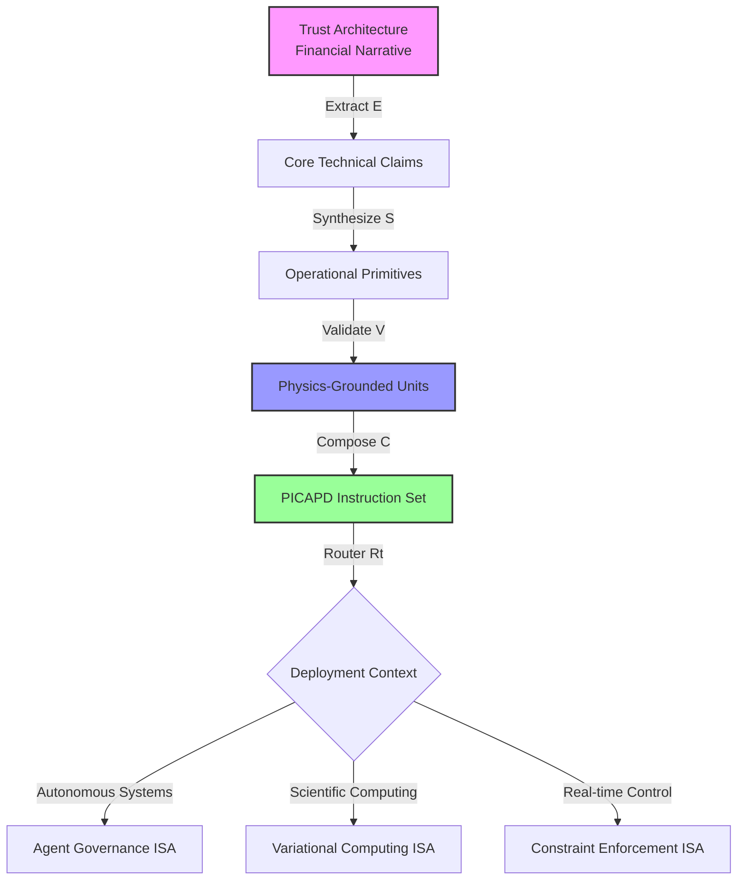
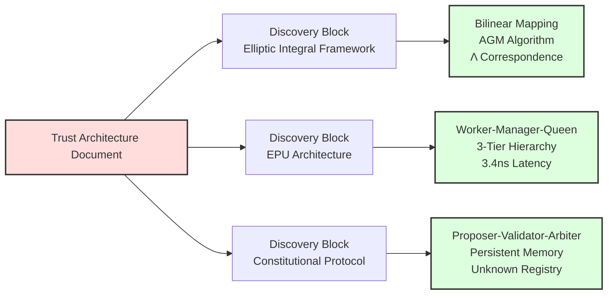
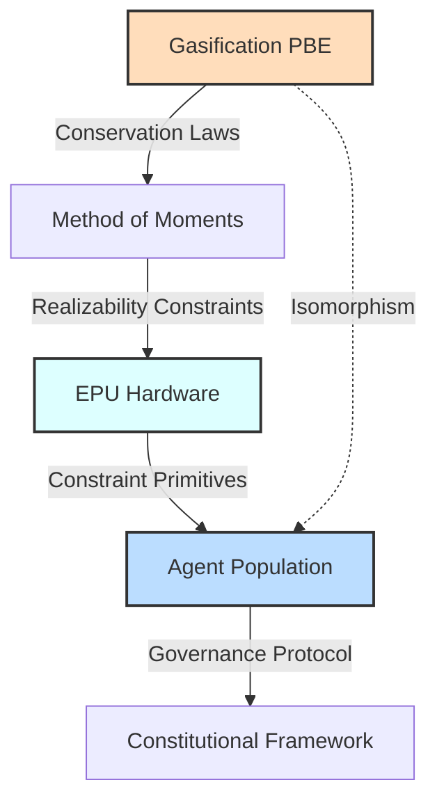
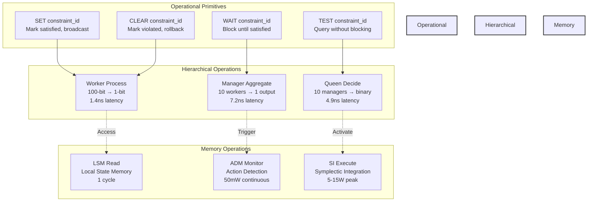
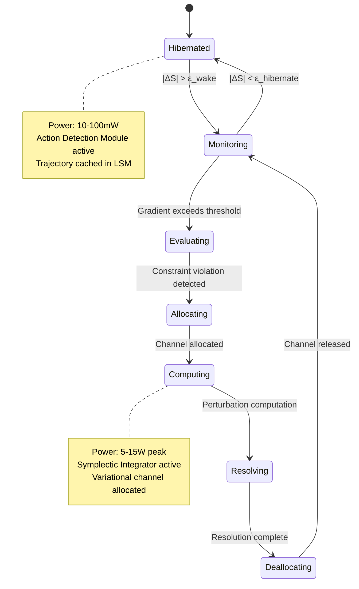
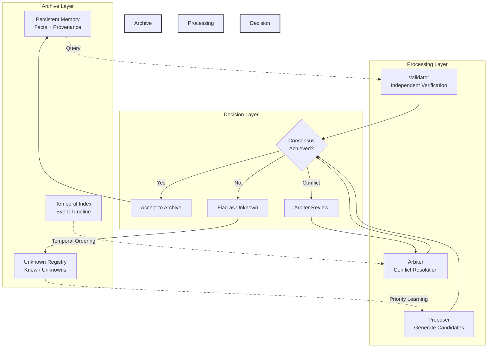
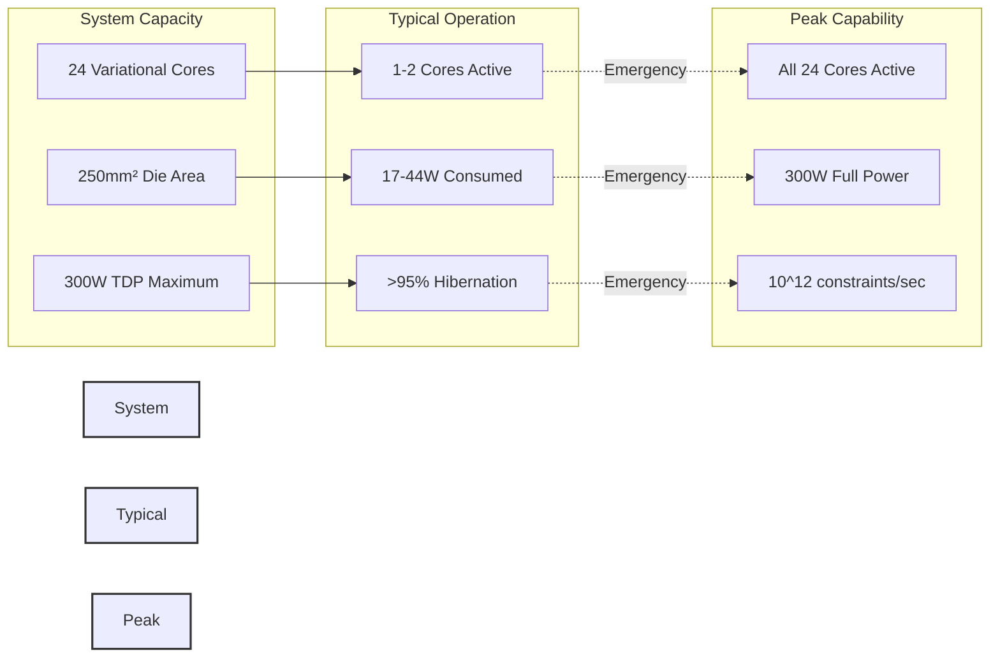
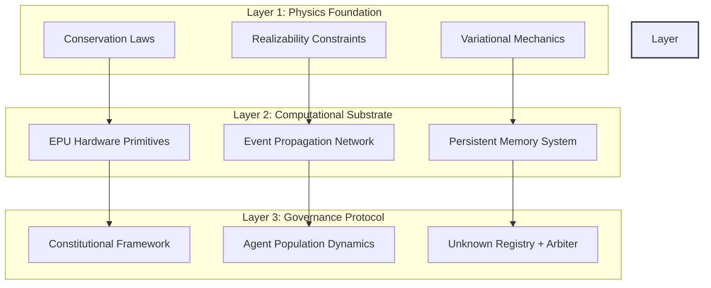

# PICAPD-KTE Reconstruction Plan
## From Financial Narrative to Operational Architecture

### Executive Summary

This document presents the systematic reconstruction of the Trust Architecture narrative, removing financial market positioning and replacing it with operational process engineering units derived from the KTE (Knowledge Transfer Engineering) framework as applied to the PICAPD (Physics-Informed Constraint Architecture for Population Dynamics) substrate.

**Transformation Principle**: Financial valuation → Operational capacity metrics
**Core Method**: KTE Block Protocol mapping to EPU operational primitives
**Target Output**: PICAPD ISA with hierarchical process flow

---

## Level 0: Meta-Architecture Transformation



---

## Level 1: Source Material Decomposition (KTE Extraction Phase)

### E1: Key Technical Discoveries Extraction



### E2: Architecture Relationship Extraction



### E3: Structural Pattern Extraction

```mermaid
flowchart TB
    subgraph Physical Layer
        P1[Particle Population<br/>n(L,t)]
        P2[Conservation: ∂n/∂t + ∇·G = B-D]
        P3[Hausdorff Constraints]
    end
    
    subgraph Computational Layer
        C1[Agent Population<br/>n(κ,t)]
        C2[Conservation: Budget+Memory]
        C3[Realizability Gates]
    end
    
    subgraph Hardware Layer
        H1[Worker-Manager-Queen]
        H2[Context Flow: 10,000:1]
        H3[Event Propagation Network]
    end
    
    P1 <-->|Isomorphism| C1
    P2 <-->|Isomorphism| C2
    P3 <-->|Isomorphism| C3
    
    C1 --> H1
    C2 --> H2
    C3 --> H3
    
    style Physical Layer fill:#fee,stroke:#333,stroke-width:2px
    style Computational Layer fill:#efe,stroke:#333,stroke-width:2px
    style Hardware Layer fill:#eef,stroke:#333,stroke-width:2px
```

---

## Level 2: Synthesis into Operational Units (KTE Synthesis Phase)

### S1: Core Operational Building Blocks



### S2: Constraint System Architecture



### S3: Constitutional Governance Synthesis



---

## Level 3: Operational Metrics (Removing Financial Units)

### Transformation Table: Financial → Operational

| Financial Metric | Operational Equivalent | PICAPD Unit | Measurement Method |
|-----------------|----------------------|-------------|-------------------|
| $25T Market Cap | 10^15 operations/sec system capacity | OPS_CAPACITY | Peak theoretical throughput |
| $280B TAM | 10^9 concurrent agents governable | AGENT_CAPACITY | Population balance limit |
| $45B SAM | 10^8 autonomous vehicles served | VEHICLE_CAPACITY | Real-time decision throughput |
| 3-5% Market Share | 3-5M vehicles × 1000 decisions/sec | DECISION_THROUGHPUT | Sustained operational rate |
| $2-3K per chip | 17-44W typical power envelope | POWER_EFFICIENCY | Watts per billion constraints |
| 700W → 10W saving | 23× power reduction | EFFICIENCY_RATIO | Comparative power metric |
| $500K NRE | 24-core die × 250mm² | DIE_COMPLEXITY | Silicon area allocation |

### Operational Capacity Diagram



---

## Level 4: PICAPD Instruction Set Architecture

### ISA Category Hierarchy

```mermaid
graph TD
    ISA[PICAPD ISA v1.0]
    
    ISA --> CAT1[Lagrangian Operations]
    ISA --> CAT2[Constraint Operations]
    ISA --> CAT3[Population Operations]
    ISA --> CAT4[Event Operations]
    ISA --> CAT5[Memory Operations]
    
    CAT1 --> L1[LEVAL: Evaluate L q,q̇]
    CAT1 --> L2[LGRAD_Q: ∂L/∂q]
    CAT1 --> L3[LGRAD_V: ∂L/∂q̇]
    CAT1 --> L4[ACTION: Compute ΔS]
    
    CAT2 --> C1[CSET: Mark constraint satisfied]
    CAT2 --> C2[CCLEAR: Mark constraint violated]
    CAT2 --> C3[CWAIT: Block on constraint]
    CAT2 --> C4[CTEST: Query constraint state]
    
    CAT3 --> P1[PSPAWN: Create agent instance]
    CAT3 --> P2[PTERM: Terminate agent]
    CAT3 --> P3[PAGG: Aggregate population moment]
    CAT3 --> P4[PCHECK: Verify realizability]
    
    CAT4 --> E1[EBROADCAST: Propagate event]
    CAT4 --> E2[ESUBSCRIBE: Register for events]
    CAT4 --> E3[EFILTER: Set event threshold]
    CAT4 --> E4[ESYNC: Multi-domain sync]
    
    CAT5 --> M1[MLOAD: Load from LSM]
    CAT5 --> M2[MSTORE: Store to LSM]
    CAT5 --> M3[MCACHE: Update L2 cache]
    CAT5 --> M4[MFLUSH: Write persistent memory]
    
    style ISA fill:#f99,stroke:#333,stroke-width:3px
    style CAT1 fill:#9f9,stroke:#333,stroke-width:2px
    style CAT2 fill:#99f,stroke:#333,stroke-width:2px
    style CAT3 fill:#f9f,stroke:#333,stroke-width:2px
    style CAT4 fill:#9ff,stroke:#333,stroke-width:2px
    style CAT5 fill:#ff9,stroke:#333,stroke-width:2px
```



---

## Summary: Three-Layer Operational Model



**Next Document**: Detailed ISA specification with instruction encoding and operational semantics.
