# PICAPD Operational Visualization Suite
## Process Flow Diagrams for Real-Time Monitoring

**Document Type**: Operational Visualization Reference  
**Version**: 1.0  
**Date**: February 2026  
**Purpose**: Complete set of Obsidian-compatible Mermaid diagrams for PICAPD system monitoring

---

## Table of Contents

1. [System-Level Overview Diagrams](#system-level-overview)
2. [Hierarchical Processing Flow](#hierarchical-processing)
3. [Constraint Lifecycle Management](#constraint-lifecycle)
4. [Constitutional Governance Flows](#constitutional-governance)
5. [Resource Management Diagrams](#resource-management)
6. [Error Handling and Recovery](#error-handling)
7. [Performance Monitoring Views](#performance-monitoring)
8. [Deployment Topology Maps](#deployment-topology)

---

## System-Level Overview

### Complete Architecture Stack

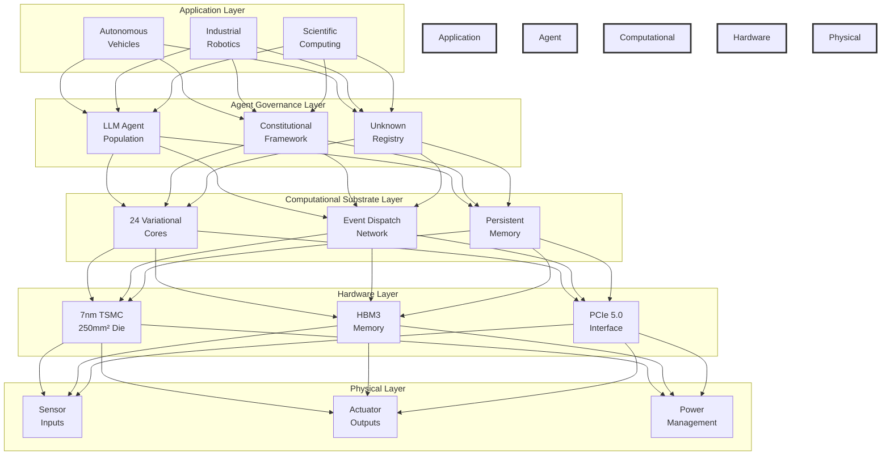
```mermaid
flowchart TB
    subgraph Application Layer
        direction LR
        App1[Autonomous<br/>Vehicles]
        App2[Industrial<br/>Robotics]
        App3[Scientific<br/>Computing]
    end
    
    subgraph Agent Governance Layer
        direction LR
        AG1[LLM Agent<br/>Population]
        AG2[Constitutional<br/>Framework]
        AG3[Unknown<br/>Registry]
    end
    
    subgraph Computational Substrate Layer
        direction LR
        CS1[24 Variational<br/>Cores]
        CS2[Event Dispatch<br/>Network]
        CS3[Persistent<br/>Memory]
    end
    
    subgraph Hardware Layer
        direction LR
        HW1[7nm TSMC<br/>250mm² Die]
        HW2[HBM3<br/>Memory]
        HW3[PCIe 5.0<br/>Interface]
    end
    
    subgraph Physical Layer
        direction LR
        PH1[Sensor<br/>Inputs]
        PH2[Actuator<br/>Outputs]
        PH3[Power<br/>Management]
    end
    
    App1 & App2 & App3 --> AG1 & AG2 & AG3
    AG1 & AG2 & AG3 --> CS1 & CS2 & CS3
    CS1 & CS2 & CS3 --> HW1 & HW2 & HW3
    HW1 & HW2 & HW3 --> PH1 & PH2 & PH3
    
    style Application Layer fill:#fee,stroke:#333,stroke-width:3px
    style Agent Governance Layer fill:#efe,stroke:#333,stroke-width:3px
    style Computational Substrate Layer fill:#eef,stroke:#333,stroke-width:3px
    style Hardware Layer fill:#ffe,stroke:#333,stroke-width:3px
    style Physical Layer fill:#fef,stroke:#333,stroke-width:3px
```

### Data Flow: Sensors to Decisions

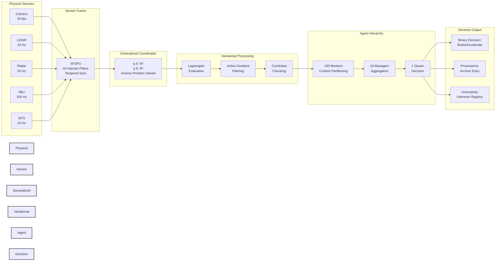
```mermaid
flowchart LR
    subgraph Physical Sensors
        S1[Camera<br/>30 fps]
        S2[LiDAR<br/>10 Hz]
        S3[Radar<br/>20 Hz]
        S4[IMU<br/>100 Hz]
        S5[GPS<br/>10 Hz]
    end
    
    subgraph Sensor Fusion
        SF[SFSPU<br/>64 Kalman Filters<br/>Temporal Sync]
    end
    
    subgraph Generalized Coordinates
        GC[q ∈ ℝᵏ<br/>q̇ ∈ ℝᵏ<br/>Inverse Problem Solved]
    end
    
    subgraph Variational Processing
        VP1[Lagrangian<br/>Evaluation]
        VP2[Action Gradient<br/>Filtering]
        VP3[Constraint<br/>Checking]
    end
    
    subgraph Agent Hierarchy
        AH1[100 Workers<br/>Context Partitioning]
        AH2[10 Managers<br/>Aggregation]
        AH3[1 Queen<br/>Decision]
    end
    
    subgraph Decision Output
        DO1[Binary Decision:<br/>Brake/Accelerate]
        DO2[Provenance:<br/>Archive Entry]
        DO3[Uncertainty:<br/>Unknown Registry]
    end
    
    S1 & S2 & S3 & S4 & S5 --> SF
    SF --> GC
    GC --> VP1 --> VP2 --> VP3
    VP3 --> AH1 --> AH2 --> AH3
    AH3 --> DO1 & DO2 & DO3
    
    style Physical Sensors fill:#dfd,stroke:#333,stroke-width:2px
    style Sensor Fusion fill:#ddf,stroke:#333,stroke-width:2px
    style Generalized Coordinates fill:#fdd,stroke:#333,stroke-width:2px
    style Variational Processing fill:#ffd,stroke:#333,stroke-width:2px
    style Agent Hierarchy fill:#dff,stroke:#333,stroke-width:2px
    style Decision Output fill:#fdf,stroke:#333,stroke-width:2px
```

### Power State Diagram

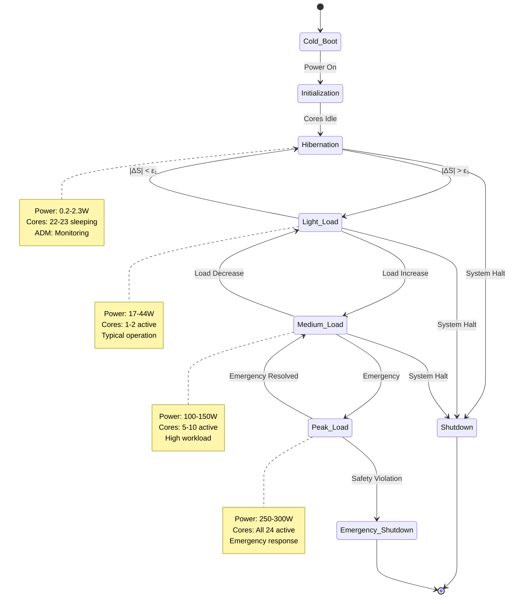
```mermaid
stateDiagram-v2
    [*] --> Cold_Boot
    
    Cold_Boot --> Initialization: Power On
    Initialization --> Hibernation: Cores Idle
    
    Hibernation --> Light_Load: |ΔS| > ε₁
    Light_Load --> Hibernation: |ΔS| < ε₁
    
    Light_Load --> Medium_Load: Load Increase
    Medium_Load --> Light_Load: Load Decrease
    
    Medium_Load --> Peak_Load: Emergency
    Peak_Load --> Medium_Load: Emergency Resolved
    
    Hibernation --> Shutdown: System Halt
    Light_Load --> Shutdown: System Halt
    Medium_Load --> Shutdown: System Halt
    Peak_Load --> Emergency_Shutdown: Safety Violation
    
    Shutdown --> [*]
    Emergency_Shutdown --> [*]
    
    note right of Hibernation
        Power: 0.2-2.3W
        Cores: 22-23 sleeping
        ADM: Monitoring
    end note
    
    note right of Light_Load
        Power: 17-44W
        Cores: 1-2 active
        Typical operation
    end note
    
    note right of Medium_Load
        Power: 100-150W
        Cores: 5-10 active
        High workload
    end note
    
    note right of Peak_Load
        Power: 250-300W
        Cores: All 24 active
        Emergency response
    end note
```

---

## Hierarchical Processing Flow

### Complete Decision Pipeline

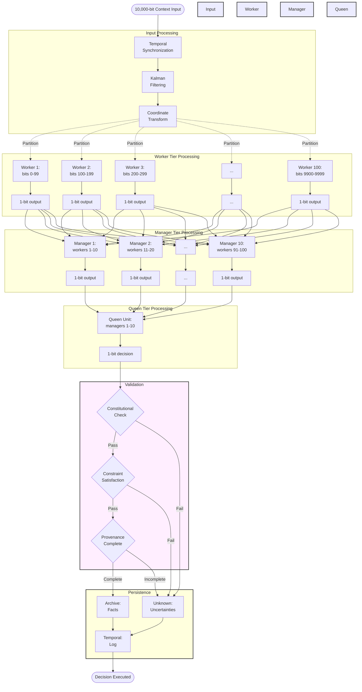
```mermaid
flowchart TB
    START([10,000-bit Context Input])
    
    subgraph Input Processing
        IP1[Temporal<br/>Synchronization]
        IP2[Kalman<br/>Filtering]
        IP3[Coordinate<br/>Transform]
    end
    
    subgraph Worker Tier Processing
        direction LR
        WT1[Worker 1:<br/>bits 0-99]
        WT2[Worker 2:<br/>bits 100-199]
        WT3[Worker 3:<br/>bits 200-299]
        WT4[...]
        WT100[Worker 100:<br/>bits 9900-9999]
        
        WT1 --> WTO1[1-bit output]
        WT2 --> WTO2[1-bit output]
        WT3 --> WTO3[1-bit output]
        WT4 --> WTO4[...]
        WT100 --> WTO100[1-bit output]
    end
    
    subgraph Manager Tier Processing
        direction LR
        MT1[Manager 1:<br/>workers 1-10]
        MT2[Manager 2:<br/>workers 11-20]
        MT3[...]
        MT10[Manager 10:<br/>workers 91-100]
        
        MT1 --> MTO1[1-bit output]
        MT2 --> MTO2[1-bit output]
        MT3 --> MTO3[...]
        MT10 --> MTO10[1-bit output]
    end
    
    subgraph Queen Tier Processing
        QT1[Queen Unit:<br/>managers 1-10]
        QT1 --> QTO[1-bit decision]
    end
    
    subgraph Validation
        VAL1{Constitutional<br/>Check}
        VAL2{Constraint<br/>Satisfaction}
        VAL3{Provenance<br/>Complete}
    end
    
    subgraph Persistence
        PERS1[Archive:<br/>Facts]
        PERS2[Unknown:<br/>Uncertainties]
        PERS3[Temporal:<br/>Log]
    end
    
    START --> IP1 --> IP2 --> IP3
    IP3 -.->|Partition| WT1 & WT2 & WT3 & WT4 & WT100
    
    WTO1 & WTO2 & WTO3 & WTO4 & WTO100 --> MT1 & MT2 & MT3 & MT10
    MTO1 & MTO2 & MTO3 & MTO10 --> QT1
    
    QTO --> VAL1
    VAL1 -->|Pass| VAL2
    VAL1 -->|Fail| PERS2
    VAL2 -->|Pass| VAL3
    VAL2 -->|Fail| PERS2
    VAL3 -->|Complete| PERS1
    VAL3 -->|Incomplete| PERS2
    
    PERS1 & PERS2 --> PERS3
    PERS3 --> END([Decision Executed])
    
    style Input Processing fill:#fee,stroke:#333,stroke-width:2px
    style Worker Tier Processing fill:#efe,stroke:#333,stroke-width:2px
    style Manager Tier Processing fill:#eef,stroke:#333,stroke-width:2px
    style Queen Tier Processing fill:#ffe,stroke:#333,stroke-width:2px
    style Validation fill:#fef,stroke:#333,stroke-width:2px
    style Persistence fill:#ffd,stroke:#333,stroke-width:2px
```

### Worker Unit Internal Flow

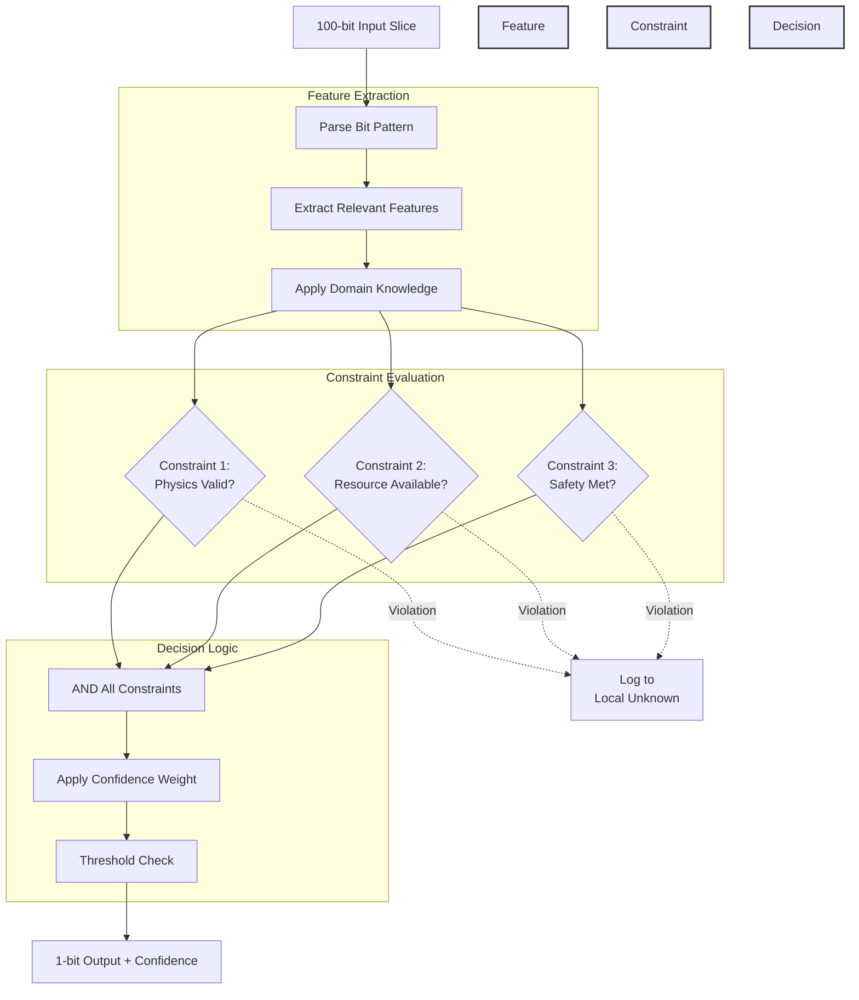
```mermaid
flowchart TB
    WORKER_IN[100-bit Input Slice]
    
    subgraph Feature Extraction
        FE1[Parse Bit Pattern]
        FE2[Extract Relevant Features]
        FE3[Apply Domain Knowledge]
    end
    
    subgraph Constraint Evaluation
        CE1{Constraint 1:<br/>Physics Valid?}
        CE2{Constraint 2:<br/>Resource Available?}
        CE3{Constraint 3:<br/>Safety Met?}
    end
    
    subgraph Decision Logic
        DL1[AND All Constraints]
        DL2[Apply Confidence Weight]
        DL3[Threshold Check]
    end
    
    WORKER_OUT[1-bit Output + Confidence]
    
    WORKER_IN --> FE1 --> FE2 --> FE3
    FE3 --> CE1 & CE2 & CE3
    CE1 & CE2 & CE3 --> DL1
    DL1 --> DL2 --> DL3 --> WORKER_OUT
    
    CE1 -.->|Violation| LOG1[Log to<br/>Local Unknown]
    CE2 -.->|Violation| LOG1
    CE3 -.->|Violation| LOG1
    
    style Feature Extraction fill:#dfd,stroke:#333,stroke-width:2px
    style Constraint Evaluation fill:#fdd,stroke:#333,stroke-width:2px
    style Decision Logic fill:#ddf,stroke:#333,stroke-width:2px
```

### Manager Unit Internal Flow

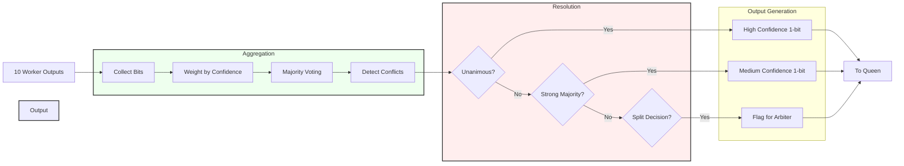
```mermaid
flowchart LR
    MANAGER_IN[10 Worker Outputs]
    
    subgraph Aggregation
        AGG1[Collect Bits]
        AGG2[Weight by Confidence]
        AGG3[Majority Voting]
        AGG4[Detect Conflicts]
    end
    
    subgraph Resolution
        RES1{Unanimous?}
        RES2{Strong Majority?}
        RES3{Split Decision?}
    end
    
    subgraph Output Generation
        OUT1[High Confidence 1-bit]
        OUT2[Medium Confidence 1-bit]
        OUT3[Flag for Arbiter]
    end
    
    MANAGER_IN --> AGG1 --> AGG2 --> AGG3 --> AGG4
    AGG4 --> RES1
    
    RES1 -->|Yes| OUT1
    RES1 -->|No| RES2
    RES2 -->|Yes| OUT2
    RES2 -->|No| RES3
    RES3 -->|Yes| OUT3
    
    OUT1 & OUT2 & OUT3 --> MANAGER_OUT[To Queen]
    
    style Aggregation fill:#efe,stroke:#333,stroke-width:2px
    style Resolution fill:#fee,stroke:#333,stroke-width:2px
    style Output Generation fill:#eef,stroke:#333,stroke-width:2px
```

### Queen Unit Internal Flow

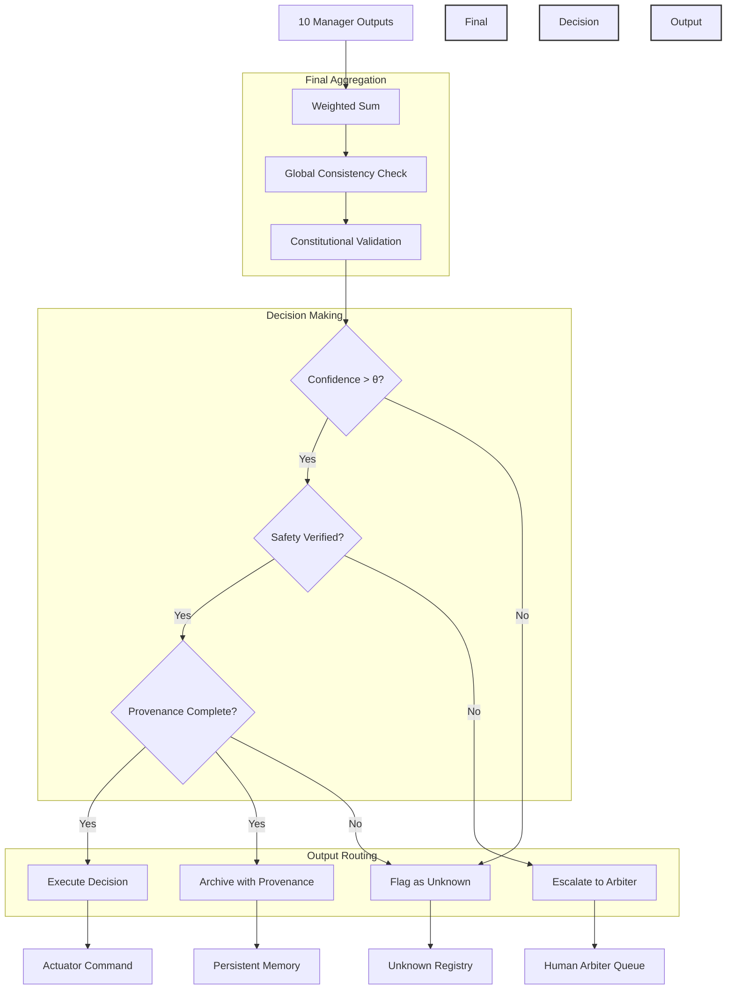
```mermaid
flowchart TB
    QUEEN_IN[10 Manager Outputs]
    
    subgraph Final Aggregation
        FA1[Weighted Sum]
        FA2[Global Consistency Check]
        FA3[Constitutional Validation]
    end
    
    subgraph Decision Making
        DM1{Confidence > θ?}
        DM2{Safety Verified?}
        DM3{Provenance Complete?}
    end
    
    subgraph Output Routing
        OR1[Execute Decision]
        OR2[Archive with Provenance]
        OR3[Flag as Unknown]
        OR4[Escalate to Arbiter]
    end
    
    QUEEN_IN --> FA1 --> FA2 --> FA3
    FA3 --> DM1
    
    DM1 -->|Yes| DM2
    DM1 -->|No| OR3
    DM2 -->|Yes| DM3
    DM2 -->|No| OR4
    DM3 -->|Yes| OR1 & OR2
    DM3 -->|No| OR3
    
    OR1 --> ACTUATE[Actuator Command]
    OR2 --> ARCHIVE[Persistent Memory]
    OR3 --> UNKNOWN[Unknown Registry]
    OR4 --> HUMAN[Human Arbiter Queue]
    
    style Final Aggregation fill:#ddf,stroke:#333,stroke-width:2px
    style Decision Making fill:#fdd,stroke:#333,stroke-width:2px
    style Output Routing fill:#dfd,stroke:#333,stroke-width:2px
```

---

## Constraint Lifecycle Management

### Constraint Definition to Enforcement

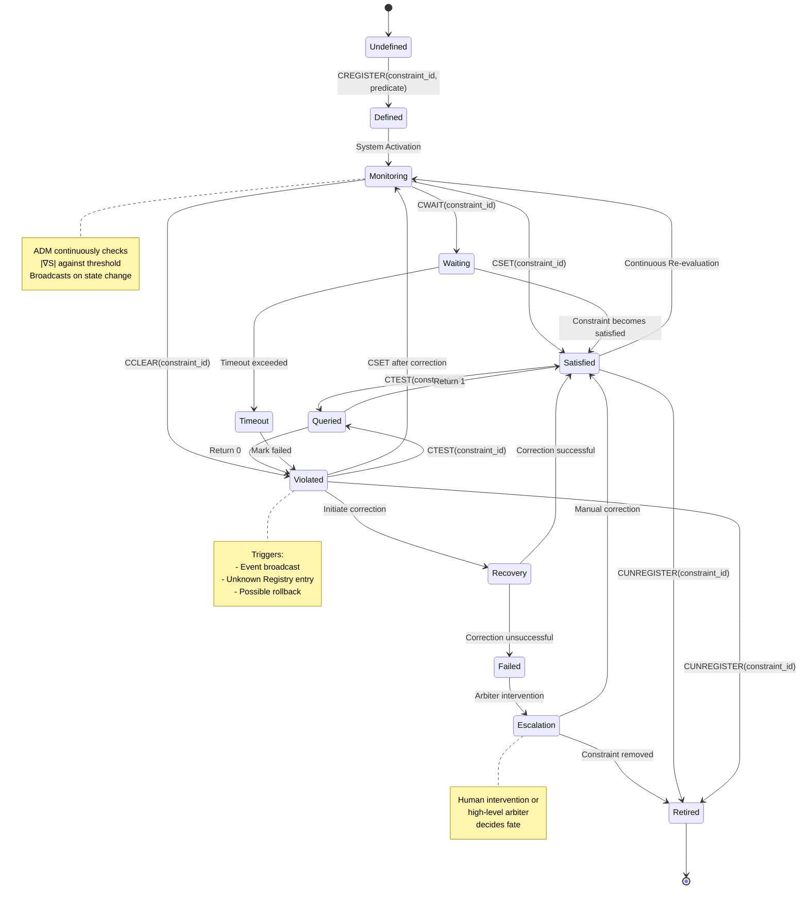
```mermaid
stateDiagram-v2
    [*] --> Undefined
    
    Undefined --> Defined: CREGISTER(constraint_id, predicate)
    
    Defined --> Monitoring: System Activation
    
    Monitoring --> Satisfied: CSET(constraint_id)
    Monitoring --> Violated: CCLEAR(constraint_id)
    
    Satisfied --> Monitoring: Continuous Re-evaluation
    Violated --> Monitoring: CSET after correction
    
    Satisfied --> Queried: CTEST(constraint_id)
    Violated --> Queried: CTEST(constraint_id)
    Queried --> Satisfied: Return 1
    Queried --> Violated: Return 0
    
    Monitoring --> Waiting: CWAIT(constraint_id)
    Waiting --> Satisfied: Constraint becomes satisfied
    Waiting --> Timeout: Timeout exceeded
    Timeout --> Violated: Mark failed
    
    Violated --> Recovery: Initiate correction
    Recovery --> Satisfied: Correction successful
    Recovery --> Failed: Correction unsuccessful
    Failed --> Escalation: Arbiter intervention
    
    Escalation --> Satisfied: Manual correction
    Escalation --> Retired: Constraint removed
    
    Satisfied --> Retired: CUNREGISTER(constraint_id)
    Violated --> Retired: CUNREGISTER(constraint_id)
    Retired --> [*]
    
    note right of Monitoring
        ADM continuously checks
        |∇S| against threshold
        Broadcasts on state change
    end note
    
    note right of Violated
        Triggers:
        - Event broadcast
        - Unknown Registry entry
        - Possible rollback
    end note
    
    note right of Escalation
        Human intervention or
        high-level arbiter
        decides fate
    end note
```

### Constraint Dependency Graph

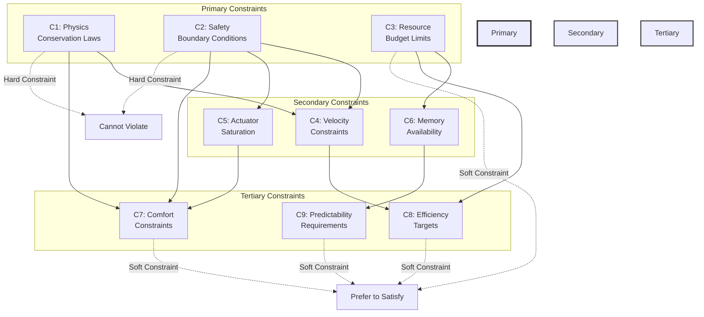
```mermaid
flowchart TB
    subgraph Primary Constraints
        C1[C1: Physics<br/>Conservation Laws]
        C2[C2: Safety<br/>Boundary Conditions]
        C3[C3: Resource<br/>Budget Limits]
    end
    
    subgraph Secondary Constraints
        C4[C4: Velocity<br/>Constraints]
        C5[C5: Actuator<br/>Saturation]
        C6[C6: Memory<br/>Availability]
    end
    
    subgraph Tertiary Constraints
        C7[C7: Comfort<br/>Constraints]
        C8[C8: Efficiency<br/>Targets]
        C9[C9: Predictability<br/>Requirements]
    end
    
    C1 --> C4
    C1 --> C7
    C2 --> C4
    C2 --> C5
    C2 --> C7
    C3 --> C6
    C3 --> C8
    C4 --> C8
    C5 --> C7
    C6 --> C9
    
    C1 -.->|Hard Constraint| BLOCK1[Cannot Violate]
    C2 -.->|Hard Constraint| BLOCK1
    C3 -.->|Soft Constraint| PREFER1[Prefer to Satisfy]
    C7 -.->|Soft Constraint| PREFER1
    C8 -.->|Soft Constraint| PREFER1
    C9 -.->|Soft Constraint| PREFER1
    
    style Primary Constraints fill:#fdd,stroke:#333,stroke-width:3px
    style Secondary Constraints fill:#ffd,stroke:#333,stroke-width:2px
    style Tertiary Constraints fill:#dff,stroke:#333,stroke-width:2px
```

### Constraint Propagation Network

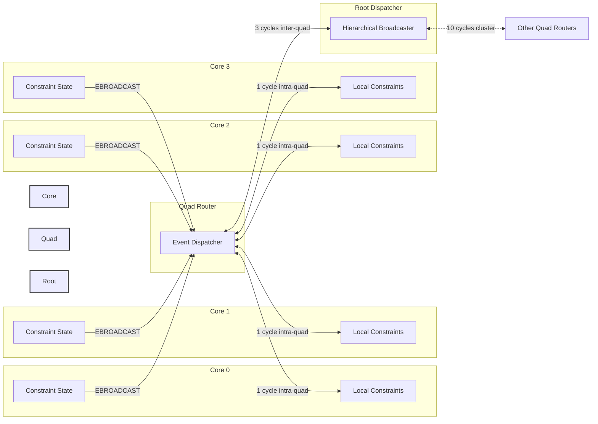
```mermaid
flowchart LR
    subgraph Core 0
        C0_1[Local Constraints]
        C0_2[Constraint State]
    end
    
    subgraph Core 1
        C1_1[Local Constraints]
        C1_2[Constraint State]
    end
    
    subgraph Core 2
        C2_1[Local Constraints]
        C2_2[Constraint State]
    end
    
    subgraph Core 3
        C3_1[Local Constraints]
        C3_2[Constraint State]
    end
    
    subgraph Quad Router
        QR[Event Dispatcher]
    end
    
    subgraph Root Dispatcher
        RD[Hierarchical Broadcaster]
    end
    
    C0_2 -->|EBROADCAST| QR
    C1_2 -->|EBROADCAST| QR
    C2_2 -->|EBROADCAST| QR
    C3_2 -->|EBROADCAST| QR
    
    QR <-->|1 cycle intra-quad| C0_1 & C1_1 & C2_1 & C3_1
    
    QR <-->|3 cycles inter-quad| RD
    
    RD <-.->|10 cycles cluster| OtherQuads[Other Quad Routers]
    
    style Core 0 fill:#fee,stroke:#333,stroke-width:2px
    style Core 1 fill:#efe,stroke:#333,stroke-width:2px
    style Core 2 fill:#eef,stroke:#333,stroke-width:2px
    style Core 3 fill:#ffe,stroke:#333,stroke-width:2px
    style Quad Router fill:#fef,stroke:#333,stroke-width:2px
    style Root Dispatcher fill:#ffd,stroke:#333,stroke-width:2px
```

---

## Constitutional Governance Flows

### Three-Branch Architecture

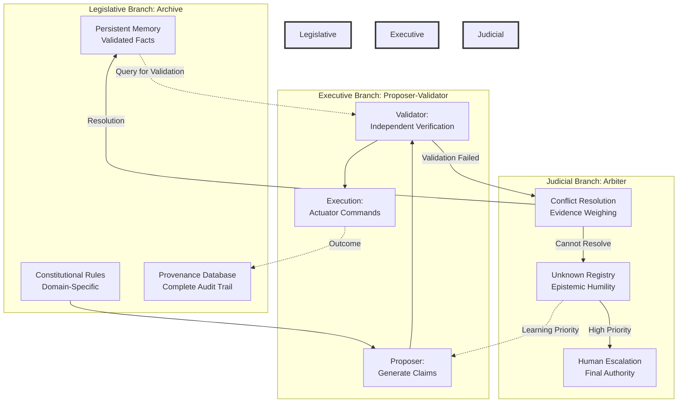
```mermaid
flowchart TB
    subgraph Legislative Branch: Archive
        LEG1[Persistent Memory<br/>Validated Facts]
        LEG2[Constitutional Rules<br/>Domain-Specific]
        LEG3[Provenance Database<br/>Complete Audit Trail]
    end
    
    subgraph Executive Branch: Proposer-Validator
        EXE1[Proposer:<br/>Generate Claims]
        EXE2[Validator:<br/>Independent Verification]
        EXE3[Execution:<br/>Actuator Commands]
    end
    
    subgraph Judicial Branch: Arbiter
        JUD1[Conflict Resolution<br/>Evidence Weighing]
        JUD2[Unknown Registry<br/>Epistemic Humility]
        JUD3[Human Escalation<br/>Final Authority]
    end
    
    LEG2 --> EXE1
    EXE1 --> EXE2
    EXE2 --> EXE3
    
    EXE2 -->|Validation Failed| JUD1
    JUD1 -->|Cannot Resolve| JUD2
    JUD2 -->|High Priority| JUD3
    
    JUD1 -->|Resolution| LEG1
    EXE3 -.->|Outcome| LEG3
    
    LEG1 -.->|Query for Validation| EXE2
    JUD2 -.->|Learning Priority| EXE1
    
    style Legislative Branch: Archive fill:#fee,stroke:#333,stroke-width:3px
    style Executive Branch: Proposer-Validator fill:#efe,stroke:#333,stroke-width:3px
    style Judicial Branch: Arbiter fill:#eef,stroke:#333,stroke-width:3px
```

### Proposer Workflow

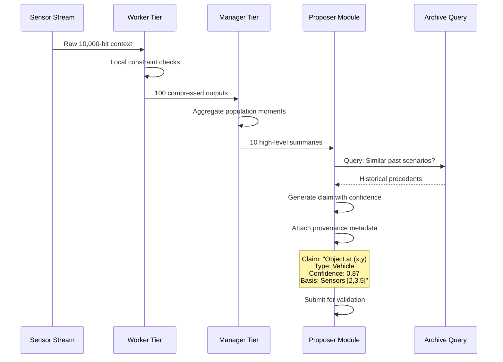
```mermaid
sequenceDiagram
    participant Sensor as Sensor Stream
    participant Worker as Worker Tier
    participant Manager as Manager Tier
    participant Proposer as Proposer Module
    participant Archive as Archive Query
    
    Sensor->>Worker: Raw 10,000-bit context
    Worker->>Worker: Local constraint checks
    Worker->>Manager: 100 compressed outputs
    Manager->>Manager: Aggregate population moments
    Manager->>Proposer: 10 high-level summaries
    
    Proposer->>Archive: Query: Similar past scenarios?
    Archive-->>Proposer: Historical precedents
    
    Proposer->>Proposer: Generate claim with confidence
    Proposer->>Proposer: Attach provenance metadata
    
    Note over Proposer: Claim: "Object at (x,y)<br/>Type: Vehicle<br/>Confidence: 0.87<br/>Basis: Sensors [2,3,5]"
    
    Proposer->>Proposer: Submit for validation
```

### Validator Workflow

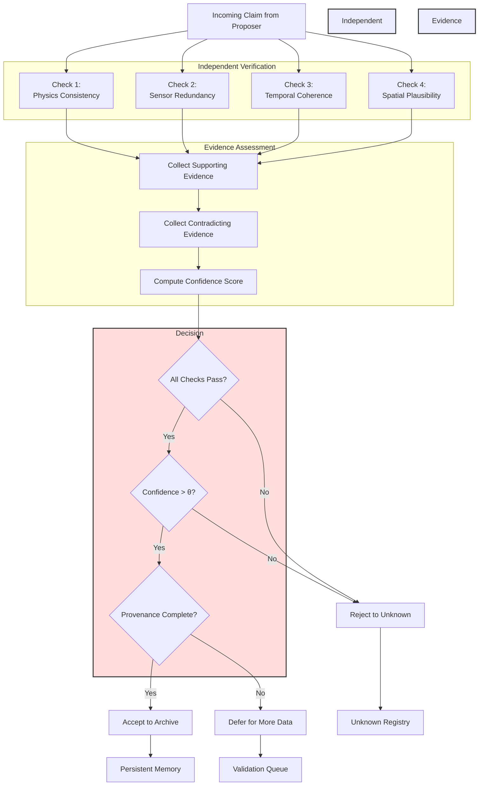
```mermaid
flowchart TB
    CLAIM[Incoming Claim from Proposer]
    
    subgraph Independent Verification
        IV1[Check 1:<br/>Physics Consistency]
        IV2[Check 2:<br/>Sensor Redundancy]
        IV3[Check 3:<br/>Temporal Coherence]
        IV4[Check 4:<br/>Spatial Plausibility]
    end
    
    subgraph Evidence Assessment
        EA1[Collect Supporting Evidence]
        EA2[Collect Contradicting Evidence]
        EA3[Compute Confidence Score]
    end
    
    subgraph Decision
        DEC1{All Checks Pass?}
        DEC2{Confidence > θ?}
        DEC3{Provenance Complete?}
    end
    
    CLAIM --> IV1 & IV2 & IV3 & IV4
    IV1 & IV2 & IV3 & IV4 --> EA1
    EA1 --> EA2 --> EA3
    
    EA3 --> DEC1
    DEC1 -->|Yes| DEC2
    DEC1 -->|No| REJECT[Reject to Unknown]
    
    DEC2 -->|Yes| DEC3
    DEC2 -->|No| REJECT
    
    DEC3 -->|Yes| ACCEPT[Accept to Archive]
    DEC3 -->|No| DEFER[Defer for More Data]
    
    ACCEPT --> ARCHIVE[Persistent Memory]
    REJECT --> UNKNOWN[Unknown Registry]
    DEFER --> QUEUE[Validation Queue]
    
    style Independent Verification fill:#dfd,stroke:#333,stroke-width:2px
    style Evidence Assessment fill:#ddf,stroke:#333,stroke-width:2px
    style Decision fill:#fdd,stroke:#333,stroke-width:2px
```

### Arbiter Workflow

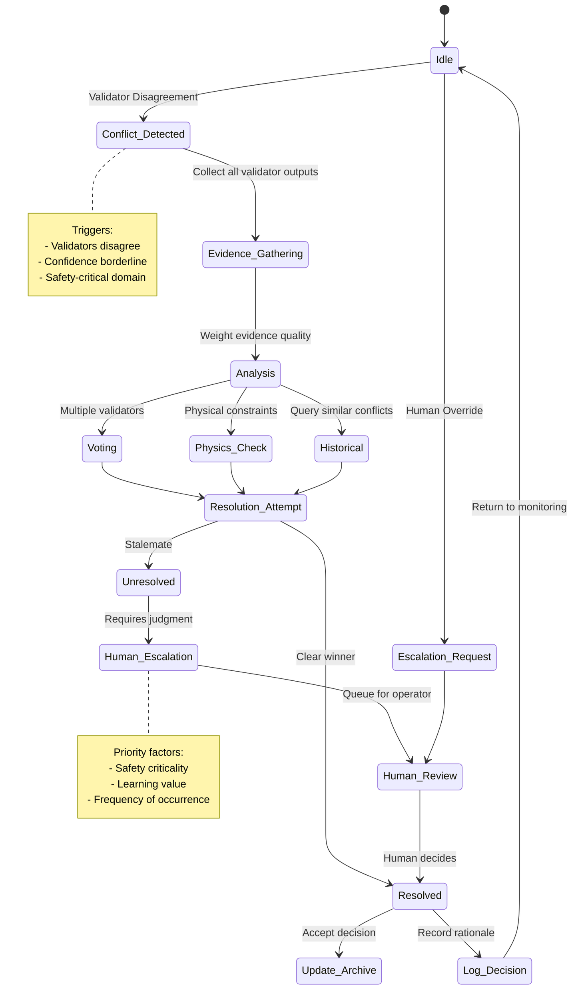
```mermaid
stateDiagram-v2
    [*] --> Idle
    
    Idle --> Conflict_Detected: Validator Disagreement
    Idle --> Escalation_Request: Human Override
    
    Conflict_Detected --> Evidence_Gathering: Collect all validator outputs
    
    Evidence_Gathering --> Analysis: Weight evidence quality
    
    Analysis --> Voting: Multiple validators
    Analysis --> Physics_Check: Physical constraints
    Analysis --> Historical: Query similar conflicts
    
    Voting --> Resolution_Attempt
    Physics_Check --> Resolution_Attempt
    Historical --> Resolution_Attempt
    
    Resolution_Attempt --> Resolved: Clear winner
    Resolution_Attempt --> Unresolved: Stalemate
    
    Resolved --> Update_Archive: Accept decision
    
    Unresolved --> Human_Escalation: Requires judgment
    Human_Escalation --> Human_Review: Queue for operator
    Human_Review --> Resolved: Human decides
    
    Resolved --> Log_Decision: Record rationale
    Log_Decision --> Idle: Return to monitoring
    
    Escalation_Request --> Human_Review
    
    note right of Conflict_Detected
        Triggers:
        - Validators disagree
        - Confidence borderline
        - Safety-critical domain
    end note
    
    note right of Human_Escalation
        Priority factors:
        - Safety criticality
        - Learning value
        - Frequency of occurrence
    end note
```

### Unknown Registry Management

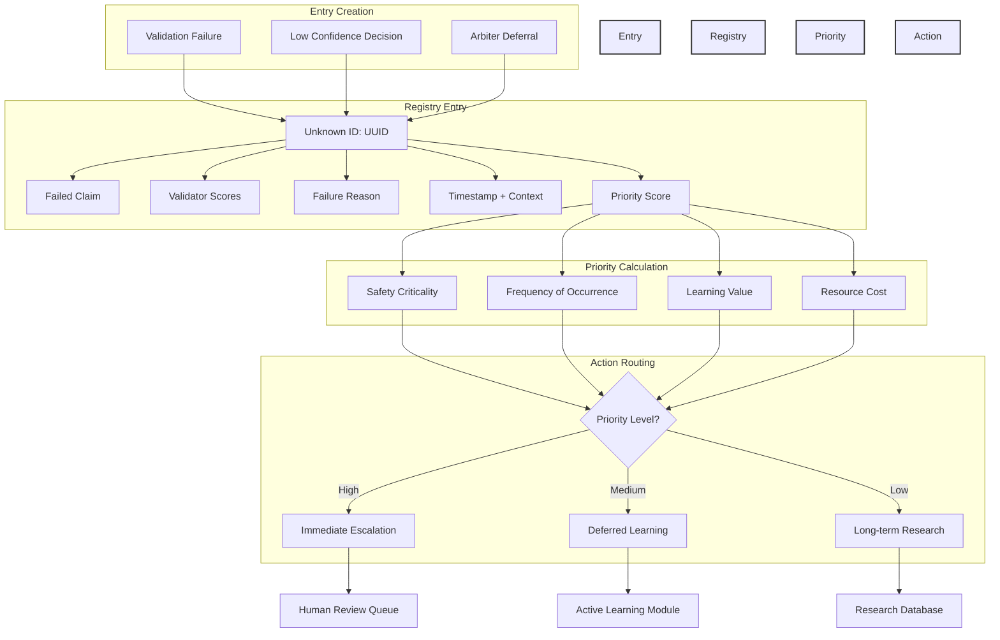
```mermaid
flowchart TB
    subgraph Entry Creation
        EC1[Validation Failure]
        EC2[Low Confidence Decision]
        EC3[Arbiter Deferral]
    end
    
    subgraph Registry Entry
        RE1[Unknown ID: UUID]
        RE2[Failed Claim]
        RE3[Validator Scores]
        RE4[Failure Reason]
        RE5[Timestamp + Context]
        RE6[Priority Score]
    end
    
    subgraph Priority Calculation
        PC1[Safety Criticality]
        PC2[Frequency of Occurrence]
        PC3[Learning Value]
        PC4[Resource Cost]
    end
    
    subgraph Action Routing
        AR1{Priority Level?}
        AR2[Immediate Escalation]
        AR3[Deferred Learning]
        AR4[Long-term Research]
    end
    
    EC1 & EC2 & EC3 --> RE1
    RE1 --> RE2 & RE3 & RE4 & RE5 & RE6
    
    RE6 --> PC1 & PC2 & PC3 & PC4
    PC1 & PC2 & PC3 & PC4 --> AR1
    
    AR1 -->|High| AR2
    AR1 -->|Medium| AR3
    AR1 -->|Low| AR4
    
    AR2 --> HUMAN[Human Review Queue]
    AR3 --> LEARNING[Active Learning Module]
    AR4 --> ARCHIVE[Research Database]
    
    style Entry Creation fill:#fee,stroke:#333,stroke-width:2px
    style Registry Entry fill:#efe,stroke:#333,stroke-width:2px
    style Priority Calculation fill:#eef,stroke:#333,stroke-width:2px
    style Action Routing fill:#ffe,stroke:#333,stroke-width:2px
```

---

## Resource Management Diagrams

### Core Activation Strategy

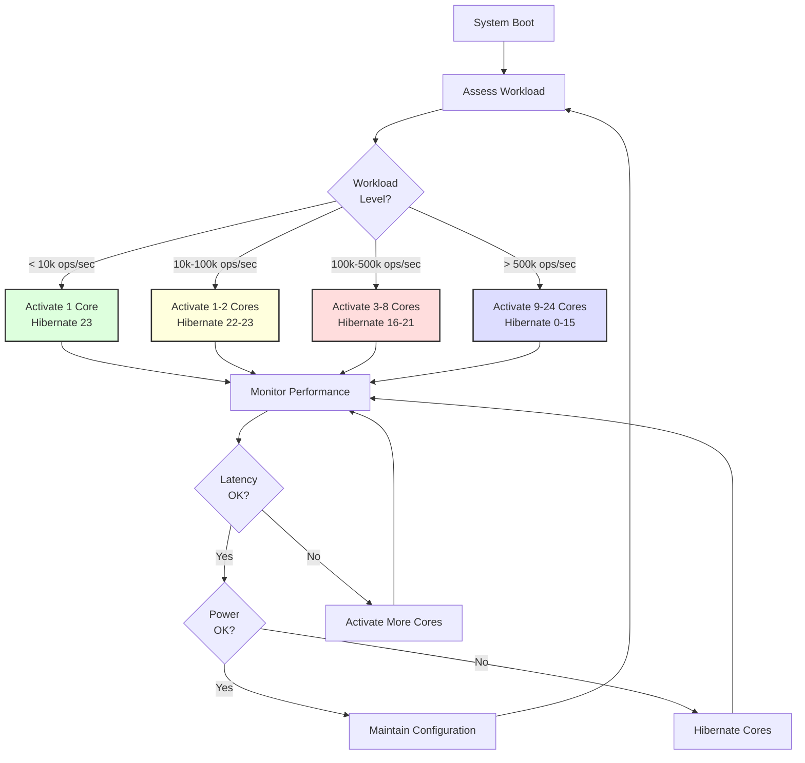
```mermaid
flowchart TB
    START[System Boot]
    
    START --> ASSESS[Assess Workload]
    
    ASSESS --> DECISION{Workload<br/>Level?}
    
    DECISION -->|< 10k ops/sec| MINIMAL[Activate 1 Core<br/>Hibernate 23]
    DECISION -->|10k-100k ops/sec| LIGHT[Activate 1-2 Cores<br/>Hibernate 22-23]
    DECISION -->|100k-500k ops/sec| MEDIUM[Activate 3-8 Cores<br/>Hibernate 16-21]
    DECISION -->|> 500k ops/sec| HEAVY[Activate 9-24 Cores<br/>Hibernate 0-15]
    
    MINIMAL --> MONITOR[Monitor Performance]
    LIGHT --> MONITOR
    MEDIUM --> MONITOR
    HEAVY --> MONITOR
    
    MONITOR --> CHECK{Latency<br/>OK?}
    
    CHECK -->|Yes| POWER{Power<br/>OK?}
    CHECK -->|No| UPSCALE[Activate More Cores]
    
    POWER -->|Yes| STABLE[Maintain Configuration]
    POWER -->|No| DOWNSCALE[Hibernate Cores]
    
    UPSCALE --> MONITOR
    DOWNSCALE --> MONITOR
    STABLE --> ASSESS
    
    style MINIMAL fill:#dfd,stroke:#333,stroke-width:2px
    style LIGHT fill:#ffd,stroke:#333,stroke-width:2px
    style MEDIUM fill:#fdd,stroke:#333,stroke-width:2px
    style HEAVY fill:#ddf,stroke:#333,stroke-width:2px
```

### Memory Hierarchy Access Patterns

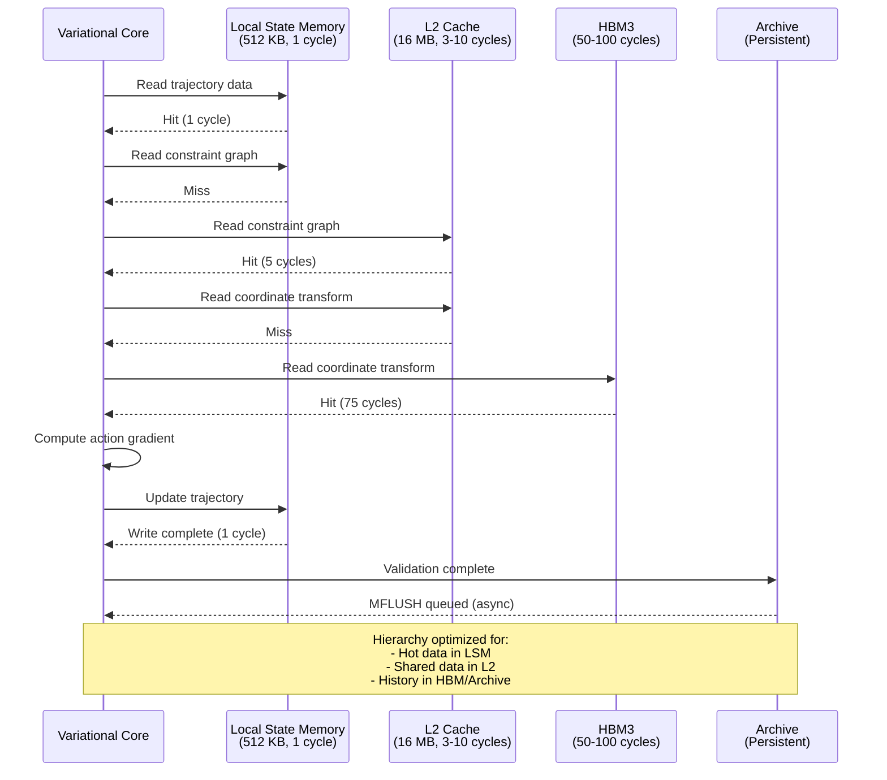
```mermaid
sequenceDiagram
    participant Core as Variational Core
    participant LSM as Local State Memory<br/>(512 KB, 1 cycle)
    participant L2 as L2 Cache<br/>(16 MB, 3-10 cycles)
    participant HBM as HBM3<br/>(50-100 cycles)
    participant Archive as Archive<br/>(Persistent)
    
    Core->>LSM: Read trajectory data
    LSM-->>Core: Hit (1 cycle)
    
    Core->>LSM: Read constraint graph
    LSM-->>Core: Miss
    Core->>L2: Read constraint graph
    L2-->>Core: Hit (5 cycles)
    
    Core->>L2: Read coordinate transform
    L2-->>Core: Miss
    Core->>HBM: Read coordinate transform
    HBM-->>Core: Hit (75 cycles)
    
    Core->>Core: Compute action gradient
    Core->>LSM: Update trajectory
    LSM-->>Core: Write complete (1 cycle)
    
    Core->>Archive: Validation complete
    Archive-->>Core: MFLUSH queued (async)
    
    Note over Core,Archive: Hierarchy optimized for:<br/>- Hot data in LSM<br/>- Shared data in L2<br/>- History in HBM/Archive
```

### Power Budget Allocation

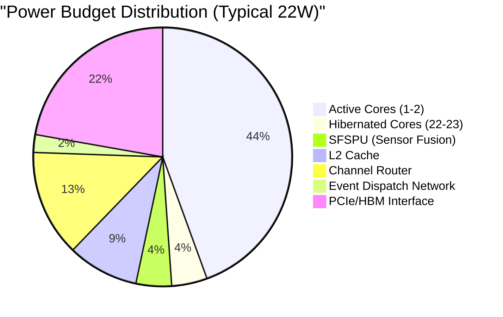
```mermaid
pie
    title "Power Budget Distribution (Typical 22W)"
    "Active Cores (1-2)" : 10
    "Hibernated Cores (22-23)" : 1
    "SFSPU (Sensor Fusion)" : 1
    "L2 Cache" : 2
    "Channel Router" : 3
    "Event Dispatch Network" : 0.5
    "PCIe/HBM Interface" : 5
```

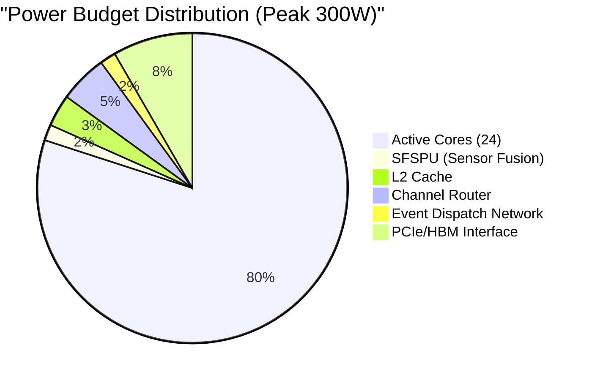
```mermaid
pie
    title "Power Budget Distribution (Peak 300W)"
    "Active Cores (24)" : 240
    "SFSPU (Sensor Fusion)" : 5
    "L2 Cache" : 10
    "Channel Router" : 15
    "Event Dispatch Network" : 5
    "PCIe/HBM Interface" : 25
```

---

## Error Handling and Recovery

### Error Classification and Response

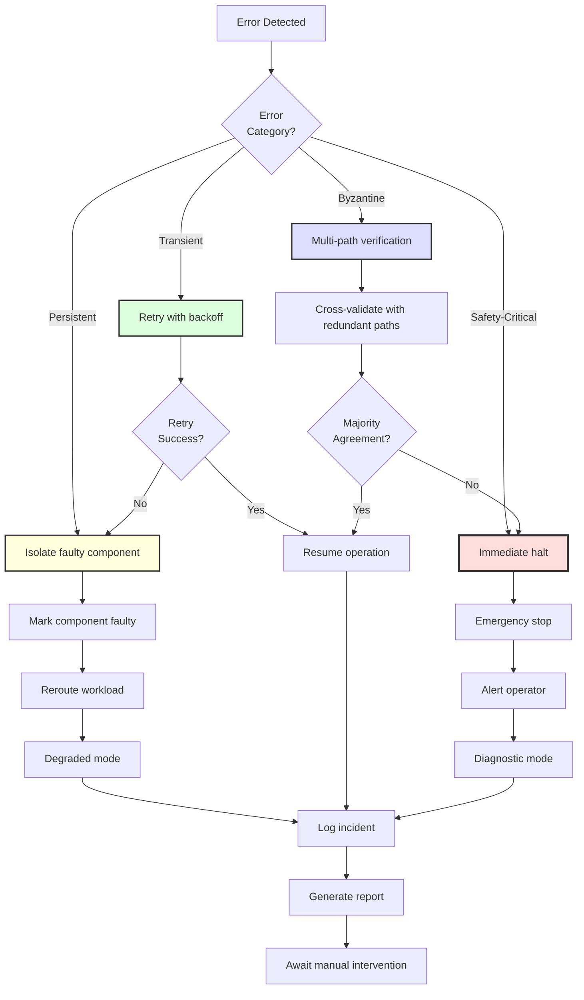
```mermaid
flowchart TB
    ERROR[Error Detected]
    
    ERROR --> CLASS{Error<br/>Category?}
    
    CLASS -->|Transient| TRANS[Retry with backoff]
    CLASS -->|Persistent| PERS[Isolate faulty component]
    CLASS -->|Byzantine| BYZ[Multi-path verification]
    CLASS -->|Safety-Critical| SAFE[Immediate halt]
    
    TRANS --> RETRY{Retry<br/>Success?}
    RETRY -->|Yes| RESUME[Resume operation]
    RETRY -->|No| PERS
    
    PERS --> ISOLATE[Mark component faulty]
    ISOLATE --> REROUTE[Reroute workload]
    REROUTE --> DEGRADE[Degraded mode]
    
    BYZ --> VERIFY[Cross-validate with redundant paths]
    VERIFY --> VOTE{Majority<br/>Agreement?}
    VOTE -->|Yes| RESUME
    VOTE -->|No| SAFE
    
    SAFE --> HALT[Emergency stop]
    HALT --> NOTIFY[Alert operator]
    NOTIFY --> DIAG[Diagnostic mode]
    
    DEGRADE --> LOG[Log incident]
    RESUME --> LOG
    DIAG --> LOG
    
    LOG --> REPORT[Generate report]
    REPORT --> END[Await manual intervention]
    
    style TRANS fill:#dfd,stroke:#333,stroke-width:2px
    style PERS fill:#ffd,stroke:#333,stroke-width:2px
    style BYZ fill:#ddf,stroke:#333,stroke-width:2px
    style SAFE fill:#fdd,stroke:#333,stroke-width:3px
```

### Fault Isolation Protocol

```mermaid
stateDiagram-v2
    [*] --> Healthy
    
    Healthy --> Suspected: Error count > threshold
    Suspected --> Healthy: False alarm
    Suspected --> Quarantined: Confirmed fault
    
    Quarantined --> Diagnosed: Run diagnostics
    
    Diagnosed --> Transient_Fault: Self-corrected
    Diagnosed --> Persistent_Fault: Hardware issue
    Diagnosed --> Byzantine_Fault: Malicious/corrupted
    
    Transient_Fault --> Probation: Limited reactivation
    Probation --> Healthy: Stable operation
    Probation --> Quarantined: Fault recurs
    
    Persistent_Fault --> Disabled: Mark offline
    Byzantine_Fault --> Disabled: Isolate completely
    
    Disabled --> [*]: Replacement required
    
    note right of Suspected
        Triggers:
        - Latency spikes
        - Constraint violations
        - Memory errors
        - Thermal alerts
    end note
    
    note right of Diagnosed
        Diagnostics include:
        - Memory test (BIST)
        - Constraint test suite
        - Cross-core verification
        - Temperature check
    end note
```

### Graceful Degradation Strategy

```mermaid
flowchart LR
    subgraph Full Capability
        FC[24 Cores Active<br/>All Features Enabled<br/>Peak Performance]
    end
    
    subgraph Degraded Level 1
        D1[20-23 Cores Active<br/>Reduced Throughput<br/>Full Safety]
    end
    
    subgraph Degraded Level 2
        D2[15-19 Cores Active<br/>Limited Throughput<br/>Core Safety Only]
    end
    
    subgraph Degraded Level 3
        D3[10-14 Cores Active<br/>Minimal Throughput<br/>Emergency Functions]
    end
    
    subgraph Emergency Mode
        EM[5-9 Cores Active<br/>Limp Home Mode<br/>Human Takeover]
    end
    
    subgraph Safe Stop
        SS[Controlled Shutdown<br/>Log State<br/>Notify Operator]
    end
    
    FC -->|Minor Fault| D1
    D1 -->|Minor Fault| D2
    D2 -->|Minor Fault| D3
    D3 -->|Minor Fault| EM
    EM -->|Critical Fault| SS
    
    FC -->|Major Fault| D2
    D1 -->|Major Fault| D3
    D2 -->|Major Fault| EM
    D3 -->|Critical Fault| SS
    
    FC -->|Critical Fault| SS
    D1 -->|Critical Fault| SS
    
    style Full Capability fill:#dfd,stroke:#333,stroke-width:3px
    style Degraded Level 1 fill:#ffd,stroke:#333,stroke-width:2px
    style Degraded Level 2 fill:#fed,stroke:#333,stroke-width:2px
    style Degraded Level 3 fill:#fdd,stroke:#333,stroke-width:2px
    style Emergency Mode fill:#fcc,stroke:#333,stroke-width:3px
    style Safe Stop fill:#ccc,stroke:#333,stroke-width:3px
```

---

## Performance Monitoring Views

### Real-Time Dashboard Layout

```mermaid
flowchart TB
    subgraph Header
        H1[System Status: Operational]
        H2[Active Cores: 2/24]
        H3[Power: 22.4W / 300W]
        H4[Uptime: 47d 13h 26m]
    end
    
    subgraph Left Panel: Throughput
        LP1[Decisions/sec: 847,234]
        LP2[Worker Utilization: 23%]
        LP3[Manager Utilization: 18%]
        LP4[Queen Utilization: 92%]
    end
    
    subgraph Center Panel: Latency
        CP1[P50 Latency: 3.2ns]
        CP2[P95 Latency: 3.8ns]
        CP3[P99 Latency: 4.3ns]
        CP4[Max Latency: 5.1ns]
    end
    
    subgraph Right Panel: Quality
        RP1[Constraint Satisfaction: 99.7%]
        RP2[Validation Pass Rate: 99.2%]
        RP3[Unknown Registry: 84 entries]
        RP4[Arbiter Queue: 3 pending]
    end
    
    subgraph Bottom Panel: Alerts
        BP1[⚠️ Core 14 temp: 79°C]
        BP2[✓ All constraints within budget]
        BP3[ℹ️ Unknown growth: +2%]
    end
    
    style Header fill:#eef,stroke:#333,stroke-width:2px
    style Left Panel: Throughput fill:#dfd,stroke:#333,stroke-width:2px
    style Center Panel: Latency fill:#ffd,stroke:#333,stroke-width:2px
    style Right Panel: Quality fill:#ddf,stroke:#333,stroke-width:2px
    style Bottom Panel: Alerts fill:#fed,stroke:#333,stroke-width:2px
```

### Performance Trend Visualization

```mermaid
line
    title "Throughput Over Time (Last Hour)"
    x-axis "Time (minutes ago)" 60 --> 0
    y-axis "Decisions/sec (thousands)" 0 --> 1000
    line [650, 680, 720, 750, 780, 820, 850, 847]
```

```mermaid
line
    title "Latency Distribution"
    x-axis "Latency (ns)" 2.5 --> 5.5
    y-axis "Frequency (%)" 0 --> 50
    line [2, 8, 18, 35, 48, 42, 28, 15, 6, 2, 0.5]
```

### Resource Utilization Heatmap

```mermaid
gantt
    title Core Activity Timeline (Last 10 seconds)
    dateFormat ss
    axisFormat %S
    
    section Core 0
    Active     :a1, 00, 3s
    Hibernated :a2, 03, 7s
    
    section Core 1
    Hibernated :b1, 00, 2s
    Active     :b2, 02, 5s
    Hibernated :b3, 07, 3s
    
    section Core 2-23
    Hibernated :c1, 00, 10s
```

---

## Deployment Topology Maps

### Single-Die Configuration

```mermaid
flowchart TB
    subgraph External Interfaces
        PCIE[PCIe 5.0 x16 Host]
        SENSOR[Sensor I/O<br/>64 channels]
    end
    
    subgraph vEPU-24 Die
        direction TB
        
        subgraph Quad 0
            C0[Core 0] & C1[Core 1] & C2[Core 2] & C3[Core 3]
        end
        
        subgraph Quad 1
            C4[Core 4] & C5[Core 5] & C6[Core 6] & C7[Core 7]
        end
        
        subgraph Quad 2-5
            C8_23[Cores 8-23]
        end
        
        EDN[Event Dispatch Network<br/>10mm²]
        
        L2[L2 Cache 16MB<br/>20mm²]
        
        SFSPU[Sensor Fusion & State<br/>Projection Unit<br/>30mm²]
        
        Router[Channel Router<br/>24×24 Crossbar<br/>15mm²]
    end
    
    subgraph Memory
        HBM[HBM3<br/>64GB<br/>819 GB/s]
    end
    
    PCIE <--> Router
    SENSOR <--> SFSPU
    
    SFSPU --> C0 & C1 & C2 & C3 & C4 & C5 & C6 & C7 & C8_23
    
    C0 & C1 & C2 & C3 & C4 & C5 & C6 & C7 & C8_23 <--> EDN
    EDN <--> L2
    L2 <--> Router
    Router <--> HBM
    
    style External Interfaces fill:#fee,stroke:#333,stroke-width:2px
    style vEPU-24 Die fill:#efe,stroke:#333,stroke-width:3px
    style Memory fill:#eef,stroke:#333,stroke-width:2px
```

### Multi-Die System (vEPU-96)

```mermaid
flowchart LR
    subgraph Host System
        CPU[Host CPU<br/>Xeon/EPYC]
        DRAM[System DRAM]
    end
    
    subgraph PCIe Switch
        SWITCH[PCIe 5.0 Switch<br/>x64 aggregate]
    end
    
    subgraph Die 0
        D0[vEPU-24<br/>Cores 0-23]
        HBM0[HBM3 64GB]
    end
    
    subgraph Die 1
        D1[vEPU-24<br/>Cores 24-47]
        HBM1[HBM3 64GB]
    end
    
    subgraph Die 2
        D2[vEPU-24<br/>Cores 48-71]
        HBM2[HBM3 64GB]
    end
    
    subgraph Die 3
        D3[vEPU-24<br/>Cores 72-95]
        HBM3[HBM3 64GB]
    end
    
    CPU <--> SWITCH
    DRAM <--> CPU
    
    SWITCH <--> D0 & D1 & D2 & D3
    
    D0 <--> HBM0
    D1 <--> HBM1
    D2 <--> HBM2
    D3 <--> HBM3
    
    D0 <-.->|Inter-die coherence| D1
    D1 <-.->|Inter-die coherence| D2
    D2 <-.->|Inter-die coherence| D3
    D3 <-.->|Inter-die coherence| D0
    
    style Host System fill:#fee,stroke:#333,stroke-width:2px
    style Die 0 fill:#dfd,stroke:#333,stroke-width:2px
    style Die 1 fill:#ddf,stroke:#333,stroke-width:2px
    style Die 2 fill:#ffd,stroke:#333,stroke-width:2px
    style Die 3 fill:#fdd,stroke:#333,stroke-width:2px
```

### Autonomous Vehicle System Integration

```mermaid
flowchart TB
    subgraph Vehicle Sensors
        CAM[8 Cameras<br/>2 MP @ 30fps]
        LID[4 LiDARs<br/>128-channel]
        RAD[6 Radars<br/>77 GHz]
        IMU[IMU<br/>100 Hz]
        GPS[GPS/GNSS<br/>10 Hz]
    end
    
    subgraph Sensor Preprocessing
        CAMPROC[Camera ISP<br/>JPEG compression]
        LIDPROC[LiDAR Point Cloud<br/>Voxel grid]
        RADPROC[Radar Doppler<br/>FFT]
    end
    
    subgraph PICAPD System
        SFSPU[Sensor Fusion<br/>Kalman Filtering<br/>Temporal Sync]
        EPU[vEPU-24<br/>Constraint Processing<br/>Agent Governance]
        PERSIST[Persistent Memory<br/>Archive + Unknown]
    end
    
    subgraph Vehicle Control
        STEER[Steering Controller<br/>±45° @ 100 Hz]
        BRAKE[Brake Controller<br/>0-100% @ 100 Hz]
        THROTTLE[Throttle Controller<br/>0-100% @ 100 Hz]
    end
    
    subgraph Safety Monitor
        SAFETY[Watchdog<br/>Redundant Checker<br/>Emergency Override]
    end
    
    CAM --> CAMPROC
    LID --> LIDPROC
    RAD --> RADPROC
    IMU --> SFSPU
    GPS --> SFSPU
    
    CAMPROC --> SFSPU
    LIDPROC --> SFSPU
    RADPROC --> SFSPU
    
    SFSPU --> EPU
    EPU --> PERSIST
    EPU --> SAFETY
    
    SAFETY --> STEER & BRAKE & THROTTLE
    
    SAFETY -.->|Override| EPU
    
    style Vehicle Sensors fill:#fee,stroke:#333,stroke-width:2px
    style Sensor Preprocessing fill:#efe,stroke:#333,stroke-width:2px
    style PICAPD System fill:#eef,stroke:#333,stroke-width:3px
    style Vehicle Control fill:#ffe,stroke:#333,stroke-width:2px
    style Safety Monitor fill:#fdd,stroke:#333,stroke-width:3px
```

---

## Conclusion

This comprehensive visualization suite provides operational monitoring and debugging capabilities for the PICAPD architecture. All diagrams are:

- **Obsidian-compatible**: Rendered natively in Obsidian using Mermaid
- **Real-time updatable**: Can be parameterized with live telemetry data
- **Hierarchical**: From system-level to instruction-level views
- **Process-oriented**: Following KTE methodology for process design and control

**Usage Guidelines**:

1. **System Overview**: Use top-level diagrams for executive briefings
2. **Operational Monitoring**: Use real-time dashboards for 24/7 operations
3. **Debugging**: Use detailed flow diagrams to trace execution paths
4. **Performance Analysis**: Use trend and heatmap visualizations
5. **Failure Analysis**: Use error handling and recovery flows

**Maintenance**:

- Update metrics with actual telemetry data from deployed systems
- Extend diagrams for new features and capabilities
- Version control all diagram source files
- Generate PNG/SVG exports for documentation

---

**Document Version**: 1.0  
**Last Updated**: February 2026  
**Maintainer**: PICAPD Visualization Team  
**Tools**: Mermaid.js, Obsidian, Python telemetry scripts
