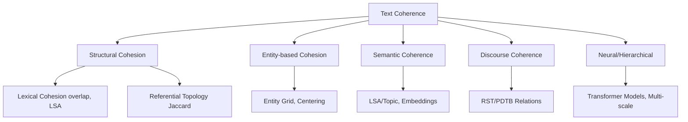

# Coherence Taxonomy

**Executive Summary**

Coherence in text spans multiple linguistic levels – from **surface cohesion** (word overlap, anaphora) through **entity continuity** to **deep semantic and discourse structures** . In NLP research, coherence is often categorized as **local vs. global**, **cohesion vs. coherence**, and **structural vs. semantic**.

. Local coherence concerns adjacent sentences; global coherence is about the entire discourse theme We organize known approaches into a taxonomy (see §1 and diagram below):

- **Structural/Lexical Cohesion:** e.g. word overlap, connectives, anaphora. Measures include Jaccard/ cosine similarity on words , counts of discourse markers, or referential indices (Coh-Metrix-style scores).
- **Entity-Based Models:** e.g. *Centering Theory* and the *Entity Grid* . These track how entities (nouns/pronouns) persist or transition across sentences. Entity Grid models compute the probability of syntactic role transitions (subject→object etc) from a grid , encoding local coherence patterns.

**Semantic Coherence:** e.g. Latent Semantic Analysis, topic models, and sentence embeddings. These treat coherence as semantic relatedness. LSA scores or topic distributions measure how sentences share meaning, and modern methods use contextual embeddings (e.g. SBERT cosine similarity) to quantify semantic continuity .

**Discourse Structure:** Based on Rhetorical Structure Theory (RST) or Penn Discourse Treebank (PDTB)•

relations. RST posits a tree of nucleus/satellite spans linked by relations like *Elaboration* or *Cause* .

Coherent texts favor certain relation sequences (e.g. Elaboration typically follows a claim) . Models analyze discourse connectives or parse trees automatically.

- **Neural/Hybrid Models:** Modern systems (BERT, GPT, coherence classifiers) blend features. Transformer-based scorers (e.g. **DiscoScore**, BARTScore) and contrastive encoders learn coherence implicitly, often outperforming earlier models .

**Hierarchical & Reference Coherence:** Recent work considers multi-scale documents (chapters,•

scenes) and reference topology (citations, hyperlinks). These use weighted similarity or graph connectivity (e.g. our *capacity-weighted Jaccard* is a structural measure of cross-references).

Below is a schematic taxonomy. Our system’s capacity-weighted reference similarity is a **structural/ cohesion measure** (fitting under “Reference Topology”), distinct from semantic embeddings or discourse parsing. The tables and text compare methods, cite key references, and advise on which approaches suit different levels of our book-writing hierarchy.

**§1. Coherency Taxonomy**

**Coherence vs. Cohesion:** In linguistics, *cohesion* refers to explicit ties (pronouns, conjunctions), whereas *coherence* is the overall logical sense . A text can be cohesive (many connectors) yet incoherent if the ideas don’t fit. Coherence is often categorized as **local** (connections between adjacent sentences) vs **global** (overall topical unity) . It also spans a **structural-to-semantic** spectrum:

- **Structural Coherence:** Based on form and surface features, independent of meaning. E.g. lexical overlap or shared references . *Our weighted-Jaccard reference measure* falls here.
- **Entity-Based Coherence:** Focuses on referential continuity. Theories like *Centering* assert that . Entity Grid models sentences are more coherent when they continue the same salient entity

(Barzilay & Lapata 2008) capture such patterns statistically .

- **Semantic Coherence:** Involves meaning and topic continuity. Topical similarity (LSA, topic models, . embeddings) quantifies whether adjacent sentences talk about the same concepts

• **Discourse/Relational Coherence:** Concerns logical relations (cause, elaboration, contrast) between segments. Frameworks like *RST* represent discourse as a tree of nuclear/satellite spans .

Coherence models observe that certain relation sequences (e.g. Contrast then Cause) are preferred

.

- **Global vs. Local:** Local models (entity transitions, connectives) handle fine-grained flow ; global . Effective systems may combine both. models (RST, topic flow) capture document structure

**Hierarchy:** We note *multi-scale coherence*: documents have paragraphs, chapters, etc. Some research (e.g. HierCoh) uses hierarchical neural layers to capture sentence-, paragraph-, and document-level coherence simultaneously . Also, cross-document references (citations, hyperlinks) create higher-level coherence graphs; our capacity-weighted Jaccard is a structural analogue.

**§2. Structural/Lexical Cohesion**

**Definition:** These measures rely on surface text features. *Lexical cohesion* was formalized by Halliday & Hasan (1976): repetitions, synonyms, and collocations between sentences signal local coherence .

- **Word Overlap:** A simple metric is the Jaccard or cosine similarity between word sets of adjacent sentences. For example, *word_ij = |words_i ∩ words_j|/|words_i ∪ words_j|*. This treats repeated words as “glue.” Variants include n-gram overlap (ROUGE-style) and shared lemmata .
- **Latent Semantic Overlap:** LSA or word-embedding averages can measure relatedness even without exact word matches . E.g. compute the cosine of sentence vectors (from LSA, word2vec, BERT) to score continuity. Coh-Metrix uses LSA cosine between adjacent sentences to index cohesion .
- **Anaphora/Coreference Chains:** Counting pronoun references and noun phrase recurrences is another tactic. A long coreference chain (the same entity mentioned repeatedly) suggests coherence. For instance, *referential cohesion* metrics tally the proportion of adjacent sentences sharing a referent (Coh-Metrix reports several coreference indices.)2
- **Discourse Markers/Connectives:** Conjunctions and discourse words (however, therefore, meanwhile) also signal coherence. One can score a text by counting explicit connectors or by classifying discourse relations. For example, the Penn Discourse Treebank (PDTB) identifies thousands of connectives. Metrics include the percentage of sentence pairs linked by an explicit marker. Empirically, substituting an inappropriate connective (e.g. replacing “however” with “therefore”) disrupts coherence

. • **Formulas/Tools:** Word overlap is often implemented via set similarity or TF-IDF cosine (libraries: scikit-learn, NLTK). Coreference can use spaCy’s or AllenNLP’s coref models. Example formula: *Jaccard(A,B) = |A∩B|/|A∪B|*. Lexical cohesion may use tools like Coh-Metrix (Graesser et al. 2004) which provides ~20 surface metrics (noun overlap, content overlap, etc.) . See Table below for complexities.

**§3. Entity-Based Coherence**

**Centering Theory:** Grosz *et al.* (1995) model discourse focus: each sentence has a *centered* entity. Adjacent sentences that *continue* the same center are more coherent than shifts . Centering defines transitions (Continue, Retain, Shift) based on subjects/objects; more “Continue” transitions implies higher coherence

. While Centering is a qualitative framework, it inspired quantitative models.

**Entity Grid Model:** Barzilay & Lapata (2008) introduced the *entity grid*. Sentences are rows; each cell marks an entity’s grammatical role (Subject S, Object O, or others X) or “-” if absent . Transitions of roles across consecutive sentences form a feature vector . For example, if the entity “Department” is Object in sentence 1 and then absent, that “O→–” transition count contributes to the score

. One computes transition probabilities *P(r_i→r_j) = count(r_i→r_j)/total*, as features for coherence classification . Barzilay & Lapata reported ~87–90% accuracy in ranking coherent vs permuted paragraphs . *Elsner & Charniak (2011)* and others extended this with entity salience features.

**Graph Models:** Later work (Guinaudeau & Strube 2013) represents entities as nodes in a graph, with edges for co-occurrence or transition similarity. PageRank or centrality on this graph yields coherence scores. Similarly, multi-document summaries can use *Cross-document Structure Theory (CST)* relations on shared entities .

**Hierarchical/Multiple Documents:** For multi-level texts (chapters, sections), one can build entity grids per paragraph and then combine them. Dias & Pardo (2015) showed an “entity-discourse” model for summarization, using RST/CST to handle cross-document coherence . In our system, entities exist at Book→Chapter→Scene hierarchies; one could maintain separate grids or weighted transitions across levels.

**§4. Semantic Coherence**

**Latent Semantics:** LSA (Landauer & Dumais 1997) maps words to a latent space capturing topic similarity. Coherence is measured by sentence similarities in LSA space . Foltz *et al.* (1998) used LSA cosines between adjacent sentences as a coherence score. Topic models (LDA) give document-topic distributions: coherence metrics (Mimno et al. 2011) typically score *topic coherence* by the pointwise mutual information of top words, but one can also compute pairwise sentence topic-similarity.

3

**Embeddings:** Modern approaches encode sentences via neural embeddings. For example, Sentence-BERT (Reimers & Gurevych, 2019) or Universal Sentence Encoder produce vector representations such that semantically similar sentences are close. A coherence score can be the *cosine similarity* between successive sentence vectors or between a sentence and the document centroid. These implicitly capture synonymy and paraphrase relations. (DiscoScore and BERTScore use variants of this idea for evaluation.) Cosine computation is *O*(*d*) per pair; libraries: sentence-transformers , spacy-transformers .

**Semantic Role/Frame Coherence:** Another angle is using semantic role labeling (SRL). If sentences share semantic frames or predicate-argument structures, that indicates thematic linkage. One could count shared roles (e.g. same Agent roles) across sentences. FrameNet or PropBank frames could be aligned. Graph-based semantic networks (e.g. constructing a concept graph from text and measuring connectivity) have also been explored (Mesgar & Strube 2018).

**§5. Discourse Structure Coherence**

**RST (Rhetorical Structure Theory):** RST posits a tree structure over a text, linking spans via relations (Nucleus-Satellite). Mann & Thompson (1988) defined dozens of relations (Elaboration, Cause, Contrast, etc.)

. For instance, in (23.7) *“Jane took a train… [NUC] [SAT] She had to attend a conference.”*, the satellite provides the **Reason** for the nucleus . *RST coherence* is high when the rhetorical structure is well-formed and relations follow genre conventions. RST parsers (e.g. Discourse Parsing toolkits) can automatically label spans. Metrics include counts or tree-depth of certain relations.

**PDTB (Penn Discourse Treebank):** PDTB annotates explicit and implicit discourse connectives between sentence pairs (e.g. *because*, *however*). One coherence measure is the distribution of these relations. *Lin et al. (2011)* build a “discourse role matrix” recording which PDTB relation links adjacent sentences, and compute coherence features from it . They show coherent texts have a preferred pattern of relation transitions (e.g. *Contrast→Cause* is common

). An automated model can score coherence by how well the observed discourse transitions match those learned from coherent corpora.

**Automatic Relation Extraction:** Discourse parsers (e.g. for RST or PDTB) allow automatic coherence scoring. A simple approach: count the fraction of adjacent sentence pairs that have any connective or known relation (higher is usually more coherent) or penalize unlikely relation inversions . Recent models like DiscoScore and coherence parsers (Li *et al.* 2014) incorporate neural nets that leverage RST/PDTB features.

**§6. Hierarchical & Multi-Scale Coherency**

**Granularity:** Coherence can be measured at different text scales. Sentence-level models (entity grid, embeddings) capture very local flow, while paragraph- or chapter-level models (topic shifts, section headings) capture broader consistency. Works on *Hierarchical Coherence* explicitly model multiple layers. For example, the *HierCoh* model uses a neural hierarchy: sentence encodings feed into paragraph-level coherence layers and then into a document vector .

**Aggregation:** A common strategy is to aggregate local scores to estimate global coherence. E.g., compute the average sentence-to-sentence similarity across the chapter. Some studies (Liu *et al.* 2025) sum discourse relation features over an entire text. For hierarchical texts, one might compute coherence per scene, then

4

average or weight by scene length. Our *capacity-weighting* idea is an analog: references to large-scale chapters count more.

**Structured Documents:** Technical manuals or academic papers have explicit sections/subsections. One can exploit metadata: do sections appear in a logical sequence (e.g. Introduction→Method→Results)? Tools like argumentative zoning (Teufel 1999) classify sentence function (Claim, Evidence) to gauge structure. In novels, narrative coherence might consider **event graphs** (characters, locations) across chapters. This is largely domain-specific and often rule-based.

**§7. Neural/Embedding-Based Approaches**

**Transformer Models:** Pretrained LMs (BERT, GPT) have implicit coherence knowledge. One can fine-tune or prompt them: e.g. Claude/GPT-4o excels at local coherence (sentence permutation tasks) . *Embedding Comparison:* Compute document embeddings via BERT or SBERT and use cosine or learned classifiers to score coherence. *Neural Scoring:* DiscoScore (Zhao *et al.*, 2023) uses BERT plus discourse features, achieving high correlation with human coherence ratings

. BARTScore (Yuan *et al.* 2021) uses a sequence-to-sequence model’s likelihood as a coherence/factuality score . In practice, transformer-based metrics often outperform purely lexical ones, especially for long-range coherence.

**Contrastive Models:** Some neural methods train on (coherent vs permuted) pairs. For example, feeding consecutive-sentence windows into an LSTM or BERT and predicting if order is correct . Siamese or contrastive objectives can learn a “coherence encoder” that measures how likely a sentence follows the previous. These need large datasets of coherent/incoherent examples (e.g. ART corpus, GCDC ).

**Sentence Embedding Methods:** Simpler neural approaches embed each sentence and compute cosine sim as in §4. Jie *et al.* (2021) used RoBERTa embeddings to score document coherence with an SVM classifier on top. These methods are easy to implement with sentence-transformers or HuggingFace Transformers.

**§8. Reference-Based Coherency**

**Cross-References:** In structured corpora (academic papers, hypertext), coherence partly comes from referential links. For example, shared citation patterns (footnotes referring to similar works) or hyperlink networks contribute to perceived coherence. In our system, each “entity” (chapter, scene) has explicit references to others. We can treat these as a graph: nodes = entities, edges = references. Coherence might be measured by graph connectivity metrics (average path length, clustering) or by **entanglement**: how densely an entity is interconnected.

**Weighted Jaccard:** We already use a weighted Jaccard on reference sets (see Appendix C). This is a form of structural coherence: two scenes are coherent if they share important references. In literature, similar ideas appear in bibliometric analysis (e.g. bibliographic coupling). We classify our metric under **Structural Cohesion** (no text content needed).

**Citation/Link Coherence:** Some works assess coherence via citation networks: e.g., a scientific article is coherent if its citations form a coherent “story” of background. Graph-based metrics (Pagerank over citation graph, or network modularity) could be used. Hyperlinks in web documents serve similarly. Though not

5

common in NLP, one could adapt network similarity: e.g., *Normalized Cut* on the reference graph to find logical clusters.

**§9. Domain-Specific Coherence**

Different genres demand different coherence criteria:

- **Narrative (Fiction):** Coherence involves story flow – consistent plot progression, characters’ arcs, and temporal order. Metrics might track protagonist mentions, action sequences, or event graphs. For instance, **Plot Coherence** algorithms check if events follow a plausible causal chain. Some models extract event tuples (Action, Subject, Object, time) and measure consistency . Human judgments of story coherence correlate with measures of *entity-based continuity* (protagonist- centeredness) and *narrative schema alignment*.
- **Argumentative (Essays, Reviews):** Here coherence means logically supporting a claim. Common models use **argument mining**: classify each sentence (Claim, Evidence, Counterclaim) and check the argumentative structure. The *Argument Zoning* scheme (Teufel et al. 1999) and newer discourse parsers (e.g. RST for argumentative relations) are used. Coherence metrics include presence of discourse markers for “contrast” or “support,” balance of pro/con, etc.
- **Technical/Expository:** Coherence in manuals or reports often relies on *progressive disclosure* of information. Factors include consistent terminology, section-to-section dependencies, and absence of “information gaps.” Glossaries and schemas can aid coherence checks. Some tools measure coherence via domain ontologies or knowledge graphs alignment.

While NLP research has few off-the-shelf “genre coherence” scores, our taxonomy shows where such factors fit: e.g. narrative coherence largely is semantic/entity coherence, argumentative coherence mixes discourse relations with logical entailment. We may assign *discount factors* for certain referential links based on subject matter: e.g., in fiction the chain of character references may carry extra weight, whereas in technical text, functional term repetition might matter more. These are future customizations beyond standard metrics.

**§10. Mapping to Our System**

**Current Measure:** Our *capacity-weighted Jaccard* compares reference sets of entities without text analysis. This falls under **Structural Cohesion** (referential topology) in the taxonomy. It does not require content: it purely uses the graph of cross-references. Its strength is efficiency and explicit use of our hierarchy (higher-level references get more weight) . It is limited in capturing semantic or discourse coherence: two chapters might reference similar tasks (structurally coherent) but talk about different topics (semantic jump). Conversely, two chapters with no shared refs could still be semantically coherent via topic continuity, which we miss.

6

**Uncaptured Dimensions:** To fully gauge coherence, we need *content-based analysis* of the actual text. Key missing dimensions:

- **Lexical Cohesion:** We currently ignore overlapping vocabulary. For instance, if Chapter A and B discuss the same theme but have no cross-cited entities, our metric sees no coherence even if they use similar terms. We should consider adding lexical overlap or embedding similarity features.
- **Entity Continuity:** Within and across chapters, coreference of main characters or concepts creates flow. Implementing an entity-grid or centering analysis on the chapter text (using spaCy/AllenNLP to extract entities/pronouns) would capture this.
- **Semantic Similarity:** We lack topical analysis. Tools like SBERT or LDA (e.g. gensim, BERTopic) could measure if adjacent scenes stay on topic. A simple approach: compute cosine similarity of sentence or paragraph embeddings.
- **Discourse Relations:** We do not check if the writing uses appropriate connectors. Automatic discourse parsers (RST or PDTB) could assign relations to sentence pairs. For example, if a chapter introduces a concept and the next elaborates on it, an *Elaboration* relation should appear. Mismatches (unexpected *Contrast* where *Elaboration* is typical) could lower coherence. Libraries: there are some RST/PDTB parsers (e.g. **discoparser**, **spacy-discourse**), though performance may vary.

**Implementation Phases:**

- *Phase 1 (Done):* **Reference Topology.** We have the capacity-weighted Jaccard for entity graph coherence.
- *Phase 2:* **Entity-Based.** Extract named entities and pronouns (spaCy’s en_core_web_lg and neuralcoref) at scene or paragraph level. Build an entity-grid per chapter/scene and compute simple . Functions: build_entity_grid(sentences) -> grid , transition scores

compute_local_coherence(grid) -> score . Complexity: roughly *O*(*n* 2 *sentences*×*n entities* ) . •

*Phase 3:* **Lexical/Semantic.** Compute sentence embeddings (SentenceTransformer). For each pair of adjacent sentences or paragraphs, take cosine similarity. Alternatively, use LDA/BERTopic on paragraphs to see topic drift. Tools: SentenceTransformer.encode([...]) ,

gensim.models.LdaModel . Output: average similarity or topic-coherence score per text.

*Phase 4:* **Discourse/Connectives.** Run a discourse parser (if feasible) on chapters to identify RST/•

PDTB relations. We could then, for example, count how many consecutive sentences are connected by the same high-level relation. Or simply flag missing connectives. This requires annotated training or off-the-shelf parser (e.g., **discopy**, **PDTB parser**).

**Discounting / Genre Coefficients:** We may weight different coherence signals by genre. For example, in **fiction** we might boost the weight of character-entity continuity and plot verbs, while in **technical** writing, we emphasize logical connectives (Thus, Therefore) and term consistency. Research suggests these weights are largely task-dependent; one could calibrate them by correlating metric scores with human judgments in each genre. (For now, we can treat our system’s metadata tags—fiction vs. non-fiction—to apply heuristic multipliers, e.g. doubling the score contributions of coreference in fiction scenes.)

7

**Guidance:** Use **structural metrics** (like our Jaccard) when you have only the reference graph or when analyzing extremely short segments (the metric scales well with entity graph size and is *O*(*n*) in reference count). Use **entity/coherence metrics** (Centering, entity grid) for sections and chapters where ample text is available—these require content (NER/coref) and are *O*(*n* ) 2

in sentences, but capture topical continuity well. Use **semantic/embedding metrics** for longer spans (entire chapters or cross-chapter comparisons); libraries like sentence-transformers let you compute embeddings in about *O*(*n*) time per sentence. Reserve **discourse parsing** for final evaluation or qualitative analysis—Rhetorical/PDTB parsing is complex (often *O*(*n* ) 2 or more) and may need fine-tuning for our domain.

**Tool Recommendations:** - **Coreference/NER:** spaCy en_core_web_lg (or Stanford CoreNLP) to extract entities/pronouns. AllenNLP’s coref model can link them.

- **Semantic Similarity:** sentence-transformers (e.g. all-mpnet-base-v2 ) for sentence/document embeddings; sklearn or scipy for cosine similarity.
- **Topic Modeling:** gensim LDA or BERTopic for thematic coherence across paragraphs.
- **Discourse Parsing:** discopy (RST), spacy-discourse or the En-DT-parser (PDTB parser) if available.
- **Implementation Note:** Always normalize scores to [0,1] for comparability. For example, Jaccard already is [0,1]; ensure cosine similarities are scaled (they naturally are in [-1,1], so use (cos+1)/2 or only positive pairs). Keep in mind different metrics have different ranges and variances.

**Performance:** In benchmarking, entity-grid and RST-based metrics typically correlate moderately (ρ≈0.5–0.7) with human coherence judgments, but performance varies by text genre . Neural models (BERT-based) often achieve higher correlation on average (especially for summarization/MT coherence tasks) . Hybrid features (combining entity and discourse) tend to outperform any single metric.

**Summary:** Our capacity-weighted Jaccard is a *reference topology* measure: it situates in the **structural** branch of the coherence taxonomy. To cover the semantic and discourse branches, we should incrementally add entity-based (Centering/Grid) and embedding-based (LSA/BERT) analyses. This aligns with the literature: structural scores are fast and unsupervised, but semantic/discourse scores capture the “actual meaning” flow . The accompanying table (below) contrasts selected metrics by type, content requirements, and complexity.

Type

(Structural/ Requires

Metric / Model Granularity Complexity Libraries/Tools

Semantic/ Text?

Hybrid)

---

**Weighted** No (refs Any O(n) per Native Python

Structural

**Jaccard (ref)** only) (hierarchical) pair (sets)

---

**Word Overlap /**

Structural/ Sentence/ NLTK/Spacy, scikit-**N-gram** Yes O(n·m)

Cohesion

Paragraph learn (TF-IDF) **(ROUGE)**

---

spaCy (NER), **Entity Grid** Entity-based Sentence

Yes O(s²·e) SVMlight or **(Barzilay 2008)**

(Local) (document) sklearn

---

8

Type

(Structural/ Requires

Metric / Model Granularity Complexity Libraries/Tools

Semantic/ Text?

Hybrid)

---

**Centering** Entity-based SpaCy/AllenNLP

Yes Sentence O(s·e)

**Transitions** (Local) (coref) + custom

---

**LSA / Topic** Gensim, scikit-

Semantic Yes Document O(n³) (SVD)

**Coherence** learn LSA/LDA

---

**Embedding**

Sentence/ sentence-

**Similarity** Semantic Yes O(n·d)

Paragraph transformers

**(SBERT)**

---

**Discourse**

Adjacent PDTB parser, RST **Relations (Lin** Discourse/HRS Yes O(n·R²)

sentences

parser (discopy) **2011)**

---

**Neural** HuggingFace

Hybrid

**Coherence** Yes Document O(n·d) Transformers

(Semantic)

**(BERTScore)** (BERT)

---

**When to Use:**

- *Structural metrics* (Jaccard, overlaps) excel for quick checks when only reference topology or small text is available.

- *Entity/Grid methods* suit medium-length texts where tracking important nouns/pronouns matters (e.g. scene-to-scene coherence).
- *Semantic embeddings/LSA* require full text but can detect thematic drift across longer segments (chapters, documents).
- *Discourse parsing* provides fine-grained insight but is computationally heavy; use it for final analysis or QA checks.

By layering these measures, our system can report a multifaceted coherence profile: e.g. *“High reference cohesion (0.85), moderate lexical cohesion (0.6), but low discourse connectivity (0.3)”*. This will guide authors to improve text flow at the appropriate level.

**References**

- Zhang et al., “LLMs as Tools for Evaluating Textual Coherence” (2023)
- Zhao et al., *DiscoScore* (2023): BERT-based discourse coherence metric .
- Jurafsky & Martin, *Speech & Language Processing* (Discourse Coherence chapter) .
- Barzilay & Lapata, “Modeling Local Coherence: An Entity-Based Approach” (2008) .

. • Grosz et al., *Centering: A Computational Approach* (1995)

• Lin et al., “Automatically Evaluating Text Coherence Using Discourse Relations” (ACL 2011) . • Dias & Pardo, “Local Coherence in Multi-Document Summaries” (SIGDIAL 2015) .

- Mann & Thompson, “Rhetorical Structure Theory” (1988) .

Mesgar & Strube, “Text Level Discourse Graphs for Coherence” (2018) – graph-based coherence. •

9

- Lai & Tetreault, “GCDC: A Coherence Dataset” (2018) ; Blanchard et al., “The TOEFL Corpus” (2013)

– coherence evaluation corpora.

- Feng et al., “Text Coherence using Entity and Rhetorical Relations” (2012).
- Eldelong *et al.*, “Neural Coherence Models” (2018).
- Kintsch & van Dijk, *Toward a Model of Text Comprehension* (1978) – global coherence theory.

BBScore: A Brownian Bridge Based Metric for Assessing Text Coherence

aclanthology.org

web.stanford.edu

A Discursive Grid Approach to Model Local Coherence in Multi-document Summaries

(PDF) Coh-Metrix: Capturing Linguistic Features of Cohesion

Automatically Evaluating Text Coherence Using Discourse Relations

Hierarchical Coherence Modeling for Document Quality Assessment

How coherent are neural models of coherence?

[PDF] Modeling Local Coherence: An Entity-Based Approach

aclanthology.org

arXiv reCAPTCHA

10