# DYNAMIC VISUALIZATIONS

# 🎨 DYNAMIC VISUALIZATIONS

## Mermaid Diagrams for Dual Book Project

---

## 📚 PROJECT STRUCTURE OVERVIEW

```mermaid
graph TB
 subgraph Climate["📗 PROSECUTING INEQUITY (Climate)"]
 C1[Part I: Economic Foundations]
 C2[Part II: Energy & Labor]
 C3[Part III: Systems Change]
 C4[Part IV: Agriculture & Urban]
 C5[Part V: Justice & Finance]
 end

subgraph AI["📘 DISHONEST AI IS DANGEROUS AI"]
 A1[Part I: Power Concentration]
 A2[Part II: Bias & Governance]
 A3[Part III: Privacy & Power]
 A4[Part IV: Economic Impact]
 A5[Part V: Accountability]
 end

subgraph Shared["🔗 SHARED THEMES"]
 S1[Monopoly Power]
 S2[Infrastructure Control]
 S3[Labor Transformation]
 S4[Governance Frameworks]
 end

C2 -.HIGH COORD.-> A1
 C3 -.HIGH COORD.-> A2
 C3 -.HIGH COORD.-> A3
 C4 -.HIGH COORD.-> A4
 C5 -.HIGH COORD.-> A5

Climate --> Shared
 AI --> Shared

style Climate fill:#90EE90
 style AI fill:#87CEEB
 style Shared fill:#FFD700
```

---

## 🔗 COORDINATION MAP

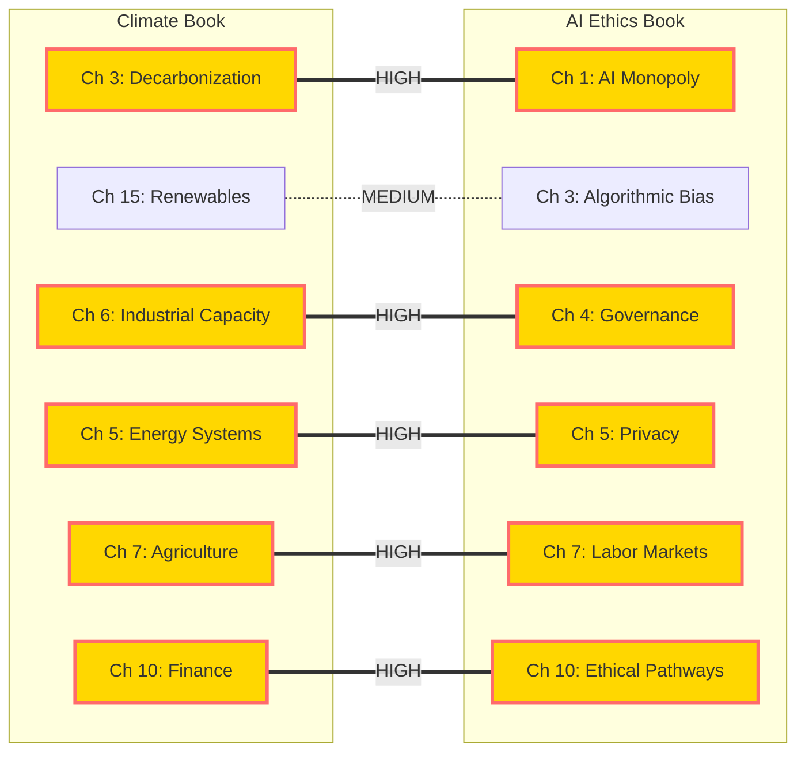

---

## 👥 READER PATHWAY: POLICY MAKER

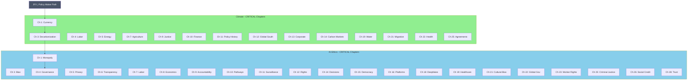

---

## ⚙️ READER PATHWAY: TECHNICAL SPECIALIST

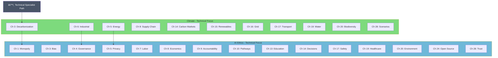

---

## 🎓 READER PATHWAY: ACADEMIC

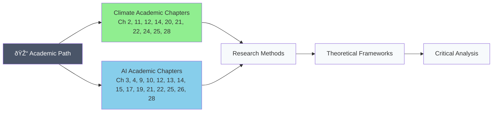

---

## 📚 READER PATHWAY: STUDENT

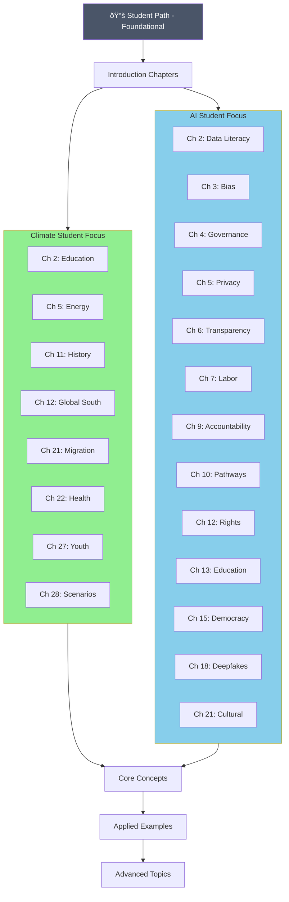

---

## 👥 READER PATHWAY: GENERAL AUDIENCE

```mermaid
flowchart LR
 Start[👥 General Audience]

Basics[Basic Understanding]
 Stories[Human Stories]
 Impact[Personal Impact]
 Action[What You Can Do]

subgraph Gen_Climate["Climate Chapters"]
 GC12[Ch 12: Global Perspectives]
 GC18[Ch 18: Urban Planning]
 GC21[Ch 21: Migration]
 GC22[Ch 22: Health]
 GC23[Ch 23: Community]
 GC24[Ch 24: Indigenous]
 GC26[Ch 26: Communication]
 GC27[Ch 27: Youth]
 end

subgraph Gen_AI["AI Chapters"]
 GA2[Ch 2: Data Literacy]
 GA5[Ch 5: Privacy]
 GA6[Ch 6: Transparency]
 GA7[Ch 7: Labor]
 GA11[Ch 11: Surveillance]
 GA12[Ch 12: Rights]
 GA15[Ch 15: Democracy]
 GA16[Ch 16: Platforms]
 GA18[Ch 18: Deepfakes]
 GA21[Ch 21: Cultural]
 GA23[Ch 23: Workers]
 end

Start --> Basics
 Basics --> Gen_Climate
 Basics --> Gen_AI
 Gen_Climate --> Stories
 Gen_AI --> Stories
 Stories --> Impact
 Impact --> Action

style Start fill:#4A5568,color:#fff
```

---

## 🌾 READER PATHWAY: STAKEHOLDER

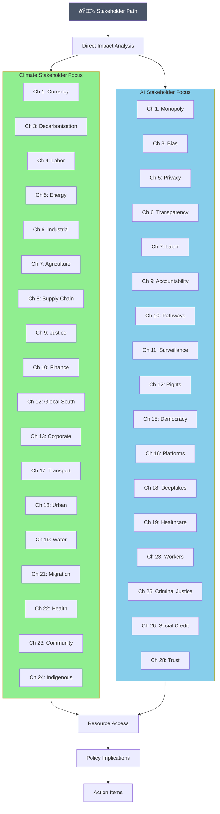

---

## ✊ READER PATHWAY: ORGANIZER

```mermaid
graph LR
 Start[✊ Organizer Path]

Strategy[Organizing Strategy]
 Tactics[Tactical Approaches]
 Coalition[Coalition Building]
 Campaign[Campaign Design]

subgraph Org_Climate["Climate Organizer Focus"]
 OC1[Ch 1: Currency]
 OC2[Ch 2: Education]
 OC3[Ch 3: Decarbonization]
 OC4[Ch 4: Labor]
 OC7[Ch 7: Agriculture]
 OC9[Ch 9: Justice]
 OC11[Ch 11: History]
 OC12[Ch 12: Global South]
 OC13[Ch 13: Corporate]
 OC18[Ch 18: Urban]
 OC23[Ch 23: Community]
 OC24[Ch 24: Indigenous]
 OC26[Ch 26: Communication]
 OC27[Ch 27: Youth]
 end

subgraph Org_AI["AI Organizer Focus"]
 OA2[Ch 2: Data Literacy]
 OA4[Ch 4: Governance]
 OA6[Ch 6: Transparency]
 OA7[Ch 7: Labor]
 OA9[Ch 9: Accountability]
 OA10[Ch 10: Pathways]
 OA11[Ch 11: Surveillance]
 OA12[Ch 12: Rights]
 OA15[Ch 15: Democracy]
 OA16[Ch 16: Platforms]
 OA18[Ch 18: Deepfakes]
 OA21[Ch 21: Cultural]
 OA23[Ch 23: Workers]
 OA25[Ch 25: Criminal Justice]
 OA26[Ch 26: Social Credit]
 OA28[Ch 28: Trust]
 end

Start --> Strategy
 Strategy --> Org_Climate
 Strategy --> Org_AI
 Org_Climate --> Tactics
 Org_AI --> Tactics
 Tactics --> Coalition
 Coalition --> Campaign

style Start fill:#4A5568,color:#fff
 style Org_Climate fill:#90EE90
 style Org_AI fill:#87CEEB
```

---

## 🔄 CHAPTER DEPENDENCY FLOW

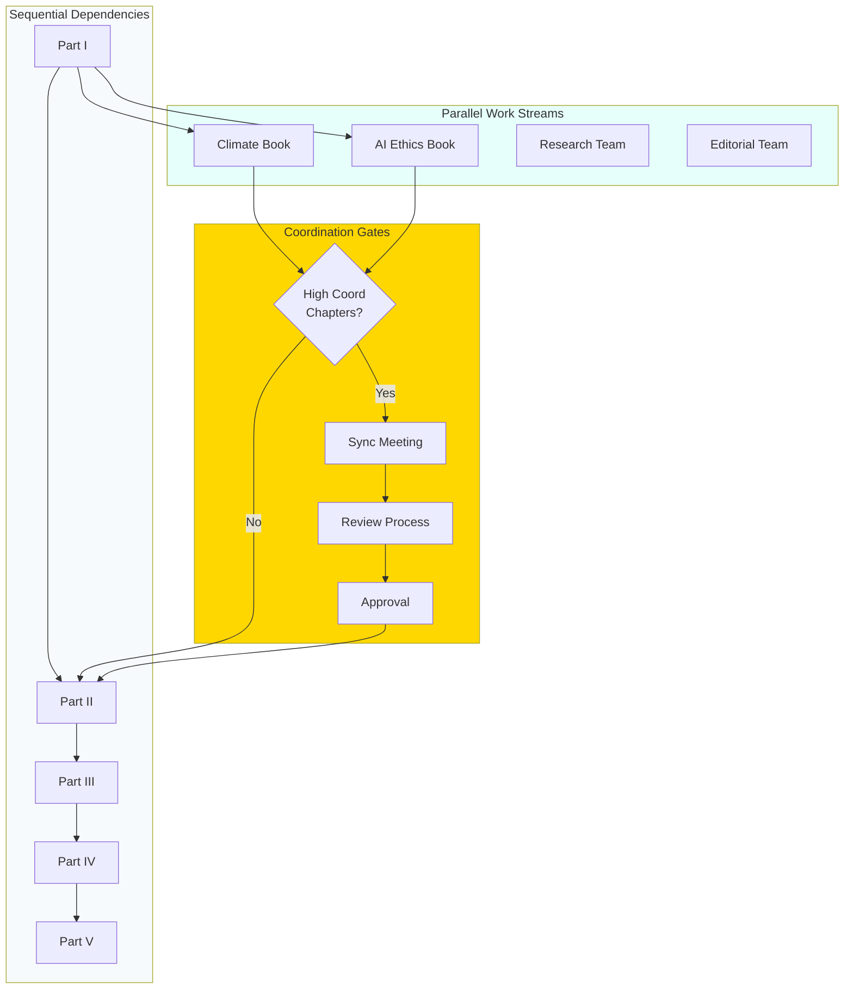

---

## 📊 PROJECT METRICS DASHBOARD

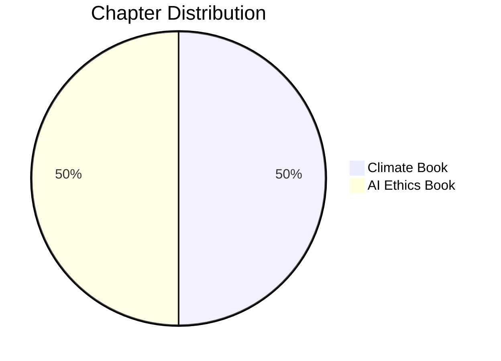

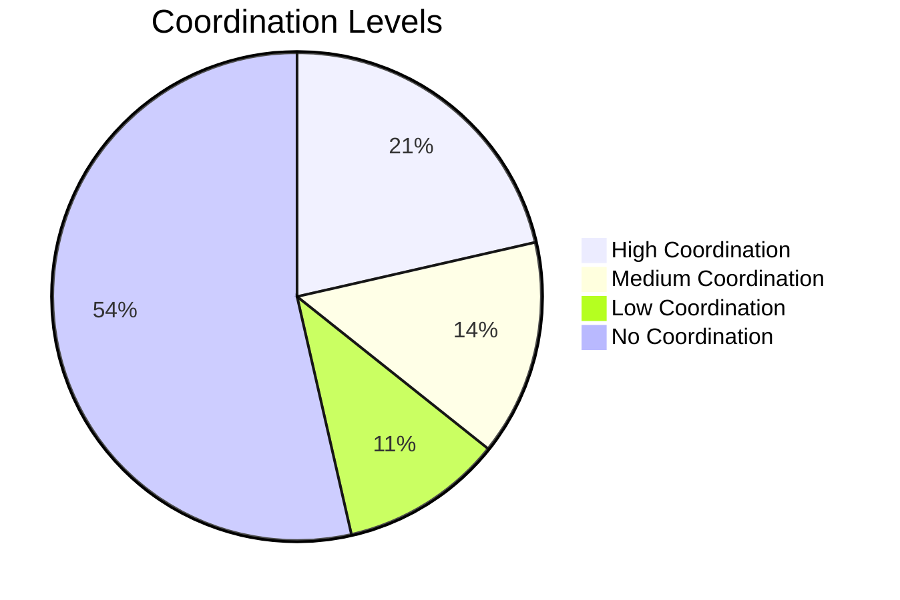

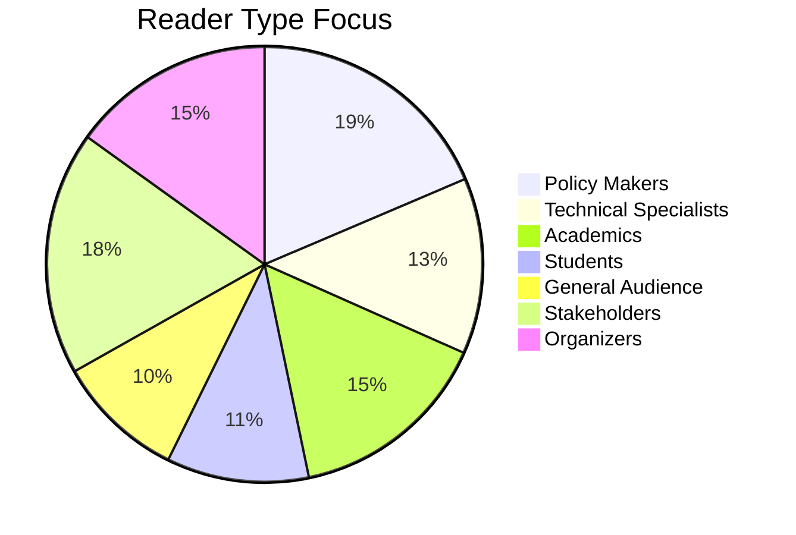

---

## 🗺️ COMPLETE CHAPTER NETWORK

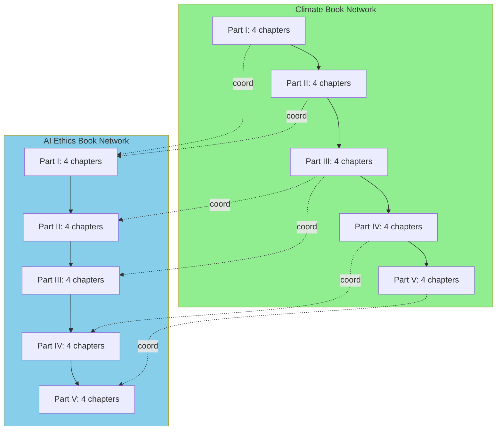

---

## 🏷️ OBSIDIAN TAG STRUCTURE

**Use these tags in your Obsidian notes:**

```markdown
#book-climate
#book-ai-ethics
#part-1 through #part-5
#reader-policy → 🏛️ Policy Maker
#reader-technical → ⚙️ Technical
#reader-academic → 🎓 Academic
#reader-student → 📚 Student
#reader-general → 👥 Public
#reader-stakeholder → 🌾 Community
#reader-organizer → ✊ Organizing
#coordination-high → 🔴 Requires sync
#coordination-medium → 🟡 Related
#coordination-low → 🟢 Tangential
#coordination-none → ⚪ Independent
#status-planning
#status-drafting
#status-review
#status-revision
#status-complete
```

---

## 🔗 OBSIDIAN DATAVIEW QUERIES

### Query 1: Show All Climate Chapters with CRITICAL Tags

```
TABLE
file.name AS "Chapter",
 reader-tags AS "Priority",
 page-count AS "Pages",
 coordination-level AS "Coordination"
FROM #book-climate
WHERE contains(reader-tags, "CRITICAL")
SORT file.name ASC
```

### Query 2: Show High-Coordination Chapters

```
TABLE
 file.name AS "Chapter",
 book AS "Book",
 parallel-chapter AS "Parallel To",
 status AS "Status"
FROM #coordination-high
SORT book ASC, file.name ASC
```

### Query 3: Track Chapter Progress by Status

```
TABLE
 file.name AS "Chapter",
 book AS "Book",
 status AS "Status",
 word-count AS "Words",
 last-updated AS "Updated"
WHERE status = "In Progress"
SORT last-updated DESC
```

### Query 4: Policy Maker Reading Path

```
LIST
FROM #reader-policy AND (#book-climate OR #book-ai-ethics)
WHERE reader-policy-priority = "CRITICAL"
SORT file.name ASC
```

### Query 5: Chapters Needing Coordination This Week

```
TABLE
 file.name AS "Chapter",
 parallel-chapter AS "Coordinate With",
 coordination-level AS "Level",
 status AS "Status"
FROM #coordination-high OR #coordination-medium
WHERE status != "Complete"
SORT coordination-level DESC, file.name ASC
```

---

## 📈 PROGRESS TRACKING VIEWS

### By Status

```
TABLE
 length(file.tasks) AS "Tasks",
 length(filter(file.tasks, (t) => t.completed)) AS "Done",
 round((length(filter(file.tasks, (t) => t.completed)) / length(file.tasks)) * 100) AS "% Complete"
FROM #book-climate OR #book-ai-ethics
WHERE file.tasks
SORT file.name ASC
```

### By Reader Type

```
TABLE
 count(rows) AS "Total Chapters"
FROM #book-climate OR #book-ai-ethics
GROUP BY reader-policy-priority AS "Policy Priority"
```

### Coordination Status Matrix

```
TABLE
 book AS "Book",
 coordination-level AS "Level",
 parallel-chapter AS "Parallel",
 status AS "Status"
FROM #coordination-high OR #coordination-medium
SORT coordination-level DESC, book ASC
```

---

## 🎨 OBSIDIAN GRAPH VIEW SETTINGS

**Recommended Graph View Configuration:**

```json
{ "colorGroups": [ { "query": "#book-climate", "color": { "a": 1, "rgb": 9500671 } }, { "query": "#book-ai-ethics", "color": { "a": 1, "rgb": 8900331 } }, { "query": "#coordination-high", "color": { "a": 1, "rgb": 16766720 } } ], "filters": { "tags": true, "attachments": false, "existingOnly": true, "orphans": false }}
```

---

**END OF DYNAMIC VISUALIZATIONS***Import these diagrams into Obsidian or Notion for interactive navigation*