# Event Stream Parameter Management System Visualizations

> Purpose: This document provides comprehensive visual explanations of the Event Stream Visualization Parameter Management System for the Multi-Agent Book Writing Platform.
> 

## 📋 Table of Contents

1. [System Overview](about:blank#system-overview)
2. [Property Mapping System](about:blank#property-mapping-system)
3. [Select Options System](about:blank#select-options-system)
4. [Default State Management](about:blank#default-state-management)
5. [Centralized Update Handler](about:blank#centralized-update-handler)
6. [Toggle Operations](about:blank#toggle-operations)
7. [State Synchronization Flow](about:blank#state-synchronization-flow)
8. [Integration with Multi-Agent Architecture](about:blank#integration-with-multi-agent-architecture)

---

## System Overview

### High-Level Architecture

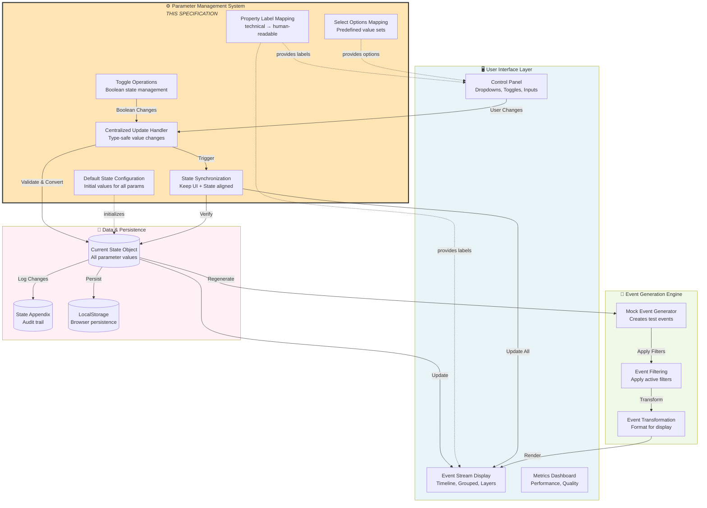

### 🎯 What This System Does

**The Parameter Management System is the “control center” that:**
1. **Translates** technical parameter names into readable labels (e.g., `task_gid` → “Asana Task GID”)
2. **Provides** dropdown options for parameters with known values (e.g., agent types, memory tiers)
3. **Manages** default values so the system starts in a meaningful state
4. **Handles** all parameter updates in a centralized, type-safe way
5. **Coordinates** toggle switches for boolean settings
6. **Synchronizes** the UI with the underlying state object

**Why It Matters**: Without this system, you’d have inconsistent labels, missing validation, broken updates, and desynchronized UI states.

---

## Property Mapping System

### Purpose: Human-Readable Labels

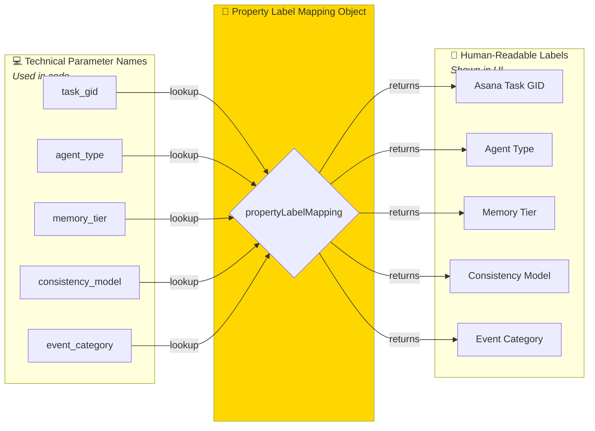

### Usage Example Flow

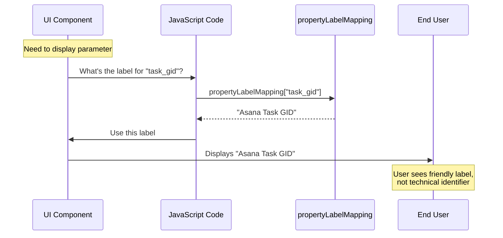

### 📝 Annotation: Why Property Mapping?

**Problem Without It:**
- UI shows cryptic labels like `task_gid`, `memory_tier`
- Inconsistent naming across components
- Hard to maintain when labels change
- Exports have technical column names

**Solution With It:**
- ✅ Single source of truth for all labels
- ✅ Easy to update labels globally
- ✅ Consistent across UI, exports, documentation
- ✅ Professional, user-friendly interface

**Real Example:**

```jsx
// ❌ Without mapping<label>consistency_model</label>// ✅ With mapping<label>{propertyLabelMapping.consistency_model}</label>// Renders as: "Consistency Model (ACID/BASE)"
```

---

## Select Options System

### Purpose: Predefined Value Sets

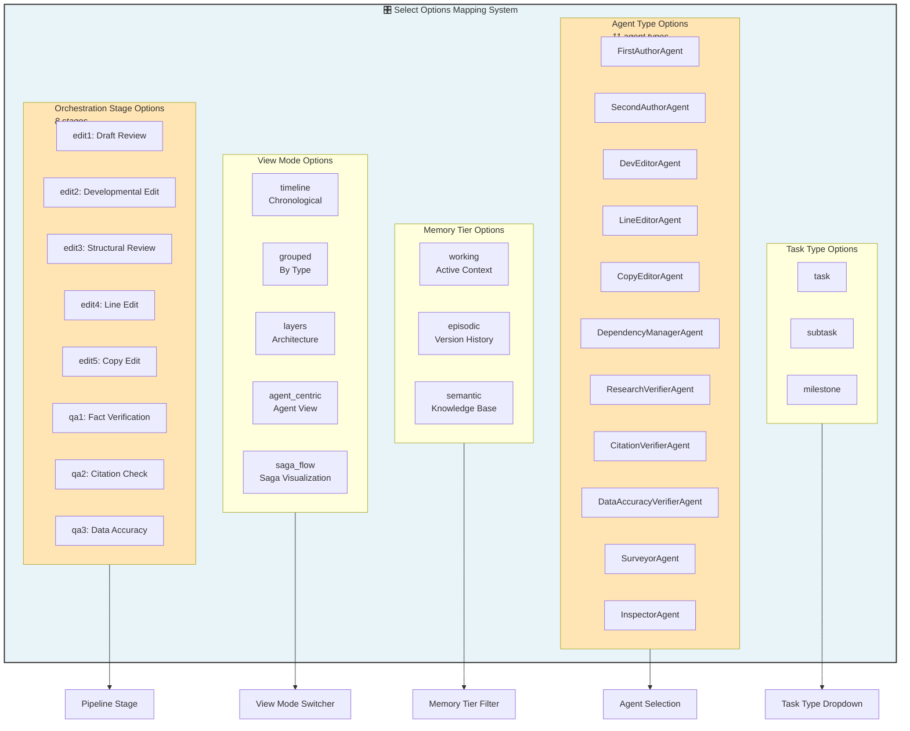

### Option Set Structure

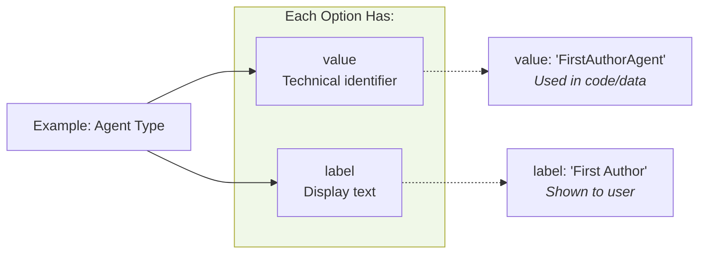

### 📝 Annotation: Select Options in Context

**Where These Come From:**
- **Agent Types**: The 11 agent roles in your multi-agent system (from the architecture docs)
- **Orchestration Stages**: The 8-stage editing pipeline (5 editing + 3 QA stages)
- **Memory Tiers**: The three-tier memory system (working, episodic, semantic)
- **View Modes**: Different ways to visualize the event stream

**Why Predefined Options Matter:**
1. **Validation**: Only valid values can be selected
2. **Consistency**: Same options everywhere in the UI
3. **Documentation**: Labels explain what each option means
4. **Filtering**: Easy to filter events by these categories

**Example Usage:**

```jsx
// Render agent type dropdownselectOptionsMapping.agent_type.forEach(option => {
    // option.value: "FirstAuthorAgent"    // option.label: "First Author"    dropdown.addOption(option.value, option.label);});
```

---

## Default State Management

### Complete Default Configuration

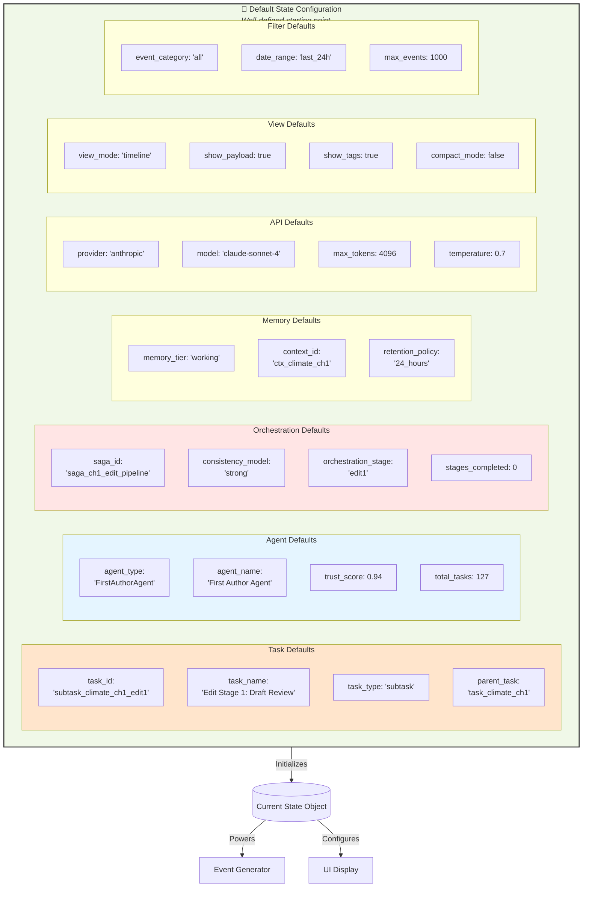

### 📝 Annotation: Why Detailed Defaults?

**The Problem:**
- Empty state = nothing to visualize
- Random values = meaningless display
- Missing context = confusing for debugging

**The Solution:**
These defaults tell a **coherent story**:

1. **Task Context**: Chapter 1 of the Climate book, currently in “Edit Stage 1”
2. **Agent Context**: First Author Agent with good trust score (0.94) and 127 completed tasks
3. **Orchestration Context**: Beginning of a 5-stage editing pipeline using strong consistency
4. **Memory Context**: Working memory tier (active context for the current chapter)
5. **API Context**: Using Claude Sonnet 4 with reasonable parameters

**Real-World Scenario**: When a developer opens the visualization for the first time, they see a realistic scenario: Chapter 1 being edited, First Author Agent working on it, in the first edit stage. This makes debugging and understanding much easier!

---

## Centralized Update Handler

### Update Flow Architecture

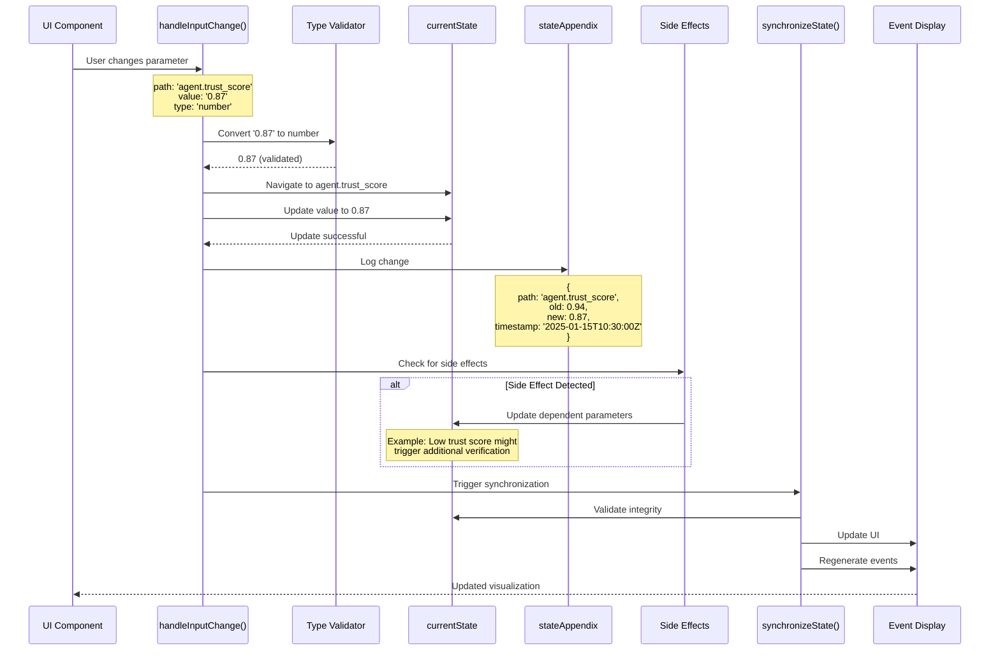

### Type Conversion System

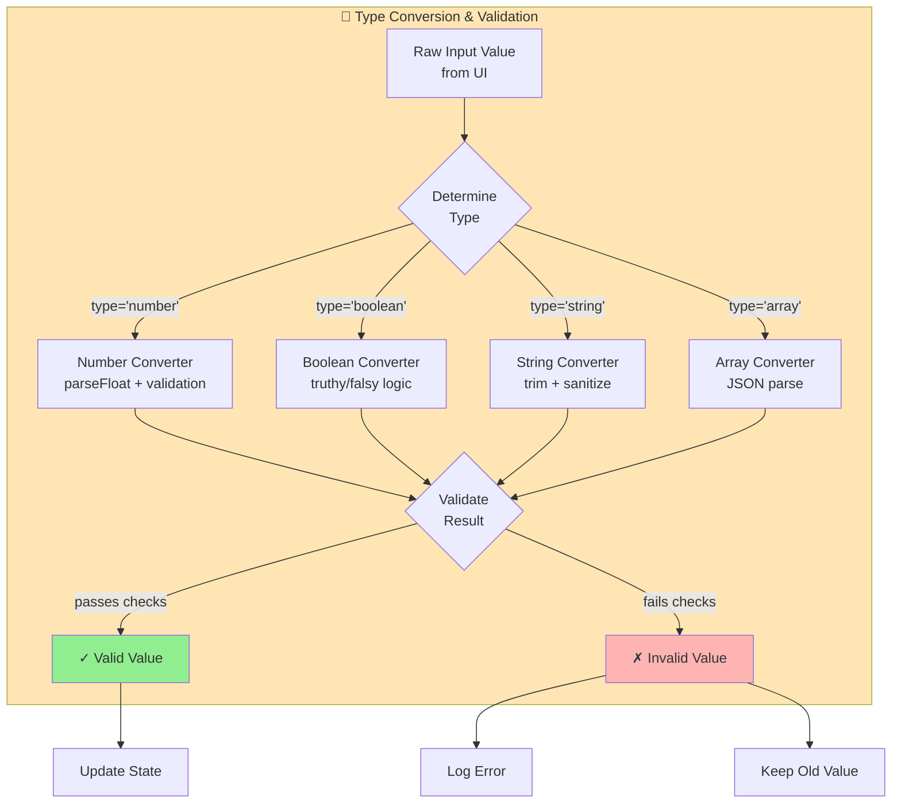

### 📝 Annotation: Why Centralized Updates?

**Without Centralized Handler:**

```jsx
// ❌ Scattered updates across codebasestate.agent.trust_score = newValue;  // No validationstate.memory.tier = newTier;  // No type checkingstate.view.mode = newMode;  // No side effects// Result: Bugs, inconsistency, broken state
```

**With Centralized Handler:**

```jsx
// ✅ Single point of controlhandleInputChange('agent.trust_score', '0.87', 'number');// Automatically: validates, converts, logs, triggers side effects, syncs
```

**Benefits:**
1. **Type Safety**: All values validated and converted correctly
2. **Audit Trail**: Every change logged in appendix
3. **Side Effects**: Dependent values automatically updated
4. **Synchronization**: UI always reflects true state
5. **Error Handling**: Centralized error logging and recovery

---

## Toggle Operations

### Toggle System Architecture

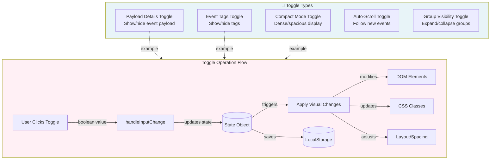

### Specific Toggle: Compact Mode

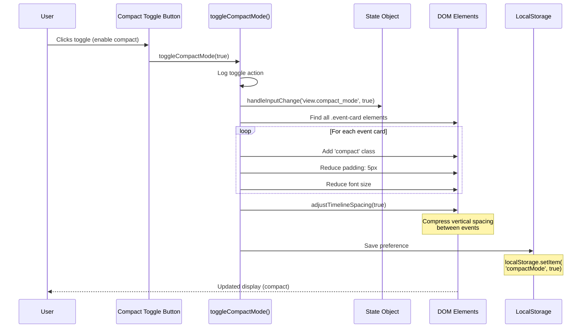

### 📝 Annotation: Toggle vs Regular Update

**Key Difference:**

| Regular Update | Toggle Operation |
| --- | --- |
| Changes data value | Changes visual state |
| May regenerate events | Modifies existing display |
| Updates calculations | Adjusts UI presentation |
| Example: Change agent type | Example: Show/hide payload |

**Toggle Operations are Special Because:**
1. **Immediate Visual Feedback**: No event regeneration needed
2. **DOM Manipulation**: Directly modifies HTML elements
3. **CSS Class Management**: Adds/removes classes for styling
4. **Persistence**: Saves user preferences to LocalStorage
5. **Synchronization**: Must keep boolean state aligned with UI state

**Example - What Happens When You Toggle Compact Mode:**

```
1. User clicks toggle
2. State updates: view.compact_mode = true
3. DOM changes: All .event-card elements get 'compact' class
4. Styling applies: Reduced padding, smaller fonts, tighter spacing
5. Preference saved: LocalStorage remembers for next session
6. Synchronization: State and UI perfectly aligned
```

---

## State Synchronization Flow

### Complete Synchronization Cycle

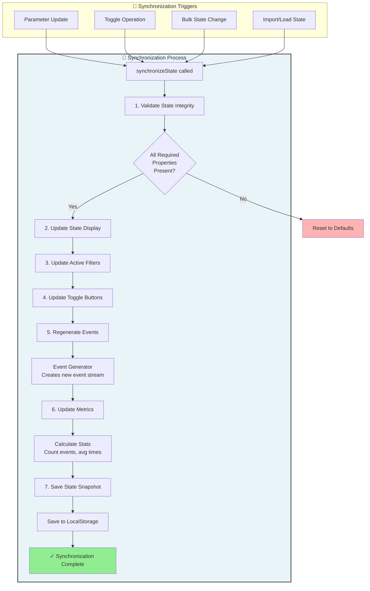

### State Integrity Validation

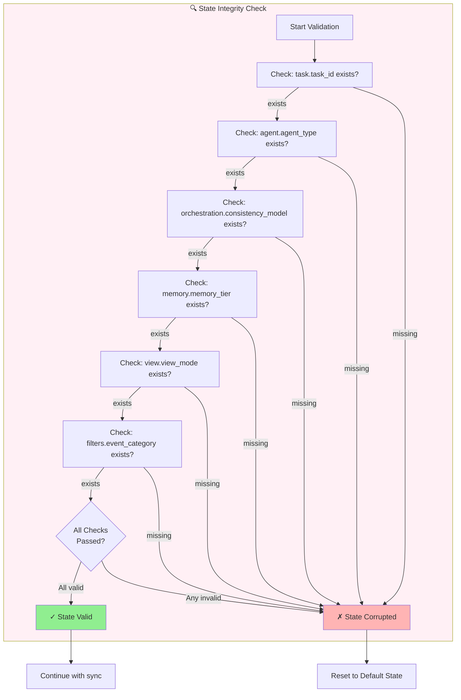

### 📝 Annotation: Why Synchronization Matters

**The Synchronization Problem:**

In complex UIs, state can become **desynchronized** between:
- The underlying data object (state)
- The visual display (DOM)
- User input controls (forms)
- Calculated values (metrics)
- Persisted data (LocalStorage)

**Example of Desynchronization:**

```
1. User selects "Copy Editor" agent
2. State updates correctly
3. BUT: Event display still shows "First Author" events
4. AND: Metrics still calculate for First Author
5. AND: LocalStorage has old value
→ System is DESYNCHRONIZED
```

**How synchronizeState() Fixes This:**

1. **Validates** state is internally consistent
2. **Updates** all UI components to match state
3. **Regenerates** dependent data (events, metrics)
4. **Persists** the new state for recovery
5. **Ensures** everything is aligned

**Critical Insight**: Every time you change a parameter, sync must run to maintain the “single source of truth” principle. Otherwise, your UI shows one thing while your state contains another.

---

## Integration with Multi-Agent Architecture

### How This Fits in the Overall System

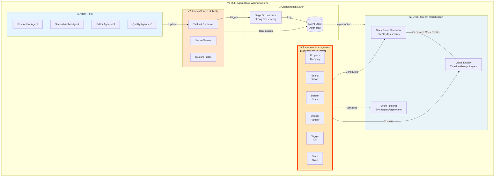

### Parameter System’s Role in Development

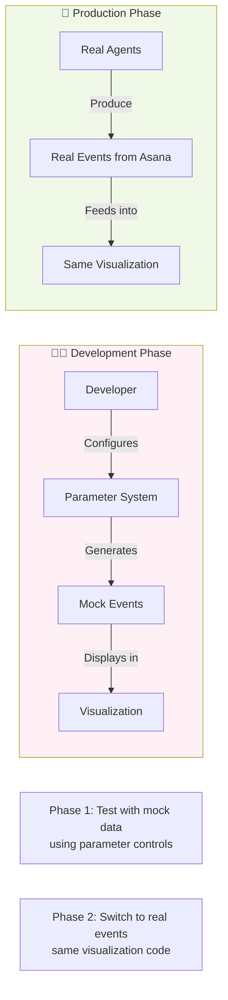

### 📝 Annotation: Development to Production Journey

**Phase 1 - Development (Current)**:
- Using **Parameter System** to generate mock events
- Can simulate any scenario:
- Different agent types
- Various orchestration stages

- Different memory tiers
- Multiple view modes
- Quickly test edge cases without waiting for real agents

**Example Development Workflow:**

```
1. Developer wants to test "Copy Editor with Strong Consistency"
2. Uses Parameter System:
   - Set agent_type = "CopyEditorAgent"
   - Set consistency_model = "strong"
   - Set orchestration_stage = "edit5"
3. Click "Generate Events"
4. Visualization shows realistic copy editing events
5. Developer debugs the visualization
```

**Phase 2 - Production (Future)**:
- **Same visualization code**
- **Real events** from Asana event stream
- Parameter system becomes:
- Filter controls (filter real events)
- View controls (how to display)
- No longer generates mock data

**The Beauty**: The visualization component doesn’t care if events are mock or real. Parameter system provides the interface for both scenarios.

---

## Real-World Usage Scenarios

### Scenario 1: Testing a New Agent Type

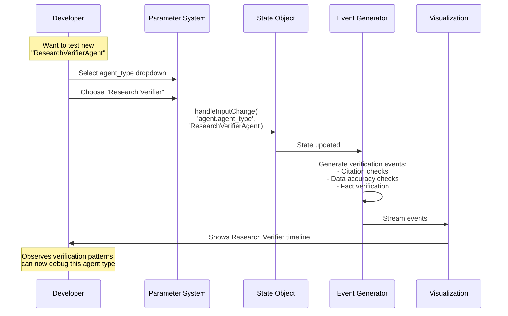

### Scenario 2: Debugging Saga Orchestration

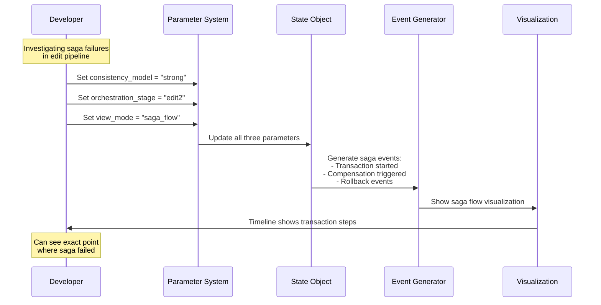

---

## Key Takeaways

### What You’ve Learned

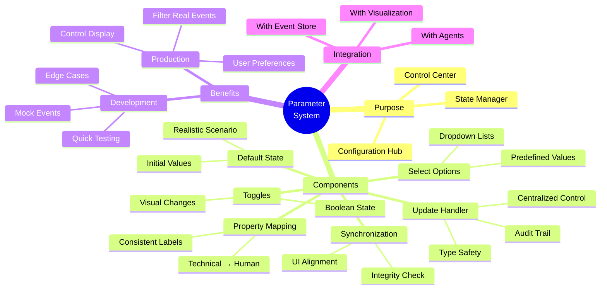

### Critical Concepts

1. **Single Source of Truth**: State object is authoritative, everything else derives from it
2. **Centralized Control**: All updates go through one handler for consistency
3. **Type Safety**: Every value validated and converted before storage
4. **Synchronization**: State and UI must always align
5. **Audit Trail**: Every change logged in appendix for debugging
6. **Development Bridge**: Same visualization works with mock and real events
7. **Context-Aware Defaults**: Starting state tells a coherent story

---

## Quick Reference

### When to Use What

| Task | Use This System Component |
| --- | --- |
| Display parameter name in UI | **Property Mapping** |
| Create dropdown with valid options | **Select Options** |
| Initialize the system | **Default State** |
| User changes a parameter | **Update Handler** |
| User toggles a switch | **Toggle Operations** |
| Ensure state/UI alignment | **State Synchronization** |
| Generate test events | **Event Generator** (configured by params) |
| Filter real events | **Parameter System** (in production mode) |

### Common Operations

```jsx
// Get human-readable labelconst label = propertyLabelMapping.agent_type;  // "Agent Type"// Get dropdown optionsconst options = selectOptionsMapping.agent_type;  // Array of {value, label}// Update a parameterhandleInputChange('agent.trust_score', 0.87, 'number');// Toggle a featuretoggleShowPayload(true);  // Show event payloads// Trigger full synchronizationsynchronizeState();  // Align everything// Get default valuesconst defaults = defaultStateConfiguration.agent;  // Agent defaults
```

---

## Conclusion

The **Event Stream Parameter Management System** is the control center that makes your visualization interactive, configurable, and maintainable. It provides:

✅ **Human-Readable Interface** - Professional labels everywhere

✅ **Type-Safe Operations** - No invalid values can sneak in

✅ **Centralized Control** - One place for all updates

✅ **Audit Trail** - Track every change

✅ **State Synchronization** - UI always matches reality

✅ **Development Support** - Easy testing with mock data

✅ **Production Ready** - Same code works with real events

**Next Steps**:
1. Review the original specification document for implementation details
2. See how this integrates with your Event Stream Visualization component
3. Understand how it connects to the broader Multi-Agent architecture
4. Use these diagrams when explaining the system to your team

---

*Created: January 2025*

*Project: Multi-Agent Book Writing System - Dispute Center*

*Phase: Phase 1 - Foundation Development*