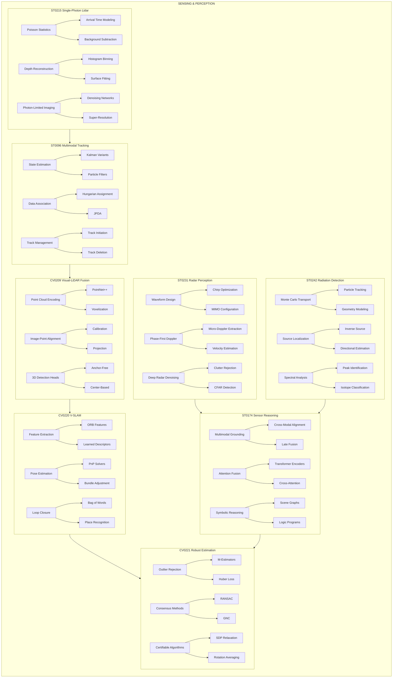
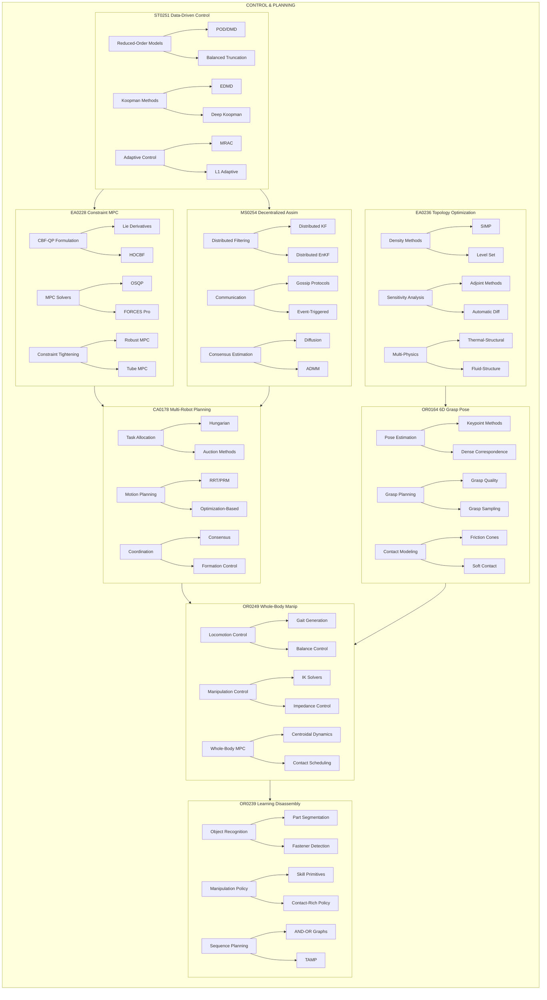
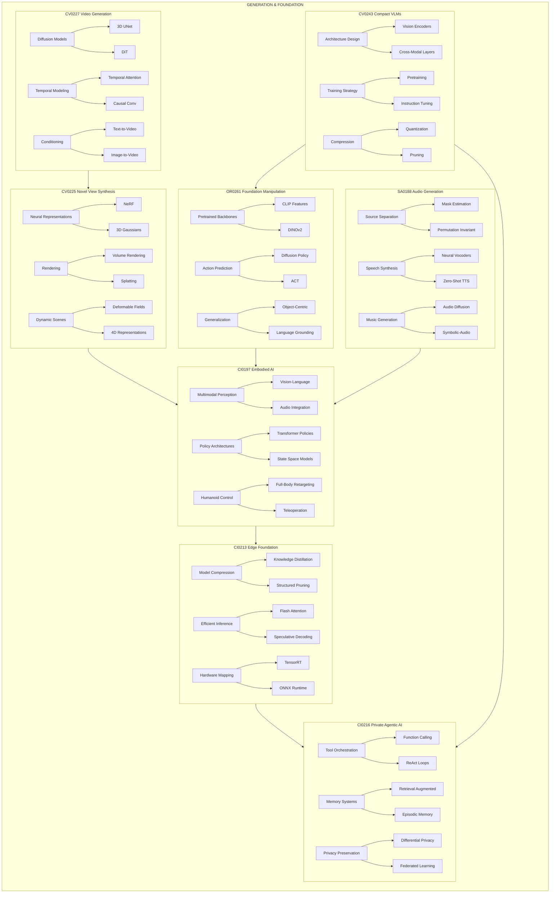
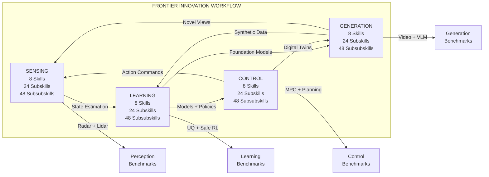

# Fascinating fields that benefit from physics-informed models

```mermaid
graph TB
    CENTER[🧮 PHYSICS-INFORMED LEARNING<br/>11 Positions<br/>Build ML that respects physics]
    
    CENTER -->|Fast CFD operators<br/>Python-OpenFOAM interface| AERO[✈️ AEROSPACE & AVIATION<br/>Wing design • Flow control<br/>Fuel efficiency optimization]
    
    CENTER -->|PDE solvers<br/>Surrogate models| CLIMATE[🌍 CLIMATE & WEATHER<br/>Decentralized assimilation<br/>Large-scale forecasting]
    
    CENTER -->|Radar transformers<br/>Multimodal tracking| AUTO[🚗 AUTONOMOUS VEHICLES<br/>All-weather perception<br/>5+ sensor fusion]
    
    CENTER -->|Spatiotemporal control<br/>Reduced-order models| ROBOT[🤖 ROBOTICS<br/>Fast dynamics prediction<br/>Real-time manipulation]
    
    CENTER -->|Geometry-aware surrogates<br/>Physics constraints| DESIGN[🎨 ENGINEERING DESIGN<br/>Generative design<br/>Topology optimization]
    
    CENTER -->|Thermal/fluid control<br/>Multi-fidelity models| ENERGY[⚡ ENERGY SYSTEMS<br/>Grid optimization<br/>Carbon capture]
    
    CENTER -->|Single-photon algorithms<br/>Low-SNR reconstruction| MEDICAL[🏥 MEDICAL IMAGING<br/>Photon-limited sensing<br/>3D reconstruction]
    
    CENTER -->|RF+IR+LiDAR fusion<br/>Sensor reasoning VLMs| DEFENSE[🛡️ DEFENSE & SECURITY<br/>Threat detection<br/>Nuclear source localization]
    
    CENTER -->|Airflow reconstruction<br/>Physics-vision hybrids| INDUSTRIAL[🏭 INDUSTRIAL INSPECTION<br/>Quality control<br/>Process monitoring]
    
    CENTER -->|Data assimilation<br/>Distributed inference| SCIENTIFIC[🔬 SCIENTIFIC COMPUTING<br/>Large-scale simulation<br/>Inverse problems]
    
    AERO -->|Design tools| MANUFACTURERS[Manufacturing partners]
    AUTO -->|Sensor stacks| AV_COMPANIES[Tesla • Waymo • Cruise]
    CLIMATE -->|Forecast models| WEATHER_AGENCIES[NOAA • ECMWF]
    ROBOT -->|Control libraries| ROBOTICS_LABS[Research labs • Startups]
    ENERGY -->|Grid simulation| UTILITIES[Power companies]
    MEDICAL -->|Imaging algorithms| HOSPITALS[Clinical deployment]
    DEFENSE -->|Detection systems| GOV_AGENCIES[DoD • National labs]
    INDUSTRIAL -->|Inspection tools| FACTORIES[Quality assurance]
    DESIGN -->|CAD integration| SOFTWARE[Autodesk • Ansys]
    SCIENTIFIC -->|Open source libs| ACADEMIA[Universities • Research]
    
    style CENTER fill:#1971c2,stroke:#1864ab,stroke-width:4px,color:#fff,font-size:14px
    
    style AERO fill:#4dabf7,stroke:#1971c2,stroke-width:2px,color:#fff
    style CLIMATE fill:#4dabf7,stroke:#1971c2,stroke-width:2px,color:#fff
    style AUTO fill:#4dabf7,stroke:#1971c2,stroke-width:2px,color:#fff
    style ROBOT fill:#4dabf7,stroke:#1971c2,stroke-width:2px,color:#fff
    style DESIGN fill:#4dabf7,stroke:#1971c2,stroke-width:2px,color:#fff
    style ENERGY fill:#4dabf7,stroke:#1971c2,stroke-width:2px,color:#fff
    style MEDICAL fill:#4dabf7,stroke:#1971c2,stroke-width:2px,color:#fff
    style DEFENSE fill:#4dabf7,stroke:#1971c2,stroke-width:2px,color:#fff
    style INDUSTRIAL fill:#4dabf7,stroke:#1971c2,stroke-width:2px,color:#fff
    style SCIENTIFIC fill:#4dabf7,stroke:#1971c2,stroke-width:2px,color:#fff
    
    style MANUFACTURERS fill:#74c0fc,stroke:#339af0,stroke-width:1px,color:#000
    style AV_COMPANIES fill:#74c0fc,stroke:#339af0,stroke-width:1px,color:#000
    style WEATHER_AGENCIES fill:#74c0fc,stroke:#339af0,stroke-width:1px,color:#000
    style ROBOTICS_LABS fill:#74c0fc,stroke:#339af0,stroke-width:1px,color:#000
    style UTILITIES fill:#74c0fc,stroke:#339af0,stroke-width:1px,color:#000
    style HOSPITALS fill:#74c0fc,stroke:#339af0,stroke-width:1px,color:#000
    style GOV_AGENCIES fill:#74c0fc,stroke:#339af0,stroke-width:1px,color:#000
    style FACTORIES fill:#74c0fc,stroke:#339af0,stroke-width:1px,color:#000
    style SOFTWARE fill:#74c0fc,stroke:#339af0,stroke-width:1px,color:#000
    style ACADEMIA fill:#74c0fc,stroke:#339af0,stroke-width:1px,color:#000
```

## Frontier Innovation: Full Workflow Architecture

Four interconnected Mermaid diagrams showing the complete skill hierarchy.

---

### Diagram 1/4: SENSING & PERCEPTION STACK

---

### Diagram 2/4: LEARNING & MODELING STACK

```mermaid
graph TB
    subgraph LEARNING["LEARNING & MODELING"]
        direction TB

        subgraph L1["ST0184 UQ & Bayesian"]
            L1A["Posterior Inference"]
            L1B["Surrogate Models"]
            L1C["Sensitivity Analysis"]
            L1A --> L1A1["MCMC Samplers"]
            L1A --> L1A2["Variational Inference"]
            L1B --> L1B1["Gaussian Processes"]
            L1B --> L1B2["Neural Surrogates"]
            L1C --> L1C1["Sobol Indices"]
            L1C --> L1C2["Active Subspaces"]
        end

        subgraph L2["ST0229 Particle Systems"]
            L2A["Particle Dynamics"]
            L2B["Resampling Schemes"]
            L2C["Convergence Diagnostics"]
            L2A --> L2A1["Langevin Dynamics"]
            L2A --> L2A2["Stein Variational"]
            L2B --> L2B1["Systematic Resampling"]
            L2B --> L2B2["Stratified Resampling"]
            L2C --> L2C1["ESS Monitoring"]
            L2C --> L2C2["Kernel Diagnostics"]
        end

        subgraph L3["ST0246 Physics-Informed ML"]
            L3A["PDE Constraints"]
            L3B["Neural Solvers"]
            L3C["Hybrid Architectures"]
            L3A --> L3A1["Residual Losses"]
            L3A --> L3A2["Boundary Conditions"]
            L3B --> L3B1["PINNs"]
            L3B --> L3B2["DeepONet"]
            L3C --> L3C1["Differentiable Physics"]
            L3C --> L3C2["Neural ODEs"]
        end

        subgraph L4["ST0247 Geometry Surrogates"]
            L4A["Shape Encoding"]
            L4B["Operator Learning"]
            L4C["Mesh Adaptation"]
            L4A --> L4A1["Signed Distance"]
            L4A --> L4A2["Point Clouds"]
            L4B --> L4B1["Fourier Neural Ops"]
            L4B --> L4B2["Graph Networks"]
            L4C --> L4C1["Adaptive Refinement"]
            L4C --> L4C2["Coarsening"]
        end

        subgraph L5["OR0179 Robot Learning"]
            L5A["Policy Learning"]
            L5B["Representation Learning"]
            L5C["Sim-to-Real"]
            L5A --> L5A1["PPO/SAC"]
            L5A --> L5A2["Imitation Learning"]
            L5B --> L5B1["Contrastive"]
            L5B --> L5B2["World Models"]
            L5C --> L5C1["Domain Randomization"]
            L5C --> L5C2["System ID Transfer"]
        end

        subgraph L6["OR0180 System ID"]
            L6A["Black-Box Models"]
            L6B["Grey-Box Models"]
            L6C["Online Adaptation"]
            L6A --> L6A1["NARX"]
            L6A --> L6A2["Neural State Space"]
            L6B --> L6B1["Parameter Estimation"]
            L6B --> L6B2["Hybrid Physics-NN"]
            L6C --> L6C1["Recursive LS"]
            L6C --> L6C2["Kalman ID"]
        end

        subgraph L7["EA0226 Safe RL"]
            L7A["Constraint Handling"]
            L7B["Safety Shields"]
            L7C["Sample Efficiency"]
            L7A --> L7A1["Lagrangian Methods"]
            L7A --> L7A2["Projection Methods"]
            L7B --> L7B1["CBF Shields"]
            L7B --> L7B2["Reachability Shields"]
            L7C --> L7C1["Model-Based RL"]
            L7C --> L7C2["Offline RL"]
        end

        subgraph L8["SA0176 Few-Shot Learning"]
            L8A["Meta-Learning"]
            L8B["Metric Learning"]
            L8C["Adaptation"]
            L8A --> L8A1["MAML"]
            L8A --> L8A2["Prototypical Nets"]
            L8B --> L8B1["Siamese Networks"]
            L8B --> L8B2["Triplet Loss"]
            L8C --> L8C1["Fine-Tuning"]
            L8C --> L8C2["In-Context"]
        end
    end

    L1 --> L2
    L2 --> L3
    L3 --> L4
    L1 --> L6
    L5 --> L7
    L6 --> L5
    L7 --> L8
    L4 --> L5

```

---

### Diagram 3/4: CONTROL & PLANNING STACK

---

### Diagram 4/4: GENERATION & FOUNDATION STACK

---

### MASTER INTERCONNECTION: All 4 Stacks

---

## Summary Statistics

| Stack | Skills | Subskills | Subsubskills | Total Nodes |
| --- | --- | --- | --- | --- |
| Sensing & Perception | 8 | 24 | 48 | 80 |
| Learning & Modeling | 8 | 24 | 48 | 80 |
| Control & Planning | 8 | 24 | 48 | 80 |
| Generation & Foundation | 8 | 24 | 48 | 80 |
| **TOTAL** | **32** | **96** | **192** | **320** |