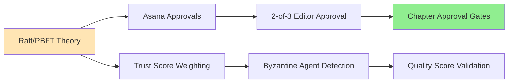
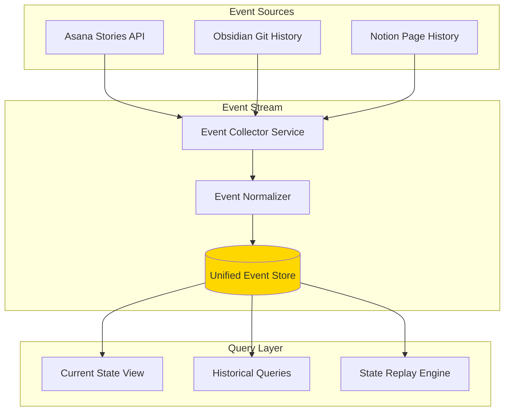
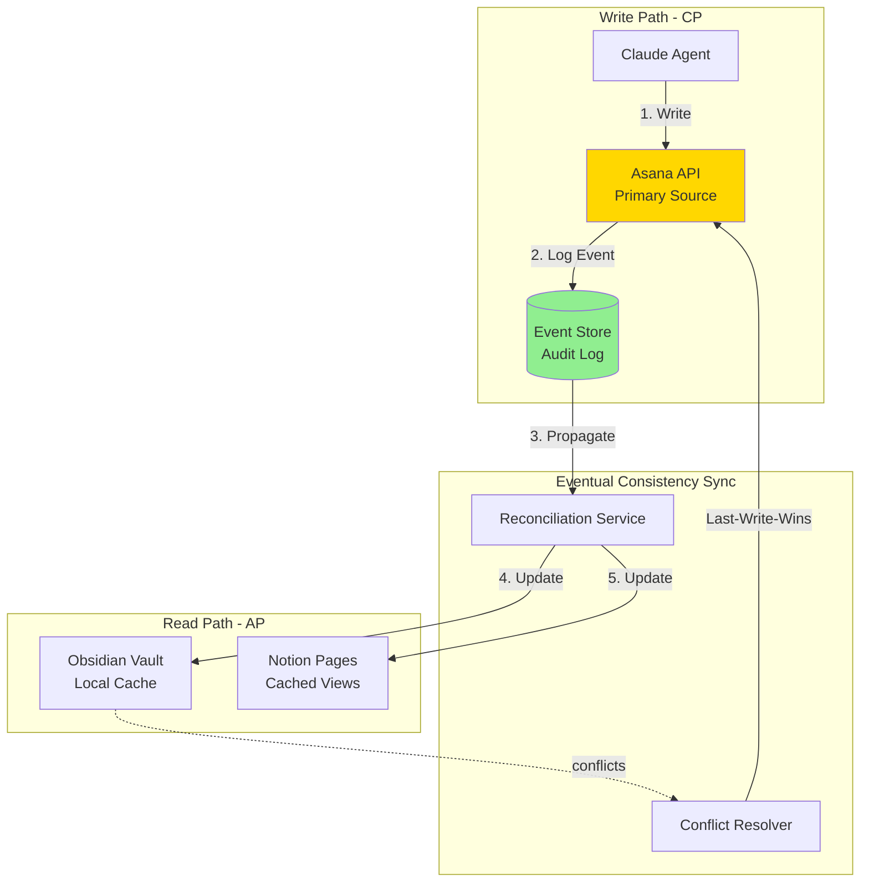
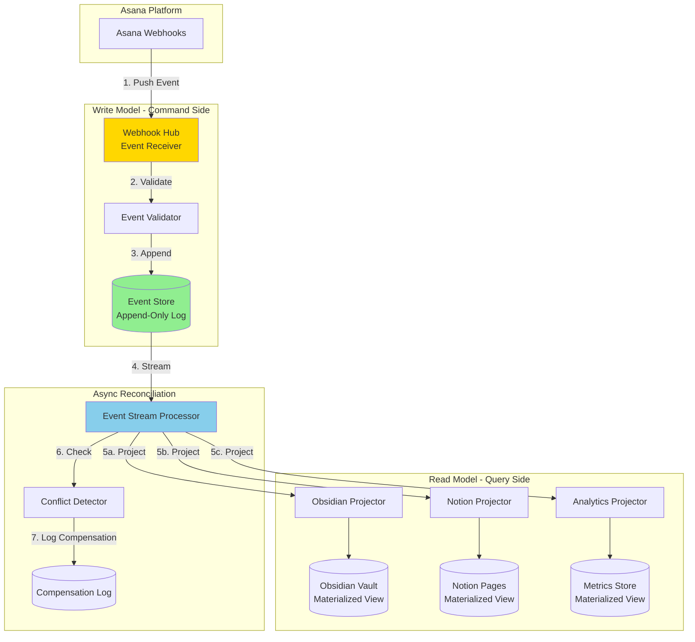
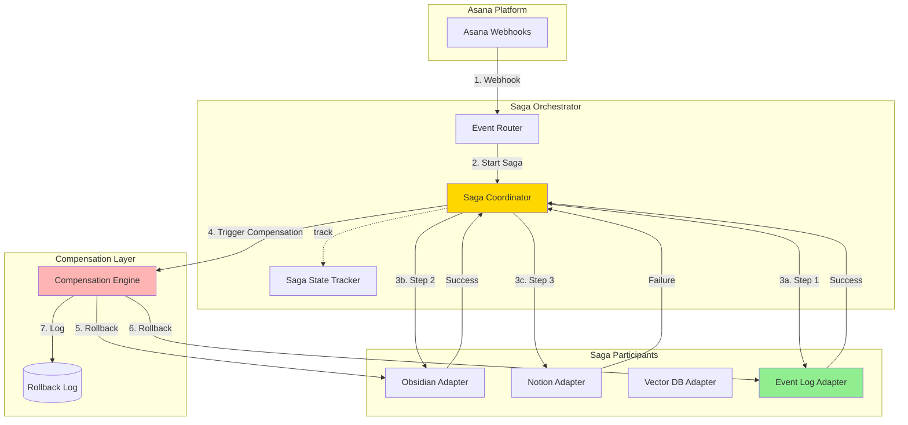
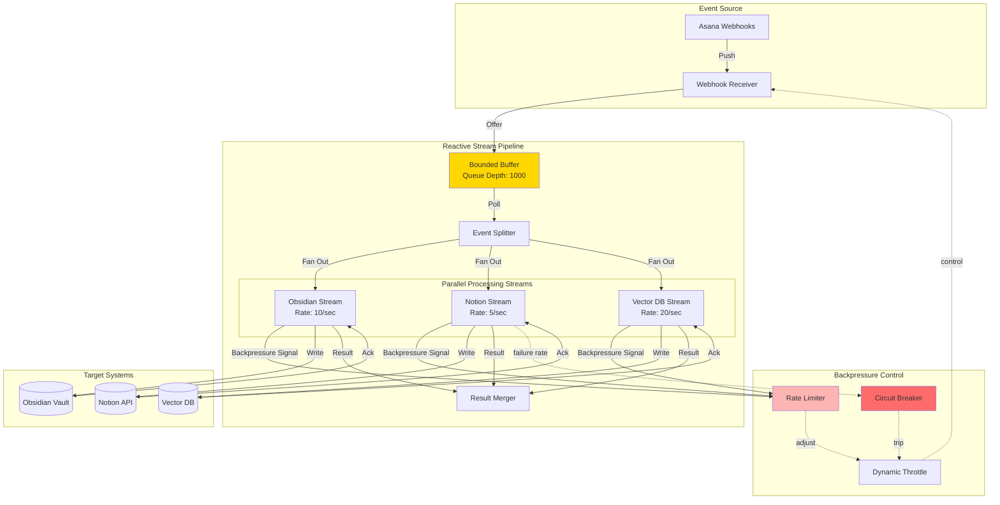
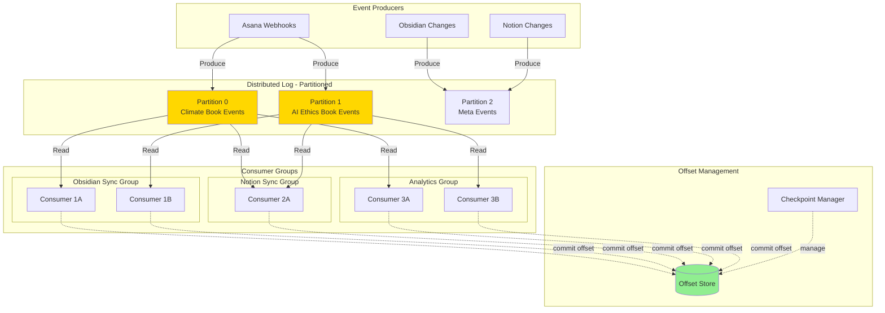

# Multi-Agent Collaboration Architecture for Book Writing

```mermaid
graph TB
 subgraph User_Layer[👥 User Interfaces]
 AsanaUI[Asana Web/Mobile<br/>Task Management]
 ObsidianUI[Obsidian Desktop<br/>Knowledge Graph]
 NotionUI[Notion Web<br/>Documentation]
 end
 subgraph Agent_Layer[🤖 Agent Intelligence]
 ClaudeAPI[Claude API<br/>Primary Reasoning]
 ChatGPT[ChatGPT API<br/>Specialized Tasks]
 LocalLLM[Local LLM<br/>Privacy-Sensitive]
 end
 subgraph Integration_Layer[🔗 Integration Services]
 WebhookHub[Webhook Hub<br/>Event Router]
 SyncEngine[Sync Engine<br/>State Reconciliation]
 APIGateway[API Gateway<br/>Rate Limiting]
 end
 subgraph Data_Layer[💾 Persistent Storage]
 AsanaDB[(Asana Database<br/>Source of Truth)]
 ObsidianVault[(Obsidian Vault<br/>Git Repository)]
 EventStore[(Event Store<br/>PostgreSQL)]
 VectorDB[(Vector DB<br/>Embeddings)]
 end
 subgraph Monitoring[📊 Observability]
 Metrics[Prometheus Metrics]
 Logs[Structured Logs]
 Traces[Distributed Tracing]
 Alerts[Alert Manager]
 end
 AsanaUI --> AsanaDB
 ObsidianUI --> ObsidianVault
 NotionUI -.sync.-> AsanaDB
 ClaudeAPI --> APIGateway
 ChatGPT --> APIGateway
 LocalLLM --> APIGateway
 APIGateway --> WebhookHub
 WebhookHub --> SyncEngine
 SyncEngine --> AsanaDB
 SyncEngine --> ObsidianVault
 SyncEngine --> EventStore
 ClaudeAPI -.embeddings.-> VectorDB
 ObsidianVault -.index.-> VectorDB
 WebhookHub --> Metrics
 SyncEngine --> Logs
 APIGateway --> Traces
 Metrics --> Alerts
 style AsanaDB fill:#FFD700
 style ClaudeAPI fill:#B4D7FF
 style EventStore fill:#90EE90
```

















```mermaid
graph TB
subgraph Primary[Primary Path - Saga Orchestrator]
WH[Webhook Hub]
SagaEngine[Saga Engine]
ObsidianSync[Obsidian Sync]
NotionSync[Notion Sync]
end
subgraph Audit[Audit Path - Event Sourcing]
EventLog[(Event Store

Complete History)]
Analytics[Analytics Engine]
end
WH –>|1. Start Saga| SagaEngine
WH –>|2. Append| EventLog
SagaEngine –>|3a. Sync| ObsidianSync
SagaEngine –>|3b. Sync| NotionSync
EventLog -.query.-> Analytics
style SagaEngine fill:#FFD700
style EventLog fill:#90EE90