# Multi-Agent Work Flow Sequence Diagrams

---

## TABLE OF CONTENTS

1. [System Architecture](about:blank#system-architecture)
2. [Agent State Machines](about:blank#agent-state-machines)
3. [Workflow Sequences](about:blank#workflow-sequences)
4. [Trust & Reputation](about:blank#trust--reputation)
5. [Coordination Patterns](about:blank#coordination-patterns)
6. [Event-Driven Flows](about:blank#event-driven-flows)
7. [Decision Trees](about:blank#decision-trees)
8. [Resource Management](about:blank#resource-management)

---

## SYSTEM ARCHITECTURE

### Complete Multi-Agent Ecosystem

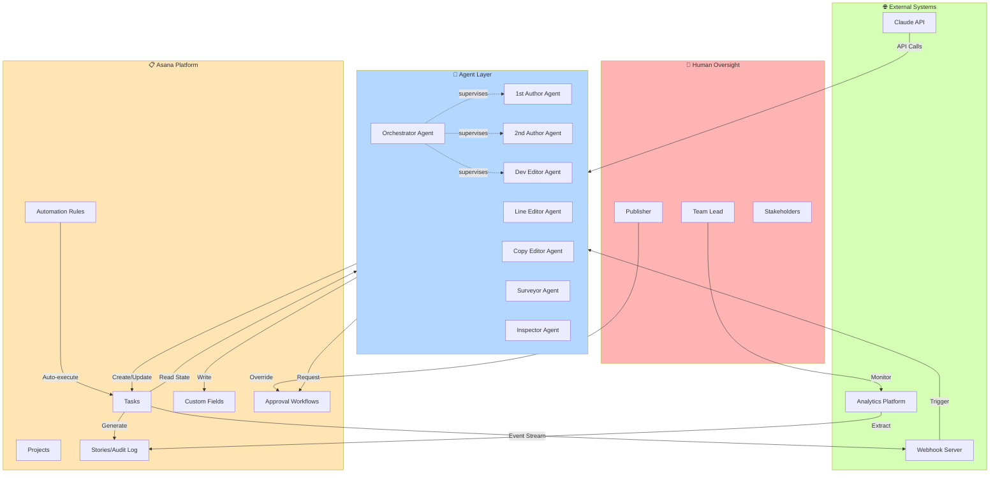
```mermaid
graph TB
    subgraph External["🌐 External Systems"]
        Claude[Claude API]
        Webhook[Webhook Server]
        Analytics[Analytics Platform]
    end

    subgraph Asana["📋 Asana Platform"]
        Projects[Projects]
        Tasks[Tasks]
        CustomFields[Custom Fields]
        Stories[Stories/Audit Log]
        Approvals[Approval Workflows]
        Rules[Automation Rules]
    end

    subgraph Agents["🤖 Agent Layer"]
        Author1[1st Author Agent]
        Author2[2nd Author Agent]
        DevEditor[Dev Editor Agent]
        LineEditor[Line Editor Agent]
        CopyEditor[Copy Editor Agent]
        Surveyor[Surveyor Agent]
        Inspector[Inspector Agent]
        Orchestrator[Orchestrator Agent]
    end

    subgraph Humans["👥 Human Oversight"]
        Publisher[Publisher]
        TeamLead[Team Lead]
        Stakeholders[Stakeholders]
    end

    Claude -->|API Calls| Agents
    Agents -->|Create/Update| Tasks
    Tasks -->|Event Stream| Webhook
    Webhook -->|Trigger| Agents
    Tasks -->|Read State| Agents
    Agents -->|Write| CustomFields
    Tasks -->|Generate| Stories
    Agents -->|Request| Approvals
    Rules -->|Auto-execute| Tasks

    Orchestrator -.supervises.-> Author1
    Orchestrator -.supervises.-> Author2
    Orchestrator -.supervises.-> DevEditor

    Publisher -->|Override| Approvals
    TeamLead -->|Monitor| Analytics
    Analytics -->|Extract| Stories

    style Asana fill:#FFE5B4
    style Agents fill:#B4D7FF
    style Humans fill:#FFB4B4
    style External fill:#D4FFB4
```

---

### Layered Architecture

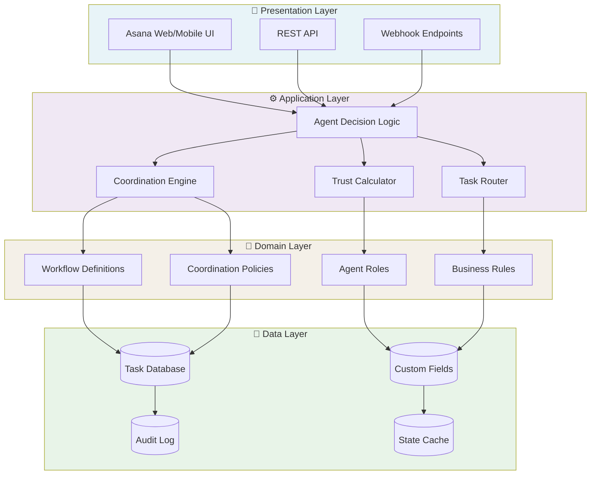
```mermaid
graph TD
    subgraph Presentation["📱 Presentation Layer"]
        UI[Asana Web/Mobile UI]
        API[REST API]
        Webhooks[Webhook Endpoints]
    end

    subgraph Application["⚙️ Application Layer"]
        AgentLogic[Agent Decision Logic]
        Coordination[Coordination Engine]
        TrustCalc[Trust Calculator]
        Routing[Task Router]
    end

    subgraph Domain["🎯 Domain Layer"]
        Workflows[Workflow Definitions]
        Policies[Coordination Policies]
        Roles[Agent Roles]
        Rules[Business Rules]
    end

    subgraph Data["💾 Data Layer"]
        TaskDB[(Task Database)]
        FieldDB[(Custom Fields)]
        AuditLog[(Audit Log)]
        Cache[(State Cache)]
    end

    UI --> AgentLogic
    API --> AgentLogic
    Webhooks --> AgentLogic

    AgentLogic --> Coordination
    AgentLogic --> TrustCalc
    AgentLogic --> Routing

    Coordination --> Workflows
    Coordination --> Policies
    TrustCalc --> Roles
    Routing --> Rules

    Workflows --> TaskDB
    Policies --> TaskDB
    Roles --> FieldDB
    Rules --> FieldDB

    TaskDB --> AuditLog
    FieldDB --> Cache

    style Presentation fill:#E8F4F8
    style Application fill:#F0E8F4
    style Domain fill:#F4F0E8
    style Data fill:#E8F4E8
```

---

## AGENT STATE MACHINES

### Author Agent State Machine

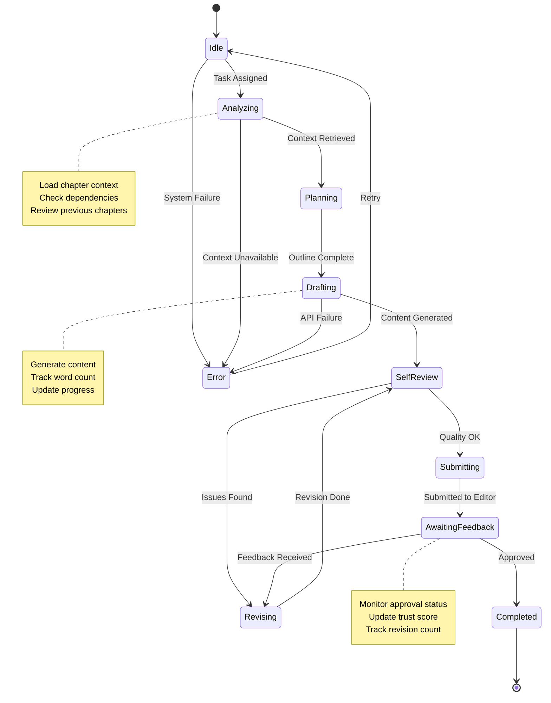
```mermaid
stateDiagram-v2
    [*] --> Idle

    Idle --> Analyzing: Task Assigned
    Analyzing --> Planning: Context Retrieved
    Planning --> Drafting: Outline Complete
    Drafting --> SelfReview: Content Generated
    SelfReview --> Revising: Issues Found
    SelfReview --> Submitting: Quality OK
    Revising --> SelfReview: Revision Done
    Submitting --> AwaitingFeedback: Submitted to Editor
    AwaitingFeedback --> Revising: Feedback Received
    AwaitingFeedback --> Completed: Approved
    Completed --> [*]

    Idle --> Error: System Failure
    Analyzing --> Error: Context Unavailable
    Drafting --> Error: API Failure
    Error --> Idle: Retry

    note right of Analyzing
        Load chapter context
        Check dependencies
        Review previous chapters
    end note

    note right of Drafting
        Generate content
        Track word count
        Update progress
    end note

    note right of AwaitingFeedback
        Monitor approval status
        Update trust score
        Track revision count
    end note
```

---

### Editor Agent State Machine

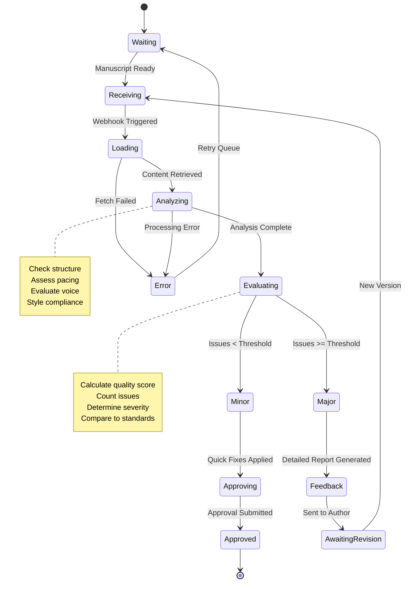
```mermaid
stateDiagram-v2
    [*] --> Waiting

    Waiting --> Receiving: Manuscript Ready
    Receiving --> Loading: Webhook Triggered
    Loading --> Analyzing: Content Retrieved
    Analyzing --> Evaluating: Analysis Complete
    Evaluating --> Minor: Issues < Threshold
    Evaluating --> Major: Issues >= Threshold
    Minor --> Approving: Quick Fixes Applied
    Major --> Feedback: Detailed Report Generated
    Approving --> Approved: Approval Submitted
    Feedback --> AwaitingRevision: Sent to Author
    AwaitingRevision --> Receiving: New Version
    Approved --> [*]

    Loading --> Error: Fetch Failed
    Analyzing --> Error: Processing Error
    Error --> Waiting: Retry Queue

    note right of Analyzing
        Check structure
        Assess pacing
        Evaluate voice
        Style compliance
    end note

    note right of Evaluating
        Calculate quality score
        Count issues
        Determine severity
        Compare to standards
    end note
```

---

### Inspector Agent State Machine

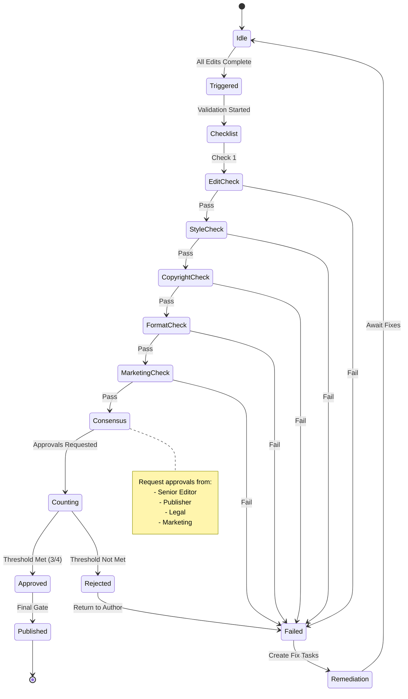
```mermaid
stateDiagram-v2
    [*] --> Idle

    Idle --> Triggered: All Edits Complete
    Triggered --> Checklist: Validation Started

    Checklist --> EditCheck: Check 1
    EditCheck --> StyleCheck: Pass
    EditCheck --> Failed: Fail

    StyleCheck --> CopyrightCheck: Pass
    StyleCheck --> Failed: Fail

    CopyrightCheck --> FormatCheck: Pass
    CopyrightCheck --> Failed: Fail

    FormatCheck --> MarketingCheck: Pass
    FormatCheck --> Failed: Fail

    MarketingCheck --> Consensus: Pass
    MarketingCheck --> Failed: Fail

    Consensus --> Counting: Approvals Requested
    Counting --> Approved: Threshold Met (3/4)
    Counting --> Rejected: Threshold Not Met

    Approved --> Published: Final Gate
    Rejected --> Failed: Return to Author
    Failed --> Remediation: Create Fix Tasks
    Remediation --> Idle: Await Fixes
    Published --> [*]

    note right of Consensus
        Request approvals from:
        - Senior Editor
        - Publisher
        - Legal
        - Marketing
    end note
```

---

### Orchestrator Agent State Machine

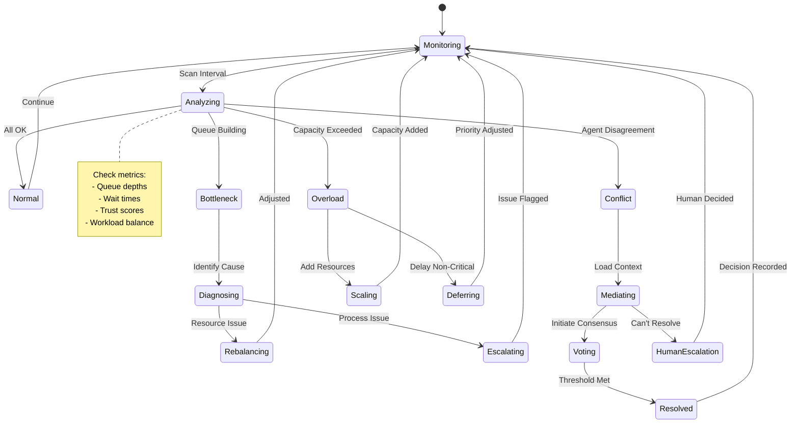
```mermaid
stateDiagram-v2
    [*] --> Monitoring

    Monitoring --> Analyzing: Scan Interval
    Analyzing --> Normal: All OK
    Analyzing --> Bottleneck: Queue Building
    Analyzing --> Conflict: Agent Disagreement
    Analyzing --> Overload: Capacity Exceeded

    Normal --> Monitoring: Continue

    Bottleneck --> Diagnosing: Identify Cause
    Diagnosing --> Rebalancing: Resource Issue
    Diagnosing --> Escalating: Process Issue
    Rebalancing --> Monitoring: Adjusted

    Conflict --> Mediating: Load Context
    Mediating --> Voting: Initiate Consensus
    Mediating --> HumanEscalation: Can't Resolve
    Voting --> Resolved: Threshold Met
    Resolved --> Monitoring: Decision Recorded
    HumanEscalation --> Monitoring: Human Decided

    Overload --> Scaling: Add Resources
    Overload --> Deferring: Delay Non-Critical
    Scaling --> Monitoring: Capacity Added
    Deferring --> Monitoring: Priority Adjusted

    Escalating --> Monitoring: Issue Flagged

    note right of Analyzing
        Check metrics:
        - Queue depths
        - Wait times
        - Trust scores
        - Workload balance
    end note
```

---

## WORKFLOW SEQUENCES

### Sequential Book Writing Workflow

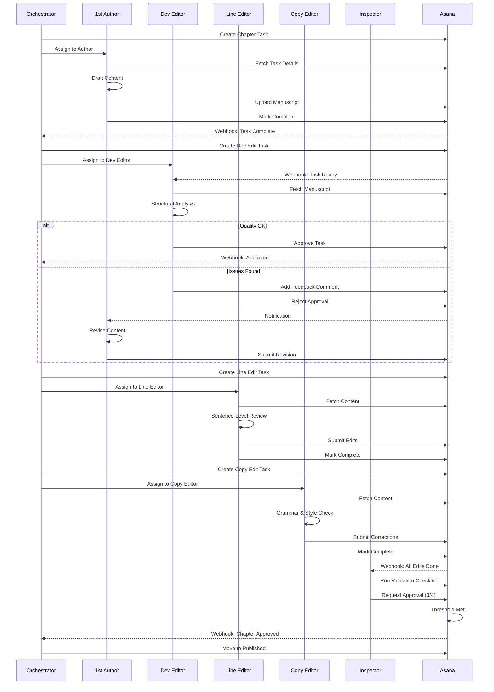
```mermaid
sequenceDiagram
    participant O as Orchestrator
    participant A as 1st Author
    participant DE as Dev Editor
    participant LE as Line Editor
    participant CE as Copy Editor
    participant I as Inspector
    participant AS as Asana

    O->>AS: Create Chapter Task
    O->>A: Assign to Author
    A->>AS: Fetch Task Details
    A->>A: Draft Content
    A->>AS: Upload Manuscript
    A->>AS: Mark Complete
    AS-->>O: Webhook: Task Complete

    O->>AS: Create Dev Edit Task
    O->>DE: Assign to Dev Editor
    AS-->>DE: Webhook: Task Ready
    DE->>AS: Fetch Manuscript
    DE->>DE: Structural Analysis
    alt Quality OK
        DE->>AS: Approve Task
        AS-->>O: Webhook: Approved
    else Issues Found
        DE->>AS: Add Feedback Comment
        DE->>AS: Reject Approval
        AS-->>A: Notification
        A->>A: Revise Content
        A->>AS: Submit Revision
    end

    O->>AS: Create Line Edit Task
    O->>LE: Assign to Line Editor
    LE->>AS: Fetch Content
    LE->>LE: Sentence-Level Review
    LE->>AS: Submit Edits
    LE->>AS: Mark Complete

    O->>AS: Create Copy Edit Task
    O->>CE: Assign to Copy Editor
    CE->>AS: Fetch Content
    CE->>CE: Grammar & Style Check
    CE->>AS: Submit Corrections
    CE->>AS: Mark Complete

    AS-->>I: Webhook: All Edits Done
    I->>AS: Run Validation Checklist
    I->>AS: Request Approval (3/4)
    AS->>AS: Threshold Met
    AS-->>O: Webhook: Chapter Approved
    O->>AS: Move to Published
```

---

### Parallel Workflow with Coordination

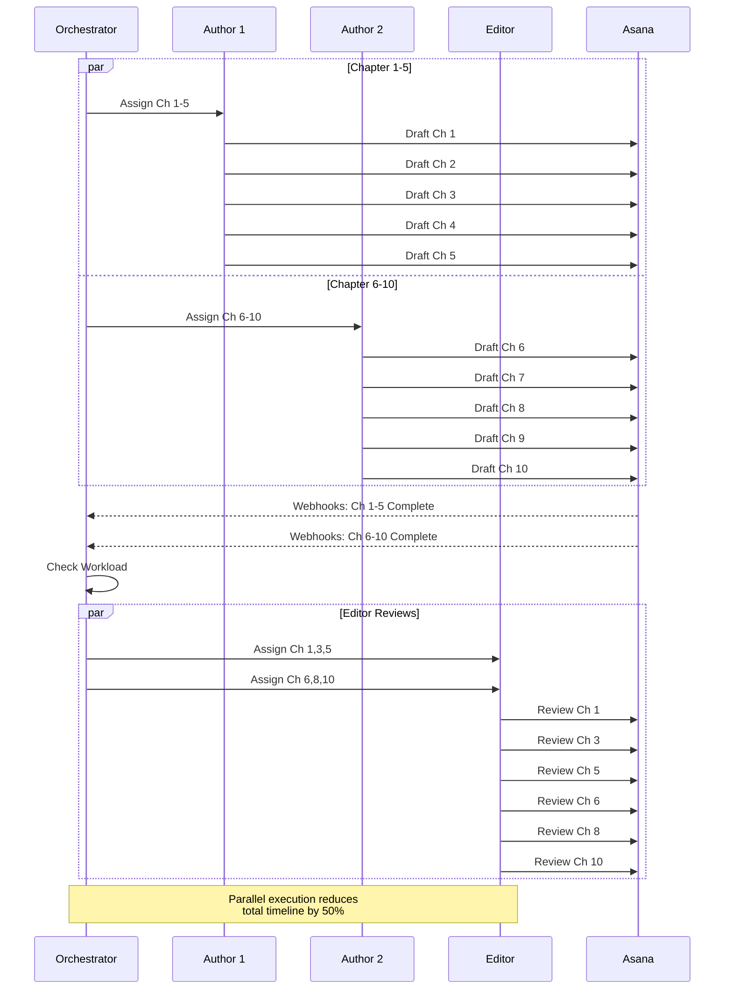
```mermaid
sequenceDiagram
    participant O as Orchestrator
    participant A1 as Author 1
    participant A2 as Author 2
    participant E as Editor
    participant AS as Asana

    par Chapter 1-5
        O->>A1: Assign Ch 1-5
        A1->>AS: Draft Ch 1
        A1->>AS: Draft Ch 2
        A1->>AS: Draft Ch 3
        A1->>AS: Draft Ch 4
        A1->>AS: Draft Ch 5
    and Chapter 6-10
        O->>A2: Assign Ch 6-10
        A2->>AS: Draft Ch 6
        A2->>AS: Draft Ch 7
        A2->>AS: Draft Ch 8
        A2->>AS: Draft Ch 9
        A2->>AS: Draft Ch 10
    end

    AS-->>O: Webhooks: Ch 1-5 Complete
    AS-->>O: Webhooks: Ch 6-10 Complete

    O->>O: Check Workload

    par Editor Reviews
        O->>E: Assign Ch 1,3,5
        O->>E: Assign Ch 6,8,10
        E->>AS: Review Ch 1
        E->>AS: Review Ch 3
        E->>AS: Review Ch 5
        E->>AS: Review Ch 6
        E->>AS: Review Ch 8
        E->>AS: Review Ch 10
    end

    Note over O,E: Parallel execution reduces<br/>total timeline by 50%
```

---

### Consensus Approval Workflow

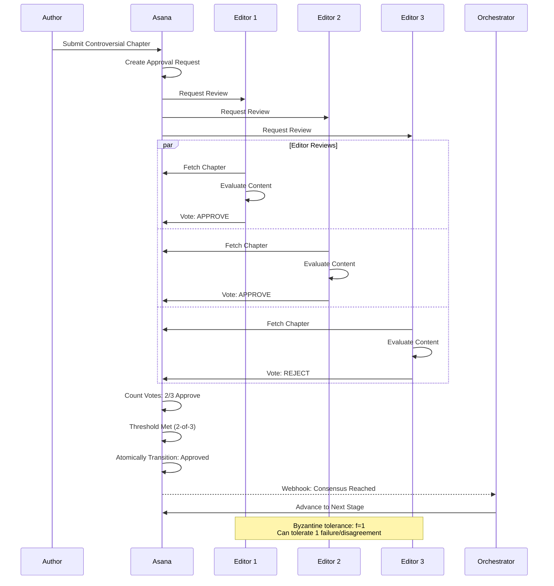
```mermaid
sequenceDiagram
    participant A as Author
    participant AS as Asana
    participant E1 as Editor 1
    participant E2 as Editor 2
    participant E3 as Editor 3
    participant O as Orchestrator

    A->>AS: Submit Controversial Chapter
    AS->>AS: Create Approval Request
    AS->>E1: Request Review
    AS->>E2: Request Review
    AS->>E3: Request Review

    par Editor Reviews
        E1->>AS: Fetch Chapter
        E1->>E1: Evaluate Content
        E1->>AS: Vote: APPROVE
    and
        E2->>AS: Fetch Chapter
        E2->>E2: Evaluate Content
        E2->>AS: Vote: APPROVE
    and
        E3->>AS: Fetch Chapter
        E3->>E3: Evaluate Content
        E3->>AS: Vote: REJECT
    end

    AS->>AS: Count Votes: 2/3 Approve
    AS->>AS: Threshold Met (2-of-3)
    AS->>AS: Atomically Transition: Approved
    AS-->>O: Webhook: Consensus Reached
    O->>AS: Advance to Next Stage

    Note over E1,E3: Byzantine tolerance: f=1<br/>Can tolerate 1 failure/disagreement
```

---

### Event-Driven Webhook Flow

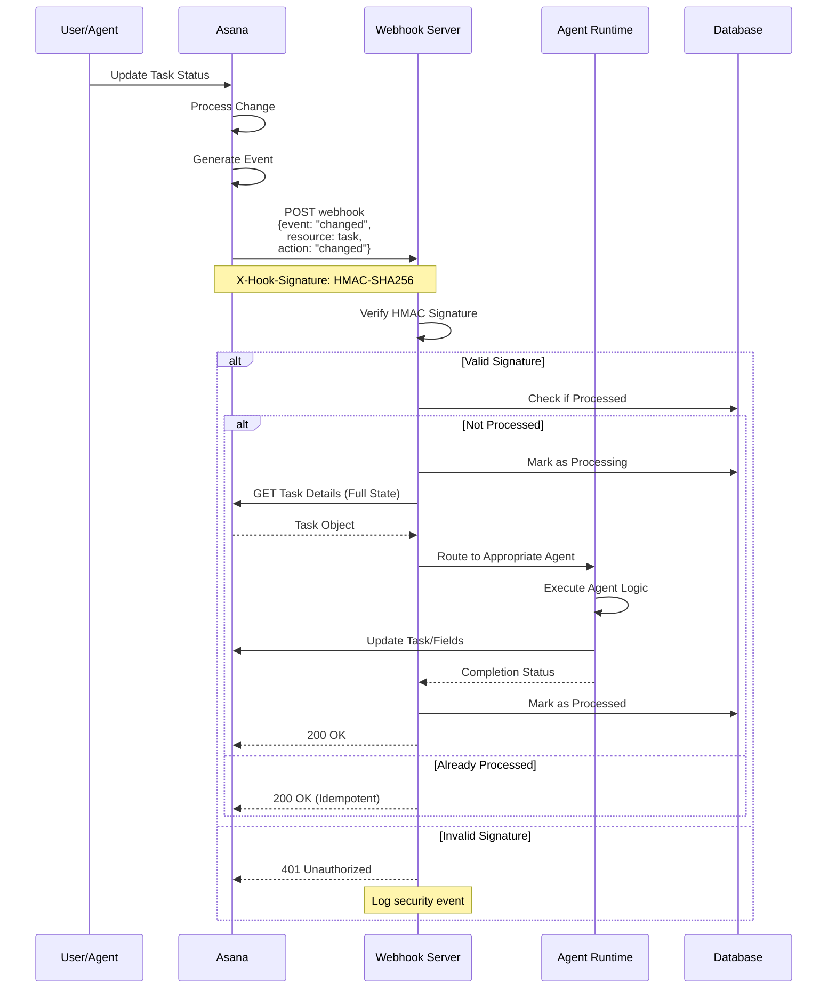
```mermaid
sequenceDiagram
    participant U as User/Agent
    participant AS as Asana
    participant WS as Webhook Server
    participant AG as Agent Runtime
    participant DB as Database

    U->>AS: Update Task Status
    AS->>AS: Process Change
    AS->>AS: Generate Event

    AS->>WS: POST webhook<br/>{event: "changed",<br/>resource: task,<br/>action: "changed"}
    Note over AS,WS: X-Hook-Signature: HMAC-SHA256

    WS->>WS: Verify HMAC Signature
    alt Valid Signature
        WS->>DB: Check if Processed
        alt Not Processed
            WS->>DB: Mark as Processing
            WS->>AS: GET Task Details (Full State)
            AS-->>WS: Task Object
            WS->>AG: Route to Appropriate Agent
            AG->>AG: Execute Agent Logic
            AG->>AS: Update Task/Fields
            AG-->>WS: Completion Status
            WS->>DB: Mark as Processed
            WS-->>AS: 200 OK
        else Already Processed
            WS-->>AS: 200 OK (Idempotent)
        end
    else Invalid Signature
        WS-->>AS: 401 Unauthorized
        Note over WS: Log security event
    end
```

---

## TRUST & REPUTATION

### Trust Score Evolution

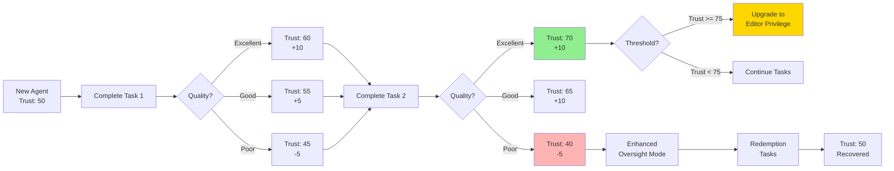
```mermaid
graph LR
    Start[New Agent<br/>Trust: 50] --> Task1[Complete Task 1]
    Task1 --> Eval1{Quality?}
    Eval1 -->|Excellent| Trust60[Trust: 60<br/>+10]
    Eval1 -->|Good| Trust55[Trust: 55<br/>+5]
    Eval1 -->|Poor| Trust45[Trust: 45<br/>-5]

    Trust60 --> Task2[Complete Task 2]
    Trust55 --> Task2
    Trust45 --> Task2

    Task2 --> Eval2{Quality?}
    Eval2 -->|Excellent| Trust70[Trust: 70<br/>+10]
    Eval2 -->|Good| Trust65[Trust: 65<br/>+10]
    Eval2 -->|Poor| Trust40[Trust: 40<br/>-5]

    Trust70 --> Milestone1{Threshold?}
    Milestone1 -->|Trust >= 75| Promotion1[Upgrade to<br/>Editor Privilege]
    Milestone1 -->|Trust < 75| Continue1[Continue Tasks]

    Trust40 --> Oversight[Enhanced<br/>Oversight Mode]
    Oversight --> Recovery[Redemption<br/>Tasks]
    Recovery --> Trust50[Trust: 50<br/>Recovered]

    style Trust70 fill:#90EE90
    style Trust40 fill:#FFB4B4
    style Promotion1 fill:#FFD700
```

---

### Progressive Trust Building

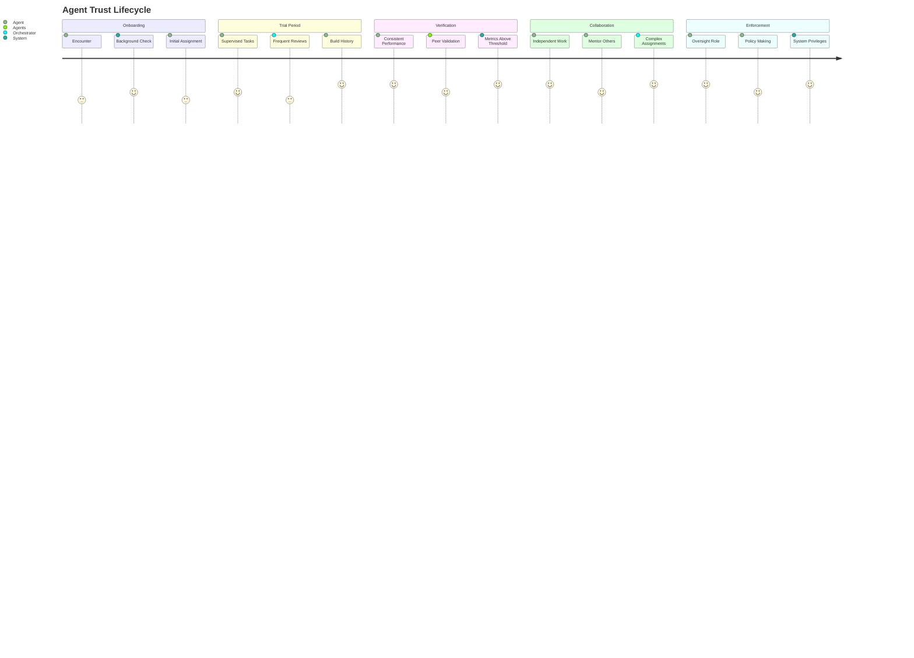
```mermaid
journey
    title Agent Trust Lifecycle
    section Onboarding
      Encounter: 3: Agent
      Background Check: 4: System
      Initial Assignment: 3: Agent
    section Trial Period
      Supervised Tasks: 4: Agent
      Frequent Reviews: 3: Orchestrator
      Build History: 5: Agent
    section Verification
      Consistent Performance: 5: Agent
      Peer Validation: 4: Agents
      Metrics Above Threshold: 5: System
    section Collaboration
      Independent Work: 5: Agent
      Mentor Others: 4: Agent
      Complex Assignments: 5: Orchestrator
    section Enforcement
      Oversight Role: 5: Agent
      Policy Making: 4: Agent
      System Privileges: 5: System
```

---

### Trust Score Calculation

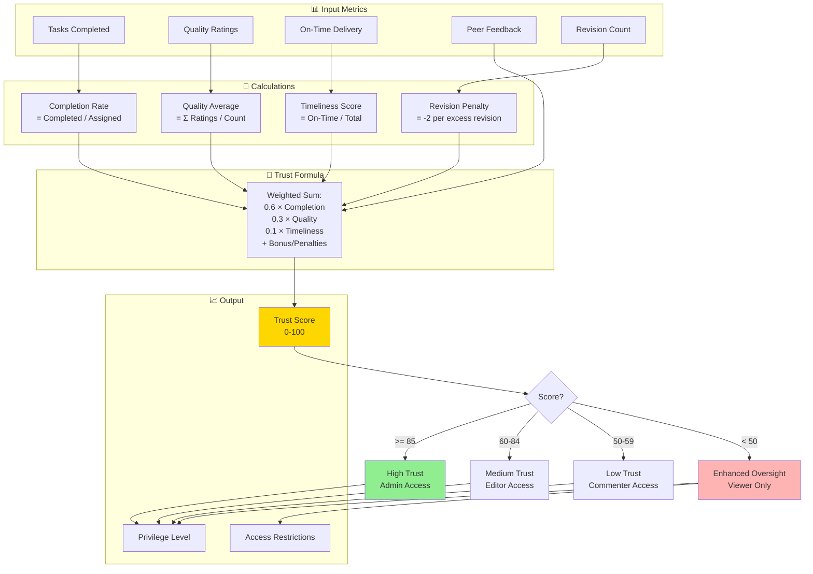
```mermaid
graph TD
    subgraph Inputs["📊 Input Metrics"]
        Completed[Tasks Completed]
        Quality[Quality Ratings]
        Timeliness[On-Time Delivery]
        Feedback[Peer Feedback]
        Revisions[Revision Count]
    end

    subgraph Calculations["🧮 Calculations"]
        CompRate[Completion Rate<br/>= Completed / Assigned]
        QualAvg[Quality Average<br/>= Σ Ratings / Count]
        TimeScore[Timeliness Score<br/>= On-Time / Total]
        RevPenalty[Revision Penalty<br/>= -2 per excess revision]
    end

    subgraph Formula["📐 Trust Formula"]
        Weighted[Weighted Sum:<br/>0.6 × Completion<br/>0.3 × Quality<br/>0.1 × Timeliness<br/>+ Bonus/Penalties]
    end

    subgraph Output["📈 Output"]
        TrustScore[Trust Score<br/>0-100]
        PrivLevel[Privilege Level]
        Restrictions[Access Restrictions]
    end

    Completed --> CompRate
    Quality --> QualAvg
    Timeliness --> TimeScore
    Revisions --> RevPenalty

    CompRate --> Weighted
    QualAvg --> Weighted
    TimeScore --> Weighted
    Feedback --> Weighted
    RevPenalty --> Weighted

    Weighted --> TrustScore

    TrustScore --> Decision{Score?}
    Decision -->|>= 85| HighTrust[High Trust<br/>Admin Access]
    Decision -->|60-84| MedTrust[Medium Trust<br/>Editor Access]
    Decision -->|50-59| LowTrust[Low Trust<br/>Commenter Access]
    Decision -->|< 50| VeryLow[Enhanced Oversight<br/>Viewer Only]

    HighTrust --> PrivLevel
    MedTrust --> PrivLevel
    LowTrust --> PrivLevel
    VeryLow --> PrivLevel

    VeryLow --> Restrictions

    style TrustScore fill:#FFD700
    style HighTrust fill:#90EE90
    style VeryLow fill:#FFB4B4
```

---

## COORDINATION PATTERNS

### Sequential Chain Pattern

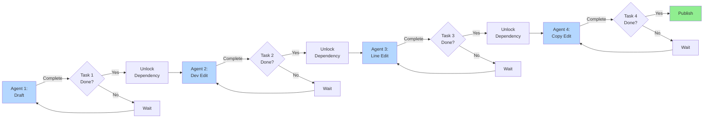
```mermaid
graph LR
    A1[Agent 1:<br/>Draft] -->|Complete| T1{Task 1<br/>Done?}
    T1 -->|Yes| Dep1[Unlock<br/>Dependency]
    Dep1 --> A2[Agent 2:<br/>Dev Edit]
    A2 -->|Complete| T2{Task 2<br/>Done?}
    T2 -->|Yes| Dep2[Unlock<br/>Dependency]
    Dep2 --> A3[Agent 3:<br/>Line Edit]
    A3 -->|Complete| T3{Task 3<br/>Done?}
    T3 -->|Yes| Dep3[Unlock<br/>Dependency]
    Dep3 --> A4[Agent 4:<br/>Copy Edit]
    A4 -->|Complete| T4{Task 4<br/>Done?}
    T4 -->|Yes| Final[Publish]

    T1 -->|No| Wait1[Wait]
    Wait1 --> A1
    T2 -->|No| Wait2[Wait]
    Wait2 --> A2
    T3 -->|No| Wait3[Wait]
    Wait3 --> A3
    T4 -->|No| Wait4[Wait]
    Wait4 --> A4

    style Final fill:#90EE90
    style A1 fill:#B4D7FF
    style A2 fill:#B4D7FF
    style A3 fill:#B4D7FF
    style A4 fill:#B4D7FF
```

---

### Fork-Join Parallel Pattern

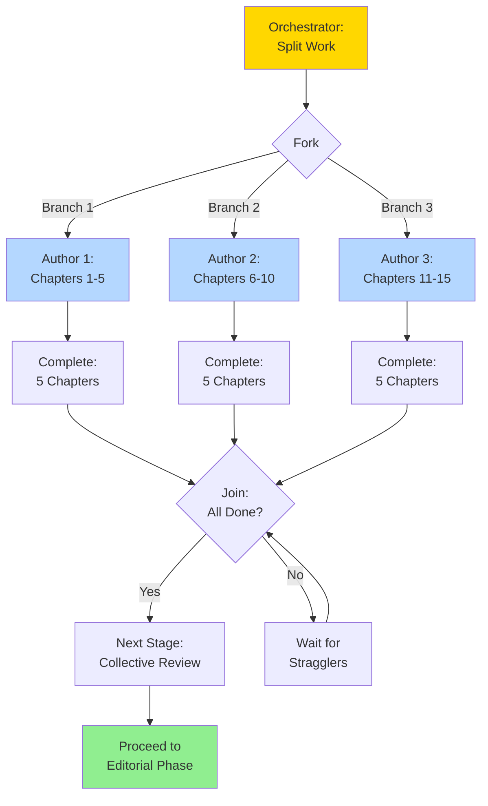
```mermaid
graph TD
    Start[Orchestrator:<br/>Split Work] --> Fork{Fork}

    Fork -->|Branch 1| A1[Author 1:<br/>Chapters 1-5]
    Fork -->|Branch 2| A2[Author 2:<br/>Chapters 6-10]
    Fork -->|Branch 3| A3[Author 3:<br/>Chapters 11-15]

    A1 --> C1[Complete:<br/>5 Chapters]
    A2 --> C2[Complete:<br/>5 Chapters]
    A3 --> C3[Complete:<br/>5 Chapters]

    C1 --> Join{Join:<br/>All Done?}
    C2 --> Join
    C3 --> Join

    Join -->|Yes| Next[Next Stage:<br/>Collective Review]
    Join -->|No| Wait[Wait for<br/>Stragglers]
    Wait --> Join

    Next --> Final[Proceed to<br/>Editorial Phase]

    style Start fill:#FFD700
    style Final fill:#90EE90
    style A1 fill:#B4D7FF
    style A2 fill:#B4D7FF
    style A3 fill:#B4D7FF
```

---

### Hierarchical Supervision Pattern

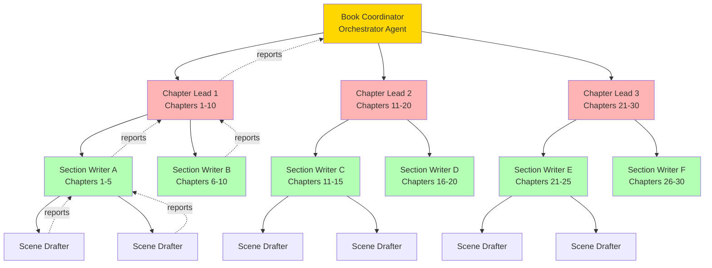
```mermaid
graph TD
    Top[Book Coordinator<br/>Orchestrator Agent]

    Top --> L1A[Chapter Lead 1<br/>Chapters 1-10]
    Top --> L1B[Chapter Lead 2<br/>Chapters 11-20]
    Top --> L1C[Chapter Lead 3<br/>Chapters 21-30]

    L1A --> L2A1[Section Writer A<br/>Chapters 1-5]
    L1A --> L2A2[Section Writer B<br/>Chapters 6-10]

    L1B --> L2B1[Section Writer C<br/>Chapters 11-15]
    L1B --> L2B2[Section Writer D<br/>Chapters 16-20]

    L1C --> L2C1[Section Writer E<br/>Chapters 21-25]
    L1C --> L2C2[Section Writer F<br/>Chapters 26-30]

    L2A1 --> L3A1[Scene Drafter]
    L2A1 --> L3A2[Scene Drafter]

    L2B1 --> L3B1[Scene Drafter]
    L2B1 --> L3B2[Scene Drafter]

    L2C1 --> L3C1[Scene Drafter]
    L2C1 --> L3C2[Scene Drafter]

    L3A1 -.reports.-> L2A1
    L3A2 -.reports.-> L2A1
    L2A1 -.reports.-> L1A
    L2A2 -.reports.-> L1A
    L1A -.reports.-> Top

    style Top fill:#FFD700
    style L1A fill:#FFB4B4
    style L1B fill:#FFB4B4
    style L1C fill:#FFB4B4
    style L2A1 fill:#B4FFB4
    style L2A2 fill:#B4FFB4
    style L2B1 fill:#B4FFB4
    style L2B2 fill:#B4FFB4
    style L2C1 fill:#B4FFB4
    style L2C2 fill:#B4FFB4
```

---

### Consensus Voting Pattern

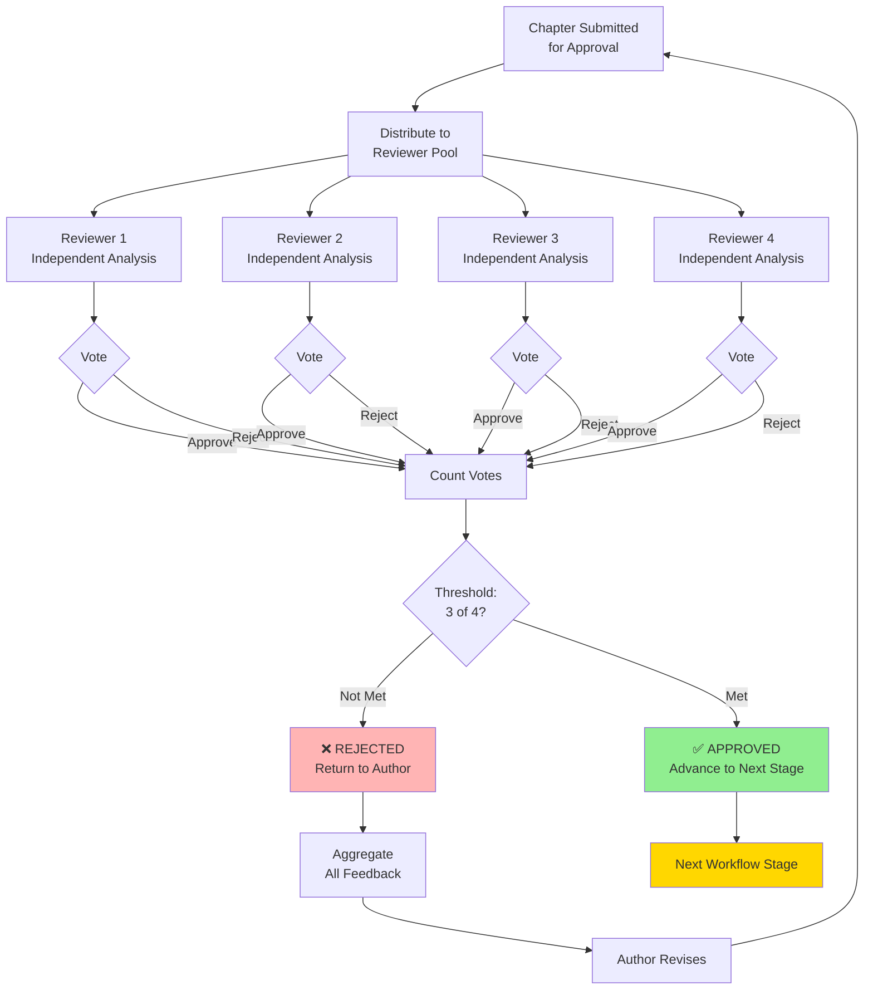
```mermaid
graph TD
    Proposal[Chapter Submitted<br/>for Approval]

    Proposal --> Distribute[Distribute to<br/>Reviewer Pool]

    Distribute --> R1[Reviewer 1<br/>Independent Analysis]
    Distribute --> R2[Reviewer 2<br/>Independent Analysis]
    Distribute --> R3[Reviewer 3<br/>Independent Analysis]
    Distribute --> R4[Reviewer 4<br/>Independent Analysis]

    R1 --> V1{Vote}
    R2 --> V2{Vote}
    R3 --> V3{Vote}
    R4 --> V4{Vote}

    V1 -->|Approve| Tally
    V1 -->|Reject| Tally
    V2 -->|Approve| Tally
    V2 -->|Reject| Tally
    V3 -->|Approve| Tally
    V3 -->|Reject| Tally
    V4 -->|Approve| Tally
    V4 -->|Reject| Tally

    Tally[Count Votes]

    Tally --> Decision{Threshold:<br/>3 of 4?}

    Decision -->|Met| Approved[✅ APPROVED<br/>Advance to Next Stage]
    Decision -->|Not Met| Rejected[❌ REJECTED<br/>Return to Author]

    Rejected --> Feedback[Aggregate<br/>All Feedback]
    Feedback --> Revision[Author Revises]
    Revision --> Proposal

    Approved --> Next[Next Workflow Stage]

    style Approved fill:#90EE90
    style Rejected fill:#FFB4B4
    style Next fill:#FFD700
```

---

## EVENT-DRIVEN FLOWS

### Complete Event Processing Pipeline

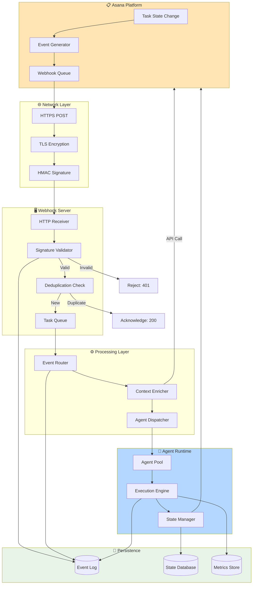
```mermaid
graph TB
    subgraph Asana["📋 Asana Platform"]
        TaskChange[Task State Change]
        EventGen[Event Generator]
        WebhookQueue[Webhook Queue]
    end

    subgraph Network["🌐 Network Layer"]
        HTTPS[HTTPS POST]
        TLS[TLS Encryption]
        HMAC[HMAC Signature]
    end

    subgraph WebhookServer["🖥️ Webhook Server"]
        Receiver[HTTP Receiver]
        Validator[Signature Validator]
        Dedup[Deduplication Check]
        Queue[Task Queue]
    end

    subgraph Processing["⚙️ Processing Layer"]
        Router[Event Router]
        Enricher[Context Enricher]
        AgentDispatch[Agent Dispatcher]
    end

    subgraph Agents["🤖 Agent Runtime"]
        AgentPool[Agent Pool]
        Executor[Execution Engine]
        StateManager[State Manager]
    end

    subgraph Persistence["💾 Persistence"]
        EventLog[(Event Log)]
        StateDB[(State Database)]
        MetricsDB[(Metrics Store)]
    end

    TaskChange --> EventGen
    EventGen --> WebhookQueue
    WebhookQueue --> HTTPS
    HTTPS --> TLS
    TLS --> HMAC
    HMAC --> Receiver

    Receiver --> Validator
    Validator -->|Valid| Dedup
    Validator -->|Invalid| Reject[Reject: 401]
    Dedup -->|New| Queue
    Dedup -->|Duplicate| Ack[Acknowledge: 200]

    Queue --> Router
    Router --> Enricher
    Enricher -->|API Call| Asana
    Enricher --> AgentDispatch

    AgentDispatch --> AgentPool
    AgentPool --> Executor
    Executor --> StateManager
    StateManager --> Asana

    Validator --> EventLog
    Router --> EventLog
    Executor --> EventLog
    StateManager --> StateDB
    Executor --> MetricsDB

    style Asana fill:#FFE5B4
    style Agents fill:#B4D7FF
    style Persistence fill:#E8F4E8
```

---

### Event Sourcing Pattern

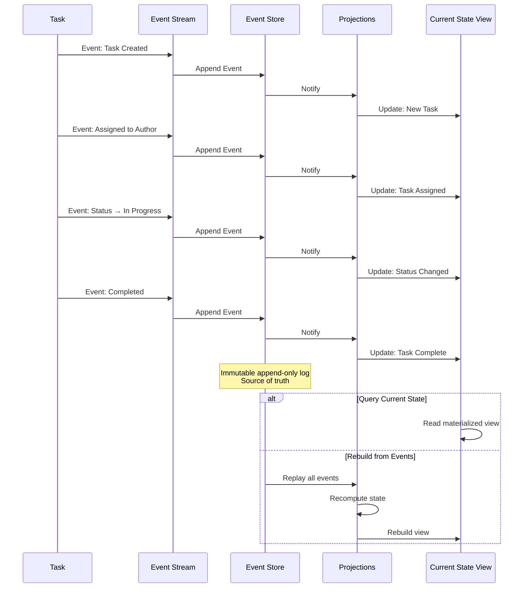
```mermaid
sequenceDiagram
    participant T as Task
    participant ES as Event Stream
    participant Store as Event Store
    participant Proj as Projections
    participant View as Current State View

    T->>ES: Event: Task Created
    ES->>Store: Append Event
    Store->>Proj: Notify
    Proj->>View: Update: New Task

    T->>ES: Event: Assigned to Author
    ES->>Store: Append Event
    Store->>Proj: Notify
    Proj->>View: Update: Task Assigned

    T->>ES: Event: Status → In Progress
    ES->>Store: Append Event
    Store->>Proj: Notify
    Proj->>View: Update: Status Changed

    T->>ES: Event: Completed
    ES->>Store: Append Event
    Store->>Proj: Notify
    Proj->>View: Update: Task Complete

    Note over Store: Immutable append-only log<br/>Source of truth

    alt Query Current State
        View->>View: Read materialized view
    else Rebuild from Events
        Store->>Proj: Replay all events
        Proj->>Proj: Recompute state
        Proj->>View: Rebuild view
    end
```

---

## DECISION TREES

### Task Routing Decision Tree

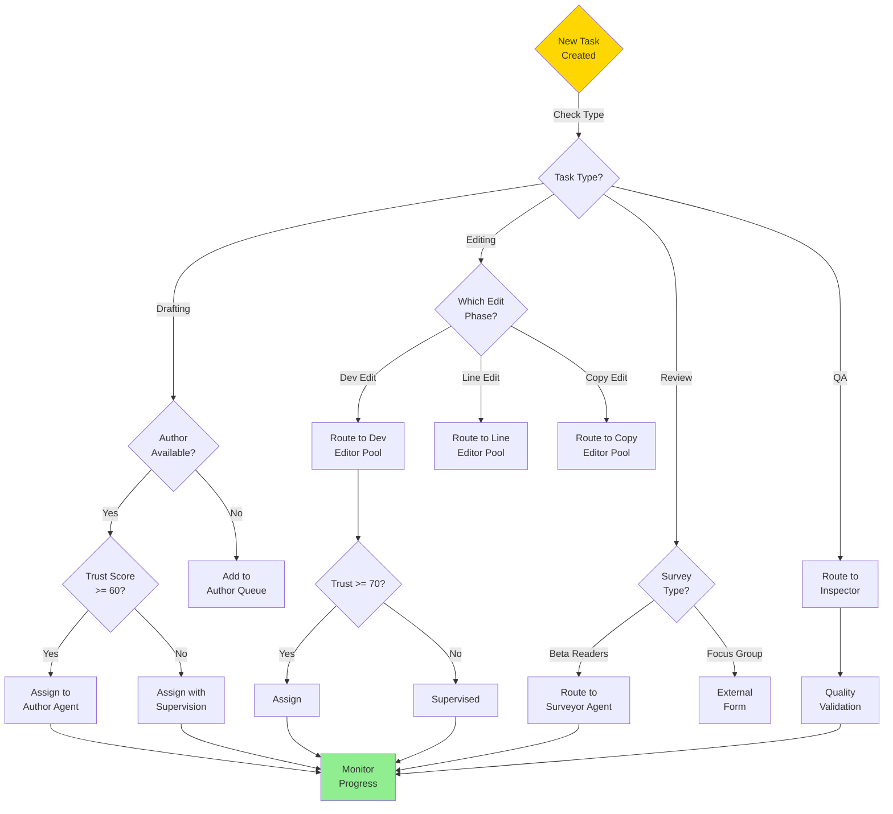
```mermaid
graph TD
    Start{New Task<br/>Created}

    Start -->|Check Type| Type{Task Type?}

    Type -->|Drafting| Author{Author<br/>Available?}
    Type -->|Editing| Editor{Which Edit<br/>Phase?}
    Type -->|Review| Survey{Survey<br/>Type?}
    Type -->|QA| Inspector[Route to<br/>Inspector]

    Author -->|Yes| CheckTrust1{Trust Score<br/>>= 60?}
    Author -->|No| Queue1[Add to<br/>Author Queue]

    CheckTrust1 -->|Yes| Assign1[Assign to<br/>Author Agent]
    CheckTrust1 -->|No| Supervised1[Assign with<br/>Supervision]

    Editor -->|Dev Edit| DevEd[Route to Dev<br/>Editor Pool]
    Editor -->|Line Edit| LineEd[Route to Line<br/>Editor Pool]
    Editor -->|Copy Edit| CopyEd[Route to Copy<br/>Editor Pool]

    DevEd --> CheckTrust2{Trust >= 70?}
    CheckTrust2 -->|Yes| Assign2[Assign]
    CheckTrust2 -->|No| Supervised2[Supervised]

    Survey -->|Beta Readers| Surveyor[Route to<br/>Surveyor Agent]
    Survey -->|Focus Group| External[External<br/>Form]

    Inspector --> Validate[Quality<br/>Validation]

    Assign1 --> Monitor[Monitor<br/>Progress]
    Assign2 --> Monitor
    Supervised1 --> Monitor
    Supervised2 --> Monitor
    Surveyor --> Monitor
    Validate --> Monitor

    style Start fill:#FFD700
    style Monitor fill:#90EE90
```

---

### Conflict Resolution Decision Tree

```mermaid
graph TD
    Conflict{Conflict<br/>Detected}

    Conflict --> Type{Conflict<br/>Type?}

    Type -->|Agent Disagreement| Severity1{Severity?}
    Type -->|Quality Dispute| Severity2{Severity?}
    Type -->|Timeline Conflict| Severity3{Severity?}

    Severity1 -->|Minor| AutoResolve1[Automated<br/>Resolution]
    Severity1 -->|Major| Consensus1[Initiate<br/>Consensus Vote]

    Severity2 -->|Minor| SecondOpinion[Request<br/>Second Opinion]
    Severity2 -->|Major| Consensus2[Multi-Party<br/>Review]

    Severity3 -->|Minor| Reschedule[Auto<br/>Reschedule]
    Severity3 -->|Major| Escalate1[Escalate to<br/>Orchestrator]

    AutoResolve1 --> Record[Record<br/>Decision]
    SecondOpinion --> Eval1{Resolved?}
    Consensus1 --> Vote{Vote<br/>Result?}
    Consensus2 --> Vote

    Eval1 -->|Yes| Record
    Eval1 -->|No| Consensus2

    Vote -->|Threshold Met| Approved[Apply<br/>Decision]
    Vote -->|Not Met| Escalate2[Human<br/>Escalation]

    Reschedule --> Notify[Notify<br/>Affected Agents]
    Escalate1 --> Human[Human<br/>Decision]
    Escalate2 --> Human

    Approved --> Record
    Human --> Record
    Notify --> Record

    Record --> Update[Update Custom<br/>Fields]
    Update --> Archive[Archive to<br/>Audit Log]

    style Conflict fill:#FFB4B4
    style Record fill:#90EE90
    style Archive fill:#FFD700
```

---

## RESOURCE MANAGEMENT

### Workload Balancing Algorithm

```mermaid
flowchart TD
    Start([New Task<br/>Needs Assignment])

    Start --> GetPool[Get Available<br/>Agent Pool]
    GetPool --> FilterSkills[Filter by<br/>Required Skills]
    FilterSkills --> CheckCap{Any Agent<br/>Below Capacity?}

    CheckCap -->|Yes| CalcLoad[Calculate Load<br/>for Each Agent]
    CheckCap -->|No| QueueTask[Add to<br/>Wait Queue]

    CalcLoad --> SortAgents[Sort by:<br/>1. Available Capacity<br/>2. Trust Score<br/>3. Past Performance]

    SortAgents --> Select[Select Top Agent]

    Select --> ValidateTrust{Trust Score<br/>>= Minimum?}

    ValidateTrust -->|Yes| Assign[Assign Task]
    ValidateTrust -->|No| NextAgent[Try Next Agent]
    NextAgent --> ValidateTrust

    Assign --> UpdateCap[Update Agent<br/>Capacity]
    UpdateCap --> NotifyAgent[Notify Agent<br/>via Webhook]
    NotifyAgent --> LogMetrics[Log Assignment<br/>Metrics]
    LogMetrics --> End([Complete])

    QueueTask --> SetPriority[Set Priority<br/>in Queue]
    SetPriority --> Schedule[Schedule<br/>Retry]
    Schedule --> End

    style Start fill:#FFD700
    style Assign fill:#90EE90
    style QueueTask fill:#FFB4B4
```

---

### Priority Queue Management

```mermaid
graph TD
    subgraph Incoming["📥 Task Intake"]
        NewTask[New Task]
        CalcPriority[Calculate<br/>Priority Score]
    end

    subgraph PriorityQueue["📊 Priority Queue"]
        Critical[🔴 Critical<br/>Score: 90-100]
        High[🟠 High<br/>Score: 75-89]
        Medium[🟡 Medium<br/>Score: 50-74]
        Low[🟢 Low<br/>Score: 0-49]
    end

    subgraph Scheduler["⚙️ Scheduler"]
        SelectNext{Select Next<br/>Task}
        CheckDeps[Check<br/>Dependencies]
        CheckResources[Check<br/>Resources]
    end

    subgraph Execution["⚡ Execution"]
        Assign[Assign to<br/>Agent]
        Monitor[Monitor<br/>Progress]
        Complete[Mark<br/>Complete]
    end

    NewTask --> CalcPriority

    CalcPriority --> Route{Route by<br/>Priority}
    Route -->|90-100| Critical
    Route -->|75-89| High
    Route -->|50-74| Medium
    Route -->|0-49| Low

    Critical --> SelectNext
    High --> SelectNext
    Medium --> SelectNext
    Low --> SelectNext

    SelectNext --> CheckDeps
    CheckDeps -->|Met| CheckResources
    CheckDeps -->|Not Met| Wait1[Wait]
    Wait1 --> SelectNext

    CheckResources -->|Available| Assign
    CheckResources -->|Unavailable| Wait2[Wait]
    Wait2 --> SelectNext

    Assign --> Monitor
    Monitor --> Complete

    Complete --> UpdateQueue[Update Queue<br/>Metrics]
    UpdateQueue --> NextTask[Process Next]
    NextTask --> SelectNext

    style Critical fill:#FF6B6B
    style High fill:#FFA500
    style Medium fill:#FFD700
    style Low fill:#90EE90
```

---

### Capacity Planning Visualization

```mermaid
gantt
    title Agent Capacity Timeline (Week View)
    dateFormat YYYY-MM-DD
    axisFormat %a %d

    section Author 1 (30h)
    Chapter 1 Draft     :a1, 2025-01-20, 10h
    Chapter 2 Draft     :a2, after a1, 12h
    Chapter 3 Outline   :a3, after a2, 8h

    section Author 2 (30h)
    Chapter 4 Draft     :b1, 2025-01-20, 15h
    Chapter 5 Draft     :b2, after b1, 15h

    section Dev Editor (40h)
    Review Ch 1         :c1, 2025-01-22, 8h
    Review Ch 4         :c2, after c1, 10h
    Review Ch 2         :c3, after c2, 8h
    Review Ch 5         :c4, after c3, 10h
    Overflow Buffer     :c5, after c4, 4h

    section Line Editor (40h)
    Review Ch 1         :d1, 2025-01-24, 6h
    Review Ch 4         :d2, after d1, 8h
    Available           :crit, d3, after d2, 26h

    section Orchestrator (20h)
    Planning            :e1, 2025-01-20, 5h
    Monitoring          :e2, 2025-01-20, 15h
```

---

**END OF MULTI-AGENT VISUALIZATIONS**

*These diagrams are optimized for Obsidian’s Mermaid rendererSave this file in your Obsidian vault and view in Reading mode*