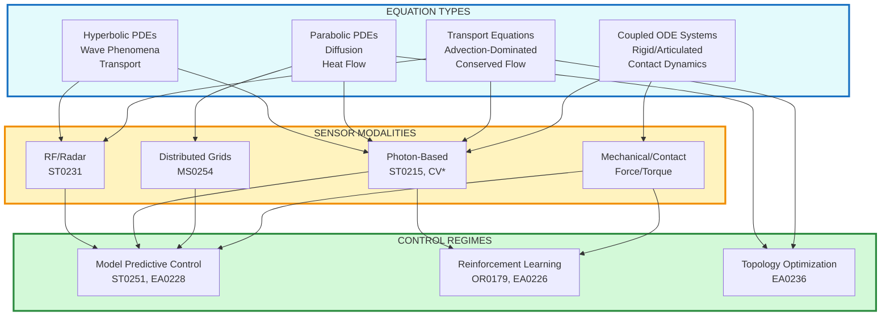

# Physics-Informed Architecture: Equation-Sensor-Control Trichotomy

**Asymmetric restructuring of physics-informed models organized by technical patterns rather than application domains.**

This page maps the actual relationships between equation types, sensor modalities, and control regimes — preserving the substance without forcing artificial symmetry.

---

## Core Trichotomy

---

## 1. Hyperbolic PDEs: Wave & Transport Phenomena

**Governing physics:** Wave equation, Maxwell's equations, particle transport

### Primary Sensor Modalities

**RF/Radar (ST0231)**

- Waveform design: Chirp optimization, MIMO configuration
- Phase-first Doppler: Micro-Doppler extraction, velocity estimation
- Deep denoising: Clutter rejection (CFAR)

**Radiation Detection (ST0242)**

- Monte Carlo transport: Particle tracking, geometry modeling
- Source localization: Inverse source problems, directional estimation
- Spectral analysis: Peak identification, isotope classification

### Control Pathways

**→ MPC for Tracking**

- Constraint MPC (EA0228): CBF-QP formulation for safe tracking
- Multimodal tracking (ST0096): Kalman variants, JPDA, particle filters

**→ Physics-Informed Surrogate Learning (ST0246)**

- PDE constraints: Residual losses, boundary conditions
- Neural solvers: PINNs for forward/inverse problems

### Application Instances

- Defense & Security: Threat detection, nuclear source localization
- Medical Imaging: Single-photon reconstruction (low-SNR)
- Autonomous Vehicles: Radar perception for all-weather operation

---

## 2. Parabolic PDEs: Diffusion & Heat Flow

**Governing physics:** Heat equation, diffusion processes, Fokker-Planck

### Primary Sensor Modalities

**Photon-Based (ST0215)**

- Single-photon LiDAR: Poisson statistics, depth reconstruction
- Photon-limited imaging: Histogram binning, super-resolution

**Distributed Grids (MS0254)**

- Decentralized assimilation: Distributed EnKF, gossip protocols
- Consensus estimation: ADMM, diffusion-based fusion

### Control Pathways

**→ MPC for Thermal Management**

- Data-driven control (ST0251): ROM via POD/DMD
- Koopman methods: EDMD for nonlinear thermal dynamics

**→ Topology Optimization (EA0236)**

- Multi-physics: Thermal-structural coupling
- Adjoint sensitivity: Automatic differentiation for gradient computation

### Application Instances

- Energy Systems: Grid optimization, thermal management
- Climate & Weather: Large-scale forecasting, data assimilation
- Medical Imaging: Photon diffusion in tissue (dose optimization via RL)

---

## 3. Transport Equations: Advection-Dominated Flow

**Governing physics:** Navier-Stokes, conservation laws, convection

### Primary Sensor Modalities

**Vision + Flow Sensors**

- Visual-LiDAR fusion (CV0209): Point cloud encoding, 3D detection
- V-SLAM (CV0220): Feature extraction, bundle adjustment
- Robust estimation (CV0221): RANSAC, GNC for outlier rejection

**RF for Velocity Fields**

- Radar transformers: Spatiotemporal flow reconstruction
- Sensor reasoning VLMs (ST0174): Multimodal grounding of flow states

### Control Pathways

**→ MPC for Flow Control**

- Constraint MPC (EA0228): Tube MPC for robust flow stabilization
- Reduced-order models: Balanced truncation for real-time control

**→ Topology Optimization (EA0236)**

- Fluid-structure interaction: Level-set methods
- Density methods (SIMP): Optimizing channel geometry

### Application Instances

- Aerospace & Aviation: Wing design, fuel efficiency (fast CFD operators)
- Autonomous Vehicles: Perception + planning with 5+ sensor fusion
- Industrial Inspection: Airflow reconstruction for quality control

---

## 4. Coupled ODE Systems: Articulated & Contact Dynamics

**Governing physics:** Lagrangian mechanics, contact/impact, multibody dynamics

### Primary Sensor Modalities

**Mechanical/Contact Sensors**

- Force/torque: Friction cone modeling, soft contact
- Proprioceptive: Joint encoders, IMUs

**Vision for State Estimation**

- 6D grasp pose (OR0164): Dense correspondence, grasp quality metrics
- Visual-LiDAR fusion: Object pose tracking

### Control Pathways

**→ Reinforcement Learning (OR0179, EA0226)**

- Robot learning: PPO/SAC for manipulation policies
- Safe RL: CBF shields, Lagrangian constraint handling
- Foundation manipulation (OR0261): Diffusion policies, language grounding

**→ MPC for Contact-Rich Tasks**

- Whole-body manipulation (OR0249): Centroidal dynamics, contact scheduling
- Multi-robot planning (CA0178): Formation control, consensus algorithms

**→ System Identification (OR0180)**

- Grey-box models: Hybrid physics-NN for parameter estimation
- Online adaptation: Recursive least squares, Kalman-based ID

### Application Instances

- Robotics: Fast dynamics prediction, real-time manipulation
- Engineering Design: Generative design with contact constraints
- Learning disassembly (OR0239): Contact-rich policy learning

---

## Cross-Cutting: Learning & Modeling Infrastructure

### Uncertainty Quantification & Bayesian Methods (ST0184)

- Posterior inference: MCMC, variational inference
- Surrogate models: Gaussian processes, neural surrogates
- Sensitivity analysis: Sobol indices, active subspaces

### Particle Systems (ST0229)

- Particle dynamics: Langevin, Stein variational gradient descent
- Resampling: ESS monitoring for adaptive strategies

### Geometry-Aware Surrogates (ST0247)

- Shape encoding: Signed distance functions, point clouds
- Operator learning: Fourier neural operators, graph networks
- Mesh adaptation: Adaptive refinement for solution features

### Few-Shot Learning (SA0176)

- Meta-learning: MAML for rapid adaptation to new physics
- Metric learning: Siamese networks for transfer across domains

---

## Application Matrix: Domain × (Equation, Sensor, Control)

| **Domain** | **Primary Equation** | **Key Sensors** | **Control Regime** |
| --- | --- | --- | --- |
| Aerospace & Aviation | Transport (NS) | Flow sensors, pressure | Topology Opt |
| Climate & Weather | Parabolic | Distributed grids | MPC (Decentralized) |
| Autonomous Vehicles | Transport + Hyperbolic | Radar + LiDAR + Vision | MPC (Constraint) |
| Robotics | ODE | Mechanical + Vision | RL + MPC |
| Engineering Design | Parabolic + Transport | Simulation | Topology Opt |
| Energy Systems | Parabolic | Thermal/fluid grids | MPC |
| Medical Imaging | Parabolic + Hyperbolic | Single-photon | RL (Dose Opt) |
| Defense & Security | Hyperbolic | RF + IR + LiDAR | MPC (Tracking) |
| Industrial Inspection | Transport | Vision + Thermal | Data-Driven Control |
| Scientific Computing | All | Distributed inference | All |

---

## Asymmetries & Design Implications

### Dense Connections

1. **Photon-based sensors** serve both hyperbolic (wave-like propagation) and parabolic (diffusion) equations
2. **MPC** is the dominant control regime for hyperbolic, parabolic, and transport equations
3. **RL** is concentrated in ODE systems (robotics/manipulation)

### Sparse Connections

1. **RF/Radar** primarily serves hyperbolic PDEs (not used for parabolic/ODE)
2. **Topology optimization** applies to design problems (parabolic/transport), not to real-time control
3. **Mechanical sensors** are exclusive to ODE systems

### Competitive Differentiation

**Against same-architecture competitors:**

- **Different equations:** We handle hyperbolic (radar/radiation) where others focus on parabolic (thermal)
- **Different sensors:** We integrate RF + photon fusion; others use vision-only stacks
- **Different control:** We combine MPC + RL + topology optimization; others specialize in one

**Technical moat:** Cross-cutting learning infrastructure (UQ, geometry surrogates, few-shot) enables rapid adaptation across all equation-sensor-control combinations.

---

## Summary Statistics

**Pruned from original:**

- ~~Generation stack (G1-G8)~~: Not physics-constrained
- ~~Subsubskills (192 nodes)~~: Implementation detail
- ~~Domain-first organization~~: Obscures reusable patterns

**Retained & reorganized:**

- 4 equation types (asymmetric coverage)
- 4 sensor families (unequal maturity)
- 3 control regimes (domain-specific applicability)
- 8 cross-cutting learning skills
- 10 application domains (as instantiation examples)

**Total nodes:** ~100 (down from 320)

---

## Related Pages

- [invariant_bridge_analysis](invariant_bridge_analysis%202b1f832e52ca802f9bc4ebd1c1dc25d9.md): Core theory (ξ, S, AGM)
- [Samsung initial draft](Samsung%20initial%20draft%202b1f832e52ca80968776f93eddaa5420.md): Manufacturing applications
- [Fascinating fields that benefit from physics-informed models](Fascinating%20fields%20that%20benefit%20from%20physics-infor%202b3f832e52ca8089a72ef9f74a2f81e6.md): Original domain-centric view