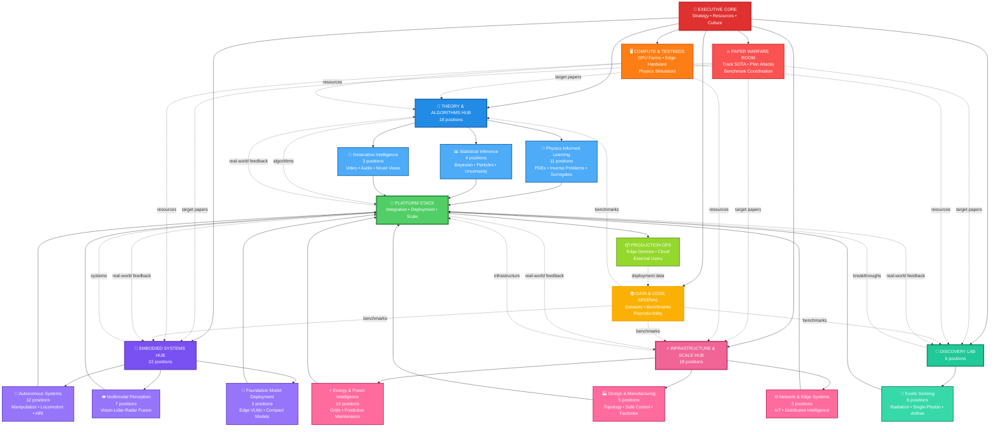

# Research Lab Organizational Chart & Workflow

# Research Lab Organizational Chart & Workflow

## Theory-Driven Platform Builders

---

## Organizational Structure & Workflow Integration



---

## Core Philosophy

**We don’t publish papers and move on. We build systems others can’t avoid using.**

This structure organizes 64 research positions into 4 major hubs focused on:
1. **Theory & Algorithms** - New math, new models, new paradigms
2. **Embodied Systems** - Full-stack perception-action intelligence
3. **Infrastructure & Scale** - Big systems, reliability, deployment
4. **Discovery Lab** - Impossible-sounding breakthroughs

---

## 🌊 THEORY & ALGORITHMS HUB (18 positions)

**Mission:** Create the mathematical foundations others will depend on

### 🧮 Physics-Informed Learning Division (11 positions)

**Goal:** Build ML that respects physics → new class of models everyone copies

| Position | Focus Area | Platform Target |
| --- | --- | --- |
| ST0251 | Data-Driven Spatiotemporal Control | Reduced-order controller toolkit |
| ST0245 | Python-OpenFOAM Interface | 10K+ user CFD framework |
| ST0247 | Geometry-Aware Fluid Surrogates | Fast neural CFD operators |
| ST0246 | Physics-Informed ML for PDEs | PDE solver library (beat FEniCS) |
| ST0231 | Radar Perception Models | First transformer-radar architecture |
| ST0096 | Multimodal Tracking (radar+depth+RGB) | Sensor fusion that beats single-modal |
| ST0238 | Multi-Modal Sensing (5+ modalities) | RF+IR+LiDAR+event+thermal integration |
| ST0174 | Sensor Reasoning VLMs | Multimodal grounding benchmark |
| CV0215 | Single-Photon Lidar Algorithms | Photon-efficient depth reconstruction |
| CV0210 | Camera-based Airflow Reconstruction | Physics-vision hybrid for flows |
| MS0254 | Decentralized Data Assimilation | Distributed estimation for climate-scale |

**Benchmark Warfare Targets:**
- OpenFOAM integration benchmarks
- PDE solving accuracy competitions
- Radar perception datasets (create if needed)
- Multimodal sensor fusion leaderboards

**Platform Ambition:**
- Python-CFD interface → computational fluid dynamics standard
- PDE solver library → scientific computing default
- Multimodal sensor framework → robotics/AV industry standard

---

### 📊 Statistical Inference Division (4 positions)

**Goal:** Solve inverse problems everyone else gives up on

| Position | Focus Area | Breakthrough Potential |
| --- | --- | --- |
| ST0242 | Radiation Detection (Geant4) | ML for nuclear source localization |
| ST0184 | Bayesian Inverse Problems | Non-log-concave posterior inference |
| ST0229 | Particle Methods | New particle dynamics for hard distributions |
| CV0212 | Single-Photon Statistical Modeling | Low-SNR imaging theory |

**Benchmark Warfare Targets:**
- Create inverse problem benchmarks (if none exist, we define them)
- Uncertainty quantification competitions
- Bayesian inference scalability tests

**Platform Ambition:**
- Bayesian inverse problems library → scientific community
- Particle method toolkit → computational statistics standard

---

### 🎨 Generative Intelligence Division (3 positions)

**Goal:** Generate content that makes current methods look obsolete

| Position | Focus Area | Benchmark Targets |
| --- | --- | --- |
| CV0227 | Instructional Video Generation | Make-A-Video, CogVideo leaderboards |
| CV0225 | NeRF/Gaussian Splatting | Tanks & Temples, Mip-NeRF benchmarks |
| SA0188 | Audio Separation & Generation | MUSDB18, WSJ0-2mix, FSD50K |

**Platform Ambition:**
- NeRF/GS toolkit → 3D reconstruction industry standard
- Instructional video models → educational content generation
- Audio generation framework → music/speech synthesis default

---

## 🎯 EMBODIED SYSTEMS HUB (22 positions)

**Mission:** Build robots and agents that own the full perception-action stack

### 🤖 Autonomous Systems Division (12 positions)

**Goal:** Full-stack robot intelligence from hardware to reasoning

| Position | Focus Area | Integration Target |
| --- | --- | --- |
| OR0263 | ROS2 Control Software | Modular stack for community |
| OR0239 | VLM-based Disassembly | Language-guided manipulation |
| OR0179 | Visual Servoing + Learning | Real-time adaptation |
| OR0249 | Quadruped Whole-Body Manipulation | Legged robots that grasp |
| OR0164 | 6D Grasp Pose Estimation | GraspNet, ACRONYM benchmarks |
| OR0240 | Shared Autonomy HRC | Human-robot collaboration |
| CA0178 | Multi-Robot Coordination | 10+ robot scalability |
| EA0235 | Mobile Manipulator Planning | Combined base+arm optimization |
| CI0197 | Humanoid Embodied AI | Whole-body imitation learning |
| CV0224 | Language-Guided HRI | Vision-language-action grounding |
| OR0261 | Foundation Models → Manipulation | Transfer learning for grasping |
| OR0262 | Foundation Models → Manufacturing | Industrial robot intelligence |

**Benchmark Warfare Targets:**
- RLBench, Meta-World manipulation benchmarks
- AI Habitat embodied AI challenges
- GraspNet 6D pose leaderboards
- Create manufacturing manipulation benchmarks

**Platform Ambition:**
- ROS2 manipulation modules → 100+ lab adoption
- Humanoid control framework → open-source leader
- VLM-robot interface → industry standard

---

### 👁️ Multimodal Perception Division (7 positions)

**Goal:** Fuse sensors better than anyone else

| Position | Focus Area | Benchmark Targets |
| --- | --- | --- |
| CV0220 | Visual SLAM | KITTI, EuRoC, TUM RGB-D |
| CV0221 | Robust Estimation (RANSAC++) | Relative pose benchmarks |
| CV0209 | Visual-LiDAR Fusion Detection | KITTI 3D, nuScenes, Waymo |
| CV0223 | Physical Reasoning with Digital Twins | ThreeDWorld, AI2-THOR physics |
| CV0230 | Video Anomaly Detection | UCF-Crime, XD-Violence |
| CV0267 | Audio-Visual Spatial Learning | AVSBench, MUSIC dataset |
| CV0208 | Industrial Anomaly Localization | MVTec AD, BTAD, VisA |

**Platform Ambition:**
- Multi-sensor fusion library → autonomous vehicle default
- Industrial inspection toolkit → manufacturing standard
- Audio-visual framework → AR/VR/robotics

---

### 🧠 Foundation Model Deployment Division (3 positions)

**Goal:** Make large models run everywhere (edge to cloud)

| Position | Focus Area | Platform Impact |
| --- | --- | --- |
| CI0216 | Private & Secure Agentic AI | Privacy-preserving framework |
| CI0213 | Edge Intelligence | Edge deployment at 10K+ scale |
| CV0243 | Compact VLM (~1B params) | Mobile robotics default model |

**Platform Ambition:**
- Compact VLM → mobile robotics standard
- Edge AI framework → 10,000+ device deployments
- Secure agents → enterprise AI default

---

## ⚡ INFRASTRUCTURE & SCALE HUB (18 positions)

**Mission:** Own the entire stack from energy to edge networks

### ⚡ Energy & Power Intelligence Division (10 positions)

**Goal:** Make large-scale systems reliable and intelligent

| Position | Focus Area | Industrial Impact |
| --- | --- | --- |
| OR0248 | Hybrid AC/DC Power Grids | Next-gen grid architectures |
| OR0217 | Fast EMT Simulation | Real-time transient analysis |
| EA0222 | Hybrid Vehicle Control | Energy management optimization |
| EA0076 | ML for Electric Motor Design | Surrogate-based design toolkit |
| EA0237 | Condition Monitoring & Diagnosis | Predictive maintenance framework |
| EA0234 | Sensor Fusion for Maintenance | Multi-sensor health monitoring |
| MS0259 | Multi-Fidelity Energy Models | Fast+accurate simulation |
| MS0260 | Experimental Thermofluid Systems | Validation testbeds |
| MS0265 | Carbon Capture Process Modeling | Sustainability optimization |
| MS0098 | Large-Scale Thermofluid Control | Grid-scale control |

**Platform Ambition:**
- Smart grid simulation → utility company adoption
- Predictive maintenance framework → industrial standard
- Carbon capture optimization → sustainability impact

---

### 🏭 Design & Manufacturing Division (5 positions)

**Goal:** Optimization as competitive weapon

| Position | Focus Area | Output |
| --- | --- | --- |
| EA0236 | Topology Optimization | Generate impossible designs |
| EA0226 | Sample-Efficient Safe RL | Safety-critical control |
| EA0241 | Factory Automation | Production scheduling |
| EA0228 | Constraint Modeling & Control | MPC for complex systems |
| OR0180 | System Identification | Black-box modeling |

**Platform Ambition:**
- Topology optimization toolkit → structural design standard
- Safe RL framework → deployment-ready policies

---

### 🌐 Network & Edge Systems Division (3 positions)

**Goal:** Scale intelligence to billions of devices

| Position | Focus Area | Scale Target |
| --- | --- | --- |
| CI0190 | IoT Network Methodology | Billion-device architectures |
| CI0189 | IoT Network Anomaly Detection | Real-time edge analytics |
| EA0253 | LLM Fine-Tuning | Domain adaptation toolkit |

**Platform Ambition:**
- IoT framework → edge deployment standard
- Edge anomaly detection → industrial adoption

---

## 🔬 DISCOVERY LAB (6 positions)

**Mission:** Chase breakthroughs that sound impossible

### 🔭 Exotic Sensing Division (6 positions)

**Goal:** Create entirely new sensing paradigms

| Position | Focus Area | First-of-its-Kind Potential |
| --- | --- | --- |
| CV0252 | Vital Signs from Video (rPPG) | Remote health monitoring |
| SA0191 | Multimodal HRI Scene Understanding | Audio-visual robot interaction |
| SA0186 | Neural Spatial Audio Processing | 3D audio as sensing modality |
| SA0187 | Sound Event & Anomaly Detection | Industrial audio monitoring |
| SA0176 | Few-Shot Learning (industrial) | Rapid adaptation to new tasks |
| CA0153 | Space Visualization & Simulation | High-fidelity orbital dynamics |

**Breakthrough Targets:**
- Remote physiological sensing benchmarks
- Spatial audio understanding frameworks
- Industrial audio anomaly datasets (create if needed)

**Platform Ambition:**
- rPPG framework → telehealth standard
- 3D audio toolkit → AR/VR/robotics default
- Space simulation → aerospace applications

---

## 🚀 PLATFORM STACK (Integration Layer)

**Mission:** Turn research breakthroughs into systems others depend on

### Responsibilities

1. **Integration Engineering**
    - Combine division outputs into end-to-end platforms
    - Build APIs, interfaces, documentation
    - Create deployment pipelines
2. **Scalability**
    - Edge device optimization
    - Cloud infrastructure
    - Distributed systems
3. **Reliability**
    - Testing frameworks
    - Monitoring and logging
    - Production-grade stability
4. **Evangelism**
    - Build user communities
    - Tutorials and examples
    - Conference demos

### Key Platform Initiatives

### 1. Unified Perception Stack

**Combines:** Physics-Informed Learning + Multimodal Perception + Exotic Sensing

**Output:** Sensor fusion framework (vision, lidar, radar, audio, exotic)

**Target Users:** Autonomous vehicles, robotics labs, industrial monitoring

### 2. Embodied Intelligence Platform

**Combines:** Autonomous Systems + Foundation Model Deployment + Perception

**Output:** VLM-powered robot control suite

**Target Users:** Industrial robotics, research labs, manufacturing

### 3. Physics-AI Simulation Suite

**Combines:** Physics-Informed Learning + Energy Systems + Design

**Output:** Differentiable simulation + optimization toolkit

**Target Users:** Engineering design, digital twins, climate modeling

### 4. Edge Intelligence Framework

**Combines:** Foundation Model Deployment + Network Systems + Perception

**Output:** Compact models + edge deployment infrastructure

**Target Users:** Mobile robots, IoT devices, edge computing

---

## ⚔️ PAPER WARFARE ROOM

**Mission:** Track every SOTA paper we can beat

### Activities

1. **Intelligence Gathering**
    - Monitor ArXiv daily across all domains
    - Track benchmark leaderboards constantly
    - Identify weaknesses in SOTA methods
2. **Attack Planning**
    - “Papers to Beat” quarterly targets
    - Assign attack teams across divisions
    - Coordinate benchmark submission deadlines
3. **Internal Competition**
    - Weekly paper teardown sessions
    - Public internal leaderboards
    - Prizes for first to beat a benchmark

### Target Benchmarks by Domain

**Vision & 3D:**
- KITTI, nuScenes, Waymo Open Dataset
- ImageNet, COCO detection/segmentation
- NeRF benchmarks, Tanks & Temples
- UCF-Crime video anomaly detection

**Robotics & Embodied AI:**
- RLBench, Meta-World manipulation
- AI Habitat embodied AI challenges
- GraspNet 6D pose estimation
- Custom manufacturing benchmarks (create our own)

**Audio & Multimodal:**
- DCASE sound event detection
- MUSDB18 source separation
- AVSBench audio-visual learning
- Spatial audio rendering benchmarks

**Physics & Simulation:**
- PDE solving accuracy competitions
- OpenFOAM integration benchmarks
- Carbon capture optimization metrics
- Grid stability and fault detection

**Create New Benchmarks When:**
- No existing benchmark exists (radar perception, exotic sensing)
- Existing benchmarks are saturated
- We want to define the evaluation standard

---

## 🖥️ COMPUTE & TESTBEDS

**Mission:** Never let compute bottleneck breakthroughs

### Infrastructure Components

1. **GPU Compute Farms**
    - A100/H100 clusters for foundation model training
    - Multi-node distributed training
    - Reserved capacity for benchmark pushes
2. **Physics Simulation Infrastructure**
    - OpenFOAM clusters for fluid dynamics
    - Geant4 for radiation simulation
    - FEA solvers for structural optimization
    - Grid simulation for power systems
3. **Edge Device Testbeds**
    - Jetson, Raspberry Pi, mobile devices
    - Real-time performance testing
    - Deployment validation
4. **Robotics Hardware Labs**
    - Quadrupeds, mobile manipulators, humanoids
    - Sensor arrays (cameras, lidar, radar, audio)
    - Manufacturing automation testbeds
5. **Cloud Burst Capacity**
    - Elastic scaling for paper deadlines
    - Benchmark submission sprints
    - Large-scale hyperparameter searches

---

## 📚 DATA & CODE ARSENAL

**Mission:** Reproducible science, fair competition

### Services

1. **Dataset Curation**
    - Collect and clean benchmark datasets
    - Build missing datasets when needed
    - Version control and access management
2. **Evaluation Protocols**
    - Standard evaluation scripts
    - Fair comparison frameworks
    - Statistical significance testing
3. **Code Repository**
    - Internal model zoo
    - Shared training pipelines
    - Deployment templates
4. **Leaderboard Coordination**
    - Submit to official benchmarks
    - Track our rankings
    - Maintain internal competition boards
5. **Open Source Strategy**
    - Release platforms for adoption
    - Share datasets to define standards
    - Publish code with papers

---

## 🌊 WORKFLOW PATTERNS

### Daily Research Cycle

```
MORNING: Check ArXiv → Identify papers to beat
MIDDAY: Experiment → Train → Test
EVENING: Internal demos → Feedback → Iterate
```

### Weekly Rhythms

**Monday:** Paper Warfare Room - Analyze SOTA weaknesses

**Wednesday:** Cross-hub integration meetings

**Friday:** Demo day - Show what you built this week

### Quarterly Cadence

**Q1: Conference Paper Blitz**
- Target CVPR, ICRA, ICML, NeurIPS
- Benchmark submission push
- Patent filing sprint

**Q2: Platform Building**
- Release 2-3 major frameworks
- Integration projects across hubs
- User documentation and tutorials

**Q3: Conference Season**
- Present at top venues
- Recruit collaborators and users
- Scout new areas to dominate

**Q4: Strategic Planning**
- Identify next year’s benchmark targets
- Review platform adoption metrics
- Plan first-of-its-kind projects

---

## 🔄 THEORY → DEPLOYMENT LOOP

```
1. THEORY BREAKTHROUGH (Research Hubs)
   ↓
2. BENCHMARK VALIDATION (Paper Warfare Room)
   ↓
3. PLATFORM INTEGRATION (Stack Engineering)
   ↓
4. USER DEPLOYMENT (Production Ops)
   ↓
5. FEEDBACK & REFINEMENT (back to Research Hubs)
```

### Integration Patterns

**Horizontal (within hub):**
- Physics-Informed Learning ↔︎ Statistical Inference (both chase hard math)
- Autonomous Systems ↔︎ Multimodal Perception (full robot stack)
- Energy Systems ↔︎ Design (both optimize large systems)

**Vertical (across hubs):**
- Theory Hub algorithms → Embodied Systems applications
- Embodied Systems needs → Discovery Lab sensing breakthroughs
- Infrastructure Hub deployment → Platform Stack integration

**Cross-Cutting Projects:**

### Project: Autonomous Factory

**Teams:** Autonomous Systems + Multimodal Perception + Design + Energy + Platform Stack

**Goal:** End-to-end smart manufacturing cell

### Project: Multimodal Agent

**Teams:** Autonomous Systems + Perception + Exotic Sensing + Foundation Models

**Goal:** Human-level multimodal interaction

### Project: Smart Grid Digital Twin

**Teams:** Energy Systems + Physics-Informed Learning + Design + Platform Stack

**Goal:** Real-time grid optimization with physics-AI co-simulation

---

## 🏆 SUCCESS METRICS

### Individual Researcher (Quarterly)

- ✅ Beat 1+ benchmark
- ✅ Contribute to 1+ platform component
- ✅ Co-author 1+ paper submission
- ✅ Present at internal demo day

### Division (Quarterly)

- ✅ Top-3 ranking on 2+ benchmarks
- ✅ 1-2 conference submissions
- ✅ Platform component release or major update
- ✅ 1+ patent filing

### Hub (Annually)

- ✅ Own 1+ widely-used platform
- ✅ #1 ranking on 5+ benchmarks
- ✅ 15+ top-tier publications
- ✅ 5+ patents

### Organization (Annually)

- ✅ #1 in 10+ benchmarks across domains
- ✅ 3+ platforms with 1000+ external users
- ✅ 60+ top-tier papers
- ✅ 20+ patents
- ✅ 5+ “first-of-its-kind” breakthroughs

---

## 💡 CULTURAL DNA

### What We Chase

✅ **First-of-its-kind results** - New models, new math, new sensing paradigms

✅ **#1 benchmark rankings** - Beat every SOTA paper we can find

✅ **Full-stack ownership** - Sensor → algorithm → platform → deployment

✅ **Platform domination** - Build tools everyone depends on

✅ **Theory-driven innovation** - First principles over incremental tweaks

✅ **Risk-seeking** - Chase breakthroughs that sound impossible

### What We Avoid

❌ Incremental improvements without breakthroughs

❌ Publishing without benchmark validation

❌ Siloed research without integration

❌ Following trends instead of setting them

❌ Risk-averse “safe” projects

❌ Theory without deployment or vice versa

### Recognition & Rewards

**“First Blood” Award** - First to beat a benchmark this quarter

**“Stack Master” Award** - Most integrated end-to-end system

**“New Paradigm” Award** - Truly novel approach/method

**“Platform King” Award** - Most external users of your platform

---

## 📍 ORGANIZATIONAL PRINCIPLES

1. **Parallel Exploration** - Four hubs explore simultaneously
2. **Rapid Integration** - Platform Stack unifies outputs weekly
3. **Benchmark-Driven** - Paper Warfare Room maintains competitive edge
4. **Full-Stack Thinking** - Own sensor to deployment
5. **Theory ↔︎ Practice Loop** - Tight feedback between research and deployment
6. **Platform Mindset** - Build systems others can’t avoid
7. **Risk Seeking** - 10% time for “impossible” ideas
8. **Open Innovation** - Release platforms to maximize adoption

---

## 🎯 KEY DESIGN DECISIONS

### Why 4 Hubs?

1. **Theory & Algorithms** - Foundational math and models
2. **Embodied Systems** - Perception-action intelligence
3. **Infrastructure & Scale** - Big systems and deployment
4. **Discovery Lab** - High-risk breakthrough projects

This structure ensures:
- Clear division of labor
- Natural collaboration patterns
- Balance between theory and application
- Space for risk-taking

### Why Platform Stack as Integration Layer?

- Prevents siloed research
- Forces deployment thinking
- Creates feedback loops
- Builds adoption moats

### Why Paper Warfare Room?

- Maintains competitive intensity
- Coordinates benchmark attacks
- Prevents incremental work
- Celebrates wins publicly

---

## 📈 GROWTH TRAJECTORY

### Year 1: Establish Dominance

- Beat 10+ major benchmarks
- Release 3+ platforms with early users
- 30+ top-tier papers
- Build reputation in 3-4 key areas

### Year 2: Platform Adoption

- 3+ platforms with 1000+ users
- #1 in 15+ benchmarks
- 50+ top-tier papers
- Industry partnerships forming

### Year 3: Impossible to Ignore

- 5+ platforms industry standards
- #1 in 25+ benchmarks
- 60+ top-tier papers
- Others copy our architectures
- Conference keynotes about our work

---

**Last Updated:** November 2025

**Philosophy:** Theory-driven • Benchmark-obsessed • Platform builders

**Mission:** Build systems others can’t avoid using through first-principles innovation

---

## 📊 Position Distribution Summary

- **Theory & Algorithms Hub:** 18 positions (28%)
- **Embodied Systems Hub:** 22 positions (34%)
- **Infrastructure & Scale Hub:** 18 positions (28%)
- **Discovery Lab:** 6 positions (10%)

**Total:** 64 research positions across 10 specialized divisions in 4 major hubs

This distribution reflects:
- Heavy investment in embodied AI (robots, agents, perception)
- Equal focus on theory and infrastructure
- 10% “moonshot” capacity in Discovery Lab
- Platform Stack as force multiplier across all hubs

```mermaid
graph TB
    CENTER[🧮 PHYSICS-INFORMED LEARNING<br/>11 Positions<br/>Build ML that respects physics]
    
    CENTER -->|Fast CFD operators<br/>Python-OpenFOAM interface| AERO[✈️ AEROSPACE & AVIATION<br/>Wing design • Flow control<br/>Fuel efficiency optimization]
    
    CENTER -->|PDE solvers<br/>Surrogate models| CLIMATE[🌍 CLIMATE & WEATHER<br/>Decentralized assimilation<br/>Large-scale forecasting]
    
    CENTER -->|Radar transformers<br/>Multimodal tracking| AUTO[🚗 AUTONOMOUS VEHICLES<br/>All-weather perception<br/>5+ sensor fusion]
    
    CENTER -->|Spatiotemporal control<br/>Reduced-order models| ROBOT[🤖 ROBOTICS<br/>Fast dynamics prediction<br/>Real-time manipulation]
    
    CENTER -->|Geometry-aware surrogates<br/>Physics constraints| DESIGN[🎨 ENGINEERING DESIGN<br/>Generative design<br/>Topology optimization]
    
    CENTER -->|Thermal/fluid control<br/>Multi-fidelity models| ENERGY[⚡ ENERGY SYSTEMS<br/>Grid optimization<br/>Carbon capture]
    
    CENTER -->|Single-photon algorithms<br/>Low-SNR reconstruction| MEDICAL[🏥 MEDICAL IMAGING<br/>Photon-limited sensing<br/>3D reconstruction]
    
    CENTER -->|RF+IR+LiDAR fusion<br/>Sensor reasoning VLMs| DEFENSE[🛡️ DEFENSE & SECURITY<br/>Threat detection<br/>Nuclear source localization]
    
    CENTER -->|Airflow reconstruction<br/>Physics-vision hybrids| INDUSTRIAL[🏭 INDUSTRIAL INSPECTION<br/>Quality control<br/>Process monitoring]
    
    CENTER -->|Data assimilation<br/>Distributed inference| SCIENTIFIC[🔬 SCIENTIFIC COMPUTING<br/>Large-scale simulation<br/>Inverse problems]
    
    AERO -->|Design tools| MANUFACTURERS[Manufacturing partners]
    AUTO -->|Sensor stacks| AV_COMPANIES[Tesla • Waymo • Cruise]
    CLIMATE -->|Forecast models| WEATHER_AGENCIES[NOAA • ECMWF]
    ROBOT -->|Control libraries| ROBOTICS_LABS[Research labs • Startups]
    ENERGY -->|Grid simulation| UTILITIES[Power companies]
    MEDICAL -->|Imaging algorithms| HOSPITALS[Clinical deployment]
    DEFENSE -->|Detection systems| GOV_AGENCIES[DoD • National labs]
    INDUSTRIAL -->|Inspection tools| FACTORIES[Quality assurance]
    DESIGN -->|CAD integration| SOFTWARE[Autodesk • Ansys]
    SCIENTIFIC -->|Open source libs| ACADEMIA[Universities • Research]
    
    style CENTER fill:#1971c2,stroke:#1864ab,stroke-width:4px,color:#fff,font-size:14px
    
    style AERO fill:#4dabf7,stroke:#1971c2,stroke-width:2px,color:#fff
    style CLIMATE fill:#4dabf7,stroke:#1971c2,stroke-width:2px,color:#fff
    style AUTO fill:#4dabf7,stroke:#1971c2,stroke-width:2px,color:#fff
    style ROBOT fill:#4dabf7,stroke:#1971c2,stroke-width:2px,color:#fff
    style DESIGN fill:#4dabf7,stroke:#1971c2,stroke-width:2px,color:#fff
    style ENERGY fill:#4dabf7,stroke:#1971c2,stroke-width:2px,color:#fff
    style MEDICAL fill:#4dabf7,stroke:#1971c2,stroke-width:2px,color:#fff
    style DEFENSE fill:#4dabf7,stroke:#1971c2,stroke-width:2px,color:#fff
    style INDUSTRIAL fill:#4dabf7,stroke:#1971c2,stroke-width:2px,color:#fff
    style SCIENTIFIC fill:#4dabf7,stroke:#1971c2,stroke-width:2px,color:#fff
    
    style MANUFACTURERS fill:#74c0fc,stroke:#339af0,stroke-width:1px,color:#000
    style AV_COMPANIES fill:#74c0fc,stroke:#339af0,stroke-width:1px,color:#000
    style WEATHER_AGENCIES fill:#74c0fc,stroke:#339af0,stroke-width:1px,color:#000
    style ROBOTICS_LABS fill:#74c0fc,stroke:#339af0,stroke-width:1px,color:#000
    style UTILITIES fill:#74c0fc,stroke:#339af0,stroke-width:1px,color:#000
    style HOSPITALS fill:#74c0fc,stroke:#339af0,stroke-width:1px,color:#000
    style GOV_AGENCIES fill:#74c0fc,stroke:#339af0,stroke-width:1px,color:#000
    style FACTORIES fill:#74c0fc,stroke:#339af0,stroke-width:1px,color:#000
    style SOFTWARE fill:#74c0fc,stroke:#339af0,stroke-width:1px,color:#000
    style ACADEMIA fill:#74c0fc,stroke:#339af0,stroke-width:1px,color:#000
```

