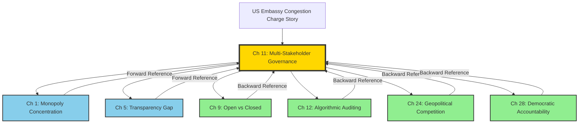
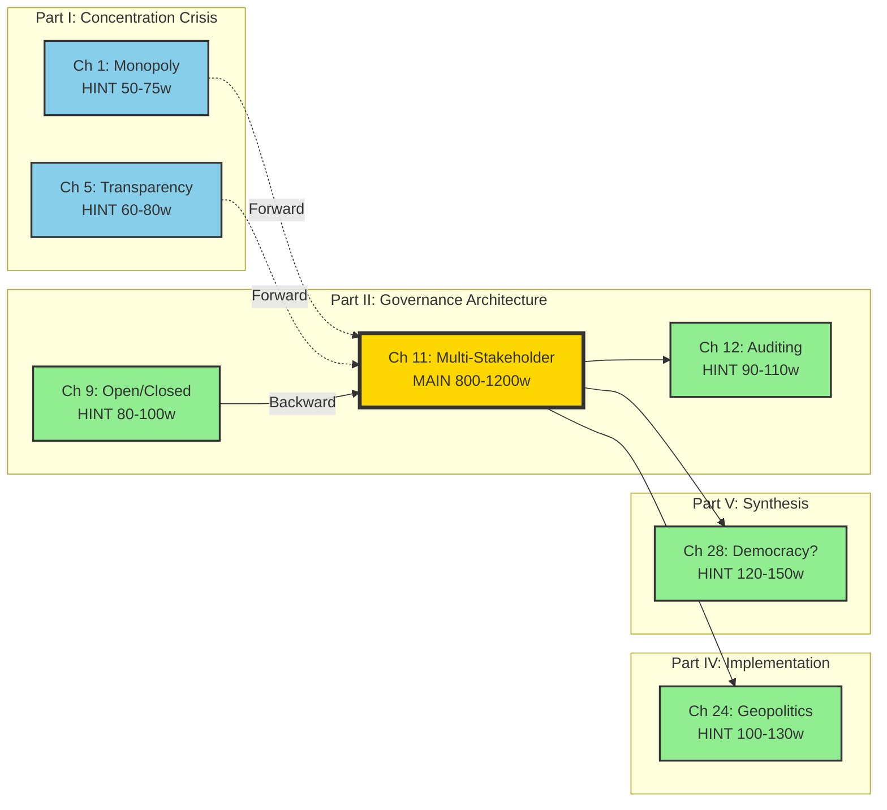

# Strategic Placement Analysis US Embassy Congestion Charge Case Study

# 📘 Strategic Placement Analysis: US Embassy Congestion Charge Case Study

## “Why America Should Not Be Trusted to Lead AI Ethics Efforts”

**Project:** Dishonest AI is Dangerous AI
**Case Study:** US Embassy’s 20-Year Refusal to Pay London Congestion Charge
**Core Thesis:** “You can’t make a bully behave ethically”
**Date:** October 20, 2025

---

## 🎯 EXECUTIVE SUMMARY

**Primary Placement:** Chapter 11 - Multi-Stakeholder Governance Frameworks
**Section:** 11.1 “Why Unilateral Decisions Fail: Executive Orders and Corporate Fiat”
**Story Function:** Opening case study demonstrating institutional accountability failure
**Word Count:** 800-1,200 words (2.5-3 pages)
**Hint Planting Strategy:** 6 strategic reference points across Parts I, II, IV, and V
**Total Coordination Points:** 7 (1 main + 6 hints)
**Implementation Protocol:** Mermaid-tracked with cross-reference matrix

---

## 📍 PRIMARY PLACEMENT: CHAPTER 11

### **Location Details**

**Chapter:** 11 - Multi-Stakeholder Governance Frameworks
**Part:** II - Governance Architecture
**Section:** 11.1 “Why Unilateral Decisions Fail”
**Position:** Opening case study (pages 1-3 of chapter)
**Target Length:** 800-1,200 words

### **Why Chapter 11 is Optimal**

1. **Direct Thematic Alignment:**
    - Chapter examines why unilateral decisions fail
    - Story demonstrates institutional refusal to comply with multi-stakeholder norms
    - Vienna Convention represents international multi-stakeholder framework
    - US unilateral decision to stop paying undermines governance system
2. **Reader Path Coverage:**
    - **CRITICAL for:** Regulators, Academics, Communities, Civil Society/Labor
    - **IMPORTANT for:** Public
    - Chapter 11 has broadest critical reader coverage in Part II
3. **Narrative Function:**
    - Establishes real-world pattern of powerful actors rejecting accountability
    - Creates framework for understanding how AI companies resist governance
    - Makes abstract governance concepts concrete and visceral
4. **Parallel Structure:**
    - Climate book Chapter 11 examines “Parliament-Based Allocation”
- Both chapters about multi-stakeholder deliberation vs unilateral power
    - Story bridges international governance to AI governance
        
        ### **Specific Integration Strategy for Chapter 11**
        
        **Opening Paragraph:**
        
        ```
        Before examining how multi-stakeholder governance frameworks can
        constrain AI monopolies, consider a simpler question: Can powerful
        actors be made to follow rules they find inconvenient? For over 20
        years, the United States Embassy in London has refused to pay the
        city's congestion charge—accumulating over $20 million in unpaid
        fees while every other embassy complies. The US claims diplomatic
        immunity; the UK insists the charge is a service fee, not a tax.
        This deadlock illustrates a fundamental governance problem: when
        powerful actors can cite technical interpretations to avoid
        accountability, multi-stakeholder frameworks mean nothing.
        ```
        
        **Section 11.1 Integration:**
        
- Use as **lead case study** (2.5-3 pages)
- Follow with analysis of pattern:
    - Citation of technical exemptions
    - Refusal to submit to arbitration (ICJ)
    - Accumulated debt as “acceptable cost of noncompliance”
    - Rhetorical commitment to “rules-based order” while violating it
- Bridge to AI governance:
    - Tech companies cite “competitive concerns” like embassies cite “immunity”
    - Refusal to submit to independent audit parallels ICJ refusal
    - “Voluntary commitments” vs enforceable accountability
    - Pattern: powerful actors comply only when convenient
    **Analytical Framework:**
    ```
    The London congestion charge dispute reveals three governance failures
    that recur in AI accountability debates:
1. INTERPRETATION AS EVASION
    - Diplomats: “It’s a tax, we’re exempt”
    - AI Companies: “It’s proprietary, we can’t disclose”
2. REFUSAL TO ADJUDICATE
    - US Embassy: Won’t submit to International Court of Justice
    - Tech firms: Resist independent algorithmic auditing
3. RHETORICAL COMPLIANCE WITHOUT SUBSTANCE
    - US: Supports “rules-based order” while violating local rules
    - AI firms: Embrace “responsible AI” while blocking accountability
    When powerful actors can interpret rules to avoid constraint,
    governance is theater, not substance.
        
        ```
        
        ```
        

---

## 🔗 STRATEGIC HINT PLANTING: 6 COORDINATION POINTS

### **Hint Planting Philosophy**

- **Hints are NOT full retellings** - brief references (1-3 sentences)
- **Forward references** (Chapters 1, 5, 9) tease the full story in Ch 11
- **Backward references** (Chapters 12, 24, 28) recall Ch 11 for reinforcement
- **Each hint serves chapter-specific purpose** - not generic repetition
- **Cross-reference protocol** maintains reader path continuity

---

### **HINT 1: Chapter 1 - AI Monopoly and Market Concentration**

**Location:** Section 1.5 “Consequences for Innovation and Equity”
**Subsection:** “Implications for democratic governance”
**Position:** Final paragraph before transition to Chapter 2
**Word Count:** 2-3 sentences (50-75 words)
**Hint Text:**

```
Concentrated power breeds contempt for accountability. When institutions
can interpret rules to avoid constraint, governance becomes theater.
We will examine this pattern in Chapter 11 through an instructive case:
the US Embassy's 20-year refusal to pay London's congestion charge,
accumulating $20 million in debt while citing diplomatic immunity for
what London insists is a service fee. If diplomats behave this way,
why expect better from tech monopolies?
```

**Function:**

- **Establishes pattern** early: power enables evasion
- **Foreshadows Ch 11** without full story
- **Connects monopoly to accountability failureTracking Tag:** `#hint-ch1-to-ch11-diplomacy`

---

### **HINT 2: Chapter 5 - The AI Transparency Gap**

**Location:** Section 5.3 “Capability Exaggeration and Limitation Suppression”
**Subsection:** “Marketing hype vs actual performance”
**Position:** After discussing AI companies’ cherry-picked benchmarks
**Word Count:** 2-3 sentences (60-80 words)
**Hint Text:**

```
This pattern—citing technical interpretations to avoid uncomfortable
accountability—is not unique to AI. For over 20 years, the US Embassy
in London has refused to pay the city's congestion charge, claiming
diplomatic immunity while accumulating $20 million in debt. Like AI
companies citing "competitive concerns" to avoid transparency, powerful
actors find convenient interpretations when rules become burdensome.
(We examine this diplomatic case study in detail in Chapter 11.)
```

**Function:**

- **Parallel drawn:** “competitive concerns” = “diplomatic immunity”
- **Both are technical evasions** of substantive accountability
- **Links opacity to powerTracking Tag:** `#hint-ch5-to-ch11-diplomacy`

---

### **HINT 3: Chapter 9 - Open vs Closed AI**

**Location:** Section 9.5 “Regulatory Frameworks for Mandated Openness”
**Subsection:** “Enforcement mechanisms and compliance challenges”
**Position:** When discussing corporate resistance to mandates
**Word Count:** 3-4 sentences (80-100 words)
**Hint Text:**

```
Mandates mean nothing without enforcement. Consider the US Embassy's
20-year refusal to pay London's congestion charge despite UK insistence
and accumulated penalties exceeding $20 million. The Vienna Convention
dispute (is it a "tax" or a "service fee"?) mirrors AI companies'
resistance to open-source mandates. Both claim technical exemptions;
both refuse independent arbitration; both accumulate "acceptable costs
of noncompliance." As we examined in Chapter 11's governance framework
analysis, powerful actors comply with rules only when constraint is
unavoidable—not when voluntary.
```

**Function:**

- **Enforcement focus**: rules without teeth are suggestions
- **Backward reference** to Ch 11 for readers on regulator path
- **Connects to open/closed governance debateTracking Tag:** `#hint-ch9-to-ch11-diplomacy`

---

### **HINT 4: Chapter 12 - Algorithmic Auditing and Accountability**

**Location:** Section 12.5 “Enforcement Mechanisms and Penalties”
**Subsection:** “When powerful actors resist accountability”
**Position:** After discussing weak enforcement of existing AI regulations
**Word Count:** 3-4 sentences (90-110 words)
**Hint Text:**

```
Without enforcement, accountability is rhetoric. The US Embassy's
20-year congestion charge dispute (Chapter 11) demonstrates this
precisely: London cannot impound diplomatic vehicles, the US won't
submit to ICJ arbitration, and $20 million in penalties accumulates
without consequence. Similarly, AI companies cite "proprietary
concerns" to refuse audits, and regulators lack tools to compel
compliance. Both cases reveal that powerful actors need not violate
rules overtly—they simply cite technical interpretations, refuse
adjudication, and absorb penalties as "cost of doing business."
Algorithmic auditing requires enforcement mechanisms that make
noncompliance costlier than compliance.
```

**Function:**

- **Reinforces Ch 11 argument** on enforcement
- **Explicit parallel:** diplomatic immunity = proprietary secrecy
- **Actionable lesson** for audit framework design
**Tracking Tag:** `#hint-ch12-to-ch11-diplomacy`

---

### **HINT 5: Chapter 24 - AI Policy in the Age of Geopolitical Competition**

**Location:** Section 24.2 “How Internal Equity Strengthens Competitiveness”
**Subsection:** “Credibility and leadership require accountability”
**Position:** When arguing US AI leadership requires domestic accountability
**Word Count:** 3-5 sentences (100-130 words)
**Hint Text:**

```
US credibility on AI governance is undermined by domestic accountability
failures—and by behavior like the Embassy's 20-year refusal to pay
London's congestion charge (Chapter 11). When America lectures China
on "rules-based order" while accumulating $20 million in unpaid fees
for a municipal toll, citing diplomatic immunity technicalities, why
should any nation accept US AI governance leadership? The UK government
has repeatedly stated there are no legal grounds for exemption; the US
Embassy persists in noncompliance. This pattern—rhetorical commitment
to accountability paired with practical evasion—mirrors tech companies'
"voluntary AI safety commitments." Leadership requires substance, not
theater. If America cannot be trusted to pay for driving in London,
why trust it to lead AI ethics?
```

**Function:**

- **CRITICAL for geopolitical chapter**: credibility argument
- **Ties domestic to international** governance failures
- **Answers book subtitle directly**: “Why America Should Not Be Trusted”
**Tracking Tag:** `#hint-ch24-to-ch11-diplomacy`

---

### **HINT 6: Chapter 28 - Can Democratic Societies Build Accountable AI?**

**Location:** Section 28.3 “Institutional Capacity and the Democracy Question”
**Subsection:** “Do democratic institutions have will to constrain power?”
**Position:** Final synthesis section on democratic accountability
**Word Count:** 4-5 sentences (120-150 words)
**Hint Text:**

```
Democratic accountability requires institutional will to constrain
power—including self-constraint. The United States asks the world to
trust its AI governance leadership while its Embassy refuses to pay
London's congestion charge after 20 years, citing diplomatic immunity
for a municipal fee (Chapter 11). This is not an isolated lapse but a
pattern: rhetorical commitment to "rules-based order" paired with
convenient interpretation when rules become burdensome. If the US
government cannot compel its own diplomats to follow London traffic
rules, how will it constrain OpenAI, Google, and Anthropic? The
congestion charge dispute is trivial in scale but instructive in
pattern: powerful actors comply only when enforcement is unavoidable.
Building accountable AI requires democracies to demonstrate they can
govern themselves before claiming authority to govern technology.
```

**Function:**

- **Final synthesis**: ties diplomatic failure to AI governance
- **Answers title question**: Can democracies build accountable AI?
- **Sobering conclusion**: not without self-governance first
**Tracking Tag:** `#hint-ch28-to-ch11-diplomacy`

---

## 📊 CROSS-REFERENCE TRACKING MATRIX

### **Chapter Coordination Map**

| Chapter | Part | Section | Hint Type | Word Count | Primary Function |
| --- | --- | --- | --- | --- | --- |
| **1** | I | 1.5 | Forward | 50-75 | Pattern establishment |
| **5** | I | 5.3 | Forward | 60-80 | Opacity parallel |
| **9** | II | 9.5 | Backward | 80-100 | Enforcement lesson |
| **11** | II | 11.1 | **MAIN** | **800-1200** | **Full case study** |
| **12** | II | 12.5 | Backward | 90-110 | Audit enforcement |
| **24** | IV | 24.2 | Backward | 100-130 | Geopolitical credibility |
| **28** | V | 28.3 | Backward | 120-150 | Democratic capacity |
| **Total Word Count:** 1,400-1,745 words across all hints + main story |  |  |  |  |  |
| **Primary Allocation:** ~800-1,200 words (main), ~600-545 words (hints) |  |  |  |  |  |
| **Coordination Density:** 7 touchpoints across 28 chapters (25% coverage) |  |  |  |  |  |

---

## 🔄 READER PATH COORDINATION

### **How Different Reader Types Encounter the Story**

**POLICY MAKER PATH (150-200 pages):**

- **Ch 1 hint** → **Ch 11 full story** → **Ch 12 hint** → **Ch 24 hint**
- **Encounters:** 4 times (establishment, deep dive, enforcement, geopolitics)
- **Purpose:** Pattern recognition across governance domains
**ENGINEER PATH (200-250 pages):**
- **Ch 5 hint** → **Ch 9 hint** → **Ch 11 SKIP** (not technical)
- **Encounters:** 2 times (opacity parallel, enforcement)
- **Purpose:** Understand corporate resistance patterns without full governance detail
**ACADEMIC PATH (300-400 pages):**
- **Ch 1 hint** → **Ch 5 hint** → **Ch 9 hint** → **Ch 11 full story** → **Ch 12 hint** → **Ch 24 hint** → **Ch 28 hint**
- **Encounters:** 7 times (ALL touchpoints)
- **Purpose:** Complete analytical framework across all dimensions
**PUBLIC/COMMUNITY PATH (100-150 pages):**
- **Ch 5 hint** → **Ch 11 full story** → **Ch 28 hint**
- **Encounters:** 3 times (transparency, governance, synthesis)
- **Purpose:** Concrete example of power evading accountability
**ORGANIZER PATH (120-180 pages):**
- **Ch 11 full story** → **Ch 12 hint** → **Ch 24 hint** → **Ch 28 hint**
- **Encounters:** 4 times (governance, enforcement, geopolitics, synthesis)
- **Purpose:** Pattern for challenging corporate power

---

## 📈 MERMAID TRACKING DIAGRAM



**Legend:**

- 🟡 **Gold** = Primary placement (Ch 11)
- 🔵 **Blue** = Forward references (tease the story)
- 🟢 **Green** = Backward references (recall the story)

---

## 🗺️ COORDINATION NETWORK VISUALIZATION



---

## 🔍 THEMATIC RESONANCE MAP

```mermaid
mindmap
 root((US Embassy<br/>Congestion<br/>Charge Story))
 Core Themes
 Power Evades Accountability
 Ch 1: Monopoly Power
 Ch 9: Corporate Resistance
 Ch 11: Governance Failure
 Technical Evasion
 Ch 5: Opacity as Shield
 Ch 12: Audit Resistance
 International Credibility
 Ch 24: Geopolitical Trust
 Ch 28: Democratic Capacity
 Key Parallels
 Diplomatic Immunity ↔ Proprietary Secrecy
 Vienna Convention ↔ AI Governance Frameworks
 ICJ Refusal ↔ Audit Refusal
 $20M Debt ↔ Cost of Noncompliance
 Reader Takeaways
 Regulators
 Enforcement ≠ Rules
 Need Unavoidable Consequences
 Public
 Power Requires Examples
 Patterns Matter
 Academics
 Institutional Failures
 Governance Theory
```

---

## ⚙️ IMPLEMENTATION PROTOCOL

### **Phase 1: Asana Task Creation**

Create 7 new tasks in Asana project “📘 Dishonest AI is Dangerous AI”:

1. **Main Story Task:**
    - **Title:** “Ch 11 MAIN: US Embassy Congestion Charge Case Study”
    - **Section:** Guideline-Reference-Outline
    - **Assignee:** [Primary author for Chapter 11]
    - **Custom Fields:**
    - Story Type: PRIMARY PLACEMENT
    - Word Count Target: 800-1,200
    - Coordination Level: HIGH
    - **Tags:** `#coordination-high` `#ch11-governance` `#us-embassy-story`
2. **Hint Tasks (6 total):**
    - **Title Format:** “Ch [X] HINT: US Embassy Reference - [Chapter Name]”
    - **Section:** Guideline-Reference-Outline
    - **Assignee:** [Author for respective chapter]
    - **Custom Fields:**
    - Story Type: COORDINATED HINT
    - Word Count Target: [Per matrix above]
    - Coordination Level: HIGH
    - **Dependencies:** Set each hint task to depend on Ch 11 main task
    - **Tags:** `#coordination-high` `#hint-to-ch11` `#us-embassy-story`
        
        ### **Phase 2: Chapter Task Updates**
        
        For each of the 7 affected chapters (1, 5, 9, 11, 12, 24, 28):
        
3. **Add to Chapter Notes:**
    
    ```markdown
    
    ```
    

---

**🔴 COORDINATION REQUIRED: US Embassy Story IntegrationStory:** US Embassy’s 20-year refusal to pay London congestion charge
**Integration Point:** [Section X.X]
**Type:** [MAIN | FORWARD HINT | BACKWARD HINT]
**Target:** [Word count]
**Dependencies:** See task “Ch [X] HINT/MAIN: US Embassy…”
**Key Parallel:**

- [Specific connection to chapter themes]
**Required Cross-References:**
- [List other chapters that reference this story]

---

```
2. **Update Custom Fields:**
 - Coordination Level: HIGH
 - Add tag: `#us-embassy-coordination`
### **Phase 3: Cross-Reference Tracking**
Create **master coordination task**:
- **Title:** "🔗 MASTER COORDINATION: US Embassy Story Cross-References"
- **Description:** Links to all 7 story integration tasks
- **Checklist:**
```

â–¡ Ch 1 hint drafted and placed
â–¡ Ch 5 hint drafted and placed
â–¡ Ch 9 hint drafted and placed
â–¡ Ch 11 MAIN story written and finalized
â–¡ Ch 12 hint drafted and placed
â–¡ Ch 24 hint drafted and placed
â–¡ Ch 28 hint drafted and placed
â–¡ All cross-references verified
â–¡ Reader path continuity checked
â–¡ Word count targets met
â–¡ No contradictions between versions

```

### **Phase 4: Mermaid Diagram Integration**

1. **Add diagram to project documentation:**
    - Create file: `/Coordination_Maps/US_Embassy_Story_Network.md`
    - Include all 3 Mermaid diagrams above
    - Link from main project README
2. **Update Dynamic Visualizations:**
    - Add story coordination to existing Mermaid chapter dependency network
    - Color-code US Embassy story nodes distinctly
        
        ### **Phase 5: Quality Assurance**
        
        **Pre-Writing Checklist:**
        
- [ ]  All 7 task assignments confirmed
- [ ]  Ch 11 author has full research document
- [ ]  Other authors have hint specifications
- [ ]  Cross-reference protocol shared
**During Writing:**
- [ ]  Ch 11 main story completed first
- [ ]  Hint authors use consistent terminology
- [ ]  Forward hints don’t over-reveal
- [ ]  Backward hints properly cite Ch 11
**Post-Writing:**
- [ ]  All 7 pieces written
- [ ]  No contradictions in details
- [ ]  Word counts within targets
- [ ]  Cross-references accurate
- [ ]  Reader path tested

---

## 📋 DETAILED WRITING SPECIFICATIONS

### **Main Story (Ch 11) - Detailed Outline**

**Section 11.1 Integration: 800-1,200 wordsStructure:**

1. **Opening Hook** (75-100 words)
    - Scene: US Embassy vehicle drives through congestion zone
    - Camera catches plate, penalty notice issued, never paid
    - Scale: $20M accumulated over 20 years
2. **Background** (150-200 words)
    - London congestion charge introduced 2003
    - Purpose: reduce traffic, fund transit
    - Most embassies pay; US initially paid
    - July 2005: US abruptly stops paying
    - Justification: Vienna Convention diplomatic immunity
3. **The Dispute** (200-250 words)
    - UK position: It’s a service fee (toll), not a tax
    - US position: It’s a tax, we’re exempt under Vienna Convention
    - Legal ambiguity: Convention text doesn’t clearly resolve
    - UK offers ICJ arbitration; US refuses
    - Penalties accumulate; UK cannot enforce (diplomatic immunity)
4. **Pattern Analysis** (250-300 words)
    - **Interpretation as Evasion:** Technical reading to avoid accountability
    - **Refusal to Adjudicate:** Won’t submit to neutral arbiter
    - **Rhetorical Commitment Without Substance:** US supports “rules-based order”
    - **Cost-Benefit Calculation:** $20M is acceptable cost of noncompliance
    - **Power Enables Impunity:** Only UK lacks enforcement, US invokes immunity
5. **Transition to AI Governance** (150-200 words)
    - Same pattern in tech companies:
    - Cite “proprietary concerns” like embassies cite “immunity”
    - Refuse independent audit like refusing ICJ
    - “Voluntary commitments” vs enforceable rules
    - Calculate: Cost of noncompliance < Cost of compliance
    - Multi-stakeholder governance requires enforcement
    - Without it, powerful actors simply invoke exemptions
    - Chapter 11’s framework must account for this pattern
6. **Concluding Insight** (75-100 words)
    - Governance is not about rules but about constraint
    - Powerful actors find interpretations to evade
    - AI governance must learn from diplomatic failures
    - Accountability requires unavoidable consequences
    **Key Sources to Cite:**
- Transport for London official statements
- UK Parliamentary Hansard records
- US Embassy public statements
- Vienna Convention Article 34
- UK Foreign Office letters
**Tone:**
- Analytical, not moralistic
- Pattern-focused, not accusatory
- Uses specific details (dates, amounts, quotes)
- Transitions cleanly to AI parallels

---

### **Hint Writing Specifications**

**For All Hints:**

1. **Brevity:** 50-150 words maximum
2. **Purpose:** Each hint serves chapter-specific argument
3. **Consistency:** Use same core facts (20 years, $20M, diplomatic immunity)
4. **Variation:** Tailor parallel to chapter theme
5. **Cross-Reference:** Note “(Chapter 11)” for forward hints, “(as discussed in Chapter 11)” for backward
**Prohibited in Hints:**
- Don’t re-explain full story
- Don’t introduce new facts beyond Ch 11
- Don’t moralize differently than Ch 11
- Don’t break reader path continuity

---

## 🎯 SUCCESS METRICS

### **Quantitative Targets**

- [ ]  7 integration points completed
- [ ]  1,400-1,745 total words across all placements
- [ ]  100% cross-references accurate
- [ ]  0 contradictions between versions
- [ ]  7/7 reader paths maintain continuity
    
    ### **Qualitative Goals**
    
- [ ]  Pattern clarity: Readers recognize evasion pattern
- [ ]  Parallel power: AI-diplomacy connection evident
- [ ]  Credibility impact: “Why America” thesis reinforced
- [ ]  Synthesis strength: Ch 28 callback resonates
    
    ### **Reader Path Validation**
    
    Test each reader path for:
    
- [ ]  **Policy Maker:** Sees enforcement lesson across governance domains
- [ ]  **Engineer:** Understands corporate resistance without full political detail
- [ ]  **Academic:** Gets complete analytical framework
- [ ]  **Public:** Remembers concrete power-evasion example
- [ ]  **Organizer:** Learns pattern for challenging corporate immunity claims

---

## 🚀 NEXT STEPS

### **Immediate Actions**

1. **Create Asana tasks** (7 total: 1 main + 6 hints)
2. **Assign chapter authors** to respective tasks
3. **Share full research document** with Ch 11 author
4. **Share hint specifications** with other authors
5. **Set dependencies** (all hints depend on Ch 11 main)
    
    ### **Writing Sequence**
    
6. **Week 1:** Ch 11 main story (800-1,200 words)
7. **Week 2:** Forward hints (Ch 1, 5) + Backward hints (Ch 9, 12)
8. **Week 3:** Geopolitical/synthesis hints (Ch 24, 28)
9. **Week 4:** Quality assurance and cross-reference verification
    
    ### **Integration Timeline**
    
- **Month 1:** All 7 pieces drafted
- **Month 2:** Cross-reference accuracy check
- **Month 3:** Reader path testing
- **Month 4:** Final consistency review before Part II completion

---

## 📚 APPENDIX: RESEARCH SUMMARY FOR AUTHORS

### **Core Facts for Consistency**

**Timeline:**

- **2003:** Congestion charge introduced
- **2003-2005:** US Embassy initially pays
- **July 11, 2005:** US formally notifies UK it will stop paying
- **2010:** £3.8M accumulated (35,602 unpaid days)
- **2024:** £14.6M accumulated (~$18.6M)
- **2025:** ~£16M accumulated (~$20M+)
**Financial:**
- **Current charge:** £15/day (~$19)
- **Total US debt:** $20M+ (largest of any embassy)
- **Percentage of total embassy debt:** ~25%
**Legal Positions:**
- **UK:** Service fee (toll), not a tax; no Vienna Convention exemption
- **US:** Tax under international law; diplomatic immunity applies
- **Arbitration:** UK willing to go to ICJ; US declines
**Key Quotes:**
- UK Foreign Secretary William Hague (2010): “No legal grounds to exempt diplomats”
- US Embassy: “The congestion charge is a tax from which diplomatic missions are exempt”
- Mayor Ken Livingstone: Called US ambassador a “chiselling little crook”
- TfL: “Pushing for the matter to be taken up at the International Court of Justice”
**Enforcement Constraints:**
- UK cannot impound diplomatic vehicles (Vienna Convention)
- Penalties accumulate but cannot be collected
- No mechanism to compel payment or arbitration

---

## 📖 CITATION PROTOCOL

### **For Chapter 11 Main Story:**

Use footnotes with full citations:

1. Transport for London official releases
2. UK Parliamentary Hansard records
3. US Embassy statements
4. News reports (CNN, Guardian, E&E)
5. Vienna Convention Article 34 text
    
    ### **For Hints:**
    
    Brief parenthetical citations:
    
- “(the US Embassy’s 20-year congestion charge dispute, discussed in Chapter 11)”
- “(see Chapter 11’s examination of diplomatic accountability failures)”

---

## ✅ FINAL COORDINATION CHECKLIST

**Before Beginning Writing:**

- [ ]  All 7 Asana tasks created
- [ ]  Authors assigned and notified
- [ ]  Research document shared
- [ ]  Timeline agreed upon
- [ ]  Cross-reference protocol understood
**During Writing:**
- [ ]  Ch 11 completed first
- [ ]  Hints reference Ch 11 consistently
- [ ]  Word counts tracked
- [ ]  No contradictions introduced
**After Writing:**
- [ ]  All 7 pieces complete
- [ ]  Cross-references verified
- [ ]  Reader paths tested
- [ ]  Mermaid diagrams updated
- [ ]  Quality assurance passed

---

**END OF STRATEGIC PLACEMENT DOCUMENT***This document should be saved in `/Coordination_Maps/` and linked from:*

- *Main project README*
- *Chapter 11 task notes*
- *All 6 hint task notes*
- *Dynamic Visualizations documentation*