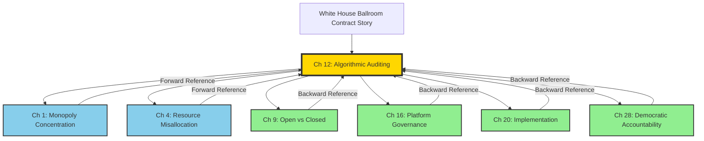
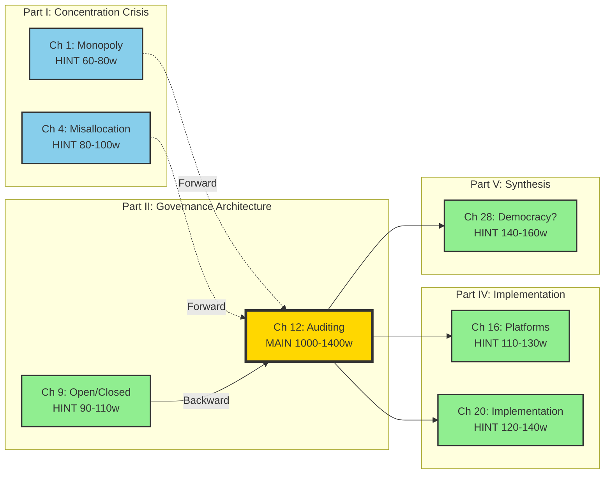

# Strategic Placement Analysis White House Ballroom Contract Case Study

# 📘 Strategic Placement Analysis: White House Ballroom Contract Case Study

## “When the Arbiter Grades His Own Work: Government Contracting Without Competition”

**Project:** Dishonest AI is Dangerous AI
**Case Study:** White House Ballroom $200M No-Bid Contract
**Core Thesis:** “By any best-value standard, a selector who publicly assigns top rankings to his own properties warrants heightened scrutiny for bias”
**Date:** October 21, 2025

---

## 🎯 EXECUTIVE SUMMARY

**Primary Placement:** Chapter 12 - Algorithmic Auditing and Accountability
**Section:** 12.3 “Who Audits the Auditors? The Self-Certification Problem”
**Story Function:** Opening case study demonstrating procurement bias and self-dealing
**Word Count:** 1,000-1,400 words (3-4 pages)
**Hint Planting Strategy:** 6 strategic reference points across Parts I, II, IV, and V
**Total Coordination Points:** 7 (1 main + 6 hints)
**Implementation Protocol:** Mermaid-tracked with cross-reference matrix
**Central Book Argument:*By any best-value standard, a selector who publicly assigns top rankings to his own properties warrants heightened scrutiny for bias.***

---

## 📋 PRIMARY PLACEMENT: CHAPTER 12

### **Location Details**

**Chapter:** 12 - Algorithmic Auditing and Accountability
**Part:** II - Governance Architecture
**Section:** 12.3 “Who Audits the Auditors? The Self-Certification Problem”
**Position:** Opening case study (pages 1-4 of section)
**Target Length:** 1,000-1,400 words

### **Why Chapter 12 is Optimal**

1. **Direct Thematic Alignment:**
    - Chapter examines accountability mechanisms and audit failures
    - Story demonstrates self-dealing in evaluation processes
    - Shows how concentrated discretion enables bias
    - Perfect parallel: self-auditing AI systems ↔ self-awarding contracts
2. **Reader Path Coverage:**
    - **CRITICAL for:** Policy Makers, Academics, Regulators
    - **IMPORTANT for:** Engineers, Public, Organizers
    - Chapter 12 has strong coverage across technical and policy readers
3. **Narrative Function:**
    - Establishes pattern: power evaluating itself
    - Creates framework for understanding AI self-certification failures
    - Makes abstract “auditing” concepts concrete through government contracting
    - Shows real-world consequences of unchecked discretion
4. **Parallel Structure:**
    - Climate book Chapter 12 examines “Performance Accountability”
    - Both chapters about evaluation integrity
    - Story bridges government procurement to AI governance
        
        ### **The Trump Golf Course Context**
        
        **Critical Background (from *Commander in Cheat*):**
        
- Trump ranked world’s best golf courses
- Positions 1-8: All Trump-owned courses
- Public self-promotion while holding decision-making power
- Establishes pattern of self-preference in rankings/selections
    
    ### **The White House Ballroom Contract**
    
    **Facts:**
    
- $200-250 million project
- No competitive bidding process
- Trump directly selected: McCrery Architects, Clark Construction, AECOM
- “President Trump has chosen…” (official announcement)
- Private donor funding with zero transparency
- Started demolition October 2025
- Professional organizations (AIA, SAH) formally objected
**The Parallel:**
- Golf courses: “My properties are #1-8”
- Ballroom contract: “I choose this firm”
- Same pattern: arbiter awarding himself/allies without competition
    
    ### **Specific Integration Strategy for Chapter 12**
    
    **Opening Framework:**
    
    ```
    Before examining how AI companies self-certify their algorithmic audits,
    consider a simpler question: Can someone who ranks his own properties
    as the world's eight best be trusted to select contractors fairly?
    In Rick Reilly's *Commander in Cheat: How Golf Explains Trump*, the
    author documents Donald Trump's ranking of the world's best golf courses:
    positions 1 through 8 went to Trump-owned courses. When that same person,
    as President, directly selected the architectural, construction, and
    engineering firms for the White House's $200 million ballroom project—
    bypassing competitive bidding—professional organizations cried foul.
    The American Institute of Architects and Society of Architectural
    Historians both issued formal statements demanding transparency and
    questioning the "pre-selection" of McCrery Architects without a
    qualifications-based competition. Their concern wasn't just procedural:
    by any best-value standard, a selector who publicly assigns top rankings
    to his own properties warrants heightened scrutiny for bias. Yet the
    project proceeded, demolition began in October 2025, and donor identities
    remain undisclosed.
    This pattern—concentrated discretion meeting self-preference—is precisely
    what algorithmic auditing confronts. When AI companies self-certify their
    systems, when they choose their own auditors, when they evaluate their
    own performance, we face the same reasonable-observer test for fairness.
    If the referee gives himself every trophy, how meaningful is the win?
    ```
    
    **Function:**
    
- **Establishes** golf course ranking as pattern of bias
- **Connects** to ballroom contract selection
- **Introduces** “reasonable-observer test for fairness”
- **Links** to AI self-certification problem
- **Sets up** detailed examination
**Tracking Tag:** `#main-ch12-ballroom-contract`

---

## 🔗 HINT PLACEMENTS: 6 STRATEGIC TOUCHPOINTS

### **HINT 1: Chapter 1 - AI Monopoly and Market Concentration**

**Location:** Section 1.4 “The Myth of Meritocracy in AI Markets”
**Subsection:** “Selection Bias and Network Effects”
**Position:** Discussion of how incumbents entrench position
**Word Count:** 2-3 sentences (60-80 words)
**Hint Text:**

```
Should we be concerned if the man who tapped McCrery Architects for the
White House's $200 million ballroom—no bid, no competition—is the same
one who, when asked to rank the world's best golf courses, populated
positions 1-8 with his own properties? When arbiter and beneficiary merge,
selection processes fail the reasonable-observer test for fairness
(Chapter 12 examines this pattern in government contracting and AI auditing).
```

**Function:**

- **Forward tease**: introduces golf course + ballroom connection
- **Monopoly framing**: selection bias, incumbent advantage
- **Question format**: engages reader skepticism
**Tracking Tag:** `#hint-ch1-to-ch12-ballroom`

---

### **HINT 2: Chapter 4 - AI Resource Misallocation**

**Location:** Section 4.3 “Procurement Failures and Capture”
**Subsection:** “Government AI Contracts Without Competition”
**Position:** Discussion of federal AI procurement
**Word Count:** 3-4 sentences (80-100 words)
**Hint Text:**

```
Should we trust a procurement process run by a man who ranked his own
golf clubs 1 through 8 among world's best? When President Trump directly
selected firms for the White House's $200 million ballroom—bypassing
competitive bidding—the American Institute of Architects formally
questioned the "pre-selection." No bid, concentrated discretion, prior
self-ranking: this fails the reasonable-observer test for fairness
(Chapter 12). Similar patterns pervade government AI procurement, where
agencies award contracts to preferred vendors without meaningful competition.
```

**Function:**

- **Forward tease**: procurement theme
- **Direct question**: trust in process
- **Links** government contracting to AI procurement
**Tracking Tag:** `#hint-ch4-to-ch12-ballroom`

---

### **HINT 3: Chapter 9 - Open vs. Closed AI Systems**

**Location:** Section 9.4 “The Transparency-Accountability Trade-off”
**Subsection:** “When Opacity Enables Self-Dealing”
**Position:** Discussion of closed evaluation processes
**Word Count:** 3-4 sentences (90-110 words)
**Hint Text:**

```
If the selector of McCrery Architects for the White House ballroom also
crowns his own golf courses eight times over, what does that say about
the selection process? The $200 million contract proceeded with zero
transparency: no competitive bidding, no disclosed evaluation criteria,
no public donor list (Chapter 12's examination of the reasonable-observer
test for fairness). Opacity enabled concentrated discretion; concentrated
discretion enabled self-preference. Closed AI systems exhibit identical
patterns: companies evaluate themselves, choose their auditors, certify
their safety—all behind proprietary walls that prevent scrutiny.
```

**Function:**

- **Backward reference**: recalls Chapter 12 framework
- **Opacity theme**: links transparency failure to self-dealing
- **AI parallel**: closed systems enable same problems
**Tracking Tag:** `#hint-ch9-to-ch12-ballroom`

---

### **HINT 4: Chapter 16 - Platform Governance and Content Moderation**

**Location:** Section 16.3 “Self-Regulation and Industry Capture”
**Subsection:** “When Platforms Grade Their Own Homework”
**Position:** Discussion of tech industry self-policing
**Word Count:** 4-5 sentences (110-130 words)
**Hint Text:**

```
When the referee gives himself every trophy, how meaningful is the win?
Rick Reilly documented Donald Trump ranking his own golf courses as the
world's eight best; as President, Trump then directly selected contractors
for the White House's $200 million ballroom without competition. The
American Institute of Architects objected, but demolition proceeded anyway.
By any best-value standard, a selector who publicly assigns top rankings
to his own properties warrants heightened scrutiny for bias (Chapter 12).
Platform companies exhibit parallel behavior: Facebook's Oversight Board
funded by Facebook, Google's AI ethics principles written by Google,
TikTok's safety certifications issued by TikTok. Self-regulation without
external accountability reproduces the ballroom contract's core failure.
```

**Function:**

- **Backward reference**: recalls Chapter 12 analysis
- **Trophy metaphor**: vivid framing of self-awarding
- **Platform parallel**: tech self-regulation failures
- **Central argument**: selector bias warrants scrutiny
**Tracking Tag:** `#hint-ch16-to-ch12-ballroom`

---

### **HINT 5: Chapter 20 - Implementation Frameworks**

**Location:** Section 20.2 “Procurement Standards for AI Systems”
**Subsection:** “Competitive Bidding Requirements”
**Position:** Prescriptive section on government AI purchasing
**Word Count:** 4-5 sentences (120-140 words)
**Hint Text:**

```
If the arbiter's taste runs from "me" to "still me," how impartial was
the shortlist? Government AI procurement must avoid the White House
ballroom contract pattern: no competitive bidding, concentrated
discretion, donor opacity, professional objections ignored (Chapter 12).
When someone who ranks his own golf courses 1-8 directly selects
contractors for $200 million projects, reasonable observers question bias.
The solution requires structural safeguards: mandatory competitive bidding
above threshold amounts, independent evaluation panels, public criteria,
disclosed scoring. By any best-value standard, a selector who publicly
assigns top rankings to his own properties warrants heightened scrutiny
for bias—and government AI contracts deserve at least the same rigor as
construction contracts.
```

**Function:**

- **Backward reference**: recalls Chapter 12
- **Solutions framing**: prescriptive recommendations
- **Procurement standards**: concrete requirements
- **Central argument**: explicit statement
**Tracking Tag:** `#hint-ch20-to-ch12-ballroom`

---

### **HINT 6: Chapter 28 - Can Democratic Societies Build Accountable AI?**

**Location:** Section 28.3 “Institutional Integrity and Democratic Capacity”
**Subsection:** “The Self-Dealing Test”
**Position:** Final synthesis on democratic governance
**Word Count:** 5-6 sentences (140-160 words)
**Hint Text:**

```
Democratic accountability requires that those who evaluate also submit
to evaluation. Consider the White House ballroom: a man who ranked his
own golf courses as the world's eight best then directly selected
contractors for a $200 million government project. No bid, concentrated
discretion, prior self-ranking—this fails the reasonable-observer test
for fairness (Chapter 12). Professional organizations objected; demolition
proceeded. By any best-value standard, a selector who publicly assigns
top rankings to his own properties warrants heightened scrutiny for bias.
Can democracies build accountable AI when similar patterns pervade tech
governance? AI companies self-certify safety, choose their auditors, write
their own ethics principles, fund their oversight boards. When the arbiter
grades his own work—whether in construction contracts or algorithmic
audits—external accountability becomes essential. Democratic AI governance
requires what the ballroom contract lacked: competition, transparency,
independent evaluation, and consequences for self-dealing.
```

**Function:**

- **Final synthesis**: ties contracting failure to democracy crisis
- **Answers title question**: requires external accountability
- **Solutions framing**: what democratic governance needs
- **Central argument**: multiple restatements for emphasis
**Tracking Tag:** `#hint-ch28-to-ch12-ballroom`

---

## 📊 DETAILED CASE STUDY ANATOMY

### **Three-Layer Structure**

**Layer 1: The Golf Course Rankings**

- Source: Rick Reilly, *Commander in Cheat: How Golf Explains Trump*
- Pattern established: Self-ranks properties 1-8 globally
- Demonstrates: Willingness to place self-interest above objectivity
- Evidence: Public, documented, undisputed self-promotion
**Layer 2: The Ballroom Contract**
- Project: $200-250 million White House expansion
- Selection: Direct presidential choice, no competition
- Firms: McCrery Architects, Clark Construction, AECOM
- Process: “President Trump has chosen…”
- Funding: Private donors, zero disclosure
- Objections: AIA, SAH formal statements
- Status: Demolition began October 2025
**Layer 3: The Parallel to AI**
- Self-certification: Companies audit themselves
- Auditor selection: Companies choose evaluators
- Ethics principles: Companies write own rules
- Oversight boards: Company-funded, company-controlled
- Pattern: Arbiter evaluating self
    
    ### **The Five Hints Formula**
    
    Each hint uses one of these framings:
    
1. **“Should we be concerned if…”** (Ch 1)
    - Question format engages skepticism
    - Links golf + ballroom directly
2. **“Should we trust a process run by…”** (Ch 4)
    - Trust/credibility framing
    - Procurement focus
3. **“If the selector also crowns himself…”** (Ch 9)
    - Conditional logic highlights absurdity
    - Selection bias focus
4. **“When the referee gives himself every trophy…”** (Ch 16)
    - Vivid metaphor, memorable
    - Self-dealing focus
5. **“If the arbiter’s taste runs from ‘me’ to ‘still me’…”** (Ch 20)
    - Satirical, pointed
    - Impartiality focus
6. **“When the arbiter grades his own work…”** (Ch 28)
    - Synthesis, broader application
    - Accountability focus
        
        ### **Key Statistics and Facts**
        
        **Ballroom Project:**
        
- Cost: $200-250 million (reports vary)
- Size: 90,000 square feet
- Capacity: 650-900 seats (changed mid-project)
- Timeline: September 2025 start, completion before January 2029
- Funding: Trump + “patriot donors” (undisclosed)
- Firms: McCrery Architects (DC), Clark Construction (MD), AECOM (TX)
- Process: Direct selection, no RFP, no competitive bidding
**Golf Course Rankings:**
- Source: *Commander in Cheat* by Rick Reilly
- Trump’s top 8 courses: All Trump-owned
- Public self-promotion while decision-maker
- Established pattern before ballroom contract
**Professional Objections:**
- American Institute of Architects (August 5, 2025)
- Society of Architectural Historians (September 16, 2025)
- Concerns: No qualifications-based selection, no transparency, no preservation review
- AIA called for: QBS process, historic preservation review, public accountability

---

## 🗺️ READER PATH COORDINATION

### **How Different Reader Types Encounter the Story**

**POLICY MAKER PATH (150-200 pages):**

- **Ch 4 hint** → **Ch 12 full examination** → **Ch 20 hint** → **Ch 28 hint**
- **Encounters:** 4 times (procurement, deep dive, standards, synthesis)
- **Purpose:** Understand procurement bias and develop safeguards
**ENGINEER/TECHNICAL PATH (200-250 pages):**
- **Ch 9 hint** → **Ch 12 full examination**
- **Encounters:** 2 times (opacity, auditing)
- **Purpose:** Understand self-certification failures
**ACADEMIC PATH (300-400 pages):**
- **Ch 1 hint** → **Ch 4 hint** → **Ch 9 hint** → **Ch 12 full examination** → **Ch 16 hint** → **Ch 20 hint** → **Ch 28 hint**
- **Encounters:** 7 times (ALL touchpoints)
- **Purpose:** Complete framework on evaluation bias and accountability
**PUBLIC/COMMUNITY PATH (100-150 pages):**
- **Ch 1 hint** → **Ch 12 full examination** → **Ch 28 hint**
- **Encounters:** 3 times (introduction, deep dive, synthesis)
- **Purpose:** Concrete example of government self-dealing
**ORGANIZER PATH (120-180 pages):**
- **Ch 12 full examination** → **Ch 16 hint** → **Ch 20 hint** → **Ch 28 hint**
- **Encounters:** 4 times (deep dive, platforms, implementation, synthesis)
- **Purpose:** Pattern for challenging self-regulation claims
**STUDENT PATH (80-120 pages):**
- **Ch 1 hint** → **Ch 12 full examination** → **Ch 16 hint**
- **Encounters:** 3 times (introduction, deep dive, platform parallel)
- **Purpose:** Introduction to conflict of interest concepts

---

## 📈 MERMAID TRACKING DIAGRAM



**Legend:**

- 🟡 **Gold** = Primary placement (Ch 12)
- 🔵 **Blue** = Forward references (tease story)
- 🟢 **Green** = Backward references (recall story)

---

## 🗺️ COORDINATION NETWORK VISUALIZATION



---

## 🔍 THEMATIC RESONANCE MAP

```mermaid
mindmap
 root((Ballroom<br/>Contract<br/>Case))
 Core Themes
 Self-Dealing
 Ch 12: Auditor Selection
 Ch 16: Platform Self-Regulation
 Ch 20: Procurement Standards
 Concentrated Discretion
 Ch 1: Monopoly Power
 Ch 4: Resource Allocation
 Ch 9: Closed Systems
 Democratic Failure
 Ch 28: Accountability Crisis
 Three Layers
 Golf Rankings → Self-Preference Pattern
 Ballroom Contract → No Competition
 AI Governance → Self-Certification
 Key Parallels
 Golf 1-8 ↔ Firm Selection
 No Bid Process ↔ No AI Competition
 AIA Objections ↔ Ethics Washing
 Donor Opacity ↔ Algorithmic Opacity
 Reader Takeaways
 Policy Makers
 Procurement Safeguards Essential
 Competition Prevents Capture
 Academics
 Evaluation Bias Framework
 Institutional Integrity
 Public
 Government Self-Dealing Concrete
 Pattern Recognition
 Engineers
 Self-Certification Failures
 External Audits Required
```

---

## ⚙️ IMPLEMENTATION PROTOCOL

### **Phase 1: Asana Task Creation**

Create 7 new tasks in Asana project “📘 Dishonest AI is Dangerous AI”:
**Reference Project:** https://app.asana.com/1/1211650102078190/project/1211678077076766/list/1211678077076790

1. **Main Story Task:**
    - **Title:** “Ch 12 MAIN: White House Ballroom Contract Case Study”
    - **Section:** Guideline-Reference-Outline
    - **Assignee:** [Primary author for Chapter 12]
    - **Custom Fields:**
    - Story Type: PRIMARY PLACEMENT
    - Word Count Target: 1,000-1,400
    - Coordination Level: HIGH
    - **Tags:** `#coordination-high` `#ch12-auditing` `#ballroom-contract`
2. **Hint Tasks (6 total):**
    - **Title Format:** “Ch [X] HINT: Ballroom Contract Reference - [Chapter Name]”
    - **Section:** Guideline-Reference-Outline
    - **Assignee:** [Author for respective chapter]
    - **Custom Fields:**
    - Story Type: COORDINATED HINT
    - Word Count Target: [Per matrix below]
    - Coordination Level: HIGH
    - **Dependencies:** Set each hint task to depend on Ch 12 main task
    - **Tags:** `#coordination-high` `#hint-to-ch12` `#ballroom-contract`
        
        ### **Phase 2: Chapter Task Updates**
        
        For each of the 7 affected chapters (1, 4, 9, 12, 16, 20, 28):
        
3. **Add to Chapter Notes:**
    
    ```markdown
    
    ```
    

---

**🔴 COORDINATION REQUIRED: Ballroom Contract IntegrationStory:** White House $200M ballroom contract - no bid, direct selection
**Integration Point:** [Section X.X]
**Type:** [MAIN | FORWARD HINT | BACKWARD HINT]
**Target:** [Word count]
**Dependencies:** See task “Ch [X] HINT/MAIN: Ballroom Contract…”
**Key Elements:**

- Golf course rankings 1-8 (self-preference pattern)
- McCrery Architects selection (no competition)
- $200M project, private donors undisclosed
- AIA/SAH formal objections ignored
- Parallel to AI self-certification
**Central Book Argument:*By any best-value standard, a selector who publicly assigns top
rankings to his own properties warrants heightened scrutiny for bias.*Required Cross-References:**
- Primary: Chapter 12
- Golf source: *Commander in Cheat* by Rick Reilly
- Related: Chapters [list other integrated chapters]

---

```
2. **Update Custom Fields:**
 - Coordination Level: HIGH
 - Add tag: `#ballroom-contract-coordination`
### **Phase 3: Cross-Reference Tracking**
Create **master coordination task**:
- **Title:** "🔗 MASTER COORDINATION: Ballroom Contract Story Cross-References"
- **Description:** Links to all 7 integration tasks
- **Checklist:**
```

â–¡ Ch 1 hint drafted and placed
â–¡ Ch 4 hint drafted and placed
â–¡ Ch 9 hint drafted and placed
â–¡ Ch 12 MAIN story written and finalized
â–¡ Ch 16 hint drafted and placed
â–¡ Ch 20 hint drafted and placed
â–¡ Ch 28 hint drafted and placed
â–¡ All cross-references verified
â–¡ Reader path continuity checked
â–¡ Word count targets met
â–¡ No contradictions between versions
â–¡ Golf course + ballroom link clear throughout
â–¡ Central argument appears in appropriate places
â–¡ *Commander in Cheat* cited consistently

```
---
## 📋 DETAILED WRITING SPECIFICATIONS
### **Main Story (Ch 12) - Detailed Outline**
**Section 12.3 Integration: 1,000-1,400 words**
**Structure:**
1. **Opening Framework** (200-250 words)
- Hook: "Can someone who ranks his own properties #1-8 select contractors fairly?"
- Golf course rankings: Introduce Rick Reilly's book
- Ballroom contract: Direct selection, no competition
- Professional objections: AIA, SAH statements
- Central argument: Selector bias warrants scrutiny
- Link to AI: Self-certification parallel
2. **The Golf Course Pattern** (150-180 words)
- *Commander in Cheat* documentation
- Trump's world rankings: 1-8 all his properties
- Public record, documented, undisputed
- Establishes: willingness to self-promote regardless of objectivity
- Pattern: arbiter favoring self
3. **The Ballroom Contract** (200-250 words)
- $200-250M project scope
- No competitive bidding, no RFP
- Direct selection: "President Trump has chosen..."
- Firms: McCrery Architects, Clark Construction, AECOM
- Private donor funding, zero disclosure
- Timeline: Announced July, demolition October 2025
- Professional backlash: AIA qualifications-based selection demand
- SAH preservation concerns
- Proceeded despite objections
4. **The Reasonable-Observer Test** (150-180 words)
- Legal/ethical standard for fairness
- Would reasonable observer question bias?
- Golf + ballroom: clear pattern
- No bid + concentrated discretion + prior self-ranking = fails test
- By any best-value standard: scrutiny warranted
5. **The AI Parallel** (200-250 words)
- Self-certification: companies audit themselves
- Auditor selection: companies choose evaluators
- Proprietary claims block scrutiny
- Examples:
* Facebook Oversight Board (Facebook-funded)
* Google AI ethics (Google-written)
* OpenAI safety tests (OpenAI-conducted)
- Same pattern: arbiter grading own work
- When referee gives self trophies: meaningless win
6. **Synthesis: External Accountability** (150-180 words)
- Solution: independent evaluation required
- Competitive processes prevent capture
- Transparency enables scrutiny
- Public standards, disclosed criteria
- Consequences for self-dealing
- What ballroom lacked, AI needs
- Democratic governance requires external checks
### **Content Requirements for Hints**
**All Hints Must:**
1. **Include golf course + ballroom link**: Both elements present
2. **Use consistent framing**: "Should we trust/be concerned..."
3. **Reference Chapter 12**: "(Chapter 12)" or "(as discussed in Chapter 12)"
4. **Maintain brevity**: 60-160 words per hint
5. **Serve chapter theme**: Connect to chapter's specific argument
6. **Central argument**: Ch 16, 20, 28 include full statement
**Hint Formulas by Chapter:**
**Forward Hints (Ch 1, 4):**
- Open with question
- Golf course fact
- Ballroom contract fact
- Reference Ch 12
- 60-100 words
**Backward Hints (Ch 9, 16, 20, 28):**
- Assume reader knows story
- Apply to chapter context
- Recall Ch 12 framework
- Add new dimension
- 90-160 words
- Ch 16, 20, 28: Include central argument verbatim
---
## 📊 CROSS-REFERENCE TRACKING MATRIX
### **Chapter Coordination Map**
| Chapter | Part | Section | Hint Type | Word Count | Primary Function | Key Phrase |
|---------|------|---------|-----------|------------|------------------|------------|
| **1** | I | 1.4 | Forward | 60-80 | Pattern introduction | "Should we be concerned if..." |
| **4** | I | 4.3 | Forward | 80-100 | Procurement focus | "Should we trust a process..." |
| **9** | II | 9.4 | Backward | 90-110 | Opacity enables self-dealing | "If the selector also crowns..." |
| **12** | II | 12.3 | **MAIN** | **1000-1400** | **Full case study** | **All elements** |
| **16** | IV | 16.3 | Backward | 110-130 | Platform self-regulation | "When the referee gives..." + **Central arg** |
| **20** | IV | 20.2 | Backward | 120-140 | Procurement standards | "If the arbiter's taste..." + **Central arg** |
| **28** | V | 28.3 | Backward | 140-160 | Democratic synthesis | "When the arbiter grades..." + **Central arg** |
**Total Word Count:** 1,600-1,880 words across all hints + main story
**Primary Allocation:** ~1,000-1,400 words (main), ~600-880 words (hints)
**Coordination Density:** 7 touchpoints across 28 chapters (25% coverage)
---
## 🎯 SUCCESS METRICS
### **Quantitative Targets**
- [ ] 7 integration points completed
- [ ] 1,600-1,880 total words across all placements
- [ ] 100% of placements include golf + ballroom link
- [ ] 100% cross-references accurate
- [ ] 0 contradictions between versions
- [ ] 7/7 reader paths maintain continuity
- [ ] Central argument appears in Ch 16, 20, 28
### **Qualitative Goals**
- [ ] Pattern clarity: Readers recognize self-dealing across contexts
- [ ] Golf course hook: Memorable, repeatable example
- [ ] Ballroom scandal: Concrete government accountability failure
- [ ] AI parallel: Clear connection to algorithmic auditing
- [ ] Central argument: Integration into book's thesis
### **Reader Path Validation**
Test each reader path for:
- [ ] **Policy Maker:** Sees procurement safeguards needed
- [ ] **Engineer:** Understands self-certification failures
- [ ] **Academic:** Gets complete bias framework
- [ ] **Public:** Remembers golf course + ballroom story
- [ ] **Organizer:** Learns to challenge self-regulation claims
---
## 🚀 NEXT STEPS
### **Immediate Actions**
1. **Create Asana tasks** (7 total: 1 main + 6 hints)
2. **Assign chapter authors** to respective tasks
3. **Share full case study** with Ch 12 author
4. **Share hint specifications** with other authors
5. **Set dependencies** (all hints depend on Ch 12 main)
6. **Obtain *Commander in Cheat* book** for precise citations
### **Writing Sequence**
1. **Week 1:** Ch 12 main story (1,000-1,400 words)
2. **Week 2:** Forward hints (Ch 1, 4)
3. **Week 3:** Backward hints (Ch 9, 16, 20)
4. **Week 4:** Final synthesis hint (Ch 28)
5. **Week 5:** Cross-reference verification and quality check
### **Quality Assurance Checkpoints**
**Pre-Writing:**
- [ ] *Commander in Cheat* details verified
- [ ] Ballroom contract facts documented
- [ ] AIA/SAH objections cited
- [ ] Central argument approved by project lead
**During Writing:**
- [ ] Ch 12 completed before hints
- [ ] Golf + ballroom always linked
- [ ] Each hint serves its chapter
- [ ] Central argument verbatim in Ch 16, 20, 28
**Post-Writing:**
- [ ] All 7 placements complete
- [ ] No contradictions in facts
- [ ] Reader paths tested
- [ ] Cross-references accurate
- [ ] Rick Reilly properly attributed
---
## 📝 RESEARCH SUPPORT MATERIALS
### **Primary Sources**
1. **Golf Course Rankings:**
- Rick Reilly, *Commander in Cheat: How Golf Explains Trump* (2019)
- Chapter detailing Trump's self-rankings
- Specific courses listed 1-8
2. **Ballroom Contract:**
- White House press briefing (July 31, 2025)
- Construction Dive article (August 6, 2025)
- CNN coverage (July 31, August 1, 2, October 20, 2025)
- NBC News interview (August 1, 2025)
3. **Professional Objections:**
- AIA statement (August 5, 2025)
- Society of Architectural Historians statement (September 16, 2025)
- ArchDaily coverage (August 5, 18, 2025)
- Architect Magazine analysis (August 22, 2025)
### **Key Facts to Verify**
**Golf Course Rankings:**
- [ ] Exact wording from *Commander in Cheat*
- [ ] Page numbers for citations
- [ ] Positions 1-8 confirmation
- [ ] Course names if relevant
**Ballroom Contract:**
- [ ] Final cost ($200M vs $250M)
- [ ] Exact firms: McCrery, Clark, AECOM
- [ ] Timeline: July announcement, September start, October demolition
- [ ] Capacity: 650 vs 900 (changed mid-project)
- [ ] Square footage: 90,000 sq ft
- [ ] Funding claim: "President Trump and other patriot donors"
**Professional Objections:**
- [ ] AIA 5 recommendations
- [ ] SAH key concerns
- [ ] Qualifications-based selection language
- [ ] Transparency demands
### **Citation Format Examples**
**Golf Rankings:**
```

Rick Reilly, Commander in Cheat: How Golf Explains Trump (New York:
Hachette Books, 2019), [page numbers].

```
**Ballroom Contract:**
```

“The White House Announces White House Ballroom Construction to Begin,”
White House Press Release, July 31, 2025.
AIA statement: “AIA Advocates for Preservation and Transparency in
Proposed $200 million White House Expansion,” August 5, 2025.
```
—

## 🔄 INTEGRATION WITH OTHER CASE STUDIES

### **Complementary Themes**

**US Embassy Story (Ch 11):**

- Power evades accountability
- Diplomatic immunity claim
- International governance failure
**Silent Majority Story (Ch 15):**
- Structural exclusion from participation
- Democratic legitimacy crisis
- Voice suppression
**Ballroom Contract Story (Ch 12):**
- Self-dealing in evaluation
- Procurement without competition
- Auditing failures
    
    ### **Combined Impact**
    
    **When encountered together:**
    
- **Ch 11 (US Embassy):** Power won’t follow rules
- **Ch 12 (Ballroom):** Power awards itself without oversight
- **Ch 15 (Silent Majority):** Power excludes others from process
- **Ch 28 (Synthesis):** All three stories converge
**Result:** Three-pronged critique of AI governance:
1. Powerful actors evade external rules (Embassy)
2. Powerful actors self-certify without competition (Ballroom)
3. Powerless actors cannot participate (Silent Majority)
**Together:** Current AI governance structurally illegitimate

---

## 📚 CITATION REQUIREMENTS

### **For Main Story (Ch 12):**

Provide full citations for:

1. *Commander in Cheat* - Rick Reilly (specific pages)
2. White House press release (July 31, 2025)
3. AIA statement (August 5, 2025)
4. SAH statement (September 16, 2025)
5. Construction industry coverage (Construction Dive, ENR)
6. News coverage (CNN, NBC)
    
    ### **For Hints:**
    
    Brief parenthetical citations:
    
- “(*Commander in Cheat*, Reilly 2019)”
- “(White House ballroom announcement, July 2025)”
- “(Chapter 12’s examination of the ballroom contract)”

---

## ⚠️ CRITICAL REMINDERS

### **Must-Have Elements**

✅ **Every placement must include:**

1. Golf course rankings (1-8)
2. Ballroom contract (no-bid selection)
3. Connection between the two
4. Reference to Chapter 12
5. Link to AI/auditing parallel
✅ **Central argument placement:**
- Full statement in: Ch 16, 20, 28
- Paraphrased in: Ch 1, 4, 9, 12
✅ **Tone consistency:**
- Questioning (Ch 1, 4): “Should we trust…”
- Analytical (Ch 9, 12): “The pattern shows…”
- Metaphorical (Ch 16): “When the referee…”
- Prescriptive (Ch 20): “Procurement must…”
- Synthetic (Ch 28): “Democratic accountability requires…”
    
    ### **Common Pitfalls to Avoid**
    
    ❌ **Don’t:**
    
- Separate golf from ballroom (always linked)
- Forget *Commander in Cheat* citation
- Omit central argument in Ch 16, 20, 28
- Make claims without evidence
- Overstate (stick to documented facts)
- Use inflammatory language (let facts speak)
- Miss the AI parallel
✅ **Do:**
- Maintain professional tone
- Cite all sources
- Link every element clearly
- Serve each chapter’s theme
- Make AI connection explicit

---

**END OF STRATEGIC PLACEMENT DOCUMENT***This document should be saved in `/Coordination_Maps/` and linked from:*

- *Main project README*
- *Chapter 12 task notes*
- *All 6 hint task notes*
- *Dynamic Visualizations documentation*
- *Asana project: Section “Guideline-Reference-Outline”*
- *Parallel to US Embassy and Silent Majority Strategic Placement documents*