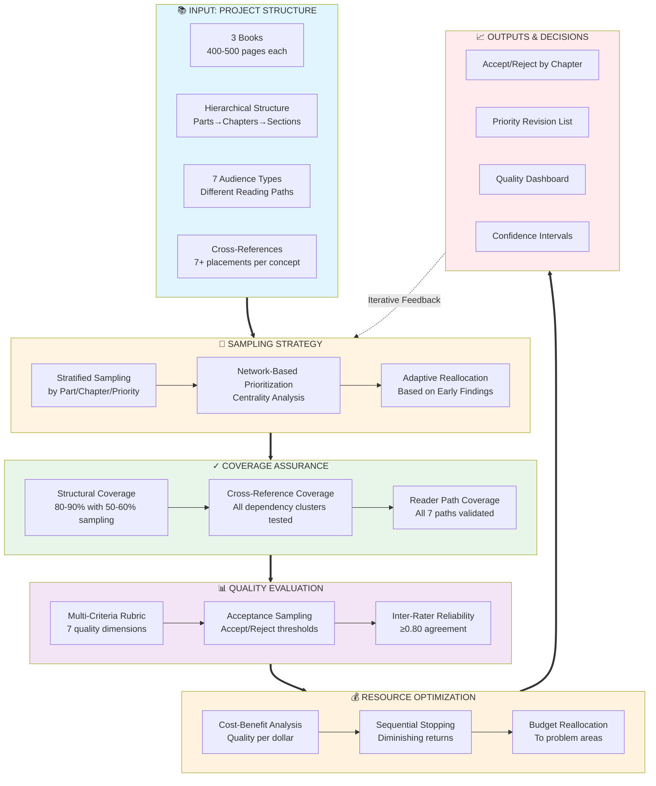
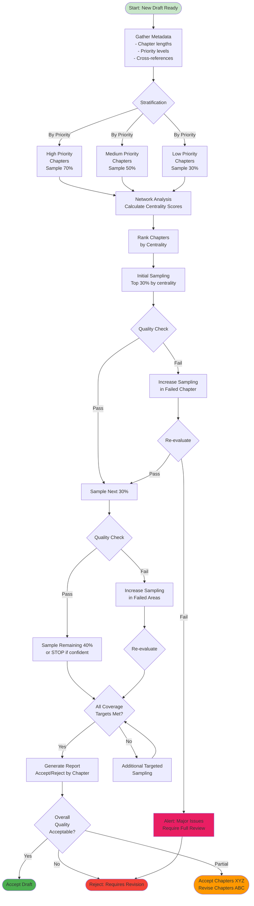
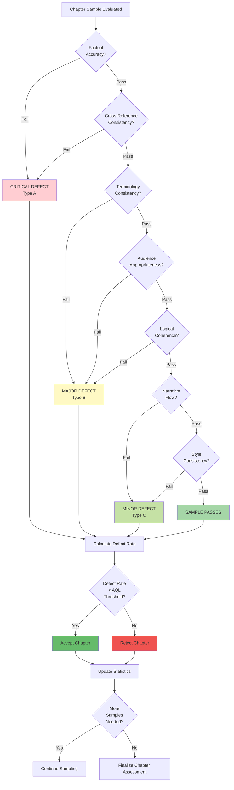
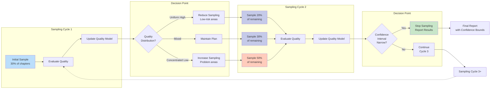
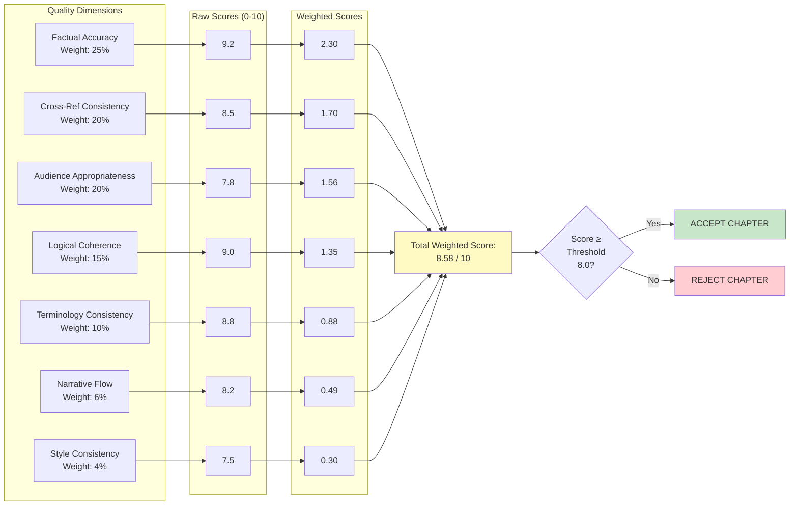
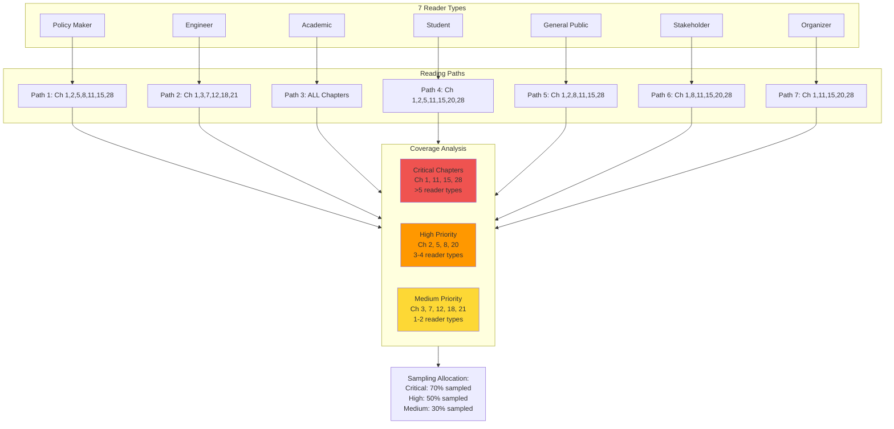
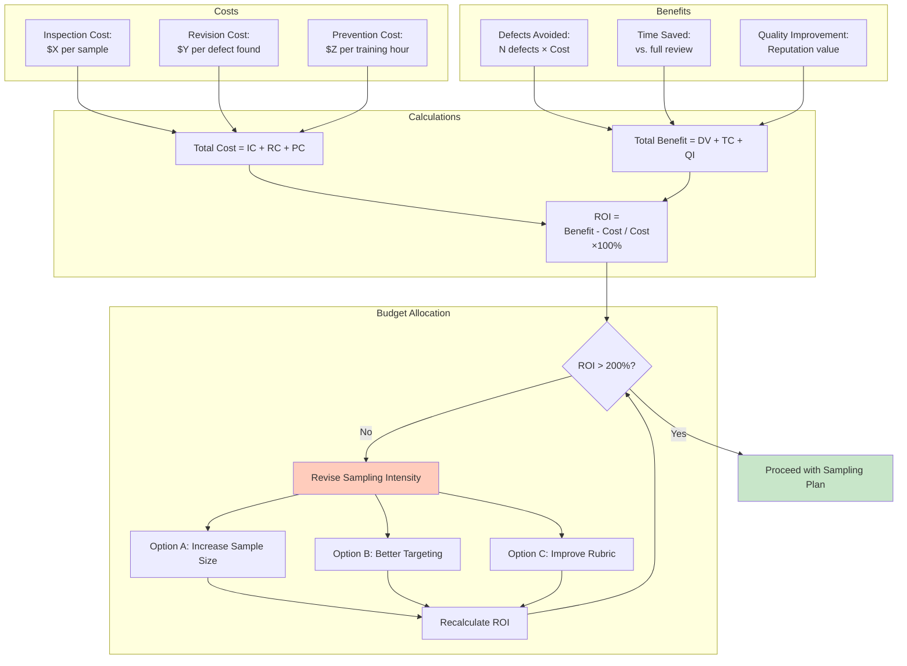
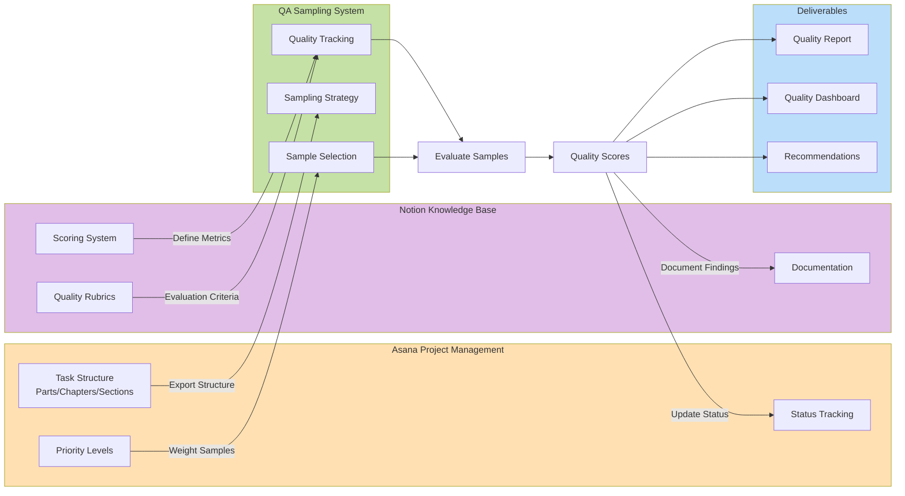
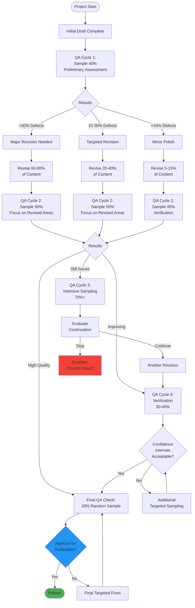

# multi_scale_qa_visual_diagrams

# Integrated Multi-Scale QA Framework: Visual Architecture

## Framework Overview Diagram



---

## Detailed Sampling Workflow



---

## Quality Evaluation Decision Tree



---

## Adaptive Sampling Feedback Loop



---

## Cross-Reference Network Sampling Priority

```mermaid
graph TD
    subgraph NETWORK["Cross-Reference Network"]
        CH1((Ch 1))
        CH5((Ch 5))
        CH8((Ch 8))
        CH11((Ch 11))
        CH15((Ch 15<br/>HIGH<br/>CENTRALITY))
        CH20((Ch 20))
        CH25((Ch 25))
        CH28((Ch 28))

        CH1 --> CH15
        CH5 --> CH15
        CH8 --> CH11
        CH11 --> CH15
        CH15 --> CH20
        CH15 --> CH25
        CH15 --> CH28
        CH20 --> CH28
        CH25 --> CH28
    end

    subgraph CENTRALITY["Centrality Analysis"]
        CALC[Calculate Measures:<br/>- Degree<br/>- Betweenness<br/>- PageRank]

        RANK[Ranking:<br/>1. Ch 15 (score: 8.2)<br/>2. Ch 28 (score: 6.4)<br/>3. Ch 11 (score: 5.1)<br/>4. Ch 20 (score: 4.8)<br/>5. Ch 25 (score: 4.8)]
    end

    subgraph SAMPLING["Sampling Priority"]
        WAVE1[Wave 1:<br/>Sample Ch 15]
        WAVE2[Wave 2:<br/>Sample Ch 28, 11]
        WAVE3[Wave 3:<br/>Sample Ch 20, 25]
        WAVE4[Wave 4:<br/>Sample Ch 1, 5, 8]

        WAVE1 --> WAVE2
        WAVE2 --> WAVE3
        WAVE3 --> WAVE4
    end

    NETWORK --> CENTRALITY
    CENTRALITY --> SAMPLING

    style CH15 fill:#ef5350,stroke:#c62828,stroke-width:4px
    style CH28 fill:#ff7043
    style CH11 fill:#ff7043
    style CH20 fill:#ffb74d
    style CH25 fill:#ffb74d
```

---

## Multi-Criteria Quality Scoring



---

## Reader Path Coverage Matrix



---

## Cost-Benefit Optimization



---

## Integration with Existing Tools



---

## Iterative Refinement Process



---

## Mermaid Diagram Usage Instructions

These diagrams can be:

1. **Rendered in Markdown viewers** that support Mermaid (GitHub, GitLab, Notion, Obsidian, etc.)
2. **Converted to PNG/SVG** using online tools like mermaid.live or CLI tools
3. **Embedded in reports** by copying the markdown code blocks
4. **Used in presentations** after export to image format

To render:
- Copy the code block including the `mermaid and closing`
- Paste into any Mermaid-compatible viewer
- Export or screenshot as needed

For high-quality exports:
- Use https://mermaid.live for best control
- Export as SVG for scalable graphics
- Export as PNG for presentations/documents