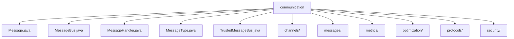
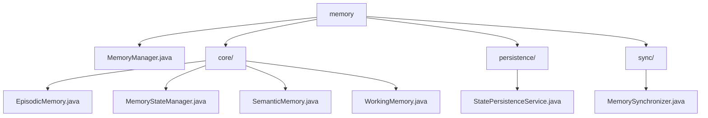
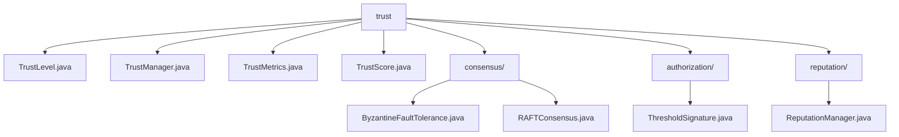
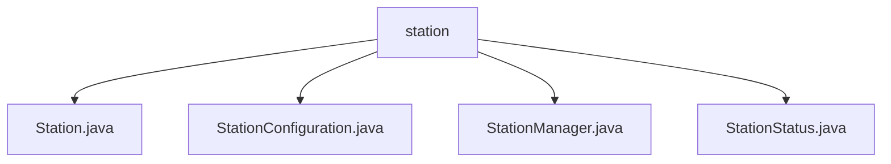
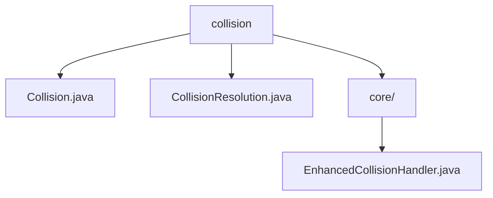

# src_structure.md

# src_structure.md

```
# Source Code Structure

This document provides a visual representation of the project's source code structure using Mermaid diagrams.

## Directory Structure

```mermaid
graph TD
    src[src] --> main
    main --> java
    main --> resources

    resources --> meta[META-INF]
    meta --> plugin_xml[plugin.xml]

    java --> com
    com --> IDE
    IDE --> plugin
    plugin --> ai
    plugin --> ui
    plugin --> settings

    ai --> multiagent
    ai --> services

    services --> claude_bridge[ClaudeCodeBridge.java]
    services --> claude_integration[ClaudeCodeIntegrationService.java]
    services --> claude_request[ClaudeRequest.java]
    services --> claude_response[ClaudeResponse.java]
    services --> claude_handler[ClaudeResponseHandler.java]
    services --> claude_adapter[ClaudeTaskAdapter.java]
    services --> conversation[ConversationMessage.java]
    services --> tool_call[ToolCall.java]

    ui --> station
    ui --> status_bar[AgentStatusBar.java]
    ui --> tool_window[AutoAgentsToolWindowFactory.java]

    station --> deployment[AgentDeploymentPanel.java]
    station --> control[StationControlPanel.java]
    station --> management[StationManagementPanel.java]
    station --> monitoring[StationMonitoringPanel.java]
    station --> view_manager[StationViewManager.java]

    settings --> auto_settings[AutoAgentsSettings.java]

    multiagent --> agent
    multiagent --> core
    multiagent --> model
    multiagent --> communication
    multiagent --> mechanical
    multiagent --> memory
    multiagent --> trust
    multiagent --> station
    multiagent --> collision
    multiagent --> event
    multiagent --> history
    multiagent --> services
    multiagent --> context
    multiagent --> coordination
    multiagent --> integration
    multiagent --> monitor

    agent --> agent_java[Agent.java]
    agent --> architect[ArchitectAgent.java]
    agent --> base[BaseAgent.java]
    agent --> editor[CodeEditorAgent.java]
    agent --> enhanced[EnhancedBaseAgent.java]
    agent --> observer[ObserverAgent.java]
    agent --> factories

    factories --> agent_factory[AgentFactory.java]

    model --> model_agent[Agent.java]
    model --> capability[AgentCapability.java]
    model --> message[AgentMessage.java]
    model --> role[AgentRole.java]
    model --> state[AgentState.java]
    model --> task[Task.java]
    model --> result[TaskResult.java]
```



## Core Components

```mermaid
graph TD
    core --> event[AgentEvent.java]
    core --> metrics[AgentMetrics.java]
    core --> registration[AgentRegistrationRequest.java]
    core --> role[AgentRole.java]
    core --> state[AgentState.java]
    core --> eventbus[EventBus.java]
    core --> group_task[GroupTaskRequest.java]
    core --> health_severity[HealthSeverity.java]
    core --> exception[ServiceException.java]
    core --> context[SharedContext.java]
    core --> health_status[SystemHealthStatus.java]
    core --> monitor[SystemMonitor.java]
    core --> task[Task.java]
    core --> result[TaskResult.java]
    core --> scheduler[TaskScheduler.java]
```



## Communication System



## Memory Management



## Trust System



## Mechanical System

```mermaid
graph TD
    mechanical --> protocol[protocol/]
    mechanical --> transmission[transmission/]
    mechanical --> validation[validation/]
    mechanical --> persistence[persistence/]
    mechanical --> integration[integration/]

    protocol --> composer[MechanicalSignalComposer.java]
    protocol --> signaling[MechanicalSignalingProtocol.java]
    protocol --> receiver[MechanicalSignalReceiver.java]
    protocol --> coordinator[ProtocolCoordinator.java]
    protocol --> models[ProtocolModels.java]

    transmission --> queue[MechanicalSignalQueue.java]
    transmission --> router[MechanicalSignalRouter.java]
    transmission --> transmitter[MechanicalSignalTransmitter.java]
    transmission --> trans_coordinator[TransmissionCoordinator.java]
    transmission --> trans_models[TransmissionModels.java]

    validation --> signal[MechanicalSignal.java]
    validation --> analyzer[MechanicalSignalAnalyzer.java]
    validation --> validator[MechanicalSignalValidator.java]
    validation --> valid_coordinator[SignalValidationCoordinator.java]
    validation --> valid_models[ValidationModels.java]

    persistence --> persist_models[PersistenceModels.java]
    persistence --> multiplexer[SignalMultiplexer.java]
    persistence --> signal_persist[SignalPersistence.java]

    integration --> bridge[MechanicalMessageBridge.java]
```



## Station Management



## Collision Handling



```