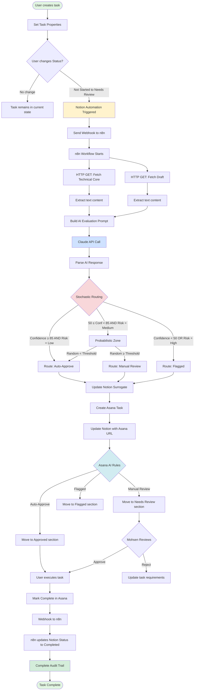

# 🏗️ SL Automation Architecture: Surrogate Pattern & Stochastic Pipeline

# Overview

## 📖 Getting Started - Read This First

**You are here:** This is your **single entry point** for the complete SL automation system. Everything is threaded through this page.

### Reading Order

**If you're new, follow this sequence:**

1. **Start here** - Read "The Constraint" section below to understand the problem
2. **See the flow** - Study the "Workflow Diagram" (Mermaid chart) to visualize the complete pipeline
3. **Understand components** - Read "Architecture Components" sections 1-4 for detailed implementation specs
4. **Review the example** - "Workflow Example: End-to-End" shows a concrete scenario
5. **Implement step-by-step** - Use the "Implementation Checklist" to build each piece
6. **Deep dive on n8n** - When ready for code, go to [📋 n8n Workflow Template: SL Surrogate Handler](%F0%9F%93%8B%20n8n%20Workflow%20Template%20SL%20Surrogate%20Handler%202c9f4401c45649058d29f44f82275cc5.md)
7. **Start executing** - Create tasks in [](https://www.notion.so/e117f24ce6044e8585f47175e8f59a3f?pvs=21)

### Key Resources Referenced Throughout

- **Technical Core:** [invariant_bridge_analysis](invariant_bridge_analysis%202b1f832e52ca802f9bc4ebd1c1dc25d9.md) - The mathematical foundation that AI evaluates against
- **Draft Document:** [Samsung initial draft](Samsung%20initial%20draft%202b1f832e52ca80968776f93eddaa5420.md) - The pitch letter being improved (contains read-only Roadmap)
- **n8n Workflow:** [📋 n8n Workflow Template: SL Surrogate Handler](%F0%9F%93%8B%20n8n%20Workflow%20Template%20SL%20Surrogate%20Handler%202c9f4401c45649058d29f44f82275cc5.md) - Node-by-node implementation guide
- **Execution Database:** [](https://www.notion.so/e117f24ce6044e8585f47175e8f59a3f?pvs=21) - Where you'll create and track tasks

**Time estimate:** 30-45 minutes to read through, 2-3 hours to implement the full pipeline.

---

This architecture implements a **Surrogate/Twin Pattern** to enable advanced automation workflows on tasks derived from a read-only synced database. The system bridges Notion → n8n → Asana with AI-driven stochastic routing.

---

## The Constraint

The **Samsung Pitch Letter - Quality Improvements Tasks** database (embedded in [Samsung initial draft](Samsung%20initial%20draft%202b1f832e52ca80968776f93eddaa5420.md)) is a **synced database** that is effectively **read-only** for schema modifications:

- Cannot add properties (AI Feedback, Status triggers)
- Cannot attach Notion Automations directly
- Cannot modify its structure without breaking sync

**Solution:** Implement a writable Surrogate database that mirrors tasks for execution.

---

## Workflow Diagram



### Workflow Phases

**Phase 1: Instantiation** (Notion)

- User creates task in Surrogate database
- Links to Original Roadmap Item
- Provides Technical Core and Draft URLs

**Phase 2: Automation Trigger** (Notion Lightning Bolt)

- Status change fires webhook
- Payload sent to n8n endpoint

**Phase 3: AI Evaluation Pipeline** (n8n)

- Fetch context from Notion pages
- Build evaluation prompt
- Claude API evaluates credibility, coherency, risk
- Stochastic routing decision

**Phase 4: State Updates** (n8n → Notion)

- Write AI feedback back to Surrogate
- Create linked Asana task
- Update Notion with Asana URL

**Phase 5: Execution Routing** (Asana AI Rules)

- Auto-Approve: Fast-track for high confidence
- Manual Review: Human review for medium confidence
- Flagged: Block for low confidence or high risk

**Phase 6: Completion Sync** (Asana → n8n → Notion)

- Task completion triggers webhook
- Notion status updated
- Audit trail complete

---

## Architecture Components

### 1. The Surrogate/Twin Pattern

**Core Concept:** Instantiate granular, actionable tasks from the read-only Roadmap into a writable execution database.

**Flow:**

```
Read-Only Roadmap ([](Samsung%20Pitch%20Letter%20-%20Quality%20Improvements%20Tasks%202b1f832e52ca800597ebdd25fc65459a.md))
         ↓ [Manual instantiation]
Surrogate Database (writable)
         ↓ [Status change]
Notion Automation (Lightning Bolt)
         ↓ [Webhook]
n8n Orchestrator
         ↓ [AI evaluation]
Asana AI Rules
```

**Surrogate Database:** Will be created as "🔧 SL Execution Surrogate (Active Tasks)" under the SL project

**Key Properties:**

- **Original Roadmap Item** (relation) - Traces back to source
- **Status** (status) - Triggers automation on change
- **AI Feedback** (text) - Receives evaluation payload
- **Confidence Score** (number) - Drives routing logic
- **Routing Decision** (select) - Auto-Approve / Manual Review / Flagged

---

### 2. Notion Automation (Lightning Bolt)

**Trigger:** Status property changes in Surrogate database

**Action:** Send webhook to n8n endpoint

**Payload Structure:**

```json
{
  "task_id": "page_id",
  "task_name": "Task Name",
  "new_status": "Status",
  "old_status": "previous Status",
  "technical_core_url": "Technical Core Reference",
  "draft_url": "Draft Reference",
  "original_roadmap_url": "Original Roadmap Item",
  "timestamp": "now"
}
```

**Notion Setup Steps:**

1. Open Surrogate database settings
2. Navigate to Automations → New Automation
3. **Trigger:** When Status is changed
4. **Filter (optional):** Only trigger for specific status transitions (e.g., → "Needs Review")
5. **Action:** Send webhook to: [`https://your-n8n-instance.com/webhook/sl-surrogate-handler`](https://your-n8n-instance.com/webhook/sl-surrogate-handler)
6. Configure payload with dynamic page properties

---

### 3. n8n Orchestrator Logic

**Webhook Endpoint:** `/webhook/sl-surrogate-handler`

**Processing Pipeline:**

### Step 1: Receive & Parse

- Extract `task_id`, `technical_core_url`, `draft_url`
- Validate payload structure

### Step 2: Fetch Context

- **HTTP Request to Notion API:**
    - Retrieve full content of Technical Core page ([invariant_bridge_analysis](invariant_bridge_analysis%202b1f832e52ca802f9bc4ebd1c1dc25d9.md))
    - Retrieve full content of Draft page ([Samsung initial draft](Samsung%20initial%20draft%202b1f832e52ca80968776f93eddaa5420.md))
    - Extract text for AI evaluation

### Step 3: AI Evaluation (LLM Call)

- **Prompt Template:**

```
You are evaluating a task for the Samsung Invariant Bridge pitch.

Task: {task_name}

Technical Foundation (from invariant_bridge_analysis):
{technical_core_excerpt}

Current Draft State (from Samsung initial draft):
{draft_excerpt}

Evaluate this task on:
1. **Credibility** (0-100): Does the task align with the mathematical rigor and validation claims in the technical core?
2. **Coherency** (0-100): Does the task maintain consistency with the draft's narrative and tone?
3. **Risk** (Low/Medium/High): Potential for introducing errors or weakening the pitch?

Return JSON:
{
  "credibility": <score>,
  "coherency": <score>,
  "overall_confidence": <average>,
  "risk_level": "<Low|Medium|High>",
  "reasoning": "<brief explanation>",
  "routing_recommendation": "<Auto-Approve|Manual Review|Flagged>"
}
```

- **LLM Provider:** Claude API, GPT-4, or similar
- **Model:** High-capability (Claude 3.5 Sonnet, GPT-4-turbo)

### Step 4: Stochastic Routing Logic

```jsx
// In n8n Function node
const confidence = ai_response.overall_confidence;
const risk = ai_response.risk_level;

// Deterministic thresholds
if (confidence >= 85 && risk === "Low") {
  routing = "Auto-Approve";
} else if (confidence < 50 || risk === "High") {
  routing = "Flagged";
} else {
  // Stochastic zone (50-85 confidence, Medium risk)
  const random = Math.random() * 100;
  
  // Probability of auto-approve scales with confidence
  const auto_threshold = (confidence - 50) * 2; // 0-70 range
  
  routing = (random < auto_threshold) ? "Auto-Approve" : "Manual Review";
}
```

**Stochastic Rationale:**

- **High confidence + Low risk** → Always auto-approve (deterministic)
- **Low confidence or High risk** → Always flag (deterministic)
- **Medium confidence + Medium risk** → Probabilistic split
    - Higher confidence → Higher chance of auto-approval
    - Introduces controlled randomness for exploration

### Step 5: Update Notion Surrogate

- **HTTP Request to Notion API:**
    - Update the task page with:
        - `AI Feedback` = JSON string of evaluation
        - `Confidence Score` = overall_confidence
        - `Routing Decision` = routing recommendation
        - `Webhook Timestamp` = current timestamp

### Step 6: Create Asana Task

- **HTTP Request to Asana API:**

```json
{
  "name": task_name,
  "notes": "AI Evaluation:\nCredibility: X/100\nCoherency: Y/100\nRisk: Z\n\nReasoning: ...",
  "projects": ["SL_Project_GID"],
  "custom_fields": {
    "Confidence_Score_Field_GID": confidence,
    "Routing_Decision_Field_GID": routing,
    "Notion_Task_URL_Field_GID": notion_page_url
  },
  "tags": [risk_level_tag_gid]
}
```

- Store returned Asana task URL back to Notion `Asana Task URL` property

---

### 4. Asana AI Rules (Stochastic Execution)

**Asana Setup:**

### Custom Fields (required):

1. **Confidence Score** (number, 0-100)
2. **Routing Decision** (dropdown: Auto-Approve, Manual Review, Flagged)
3. **Notion Task URL** (text/url)

### AI Rule 1: Auto-Approve Fast Track

- **Trigger:** Task created with `Routing Decision = "Auto-Approve"`
- **Condition:** `Confidence Score >= 85`
- **Action:**
    - Move to "Approved" section
    - Assign to execution owner
    - Set due date: +2 days
    - Add comment: "✅ Auto-approved by AI pipeline (Confidence: X%)"

### AI Rule 2: Manual Review Queue

- **Trigger:** Task created with `Routing Decision = "Manual Review"`
- **Condition:** `50 <= Confidence Score < 85`
- **Action:**
    - Move to "Needs Review" section
    - Assign to project lead (Mohsen)
    - Add comment: "⚠️ Manual review required (Confidence: X%)nSee AI evaluation in Notion: [link]"
    - Set due date: +1 day (priority review)

### AI Rule 3: Flagged Items Escalation

- **Trigger:** Task created with `Routing Decision = "Flagged"`
- **Condition:** `Confidence Score < 50` OR has tag "High Risk"
- **Action:**
    - Move to "Flagged - Do Not Execute" section
    - Assign to project lead
    - Add high-priority flag
    - Add comment: "🚨 FLAGGED: Potential credibility/coherency issuenReview AI reasoning before proceedingnNotion: [link]"
    - Block all downstream tasks (if using dependencies)

### AI Rule 4: Completion Sync-Back

- **Trigger:** Task marked complete in Asana
- **Action:**
    - Webhook back to n8n: `/webhook/asana-completion`
    - n8n updates Notion Surrogate: Status → "Completed"
    - Optional: Generate completion summary and update Draft page

---

## Workflow Example: End-to-End

### Scenario: Roadmap item "Add quantitative comparison table"

**Step 1: Instantiation**

- User creates new page in Surrogate database
- Sets:
    - Task Name: "Add quantitative comparison table (ML vs. Framework)"
    - Original Roadmap Item: [link to roadmap item]
    - Technical Core Reference: [invariant_bridge_analysis](invariant_bridge_analysis%202b1f832e52ca802f9bc4ebd1c1dc25d9.md)
    - Draft Reference: [Samsung initial draft](Samsung%20initial%20draft%202b1f832e52ca80968776f93eddaa5420.md)
    - Status: "Not Started"

**Step 2: Status Change Trigger**

- User changes Status: "Not Started" → "Needs Review"
- Notion Automation fires immediately (Lightning Bolt)
- Webhook sent to n8n with payload

**Step 3: n8n Processing**

- Fetches Technical Core: Extracts validation results (R² > 0.85), speedup claims (10⁵×)
- Fetches Draft: Identifies existing comparison section
- Sends to Claude API:
    - Credibility: 92/100 (directly supported by technical data)
    - Coherency: 88/100 (aligns with existing narrative)
    - Risk: Low
    - Overall Confidence: 90
    - Routing: "Auto-Approve"

**Step 4: Notion Update**

- AI Feedback populated with evaluation JSON
- Confidence Score: 90
- Routing Decision: "Auto-Approve"
- Webhook Timestamp: 2025-11-20T16:25:00

**Step 5: Asana Task Creation**

- Task created in SL Project
- Custom fields populated
- AI Rule 1 triggers: Moved to "Approved", assigned, due date set

**Step 6: Execution**

- Assignee completes task in Asana
- Webhook fires back to n8n
- Notion Surrogate Status updated: "Completed"

**Step 7: Audit Trail**

- Complete lineage preserved:
    - Roadmap source
    - AI evaluation reasoning
    - Routing decision logic
    - Asana execution record
    - Timestamps at each stage

---

## Key Advantages

### 1. Preserves Read-Only Constraint

- Original Roadmap untouched
- Sync integrity maintained
- No schema conflicts

### 2. Full Automation Control

- Writable Surrogate enables Lightning Bolt triggers
- Arbitrary properties for AI feedback
- Flexible status workflows

### 3. Auditability

- Every decision traced
- AI reasoning captured
- Stochastic routing logged
- Timestamps at each stage

### 4. Stochastic Learning

- Probabilistic routing enables A/B testing
- Can measure: Does higher auto-approve threshold reduce quality?
- Tune confidence thresholds based on outcomes

### 5. Technical Grounding

- AI evaluation directly consults Technical Core
- Credibility tied to mathematical validation
- Coherency tied to existing Draft narrative
- Not arbitrary quality scores—physics-informed

---

## Implementation Checklist

### Notion Setup

- [x]  Create Surrogate database with full schema
- [ ]  Configure Lightning Bolt automation:
    - Trigger: Status change
    - Action: Webhook to n8n
    - Payload: Include task properties
- [ ]  Test webhook delivery (use RequestBin initially)

### n8n Setup

- [ ]  Create workflow: `SL-Surrogate-Handler`
- [ ]  Webhook trigger node (generate URL)
- [ ]  HTTP Request: Fetch Notion Technical Core
- [ ]  HTTP Request: Fetch Notion Draft
- [ ]  Function: Build AI prompt
- [ ]  HTTP Request: Call Claude API / GPT-4
- [ ]  Function: Stochastic routing logic
- [ ]  HTTP Request: Update Notion Surrogate
- [ ]  HTTP Request: Create Asana task
- [ ]  Error handling: Slack/email on failure
- [ ]  Test with sample payload

### Asana Setup

- [ ]  Create project: "SL Execution"
- [ ]  Add custom fields: Confidence Score, Routing Decision, Notion URL
- [ ]  Create sections: Approved, Needs Review, Flagged, Completed
- [ ]  Configure AI Rules (4 rules above)
- [ ]  Add tags: Low Risk, Medium Risk, High Risk
- [ ]  Test task creation via API

### Integration Testing

- [ ]  End-to-end test: Notion → n8n → Asana
- [ ]  Verify all routing paths:
    - High confidence → Auto-Approve
    - Medium confidence → Stochastic split
    - Low confidence → Flagged
- [ ]  Validate sync-back: Asana completion → Notion update
- [ ]  Load test: 10 simultaneous status changes

### Documentation

- [x]  Architecture overview (this page)
- [ ]  n8n workflow export (JSON)
- [ ]  Asana AI Rules screenshots
- [ ]  Troubleshooting guide
- [ ]  Runbook for manual intervention

---

## Future Enhancements

### Phase 2: Bidirectional Sync

- Asana updates flow back to Notion in real-time
- Not just completion, but comments, attachments, time tracking

### Phase 3: Multi-Agent Evaluation

- Multiple LLMs vote (Claude, GPT-4, Gemini)
- Aggregate confidence via ensemble
- Flag disagreements for human review

### Phase 4: Reinforcement Loop

- Track outcome quality of auto-approved vs. manually reviewed tasks
- Adjust confidence thresholds dynamically
- Bayesian updating of routing probabilities

### Phase 5: Natural Language Instantiation

- Chat interface: "Create tasks from Roadmap item 5"
- AI generates granular breakdown
- Auto-populates Surrogate with relations

---

## Contact & Support

**Architecture Owner:** Mohsen Dirbaz

**Key References:**

- Technical Core: [invariant_bridge_analysis](invariant_bridge_analysis%202b1f832e52ca802f9bc4ebd1c1dc25d9.md)
- Draft: [Samsung initial draft](Samsung%20initial%20draft%202b1f832e52ca80968776f93eddaa5420.md)
- Roadmap (read-only): Embedded in Draft page
- Surrogate (active): This workspace

**Related Systems:**

- [APPENDIX A COMPLETE AUDITABILITY & REINFORCEMENT LOOP ARCHITECTURE](APPENDIX%20A%20COMPLETE%20AUDITABILITY%20&%20REINFORCEMENT%20L%2081a7b6a7f3c943f4982647473488e92d.md)
- [ENHANCED DISTRIBUTED LOG ARCHITECTURE](ENHANCED%20DISTRIBUTED%20LOG%20ARCHITECTURE%207fd644528b284e90a45d894fbbc6d765.md)

---

**Last Updated:** 2025-11-20 by Notion AI

**Architecture Version:** 1.0