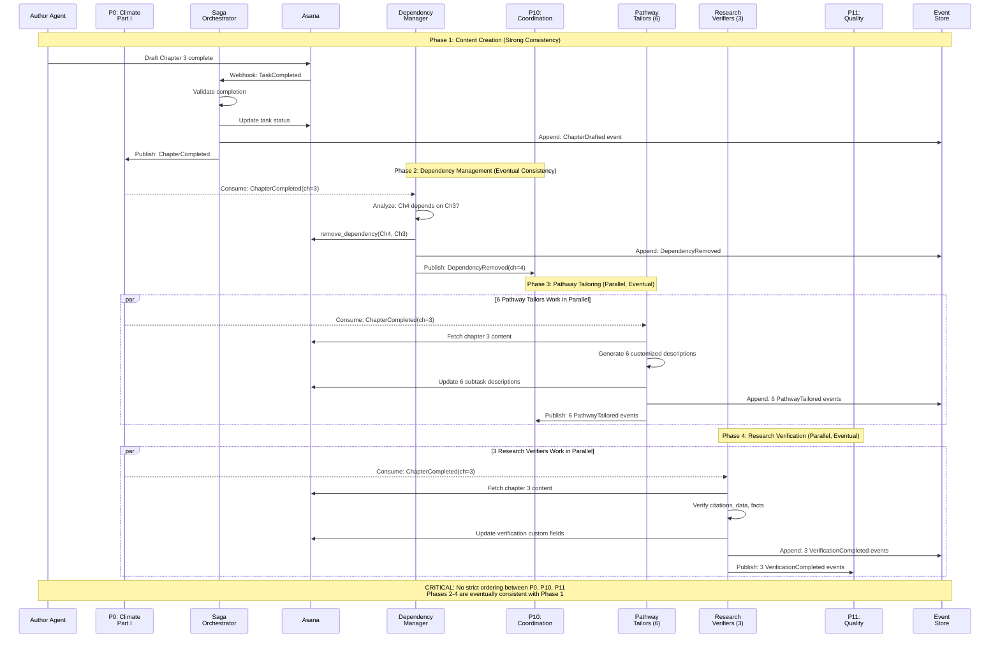
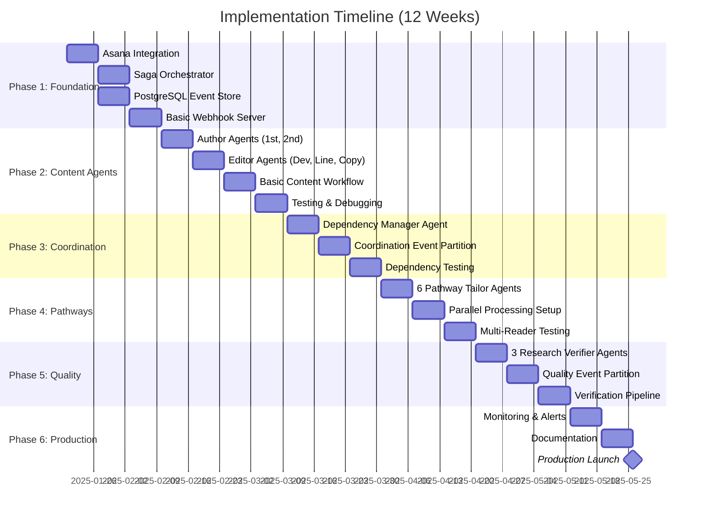
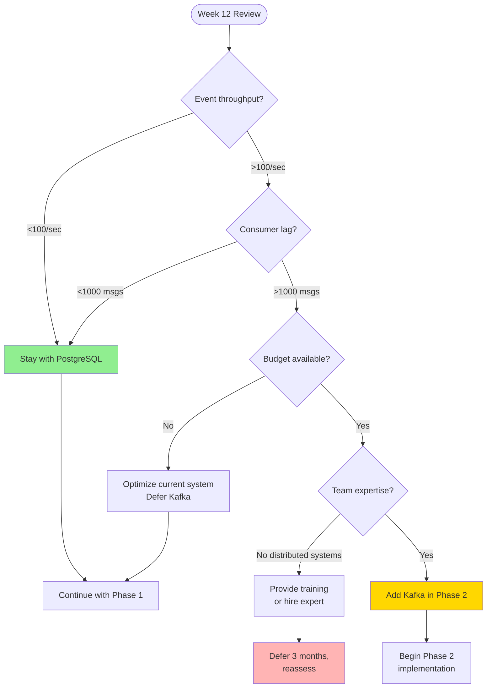

# 📦 ARCHIVED 2025-11-01: EDLA Version 2

# ENHANCED DISTRIBUTED LOG ARCHITECTURE

## Multi-Agent Book Writing with Dependency Management, Pathway Tailoring, and Research Verification

## **Integrating Critical Design Considerations from Event Sourcing**

## EXECUTIVE SUMMARY

This architecture extends the base multi-agent collaboration system by adding three specialized agent groups:

1. **Dependency Manager Agents** - Manage Part-level dependencies between chapters
2. **Pathway Tailor Agents** - Customize subtask descriptions for 6 reader types
3. **Research Verifier Agents** - Validate citations, data accuracy, and fact-checking
The design carefully balances the power of Event Sourcing with operational pragmatism, following a **Hybrid Consistency Model**: Saga Orchestrator for critical coordination + Event Sourcing for audit trails. This addresses the key trade-offs identified in the discussion: strong consistency vs. eventual consistency, ordering guarantees, latency, and infrastructure complexity.

---

## TABLE OF CONTENTS

1. [Critical Design Considerations](about:blank#critical-design-considerations)
2. [Enhanced Architecture Overview](about:blank#enhanced-architecture-overview)
3. [Partitioning Strategy for New Agent Types](about:blank#partitioning-strategy-for-new-agent-types)
4. [Hybrid Consistency Model](about:blank#hybrid-consistency-model)
5. [Agent Group Specifications](about:blank#agent-group-specifications)
6. [Event Flow with Cross-Partition Coordination](about:blank#event-flow-with-cross-partition-coordination)
7. [Addressing Ordering Guarantees](about:blank#addressing-ordering-guarantees)
8. [Latency Considerations](about:blank#latency-considerations)
9. [Infrastructure & Operational Complexity](about:blank#infrastructure--operational-complexity)
10. [Implementation Roadmap](about:blank#implementation-roadmap)

---

## CRITICAL DESIGN CONSIDERATIONS

### The Core Trade-offs We’re Addressing

Based on the Event Sourcing discussion, we must carefully navigate these fundamental tensions:

```mermaid
graph TB
 subgraph Advantages["✅ Event Sourcing Advantages"]
 A1[High Scalability<br/>1000+ events/sec]
 A2[Complete Auditability<br/>Time-travel capability]
 A3[System Decoupling<br/>Independent evolution]
 A4[Replay Capability<br/>Recovery & debugging]
 end

subgraph Challenges["âš ï¸ Critical Challenges"]
 C1[Infrastructure Complexity<br/>Kafka/Pulsar management]
 C2[Ordering Limited<br/>Only within partitions]
 C3[Eventual Consistency<br/>Not strong consistency]
 C4[Latency 100ms-1s<br/>Batch processing delay]
 end

subgraph OurApproach["🎯 Our Hybrid Solution"]
 S1[Saga Orchestrator<br/>for Critical Path]
 S2[Event Sourcing<br/>for Audit Trail]
 S3[Partition by Book+Part<br/>for Ordering]
 S4[Separate Meta Partitions<br/>for Coordination]
 end

A1 --> OurApproach
 A2 --> OurApproach
 C1 --> OurApproach
 C2 --> OurApproach
 C3 --> OurApproach

OurApproach --> Result[Balanced System:<br/>Strong consistency where needed<br/>Auditability everywhere<br/>Manageable complexity]

style Advantages fill:#90EE90
 style Challenges fill:#FFB4B4
 style OurApproach fill:#FFD700
 style Result fill:#87CEEB
```



### Key Decision: Why Hybrid?

**Professor Elliot’s Recommendation**: “For systems requiring strong consistency, a hybrid approach is recommended. Use a Saga Orchestrator for primary coordination, ensuring strong consistency for critical business processes, and supplement with Event Sourcing specifically for audit trails.”
This is exactly what we implement:

- **Critical Path** (Chapter drafting → Editing → Approval): Saga Orchestrator ensures strong consistency
- **Audit Trail** (What happened? Why? When?): Event Sourcing captures immutable history
- **Coordination Events** (Dependencies, Pathways, Verification): Separate partitions with eventual consistency

---

## ENHANCED ARCHITECTURE OVERVIEW

### Complete System with New Agent Types

```mermaid
graph TB
 subgraph External["🌠External Systems"]
 Claude[Claude API<br/>Agent Intelligence]
 Webhook[Webhook Server<br/>Event Router]
 Analytics[Analytics Platform<br/>Metrics & Monitoring]
 end

subgraph Asana["ðŸ"‹ Asana - Source of Truth"]
 Projects[Projects<br/>Book Structure]
 Tasks[Tasks<br/>Chapters]
 Subtasks[Subtasks<br/>Reader Pathways]
 Dependencies[Dependencies<br/>Chapter Ordering]
 CustomFields[Custom Fields<br/>Trust & State]
 Stories[Stories<br/>Immutable Audit Log]
 Approvals[Approvals<br/>Quality Gates]
 end

subgraph ContentAgents["âœï¸ Content Production Agents"]
 Author1[1st Author Agent<br/>Original Content]
 Author2[2nd Author Agent<br/>Collaborative Writing]
 DevEditor[Dev Editor Agent<br/>Structure & Pacing]
 LineEditor[Line Editor Agent<br/>Prose Quality]
 CopyEditor[Copy Editor Agent<br/>Grammar & Style]
 end

subgraph NewCoordAgents["🆕 Coordination Agents"]
 DepMgr[Dependency Manager<br/>Part-Level Dependencies]

subgraph PathwayTailors["Pathway Tailor Sub-Group"]
 PT1[Tailor: Policy Maker]
 PT2[Tailor: Technical]
 PT3[Tailor: Academic]
 PT4[Tailor: Student]
 PT5[Tailor: General]
 PT6[Tailor: Stakeholder]
 end
 end

subgraph NewQualityAgents["🆕 Quality Assurance Agents"]
 subgraph ResearchVerifiers["Research Verifier Sub-Group"]
 RV1[Verifier: Citations]
 RV2[Verifier: Data Accuracy]
 RV3[Verifier: Fact Checking]
 end

Surveyor[Surveyor Agent<br/>Reader Feedback]
 Inspector[Inspector Agent<br/>Final Quality Gate]
 end

subgraph Orchestration["🎯 Orchestration Layer"]
 SagaEngine[Saga Orchestrator<br/>Strong Consistency]
 EventLog[(Event Store<br/>Audit Trail)]
 Orchestrator[Master Orchestrator<br/>System Supervision]
 end

subgraph DistributedLog["ðŸ"Š Optional: Distributed Log (High Scale)"]
 P0[P0: Climate-Part-I]
 P1[P1: Climate-Part-II]
 P2[P2: Climate-Part-III]
 P3[P3: Climate-Part-IV]
 P4[P4: Climate-Part-V]
 P5[P5: AI-Ethics-Part-I]
 P6[P6: AI-Ethics-Part-II]
 P7[P7: AI-Ethics-Part-III]
 P8[P8: AI-Ethics-Part-IV]
 P9[P9: AI-Ethics-Part-V]
 P10[P10: Coordination Events<br/>Dependencies + Pathways]
 P11[P11: Quality Events<br/>Research Verification]
 end

Claude -->|API Calls| ContentAgents
 Claude -->|API Calls| NewCoordAgents
 Claude -->|API Calls| NewQualityAgents

Webhook -->|Trigger| SagaEngine
 SagaEngine -->|Strong Consistency| Tasks
 SagaEngine -->|Log Events| EventLog

ContentAgents -->|Update| Tasks
 NewCoordAgents -->|Update| Dependencies
 NewCoordAgents -->|Update| Subtasks
 NewQualityAgents -->|Verify| Tasks

Tasks -->|Generate| Stories
 Stories -->|Stream to| EventLog

EventLog -.optional high scale.-> DistributedLog
 DistributedLog -.consume.-> Analytics

Orchestrator -.supervise.-> SagaEngine
 Orchestrator -.monitor.-> NewCoordAgents
 Orchestrator -.monitor.-> NewQualityAgents

DepMgr -->|Manage| Dependencies
 PathwayTailors -->|Customize| Subtasks
 ResearchVerifiers -->|Validate| Tasks

style Asana fill:#FFE5B4
 style NewCoordAgents fill:#FFD700
 style NewQualityAgents fill:#87CEEB
 style Orchestration fill:#90EE90
 style DistributedLog fill:#E8E8E8,stroke-dasharray: 5 5
```

## **Key Architectural Decision**: The Distributed Log is *optional* and only needed at high scale (>1000 events/sec). We start with the simpler Saga + Event Store approach.

## PARTITIONING STRATEGY FOR NEW AGENT TYPES

### Partition Design Philosophy

Following the discussion’s guidance on ordering guarantees:

> “Ordering is guaranteed within a partition, but not across partitions.”
We design partitions to ensure events that must maintain strict ordering are in the same partition.
> 

```mermaid
graph TB
 subgraph PartitioningRules["ðŸ"Š Partitioning Rules"]
 R1[Rule 1: Content events by Book+Part<br/>Ensures chapter ordering within Part]
 R2[Rule 2: Coordination in separate partition<br/>Avoids blocking content flow]
 R3[Rule 3: Quality in separate partition<br/>Non-blocking verification]
 end

subgraph ContentPartitions["ðŸ"š Content Partitions (P0-P9)"]
 subgraph ClimateBook["Climate Book"]
 CP0[P0: Part I, Ch 1-6<br/>Sequential Content]
 CP1[P1: Part II, Ch 7-12]
 CP2[P2: Part III, Ch 13-18]
 CP3[P3: Part IV, Ch 19-24]
 CP4[P4: Part V, Ch 25-28]
 end

subgraph AIBook["AI Ethics Book"]
 AP0[P5: Part I, Ch 1-6<br/>Sequential Content]
 AP1[P6: Part II, Ch 7-12]
 AP2[P7: Part III, Ch 13-18]
 AP3[P8: Part IV, Ch 19-24]
 AP4[P9: Part V, Ch 25-28]
 end
 end

subgraph MetaPartitions["ðŸ"— Meta Partitions"]
 MP1[P10: Coordination<br/>Dependency Changes<br/>Pathway Tailoring]
 MP2[P11: Quality Assurance<br/>Citation Verification<br/>Data Validation<br/>Fact Checking]
 end

subgraph OrderingGuarantees["✅ What We Guarantee"]
 O1[✅ Within P0: Ch1 draft â†' Ch2 draft â†' Ch3 draft<br/>Strict sequential ordering]
 O2[âš ï¸ Between P0 and P10: No ordering guarantee<br/>Dependency update may be async]
 O3[âš ï¸ Between P10 and P11: No ordering guarantee<br/>Verification happens eventually]
 end

R1 --> ContentPartitions
 R2 --> MP1
 R3 --> MP2

ContentPartitions --> O1
 ContentPartitions --> O2
 MetaPartitions --> O2
 MP1 --> O3

style OrderingGuarantees fill:#90EE90
 style MetaPartitions fill:#FFD700
 style PartitioningRules fill:#87CEEB
```

### Why This Partitioning Strategy?

**Content Partitions (P0-P9)**:

- Each Part of each Book gets its own partition
- This ensures **strict ordering** for chapter progression within a Part
- Example: In P0 (Climate Part I), events for Ch1→Ch2→Ch3 maintain their order
- Enables parallel work across Parts without ordering conflicts
**Coordination Partition (P10)**:
- Dependency changes and pathway tailoring events
- These don’t need strict ordering with content events
- Example: Unlocking Ch4 dependency can happen asynchronously from Ch3 completion
- **Trade-off**: Eventual consistency acceptable here
**Quality Partition (P11)**:
- Research verification events
- Non-blocking - doesn’t stop content flow
- Example: Citation verification can lag behind content drafting
- **Trade-off**: Verification results are eventually consistent

---

## HYBRID CONSISTENCY MODEL

### The Two-Path Architecture

Following Professor Elliot’s recommendation for hybrid approach:

```mermaid
graph TB
 subgraph CriticalPath["🎯 CRITICAL PATH: Strong Consistency"]
 Webhook[Webhook Trigger<br/>Task Completed]
 Saga[Saga Orchestrator]

subgraph SagaSteps["Saga Transaction Steps"]
 S1[1. Update Asana Task Status]
 S2[2. Check Quality Gates]
 S3[3. Unlock Dependencies<br/>if applicable]
 S4[4. Notify Next Agent]
 end

Compensate[Compensation Logic<br/>Rollback on Failure]

S1 -.on failure.-> Compensate
 S2 -.on failure.-> Compensate
 S3 -.on failure.-> Compensate
 end

subgraph AuditPath["ðŸ"Š AUDIT PATH: Event Sourcing"]
 EventLog[(Event Store<br/>PostgreSQL)]

subgraph Events["Event Types Captured"]
 E1[ChapterDrafted]
 E2[DependencyRemoved]
 E3[PathwayTailored]
 E4[CitationVerified]
 E5[ApprovalGranted]
 end

subgraph Projections["Read Models / Projections"]
 Proj1[Current State View<br/>What's happening now?]
 Proj2[Historical View<br/>What happened and why?]
 Proj3[Metrics View<br/>Performance & Quality]
 end
 end

subgraph AsanaState["ðŸ"‹ Asana: Single Source of Truth"]
 Tasks[(Tasks)]
 Deps[(Dependencies)]
 Fields[(Custom Fields)]
 AsanaStories[(Asana Stories API)]
 end

Webhook -->|Trigger| Saga
 Saga --> S1
 S1 --> S2
 S2 --> S3
 S3 --> S4

S1 -->|Write| Tasks
 S3 -->|Write| Deps
 S4 -->|Write| Fields

Saga -->|Append Events| EventLog
 AsanaStories -->|Also append| EventLog

EventLog --> Events
 Events --> Projections

Projections -.query for analytics.-> Analytics[Analytics Platform]

S4 -->|Success| NextAgent[Notify Next Agent<br/>Continue Workflow]
 Compensate -->|Rollback| Tasks

style CriticalPath fill:#FFD700
 style AuditPath fill:#90EE90
 style AsanaState fill:#FFE5B4
 style Compensate fill:#FFB4B4
```

### What Runs on Each Path?

**Critical Path (Strong Consistency via Saga)**:

- Chapter drafting → Editing handoffs
- Approval workflows
- Quality gate transitions
- Any operation requiring immediate consistency
**Audit Path (Eventual Consistency via Event Sourcing)**:
- Complete history of all changes
- “Why did this happen?” questions
- Performance metrics and analytics
- Replay capability for debugging
**Key Insight**: The Critical Path uses the Saga to ensure immediate consistency, while the Audit Path captures everything for later analysis. This gives us both reliability and complete auditability.

---

## AGENT GROUP SPECIFICATIONS

### 1. Dependency Manager Agent

**Purpose**: Manages Part-level dependencies between chapters, automatically unlocking downstream work as upstream chapters complete.
**Responsibilities**:

- Monitor chapter completion events within each Part
- Analyze dependency chains (Ch3 blocks Ch4, Ch4 blocks Ch5)
- Automatically remove dependencies when prerequisites complete
- Update Asana’s dependency graph via API
- Emit coordination events to Partition 10
**Event Consumption**:
- Subscribes to: Content Partitions (P0-P9)
- Publishes to: Coordination Partition (P10)
**Example Workflow**:
```
1. P0 emits: ChapterCompleted(book=Climate, part=I, chapter=3)
2. Dependency Manager consumes event
3. Analyzes: Ch4 dependency on Ch3
4. Calls Asana API: remove_dependency(Ch4, Ch3)
5. Emits to P10: DependencyRemoved(chapter=4, unblocked_by=3)
6. Author Agent for Ch4 receives notification
    
    ```
    **Coordination Diagram**:
    ```mermaid
    sequenceDiagram
    participant P0 as Partition 0<br/>(Climate Part I)
    participant DM as Dependency<br/>Manager
    participant Asana as Asana API
    participant P10 as Partition 10<br/>(Coordination)
    participant Author as Author Agent
    ```
    

Note over P0,Author: Chapter 3 Completion Flow

P0->>DM: Event: ChapterCompleted

(book=Climate, part=I, ch=3)

DM->>DM: Analyze Dependencies:

Ch4 depends on Ch3?

✅ Yes, prerequisite met

DM->>Asana: remove_dependency()

task_gid=Ch4

dependency_gid=Ch3

Asana–>>DM: Success: Dependency Removed

DM->>P10: Event: DependencyRemoved

(chapter=4, unblocked_by=3,

timestamp=now)

P10->>Author: Notification:

“Ch4 is now unblocked

and ready for drafting”

Author->>Asana: Begin drafting Ch4

Note over DM,Asana: Eventual Consistency:

Dependency removal may lag

Chapter 3 completion by 100ms-1s

```
**Configuration**:
```yaml
dependency_manager:
 consumer_group: "coordination-consumers"
 partitions_subscribed: ["P0", "P1", "P2", "P3", "P4", "P5", "P6", "P7", "P8", "P9"]
 partition_published: "P10"

rules:
 - name: "Sequential Chapter Dependencies"
 condition: "chapter_n completed AND chapter_n+1 depends_on chapter_n"
 action: "remove_dependency(chapter_n+1, chapter_n)"

- name: "Part Milestone Dependencies"
 condition: "all chapters in part completed"
 action: "remove_dependency(next_part_first_chapter, current_part_last_chapter)"
```

---

### 2. Pathway Tailor Agents (6 Agents)

**Purpose**: Customize subtask descriptions for different reader types, ensuring each reader pathway provides appropriate context and framing.
**Agent Instances**:

1. **Policy Maker Tailor** - Focuses on governance, policy implications, actionable recommendations
2. **Technical Specialist Tailor** - Emphasizes technical details, implementation, system design
3. **Academic Tailor** - Highlights research methods, theoretical frameworks, citations
4. **Student Tailor** - Provides foundational concepts, learning objectives, examples
5. **General Audience Tailor** - Uses accessible language, human stories, practical impact
6. **Stakeholder Tailor** - Focuses on direct impact, resource access, action items
**Responsibilities**:
- Monitor chapter completion events
- Analyze chapter content and identify key themes
- Generate customized descriptions for subtasks targeting each reader type
- Update Asana subtask descriptions via API
- Emit pathway tailoring events to Partition 10
**Event Consumption**:
- Subscribes to: Content Partitions (P0-P9)
- Publishes to: Coordination Partition (P10)
**Example Workflow**:
```
1. P0 emits: ChapterCompleted(book=Climate, part=I, chapter=3, title=“Decarbonization Pathways”)
2. All 6 Pathway Tailors consume event
3. Each Tailor fetches chapter content from Asana
4. Policy Maker Tailor generates:
“Focus: Policy frameworks for industrial decarbonization.
Key sections: Carbon pricing mechanisms, regulatory approaches,
international agreements. Critical for policy makers.”
5. Technical Tailor generates:
“Focus: Technical implementation of decarbonization.
Key sections: Energy efficiency metrics, grid integration,
CCS technology. Critical for engineers.”
6. Each Tailor updates corresponding subtask in Asana
7. Each Tailor emits to P10: PathwayTailored(chapter=3, reader_type=…)
    
    ```
    **Coordination Diagram**:
    ```mermaid
    sequenceDiagram
    participant P0 as Partition 0<br/>(Climate Part I)
    participant PT1 as Policy Maker<br/>Tailor
    participant PT2 as Technical<br/>Tailor
    participant PT6 as Stakeholder<br/>Tailor
    participant Asana as Asana API
    participant P10 as Partition 10
    ```
    

Note over P0,P10: Parallel Pathway Tailoring

P0->>PT1: Event: ChapterCompleted

(chapter=3, title=“Decarbonization”)
P0->>PT2: Event: ChapterCompleted

(chapter=3, title=“Decarbonization”)
P0->>PT6: Event: ChapterCompleted

(chapter=3, title=“Decarbonization”)

par Parallel Processing
PT1->>Asana: fetch_chapter_content(ch=3)
Asana–>>PT1: Content
PT1->>PT1: Generate Policy Maker

description
PT1->>Asana: update_subtask_description

(subtask=“Ch3-PolicyMaker”)
PT1->>P10: PathwayTailored

(chapter=3, reader=policy)
and
PT2->>Asana: fetch_chapter_content(ch=3)
Asana–>>PT2: Content
PT2->>PT2: Generate Technical

description
PT2->>Asana: update_subtask_description

(subtask=“Ch3-Technical”)
PT2->>P10: PathwayTailored

(chapter=3, reader=technical)
and
PT6->>Asana: fetch_chapter_content(ch=3)
Asana–>>PT6: Content
PT6->>PT6: Generate Stakeholder

description
PT6->>Asana: update_subtask_description

(subtask=“Ch3-Stakeholder”)
PT6->>P10: PathwayTailored

(chapter=3, reader=stakeholder)
end

Note over PT1,PT6: All 6 tailors work in parallel

No strict ordering needed

```
**Configuration**:
```yaml
pathway_tailors:
 consumer_group: "pathway-tailoring-consumers"
 partitions_subscribed: ["P0", "P1", "P2", "P3", "P4", "P5", "P6", "P7", "P8", "P9"]
 partition_published: "P10"

instances:
 - reader_type: "policy_maker"
 prompt_template: "Generate a description for policy makers focusing on..."
 subtask_suffix: "-PolicyMaker"

- reader_type: "technical"
 prompt_template: "Generate a description for technical specialists focusing on..."
 subtask_suffix: "-Technical"

- reader_type: "academic"
 prompt_template: "Generate a description for academics focusing on..."
 subtask_suffix: "-Academic"

# ... 3 more instances ...
```

---

### 3. Research Verifier Agents (3 Agents)

**Purpose**: Validate the accuracy and completeness of written content through specialized verification tasks.
**Agent Instances**:

1. **Citation Verifier** - Validates that all claims are properly cited and citations are accurate
2. **Data Accuracy Verifier** - Checks numerical data, statistics, and quantitative claims
3. **Fact Checker** - Verifies factual statements, dates, names, and events
**Responsibilities**:
- Monitor chapter completion events
- Extract claims, data, and facts from content
- Verify against authoritative sources
- Generate verification reports
- Update Asana tasks with verification status via custom fields
- Emit quality events to Partition 11
**Event Consumption**:
- Subscribes to: Content Partitions (P0-P9)
- Publishes to: Quality Partition (P11)
**Example Workflow**:
```
1. P0 emits: ChapterCompleted(book=Climate, part=I, chapter=7, title=“Agriculture”)
2. All 3 Research Verifiers consume event
3. Citation Verifier:
    - Extracts all citations from chapter
    - Verifies each citation exists and is accessible
    - Checks citation format compliance
    - Result: 18/20 citations valid
4. Data Accuracy Verifier:
    - Extracts numerical claims: “40% reduction in emissions”
    - Cross-references with source data
    - Result: All data points verified
5. Fact Checker:
    - Extracts factual claims: “Paris Agreement signed in 2015”
    - Verifies against reliable sources
    - Result: All facts accurate
6. Each Verifier updates Asana custom field: “Verification_Status”
7. Each Verifier emits to P11: VerificationCompleted(chapter=7, type=…)
    
    ```
    **Coordination Diagram**:
    ```mermaid
    sequenceDiagram
    participant P0 as Partition 0<br/>(Climate Part I)
    participant CV as Citation<br/>Verifier
    participant DV as Data<br/>Verifier
    participant FC as Fact<br/>Checker
    participant Asana as Asana API
    participant P11 as Partition 11<br/>(Quality)
    ```
    

Note over P0,P11: Parallel Research Verification

P0->>CV: Event: ChapterCompleted

(chapter=7, “Agriculture”)
P0->>DV: Event: ChapterCompleted

(chapter=7, “Agriculture”)
P0->>FC: Event: ChapterCompleted

(chapter=7, “Agriculture”)

par Independent Verification
CV->>Asana: fetch_chapter_content(ch=7)
Asana–>>CV: Content with citations
CV->>CV: Extract citations (20 found)
CV->>CV: Verify each citation

(18/20 valid, 2 broken links)
CV->>Asana: update_custom_field

(CitationStatus=“90% verified”)
CV->>Asana: add_comment

(“2 citations need updating”)
CV->>P11: VerificationCompleted

(chapter=7, type=citation,

pass_rate=90%)
and
DV->>Asana: fetch_chapter_content(ch=7)
Asana–>>DV: Content with data claims
DV->>DV: Extract numerical claims (15 found)
DV->>DV: Verify against sources

(15/15 accurate)
DV->>Asana: update_custom_field

(DataStatus=“100% verified”)
DV->>P11: VerificationCompleted

(chapter=7, type=data,

pass_rate=100%)
and
FC->>Asana: fetch_chapter_content(ch=7)
Asana–>>FC: Content with factual claims
FC->>FC: Extract facts (25 found)
FC->>FC: Verify accuracy

(24/25 verified, 1 date incorrect)
FC->>Asana: update_custom_field

(FactStatus=“96% verified”)
FC->>Asana: add_comment

(“Paris Agreement date needs correction”)
FC->>P11: VerificationCompleted

(chapter=7, type=fact,

pass_rate=96%)
end

Note over CV,FC: Non-blocking verification

Doesn’t stop content flow

```
**Configuration**:
```yaml
research_verifiers:
 consumer_group: "quality-verification-consumers"
 partitions_subscribed: ["P0", "P1", "P2", "P3", "P4", "P5", "P6", "P7", "P8", "P9"]
 partition_published: "P11"

instances:
 - type: "citation"
 custom_field: "CitationVerificationStatus"
 acceptance_threshold: 95.0 # % of citations that must be valid

- type: "data_accuracy"
 custom_field: "DataAccuracyStatus"
 acceptance_threshold: 100.0 # All data must be accurate

- type: "fact_checking"
 custom_field: "FactCheckStatus"
 acceptance_threshold: 98.0 # % of facts that must be accurate
```

---

## EVENT FLOW WITH CROSS-PARTITION COORDINATION

### Complete End-to-End Flow



**Key Observations**:

1. **Strong Consistency in Phase 1**: The Saga Orchestrator ensures the chapter completion is properly recorded in Asana before any other processing begins.
2. **Eventual Consistency in Phases 2-4**: Dependency management, pathway tailoring, and research verification all happen asynchronously. There’s no guarantee about which completes first.
3. **Non-Blocking Design**: Content creation (Phase 1) doesn’t wait for verification (Phase 4) to complete. Authors can keep working while verification happens in the background.
4. **Trade-off Acceptance**: We accept 100ms-1s delay between content completion and dependency updates. This is the “latency” trade-off from the discussion.

---

## ADDRESSING ORDERING GUARANTEES

### What We Guarantee vs. What We Don’t

Following Professor Elliot’s key insight: “Ordering is guaranteed **within** a partition, but **not across** partitions.”

```mermaid
graph TB
 subgraph WithinPartition["✅ GUARANTEED ORDERING: Within Partition"]
 W1[P0: Climate Part I]
 W2[Sequential Events:<br/>Ch1 Draft â†' Ch2 Draft â†' Ch3 Draft â†'<br/>Ch1 Edit â†' Ch2 Edit â†' Ch3 Edit]
 W3[Result: Strict chronological order<br/>maintained within this Part]
 end

subgraph AcrossPartitions["âš ï¸ NO ORDERING GUARANTEE: Across Partitions"]
 A1[P0: Climate Part I<br/>Ch3 Completed at 10:00:00]
 A2[P10: Coordination<br/>Dependency Removed at 10:00:00.150]
 A3[P11: Quality<br/>Verification Complete at 10:00:00.300]
 A4[Result: These 3 events have no<br/>guaranteed order relative to each other]
 end

subgraph Mitigation["ðŸ›¡ï¸ MITIGATION STRATEGIES"]
 M1[Strategy 1: Causal Timestamps<br/>Add event_time + vector_clocks<br/>to establish happened-before relationships]
 M2[Strategy 2: Correlation IDs<br/>Link related events across partitions<br/>to reconstruct causal chains]
 M3[Strategy 3: Idempotent Processing<br/>Handle out-of-order events gracefully<br/>using state machines]
 M4[Strategy 4: Accept Eventual Consistency<br/>Design business logic to tolerate<br/>async coordination]
 end

WithinPartition --> W1 --> W2 --> W3
 AcrossPartitions --> A1
 AcrossPartitions --> A2
 AcrossPartitions --> A3
 A1 --> A4
 A2 --> A4
 A3 --> A4

A4 --> Mitigation

style WithinPartition fill:#90EE90
 style AcrossPartitions fill:#FFD700
 style Mitigation fill:#87CEEB
```



### Practical Example: Handling Out-of-Order Events

**Scenario**: What if the Research Verifier processes Chapter 3 before the Dependency Manager has unlocked Chapter 4?
**Answer**: This is acceptable because these are independent concerns:

- Research verification validates Chapter 3’s content quality
- Dependency management controls workflow sequencing
- These can happen in any order without correctness issues
**Counter-Example**: What if we needed strict ordering?
- If verification results BLOCKED dependency removal (e.g., “don’t unlock Ch4 until Ch3 passes verification”)
- Then we’d need both events in the **same partition**
- Or use the Saga Orchestrator for this critical coordination
    
    ### Design Principle: Partition by Causality
    
    **Question**: How do we decide what goes in the same partition?
    **Answer**: Put events in the same partition if they have a **happens-before** relationship that matters for correctness.
    
- ✅ Ch1 Draft → Ch2 Draft → Ch3 Draft: Same partition (P0)
- ✅ Ch3 Draft → Ch3 Dev Edit → Ch3 Line Edit: Same partition (P0)
- ❌ Ch3 Complete → Dependency Update: Different partitions (P0, P10) - eventual consistency OK
- ❌ Ch3 Complete → Citation Verification: Different partitions (P0, P11) - eventual consistency OK

---

## LATENCY CONSIDERATIONS

### Understanding the 100ms-1s Delay

From the discussion: “Batch processing typically introduces latency ranging from 100 milliseconds to a full second.”

```mermaid
graph LR
 subgraph Timeline["âï¸ Event Processing Timeline"]
 T0[t=0ms<br/>Author completes<br/>Chapter 3]
 T1[t=50ms<br/>Saga commits<br/>to Asana]
 T2[t=100ms<br/>Event published<br/>to log]
 T3[t=200ms<br/>Dependency Manager<br/>consumes event]
 T4[t=250ms<br/>Dependency removed<br/>in Asana]
 T5[t=300ms<br/>Author notified<br/>Ch4 ready]
 T6[t=400ms<br/>Pathway Tailors<br/>complete]
 T7[t=600ms<br/>Research Verifiers<br/>complete]
 end

subgraph Critical["ðŸ"´ CRITICAL PATH (Strong Consistency)"]
 C1[Author → Asana: <50ms<br/>Direct API call]
 C2[Saga → Asana: <50ms<br/>Synchronous update]
 end

subgraph NonCritical["🟡 NON-CRITICAL PATH (Eventual Consistency)"]
 N1[Event Log → Consumers: 100-300ms<br/>Batch processing delay]
 N2[Agent Processing: 50-200ms<br/>LLM inference time]
 N3[Total Latency: 150-500ms<br/>Acceptable for coordination]
 end

T0 --> T1
 T1 --> T2
 T2 --> T3
 T3 --> T4
 T4 --> T5

T2 --> T6
 T2 --> T7

C1 -.Critical Path.-> T0
 C1 -.Critical Path.-> T1

N1 -.Non-Critical.-> T2
 N1 -.Non-Critical.-> T3
 N2 -.Non-Critical.-> T4
 N3 -.Non-Critical.-> T6

style Critical fill:#FFB4B4
 style NonCritical fill:#FFD700
```

### Where Latency Matters (and Where It Doesn’t)

**âš ï¸ Latency DOES Matter**:

- Author waits for “save” confirmation → Must be <100ms
- Editor waits for content to load → Must be <500ms
- Approval decisions blocking publication → Must be <1s
**✅ Latency DOESN’T Matter**:
- Dependency updates → 200ms delay is fine
- Pathway tailoring → 400ms delay is fine
- Research verification → 600ms delay is fine
- Analytics dashboard updates → Even minutes are OK
**Design Decision**: Use the Saga for low-latency critical path, use Event Sourcing for everything else.
    
    ### Latency Monitoring
    
    ```yaml
    latency_slos:critical_path:author_to_asana:p50: 20msp95: 50msp99: 100ms
    ```
    

saga_orchestration:
p50: 30ms
p95: 80ms
p99: 150ms

coordination_path:
event_to_consumer:
p50: 100ms
p95: 300ms
p99: 500ms

agent_processing:
p50: 150ms
p95: 400ms
p99: 800ms

quality_path:
verification_total:
p50: 500ms
p95: 2000ms
p99: 5000ms # Acceptable delay for quality checks

```
---
## INFRASTRUCTURE & OPERATIONAL COMPLEXITY
### The Complexity Spectrum
Based on the discussion's warning about infrastructure complexity:
```mermaid
graph TB
 subgraph Phase1["ðŸ"µ PHASE 1: START SIMPLE (Weeks 1-8)"]
 P1_Infra[Infrastructure:<br/>- Asana (source of truth)<br/>- PostgreSQL (event store)<br/>- Basic webhook server<br/>- Claude API]

P1_Agents[Agents Running:<br/>- Content agents (5)<br/>- Dependency Manager (1)<br/>- Pathway Tailors (6)<br/>- Research Verifiers (3)]

P1_Scale[Expected Scale:<br/>- <100 events/sec<br/>- <1000 tasks/day<br/>- 2-3 book projects]

P1_Complexity[Complexity: LOW<br/>No Kafka, no distributed log<br/>Single database, simple webhooks]
 end

subgraph Phase2["🟡 PHASE 2: MODERATE SCALE (Weeks 9-16)"]
 P2_Infra[Infrastructure:<br/>- Add Redis for caching<br/>- Add message queue (RabbitMQ)<br/>- Multiple webhook servers<br/>- Monitoring (Prometheus)]

P2_Agents[Agents Running:<br/>- All Phase 1 agents<br/>- Additional orchestrators<br/>- Analytics consumers]

P2_Scale[Expected Scale:<br/>- 100-500 events/sec<br/>- 5000 tasks/day<br/>- 10-20 book projects]

P2_Complexity[Complexity: MEDIUM<br/>Message queues, caching<br/>Load balancing, monitoring]
 end

subgraph Phase3["ðŸ"´ PHASE 3: HIGH SCALE (Weeks 17+)"]
 P3_Infra[Infrastructure:<br/>- Apache Kafka cluster (3+ brokers)<br/>- ZooKeeper/etcd<br/>- Distributed tracing<br/>- Advanced monitoring]

P3_Agents[Agents Running:<br/>- All Phase 2 agents<br/>- Multiple consumer groups<br/>- Rebalancing controllers]

P3_Scale[Expected Scale:<br/>- >1000 events/sec<br/>- 50000+ tasks/day<br/>- 100+ book projects]

P3_Complexity[Complexity: HIGH<br/>Kafka management, partition rebalancing<br/>Consumer group coordination<br/>Requires distributed systems expertise]
 end

Start([Start Here]) --> Decision{Current Scale?}
 Decision -->|<100 events/sec| Phase1
 Decision -->|100-1000/sec| Phase2
 Decision -->|>1000/sec| Phase3

Phase1 --> Eval1{Growing?}
 Eval1 -->|Yes, hitting limits| Phase2
 Eval1 -->|No, stable| Continue1[Stay in Phase 1]

Phase2 --> Eval2{Growing?}
 Eval2 -->|Yes, hitting limits| Phase3
 Eval2 -->|No, stable| Continue2[Stay in Phase 2]

style Phase1 fill:#90EE90
 style Phase2 fill:#FFD700
 style Phase3 fill:#FFB4B4
```

### Operational Complexity by Phase

**Phase 1: Simple (Recommended Start)**
Required Skills:

- ✅ Basic database administration (PostgreSQL)
- ✅ API integration (Asana, Claude)
- ✅ Simple webhook handling
- ❌ NO distributed systems expertise required
Operational Tasks:
- Database backups (automated)
- Webhook server monitoring (simple health checks)
- Agent log monitoring (basic alerts)
**Phase 2: Moderate**
Required Skills:
- ✅ Message queue management (RabbitMQ/Redis)
- ✅ Load balancing
- ✅ Performance monitoring
- ⚠️ Some distributed systems understanding helpful
Operational Tasks:
- Message queue monitoring
- Cache invalidation strategies
- Performance tuning
- Horizontal scaling
**Phase 3: Complex**
Required Skills:
- ✅ Kafka cluster administration
- ✅ Partition management and rebalancing
- ✅ Distributed systems debugging
- ✅ ZooKeeper/etcd management
- ⚠️ Requires dedicated distributed systems engineer
Operational Tasks:
- Partition rebalancing
- Consumer lag monitoring
- Broker failure recovery
- Schema evolution management
- Advanced performance tuning
    
    ### Cost Comparison
    
    ```yaml
    monthly_costs:phase_1:infrastructure:asana_business: $600 # 24 users × $25/userpostgresql_managed: $50 # Small RDS instancewebhook_server: $20 # Single EC2 instanceclaude_api: $500 # Estimated usagetotal: $1,170
    ```
    

phase_2:
infrastructure:
asana_business: $600
postgresql_managed: $100 # Larger instance
redis_managed: $50
rabbitmq_managed: $100
load_balancer: $30
multiple_servers: $100 # 5× EC2 instances
claude_api: $2000 # Higher usage
monitoring: $50 # Prometheus/Grafana
total: $3,030

phase_3:
infrastructure:
asana_enterprise: $1800 # 60 users × $30/user
postgresql_managed: $200
kafka_managed: $1000 # MSK or Confluent Cloud
distributed_tracing: $200
advanced_monitoring: $200
large_fleet: $500 # 20× EC2 instances
claude_api: $5000 # Heavy usage
total: $8,900

```
**Key Insight**: Start with Phase 1 ($1,170/month) and only scale when necessary. Most book-writing workflows will never need Phase 3.
---
## IMPLEMENTATION ROADMAP
### Week-by-Week Plan


### Detailed Week-by-Week Tasks

**Weeks 1-2: Foundation**

```markdown
Week 1: Asana Integration- [ ] Create Asana workspace and projects
- [ ] Set up custom fields (Trust Score, Agent Role, etc.)
- [ ] Create task templates for chapters
- [ ] Set up sections (Drafting, Editing, etc.)
- [ ] Configure approval workflows
Week 2: Saga Orchestrator
- [ ] Design saga transaction steps
- [ ] Implement compensation logic
- [ ] Set up PostgreSQL event store schema
- [ ] Create webhook receiver endpoint
- [ ] Test basic saga flow
```

**Weeks 3-4: Content Agents**

```markdown
Week 3: Author & Editor Agents- [ ] Implement 1st Author agent with Claude
- [ ] Implement 2nd Author agent
- [ ] Implement Dev Editor agent
- [ ] Implement Line Editor agent
- [ ] Implement Copy Editor agent
- [ ] Test sequential workflow
Week 4: Integration Testing
- [ ] Test end-to-end chapter workflow
- [ ] Validate saga orchestration
- [ ] Check event logging
- [ ] Performance testing
- [ ] Bug fixes
```

**Weeks 5-6: Coordination**

```markdown
Week 5: Dependency Manager- [ ] Implement Dependency Manager agent
- [ ] Create coordination event partition (P10)
- [ ] Set up consumer group for coordination
- [ ] Test dependency removal flow
- [ ] Validate cross-partition events
Week 6: Dependency Testing
- [ ] Test multi-chapter dependencies
- [ ] Test Part-level dependencies
- [ ] Test failure scenarios
- [ ] Performance testing
- [ ] Documentation
```

**Weeks 7-8: Pathway Tailoring**

```markdown
Week 7: Pathway Tailor Agents- [ ] Implement Policy Maker Tailor
- [ ] Implement Technical Tailor
- [ ] Implement Academic Tailor
- [ ] Implement Student Tailor
- [ ] Implement General Audience Tailor
- [ ] Implement Stakeholder Tailor
- [ ] Set up parallel processing
Week 8: Pathway Testing
- [ ] Test all 6 tailors in parallel
- [ ] Validate subtask descriptions
- [ ] Test with real chapter content
- [ ] Performance & latency testing
- [ ] User acceptance testing
```

**Weeks 9-10: Research Verification**

```markdown
Week 9: Research Verifier Agents- [ ] Implement Citation Verifier
- [ ] Implement Data Accuracy Verifier
- [ ] Implement Fact Checker
- [ ] Create quality event partition (P11)
- [ ] Set up verification consumer group
Week 10: Verification Testing
- [ ] Test citation verification
- [ ] Test data accuracy checking
- [ ] Test fact checking
- [ ] Test verification reporting
- [ ] Integration with approval workflow
```

**Weeks 11-12: Production Readiness**

```markdown
Week 11: Monitoring & Operations- [ ] Set up Prometheus metrics
- [ ] Create Grafana dashboards
- [ ] Configure alerts (PagerDuty/Slack)
- [ ] Set up log aggregation
- [ ] Create operational runbooks
Week 12: Documentation & Launch
- [ ] Complete system documentation
- [ ] Create agent deployment guide
- [ ] Write troubleshooting guides
- [ ] Conduct team training
- [ ] Production launch 🚀
```

### Decision Point: When to Add Kafka?

**After 12 Weeks, Evaluate**:



**Trigger Criteria for Kafka**:

1. Sustained >1000 events/second for 1+ week
2. Consumer lag consistently >5000 messages
3. Need for >20 parallel consumer instances
4. Multiple independent systems consuming events
5. Replay requirements for historical data processing
**Until then**: PostgreSQL + Saga is sufficient and much simpler to operate.

---

## MONITORING & ALERTING STRATEGY

### Key Metrics to Track

```mermaid
graph TB
 subgraph AgentMetrics["🤖 Agent Health Metrics"]
 AM1[Processing Time<br/>p50, p95, p99 latency]
 AM2[Success Rate<br/>% of successful operations]
 AM3[Error Rate<br/>Failures per 1000 events]
 AM4[Queue Depth<br/>Pending work items]
 end

subgraph SystemMetrics["âš™ï¸ System Metrics"]
 SM1[Event Throughput<br/>Events/second]
 SM2[Saga Success Rate<br/>% of completed sagas]
 SM3[API Rate Limit Usage<br/>% of Asana API quota]
 SM4[Database Performance<br/>Query latency, connections]
 end

subgraph BusinessMetrics["ðŸ"Š Business Metrics"]
 BM1[Chapter Completion Rate<br/>Chapters/day]
 BM2[Quality Pass Rate<br/>% passing verification]
 BM3[Dependency Resolution Time<br/>Time to unlock blocked work]
 BM4[Pathway Tailoring Coverage<br/>% of subtasks customized]
 end

subgraph Alerting["🚨 Alert Configuration"]
 A1[CRITICAL: Agent failure rate >5%<br/>PagerDuty immediate]
 A2[WARNING: Processing time p95 >5s<br/>Slack notification]
 A3[INFO: Queue depth >1000<br/>Email digest]
 A4[CRITICAL: Saga failures >10%<br/>PagerDuty immediate]
 end

AgentMetrics --> Dashboard1[Agent Health<br/>Dashboard]
 SystemMetrics --> Dashboard2[System Performance<br/>Dashboard]
 BusinessMetrics --> Dashboard3[Business KPIs<br/>Dashboard]

AM3 --> A1
 SM2 --> A4
 AM1 --> A2
 AM4 --> A3

style Alerting fill:#FFB4B4
 style Dashboard1 fill:#90EE90
 style Dashboard2 fill:#90EE90
 style Dashboard3 fill:#90EE90
```

### Alert Thresholds

```yaml
alerts: critical: - name: "Agent Failure Rate High" condition: "error_rate > 5% over 5 minutes" action: "PagerDuty to on-call engineer"- name: "Saga Orchestrator Failures" condition: "saga_failures > 10% over 10 minutes" action: "PagerDuty to on-call engineer"- name: "Database Connection Pool Exhausted" condition: "available_connections < 5" action: "PagerDuty to on-call engineer"warning: - name: "Processing Latency High" condition: "p95_latency > 5s over 15 minutes" action: "Slack notification to team channel"- name: "Consumer Lag Building" condition: "queue_depth > 5000" action: "Slack notification to team channel"- name: "API Rate Limit Approaching" condition: "api_usage > 80% of quota" action: "Slack notification to team channel"info: - name: "Queue Depth Moderate" condition: "queue_depth > 1000" action: "Email digest (daily)"- name: "Quality Pass Rate Declining" condition: "verification_pass_rate < 95% over 1 day" action: "Email digest (daily)"
```

---

## CONCLUSION & RECOMMENDATIONS

### Summary of Design Decisions

Based on the critical considerations from the Event Sourcing discussion, here are our key architectural choices:

1. **Hybrid Consistency Model** ✅
    - Saga Orchestrator for critical path (strong consistency)
    - Event Sourcing for audit trail (eventual consistency)
    - Balances reliability with auditability
2. **Smart Partitioning Strategy** ✅
    - Content events partitioned by Book+Part (P0-P9)
    - Coordination events in separate partition (P10)
    - Quality events in separate partition (P11)
    - Ensures ordering where it matters
3. **Phased Infrastructure Approach** ✅
    - Start simple: PostgreSQL + Saga (Phase 1)
    - Scale gradually: Add message queues (Phase 2)
    - Only if needed: Add Kafka (Phase 3)
    - Defer complexity until scale demands it
4. **Three New Agent Groups** ✅
    - Dependency Manager: Automates Part-level dependencies
    - Pathway Tailors (6): Customizes for reader types
    - Research Verifiers (3): Validates content quality
5. **Latency-Aware Design** ✅
    - Critical path: <100ms (Saga)
    - Coordination: 100-500ms (acceptable)
    - Verification: 500-5000ms (acceptable)
    - Non-blocking design prevents slowdowns
        
        ### What We’ve Solved
        
        **From the Discussion’s Challenges**:
        
- ✅ **Infrastructure Complexity**: Start simple, scale gradually
- ✅ **Ordering Guarantees**: Partition by causality needs
- ✅ **Eventual Consistency**: Accept for non-critical paths
- ✅ **Latency**: Use Saga for critical, Event Sourcing for audit
**New Agent Capabilities**:
- ✅ **Dependency Management**: Automatic unlocking as work completes
- ✅ **Reader Pathways**: Customized descriptions for 6 reader types
- ✅ **Quality Assurance**: Citations, data, facts all verified
    
    ### Recommendations for Your Implementation
    
1. **Start with Phase 1 (Weeks 1-12)**
    - Implement Saga + PostgreSQL Event Store
    - Deploy all 3 new agent groups
    - Validate the hybrid consistency model
    - **Do NOT start with Kafka**
2. **Monitor These Key Metrics**
    - Event throughput (stay <100/sec initially)
    - Consumer lag (should stay <1000 messages)
    - Processing latency (p95 <5s)
    - Agent success rates (>95%)
3. **Scale Decision Points**
    - If throughput >100/sec sustained: Consider Phase 2
    - If throughput >1000/sec sustained: Consider Phase 3
    - If lag >5000 messages: Add more consumer instances
    - If budget allows and team has expertise: Add Kafka
4. **Operational Priorities**
    - Set up monitoring from Day 1
    - Create runbooks for common issues
    - Document all agent behaviors
    - Train team on saga orchestration
        
        ### Next Steps
        
        **Immediate Actions**:
        
5. Review this architecture with your team
6. Decide on Phase 1 start date
7. Set up Asana workspace and projects
8. Allocate resources for 12-week implementation
9. Begin Week 1 tasks (Asana Integration)
**Questions to Answer Before Starting**:
- [ ]  Do we have PostgreSQL expertise on the team?
- [ ]  Can we dedicate 1-2 engineers for 12 weeks?
- [ ]  What’s our Claude API budget?
- [ ]  Do we need additional Asana licenses?
- [ ]  Who will be on-call for production issues?

---

## APPENDIX: Event Schema Definitions

### Content Events (P0-P9)

```tsx
interface ChapterCompletedEvent {
 event_type: "ChapterCompleted"; event_id: string; // UUID timestamp: string; // ISO 8601 partition: string; // "P0" through "P9"book_id: string; // "climate" | "ai-ethics" part_number: number; // 1-5 chapter_number: number; // 1-28task_gid: string; // Asana task GID author_gid: string; // Asana user GIDmetadata: {
 word_count: number; quality_score: number; revision_count: number; };}
```

### Coordination Events (P10)

```tsx
interface DependencyRemovedEvent {
 event_type: "DependencyRemoved"; event_id: string; timestamp: string; partition: "P10";book_id: string; part_number: number; chapter_number: number;unblocked_by_chapter: number; // Which chapter completion triggered this task_gid: string; // The task that was unblocked dependency_gid: string; // The dependency that was removed}
interface PathwayTailoredEvent {
 event_type: "PathwayTailored"; event_id: string; timestamp: string; partition: "P10";book_id: string; part_number: number; chapter_number: number;reader_type: "policy_maker" | "technical" | "academic" | "student" | "general" | "stakeholder"; subtask_gid: string; // The subtask that was customized description_length: number; // Character count of new description}
```

### Quality Events (P11)

```tsx
interface VerificationCompletedEvent {
 event_type: "VerificationCompleted"; event_id: string; timestamp: string; partition: "P11";book_id: string; part_number: number; chapter_number: number;verification_type: "citation" | "data_accuracy" | "fact_checking";results: {
 total_checked: number; passed: number; failed: number; pass_rate: number; // Percentage };issues: Array<{
 location: string; // "Chapter 7, paragraph 3" description: string; severity: "critical" | "moderate" | "minor"; }>;custom_field_updated: string; // Which Asana custom field was updated}
```

---

**END OF ENHANCED DISTRIBUTED LOG ARCHITECTURE***This architecture balances the power of Event Sourcing with operational pragmatism, following Professor Elliot’s hybrid approach recommendation.*