# 🔶 ACTIVE: Enhanced Distributed Log Architecture

# ENHANCED DISTRIBUTED LOG ARCHITECTURE

## Comprehensive Obsidian-Compatible Dynamic Visualizations

**Project:** Dual Book Multi-Agent Writing System
**Architecture:** Hybrid Consistency Model (Saga + Event Sourcing)
**Created:** October 21, 2025
**Purpose:** Visual implementation guide for dual-book collaborative writing system

---

## TABLE OF CONTENTS

1. [System Overview & Core Architecture](about:blank#1-system-overview--core-architecture)
2. [Ephemeral Agent Architecture Integration](Ephemeral%20Agent%20Architecture%20Knowledge%20Transfer%20Ov%207afafe82739348449708a1e1cecb8c65.md)
3. [Partitioning Strategy & Data Flow](about:blank#2-partitioning-strategy--data-flow)
4. [Agent Ecosystem & Interactions](about:blank#3-agent-ecosystem--interactions)
5. [Event Flow Patterns](about:blank#4-event-flow-patterns)
6. [Hybrid Consistency Model](about:blank#5-hybrid-consistency-model)
7. [Implementation Phases](about:blank#6-implementation-phases)
8. [Monitoring & Observability](about:blank#7-monitoring--observability)
9. [Scaling & Performance](about:blank#8-scaling--performance)
10. [Error Handling & Recovery](about:blank#9-error-handling--recovery)
11. [Quality Assurance Flow](about:blank#10-quality-assurance-flow)
12. [Reader Pathway Coordination](about:blank#11-reader-pathway-coordination)
13. [Deployment Architecture](about:blank#12-deployment-architecture)
14. [Agent Lifecycle Management](about:blank#13-agent-lifecycle-management)
15. [Operational Workflows](about:blank#14-operational-workflows)
16. [Decision Trees & Trade-offs](about:blank#15-decision-trees--trade-offs)

---

## CRITICAL ARCHITECTURAL SHIFT: EPHEMERAL AGENTS

**This architecture now incorporates a radical redesign**: agents are treated as **single-use, disposable execution units** where **knowledge transfer becomes the primary learning mechanism** rather than persistent state accumulation.

### Why Ephemeral Agents?

**Context Window Constraint**: Traditional persistent agents accumulate unbounded context (task history, decisions, logs) leading to context overflow within 10-20 interactions. The ephemeral agent architecture solves this by:

- **Single-use execution**: Each agent executes exactly ONE task
- **Bounded context**: Each agent receives compressed knowledge transfer (~5K tokens) from predecessor
- **Knowledge crystallization**: Agent produces compressed knowledge transfer for successor (20% of execution budget)
- **Explicit disposal**: Agent is discarded after execution, no state persistence

**Analogy**: Like continuation prompts in multi-session LLM workloads, where each session receives a compressed summary of prior sessions rather than full history.

**Key Benefits**:

- ✅ No context overflow ever (bounded at 15K tokens per agent: 5K transfer + 10K task)
- ✅ Unbounded agent succession (Agent 1 → Agent 2 → ... → Agent 1000+)
- ✅ Explicit knowledge compression forces pattern extraction over raw history
- ✅ Reduced infrastructure complexity (no persistent agent state stores)

**Integration with Distributed Log**:

- Event log captures **partial audit trail** (metadata only, not full payloads)
- Knowledge transfers are **not logged** to distributed log (too expensive)
- Audit focuses on **message flow** (handoffs, results, errors) not **knowledge content**
- Reconstruction capability for debugging via transfer chain metadata

See full specification: [Ephemeral Agent Architecture](Ephemeral%20Agent%20Architecture%20Knowledge%20Transfer%20Ov%207afafe82739348449708a1e1cecb8c65.md)

---

## 1. SYSTEM OVERVIEW & CORE ARCHITECTURE

### 1.1 Complete System Architecture

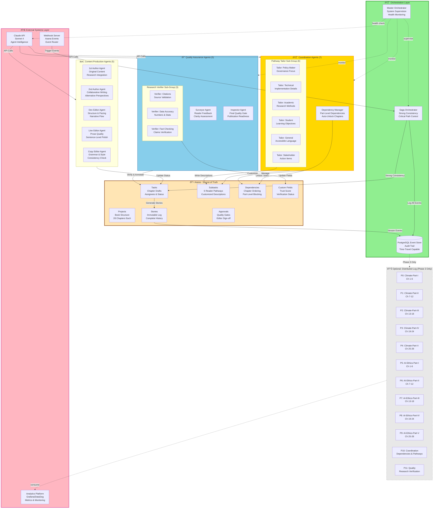
```mermaid
graph TB
 subgraph External["🌐 External Systems Layer"]
 Claude[Claude API<br/>Sonnet 4<br/>Agent Intelligence]
 Webhook[Webhook Server<br/>Asana Events<br/>Event Router]
 Analytics[Analytics Platform<br/>Grafana/DataDog<br/>Metrics & Monitoring]
 end

subgraph Asana["📋 Asana - Source of Truth"]
 Projects[Projects<br/>Book Structure<br/>28 Chapters Each]
 Tasks[Tasks<br/>Chapter Drafts<br/>Assignees & Status]
 Subtasks[Subtasks<br/>6 Reader Pathways<br/>Customized Descriptions]
 Dependencies[Dependencies<br/>Chapter Ordering<br/>Part-Level Blocking]
 CustomFields[Custom Fields<br/>Trust Score<br/>Verification Status]
 Stories[Stories<br/>Immutable Log<br/>Complete History]
 Approvals[Approvals<br/>Quality Gates<br/>Editor Sign-off]
 end

subgraph ContentAgents["✍️ Content Production Agents (5)"]
 Author1[1st Author Agent<br/>Original Content<br/>Research Integration]
 Author2[2nd Author Agent<br/>Collaborative Writing<br/>Alternative Perspectives]
 DevEditor[Dev Editor Agent<br/>Structure & Pacing<br/>Narrative Flow]
 LineEditor[Line Editor Agent<br/>Prose Quality<br/>Sentence-Level Polish]
 CopyEditor[Copy Editor Agent<br/>Grammar & Style<br/>Consistency Check]
 end

subgraph NewCoordAgents["🎯 Coordination Agents (7)"]
 DepMgr[Dependency Manager<br/>Part-Level Dependencies<br/>Auto-Unlock Chapters]

subgraph PathwayTailors["Pathway Tailor Sub-Group (6)"]
 PT1[Tailor: Policy Maker<br/>Governance Focus]
 PT2[Tailor: Technical<br/>Implementation Details]
 PT3[Tailor: Academic<br/>Research Methods]
 PT4[Tailor: Student<br/>Learning Objectives]
 PT5[Tailor: General<br/>Accessible Language]
 PT6[Tailor: Stakeholder<br/>Action Items]
 end
 end

subgraph NewQualityAgents["🔍 Quality Assurance Agents (5)"]
 subgraph ResearchVerifiers["Research Verifier Sub-Group (3)"]
 RV1[Verifier: Citations<br/>Source Validation]
 RV2[Verifier: Data Accuracy<br/>Numbers & Stats]
 RV3[Verifier: Fact Checking<br/>Claims Verification]
 end

Surveyor[Surveyor Agent<br/>Reader Feedback<br/>Clarity Assessment]
 Inspector[Inspector Agent<br/>Final Quality Gate<br/>Publication Readiness]
 end

subgraph Orchestration["🎯 Orchestration Layer"]
 SagaEngine[Saga Orchestrator<br/>Strong Consistency<br/>Critical Path Control]
 EventLog[(PostgreSQL Event Store<br/>Audit Trail<br/>Time-Travel Capable)]
 Orchestrator[Master Orchestrator<br/>System Supervision<br/>Health Monitoring]
 end

subgraph DistributedLog["📊 Optional: Distributed Log (Phase 3 Only)"]
 P0[P0: Climate-Part-I<br/>Ch 1-6]
 P1[P1: Climate-Part-II<br/>Ch 7-12]
 P2[P2: Climate-Part-III<br/>Ch 13-18]
 P3[P3: Climate-Part-IV<br/>Ch 19-24]
 P4[P4: Climate-Part-V<br/>Ch 25-28]
 P5[P5: AI-Ethics-Part-I<br/>Ch 1-6]
 P6[P6: AI-Ethics-Part-II<br/>Ch 7-12]
 P7[P7: AI-Ethics-Part-III<br/>Ch 13-18]
 P8[P8: AI-Ethics-Part-IV<br/>Ch 19-24]
 P9[P9: AI-Ethics-Part-V<br/>Ch 25-28]
 P10[P10: Coordination<br/>Dependencies & Pathways]
 P11[P11: Quality<br/>Research Verification]
 end

Claude -->|API Calls| ContentAgents
 Claude -->|API Calls| NewCoordAgents
 Claude -->|API Calls| NewQualityAgents

Webhook -->|Trigger Events| SagaEngine
 SagaEngine -->|Strong Consistency| Tasks
 SagaEngine -->|Log All Events| EventLog

ContentAgents -->|Update Status| Tasks
 NewCoordAgents -->|Manage| Dependencies
 NewCoordAgents -->|Customize| Subtasks
 NewQualityAgents -->|Verify & Annotate| Tasks

Tasks -->|Generate Stories| Stories
 Stories -->|Stream Events| EventLog

EventLog -.Phase 3 Only.-> DistributedLog
 DistributedLog -.consume.-> Analytics

Orchestrator -.supervise.-> SagaEngine
 Orchestrator -.monitor.-> NewCoordAgents
 Orchestrator -.monitor.-> NewQualityAgents
 Orchestrator -.health check.-> Claude

DepMgr -->|Unlock Tasks| Dependencies
 PathwayTailors -->|Write Descriptions| Subtasks
 ResearchVerifiers -->|Update Fields| CustomFields

style Asana fill:#FFE5B4,stroke:#8B4513,stroke-width:3px
 style NewCoordAgents fill:#FFD700,stroke:#FF8C00,stroke-width:2px
 style NewQualityAgents fill:#87CEEB,stroke:#4682B4,stroke-width:2px
 style Orchestration fill:#90EE90,stroke:#228B22,stroke-width:3px
 style DistributedLog fill:#E8E8E8,stroke:#666,stroke-dasharray: 5 5
 style External fill:#FFB6C1,stroke:#C71585,stroke-width:2px
```

### 1.2 Architectural Layers

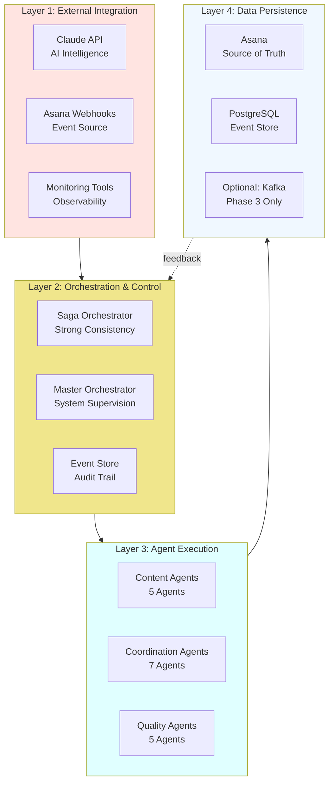
```mermaid
graph TB
 subgraph Layer1["Layer 1: External Integration"]
 L1A[Claude API<br/>AI Intelligence]
 L1B[Asana Webhooks<br/>Event Source]
 L1C[Monitoring Tools<br/>Observability]
 end

subgraph Layer2["Layer 2: Orchestration & Control"]
 L2A[Saga Orchestrator<br/>Strong Consistency]
 L2B[Master Orchestrator<br/>System Supervision]
 L2C[Event Store<br/>Audit Trail]
 end

subgraph Layer3["Layer 3: Agent Execution"]
 L3A[Content Agents<br/>5 Agents]
 L3B[Coordination Agents<br/>7 Agents]
 L3C[Quality Agents<br/>5 Agents]
 end

subgraph Layer4["Layer 4: Data Persistence"]
 L4A[Asana<br/>Source of Truth]
 L4B[PostgreSQL<br/>Event Store]
 L4C[Optional: Kafka<br/>Phase 3 Only]
 end

Layer1 --> Layer2
 Layer2 --> Layer3
 Layer3 --> Layer4
 Layer4 -.feedback.-> Layer2

style Layer1 fill:#FFE4E1
 style Layer2 fill:#F0E68C
 style Layer3 fill:#E0FFFF
 style Layer4 fill:#F0F8FF
```

---

## 2. PARTITIONING STRATEGY & DATA FLOW

### 2.1 Partition Architecture

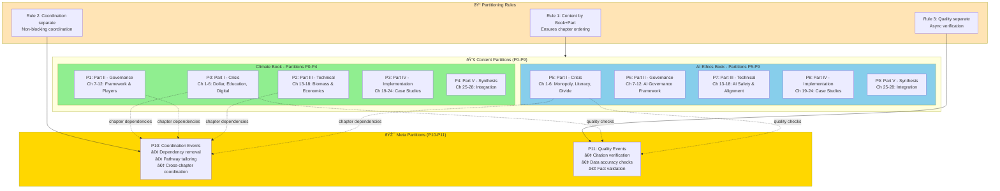
```mermaid
graph TB
 subgraph PartitioningRules["📏 Partitioning Rules"]
 R1[Rule 1: Content by Book+Part<br/>Ensures chapter ordering]
 R2[Rule 2: Coordination separate<br/>Non-blocking coordination]
 R3[Rule 3: Quality separate<br/>Async verification]
 end

subgraph ContentPartitions["📚 Content Partitions (P0-P9)"]
 subgraph ClimateBook["Climate Book - Partitions P0-P4"]
 CP0[P0: Part I - Crisis<br/>Ch 1-6: Dollar, Education, Digital]
 CP1[P1: Part II - Governance<br/>Ch 7-12: Framework & Players]
 CP2[P2: Part III - Technical<br/>Ch 13-18: Biomass & Economics]
 CP3[P3: Part IV - Implementation<br/>Ch 19-24: Case Studies]
 CP4[P4: Part V - Synthesis<br/>Ch 25-28: Integration]
 end

subgraph AIBook["AI Ethics Book - Partitions P5-P9"]
 AP0[P5: Part I - Crisis<br/>Ch 1-6: Monopoly, Literacy, Divide]
 AP1[P6: Part II - Governance<br/>Ch 7-12: AI Governance Framework]
 AP2[P7: Part III - Technical<br/>Ch 13-18: AI Safety & Alignment]
 AP3[P8: Part IV - Implementation<br/>Ch 19-24: Case Studies]
 AP4[P9: Part V - Synthesis<br/>Ch 25-28: Integration]
 end
 end

subgraph MetaPartitions["🎯 Meta Partitions (P10-P11)"]
 CP10[P10: Coordination Events<br/>• Dependency removal<br/>• Pathway tailoring<br/>• Cross-chapter coordination]
 CP11[P11: Quality Events<br/>• Citation verification<br/>• Data accuracy checks<br/>• Fact validation]
 end

R1 --> ContentPartitions
 R2 --> CP10
 R3 --> CP11

CP0 -.chapter dependencies.-> CP10
 CP1 -.chapter dependencies.-> CP10
 CP2 -.chapter dependencies.-> CP10
 AP0 -.chapter dependencies.-> CP10

CP0 -.quality checks.-> CP11
 AP0 -.quality checks.-> CP11

style PartitioningRules fill:#FFE4B5
 style ClimateBook fill:#90EE90
 style AIBook fill:#87CEEB
 style MetaPartitions fill:#FFD700
```

### 2.2 Data Flow Architecture

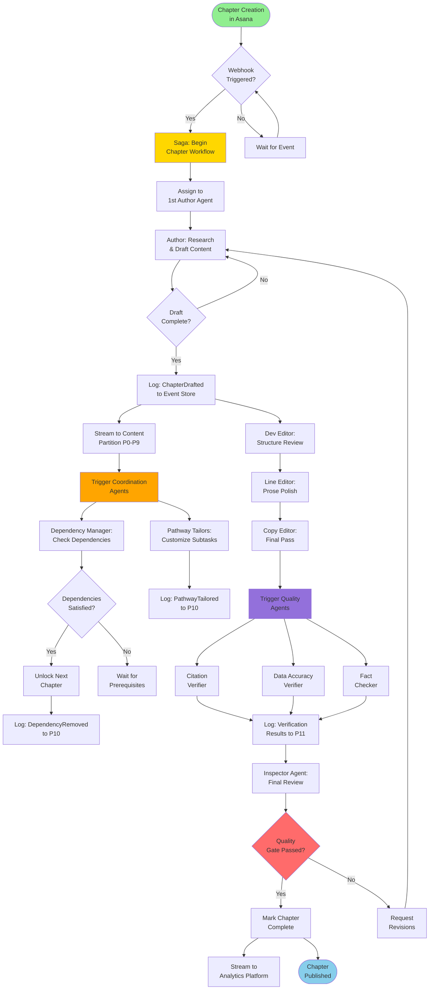
```mermaid
flowchart TD
 Start([Chapter Creation<br/>in Asana])

Start --> Webhook{Webhook<br/>Triggered?}
 Webhook -->|Yes| SagaStart[Saga: Begin<br/>Chapter Workflow]
 Webhook -->|No| Wait[Wait for Event]
 Wait --> Webhook

SagaStart --> Author1Task[Assign to<br/>1st Author Agent]
 Author1Task --> Author1Work[Author: Research<br/>& Draft Content]

Author1Work --> Author1Complete{Draft<br/>Complete?}
 Author1Complete -->|Yes| LogEvent1[Log: ChapterDrafted<br/>to Event Store]
 Author1Complete -->|No| Author1Work

LogEvent1 --> StreamP0[Stream to Content<br/>Partition P0-P9]
 StreamP0 --> TriggerCoord[Trigger Coordination<br/>Agents]

TriggerCoord --> DepCheck[Dependency Manager:<br/>Check Dependencies]
 TriggerCoord --> PathwayTailor[Pathway Tailors:<br/>Customize Subtasks]

DepCheck --> DepAction{Dependencies<br/>Satisfied?}
 DepAction -->|Yes| UnlockNext[Unlock Next<br/>Chapter]
 DepAction -->|No| DepWait[Wait for<br/>Prerequisites]

UnlockNext --> LogEvent2[Log: DependencyRemoved<br/>to P10]
 PathwayTailor --> LogEvent3[Log: PathwayTailored<br/>to P10]

LogEvent1 --> DevEditor[Dev Editor:<br/>Structure Review]
 DevEditor --> LineEditor[Line Editor:<br/>Prose Polish]
 LineEditor --> CopyEditor[Copy Editor:<br/>Final Pass]

CopyEditor --> TriggerQuality[Trigger Quality<br/>Agents]

TriggerQuality --> RV1[Citation<br/>Verifier]
 TriggerQuality --> RV2[Data Accuracy<br/>Verifier]
 TriggerQuality --> RV3[Fact<br/>Checker]

RV1 --> QualityLog[Log: Verification<br/>Results to P11]
 RV2 --> QualityLog
 RV3 --> QualityLog

QualityLog --> Inspector[Inspector Agent:<br/>Final Review]
 Inspector --> Approval{Quality<br/>Gate Passed?}

Approval -->|Yes| Complete[Mark Chapter<br/>Complete]
 Approval -->|No| Revisions[Request<br/>Revisions]

Revisions --> Author1Work
 Complete --> Analytics[Stream to<br/>Analytics Platform]

Complete --> End([Chapter<br/>Published])

style Start fill:#90EE90
 style End fill:#87CEEB
 style SagaStart fill:#FFD700
 style TriggerCoord fill:#FFA500
 style TriggerQuality fill:#9370DB
 style Approval fill:#FF6B6B
```

### 2.3 Partition Routing Logic

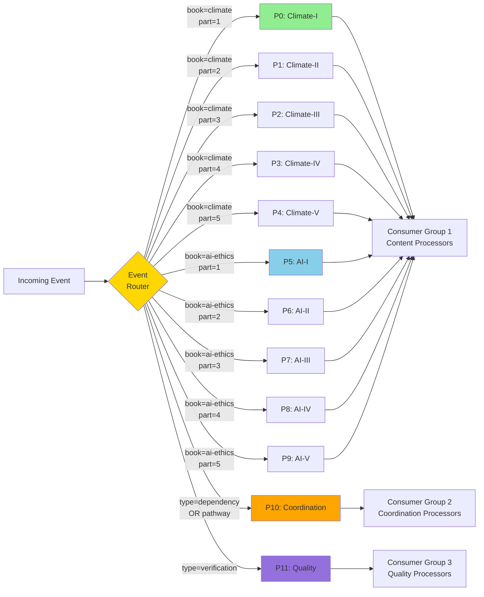
```mermaid
graph LR
 Event[Incoming Event] --> Router{Event<br/>Router}

Router -->|book=climate<br/>part=1| P0[P0: Climate-I]
 Router -->|book=climate<br/>part=2| P1[P1: Climate-II]
 Router -->|book=climate<br/>part=3| P2[P2: Climate-III]
 Router -->|book=climate<br/>part=4| P3[P3: Climate-IV]
 Router -->|book=climate<br/>part=5| P4[P4: Climate-V]

Router -->|book=ai-ethics<br/>part=1| P5[P5: AI-I]
 Router -->|book=ai-ethics<br/>part=2| P6[P6: AI-II]
 Router -->|book=ai-ethics<br/>part=3| P7[P7: AI-III]
 Router -->|book=ai-ethics<br/>part=4| P8[P8: AI-IV]
 Router -->|book=ai-ethics<br/>part=5| P9[P9: AI-V]

Router -->|type=dependency<br/>OR pathway| P10[P10: Coordination]
 Router -->|type=verification| P11[P11: Quality]

P0 --> Consumer1[Consumer Group 1<br/>Content Processors]
 P1 --> Consumer1
 P2 --> Consumer1
 P3 --> Consumer1
 P4 --> Consumer1
 P5 --> Consumer1
 P6 --> Consumer1
 P7 --> Consumer1
 P8 --> Consumer1
 P9 --> Consumer1

P10 --> Consumer2[Consumer Group 2<br/>Coordination Processors]
 P11 --> Consumer3[Consumer Group 3<br/>Quality Processors]

style Router fill:#FFD700
 style P0 fill:#90EE90
 style P5 fill:#87CEEB
 style P10 fill:#FFA500
 style P11 fill:#9370DB
```

---

## 3. AGENT ECOSYSTEM & INTERACTIONS

### Ephemeral Agent Lifecycle in Distributed System

**Each agent generation follows this lifecycle**:

```
1. CREATION: Agent N spawned from Knowledge Transfer N-1
2. CONTEXT LOADING: Load 5K token compressed knowledge (bounded)
3. TASK EXECUTION: Execute single task (70% of budget)
4. KNOWLEDGE CRYSTALLIZATION: Extract patterns, compress learnings (20% of budget)
5. TRANSFER GENERATION: Produce Knowledge Transfer N for successor (10% of budget)
6. HANDOFF: Pass result + transfer to system
7. DISPOSAL: Agent N terminated, memory freed
8. SUCCESSION: Agent N+1 created from Knowledge Transfer N
```

**Distributed Log Integration**:

- **Event Published**: `AgentHandoff(generation=N, to_generation=N+1, task_id=X, result_summary=Y, transfer_size=5000)`
- **NOT Published**: Full knowledge transfer payload (too expensive)
- **Audit Trail**: Metadata chain allows reconstruction of agent lineage for debugging
- **Partial Auditability**: Sufficient for system health monitoring, insufficient for complete history replay

### 3.1 Complete Agent Hierarchy

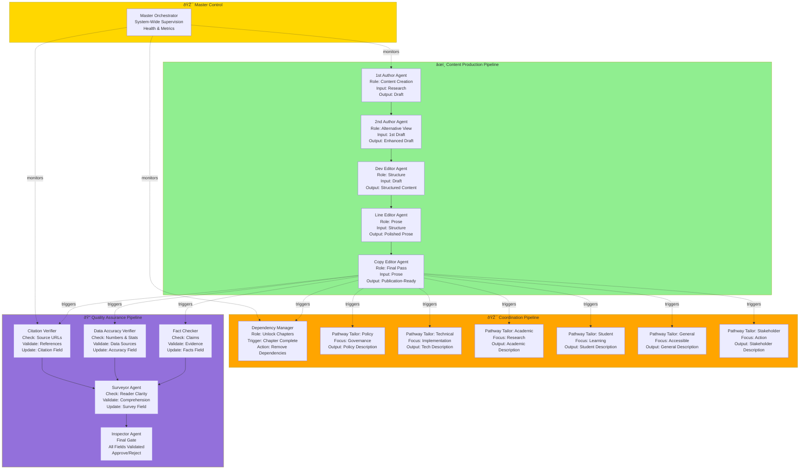
```mermaid
graph TB
 subgraph MasterControl["🎯 Master Control"]
 Master[Master Orchestrator<br/>System-Wide Supervision<br/>Health & Metrics]
 end

subgraph ContentPipeline["✍️ Content Production Pipeline"]
 A1[1st Author Agent<br/>Role: Content Creation<br/>Input: Research<br/>Output: Draft]

A2[2nd Author Agent<br/>Role: Alternative View<br/>Input: 1st Draft<br/>Output: Enhanced Draft]

DE[Dev Editor Agent<br/>Role: Structure<br/>Input: Draft<br/>Output: Structured Content]

LE[Line Editor Agent<br/>Role: Prose<br/>Input: Structure<br/>Output: Polished Prose]

CE[Copy Editor Agent<br/>Role: Final Pass<br/>Input: Prose<br/>Output: Publication-Ready]
 end

subgraph CoordPipeline["🎯 Coordination Pipeline"]
 DM[Dependency Manager<br/>Role: Unlock Chapters<br/>Trigger: Chapter Complete<br/>Action: Remove Dependencies]

PT1[Pathway Tailor: Policy<br/>Focus: Governance<br/>Output: Policy Description]
 PT2[Pathway Tailor: Technical<br/>Focus: Implementation<br/>Output: Tech Description]
 PT3[Pathway Tailor: Academic<br/>Focus: Research<br/>Output: Academic Description]
 PT4[Pathway Tailor: Student<br/>Focus: Learning<br/>Output: Student Description]
 PT5[Pathway Tailor: General<br/>Focus: Accessible<br/>Output: General Description]
 PT6[Pathway Tailor: Stakeholder<br/>Focus: Action<br/>Output: Stakeholder Description]
 end

subgraph QualityPipeline["🔍 Quality Assurance Pipeline"]
 RV1[Citation Verifier<br/>Check: Source URLs<br/>Validate: References<br/>Update: Citation Field]

RV2[Data Accuracy Verifier<br/>Check: Numbers & Stats<br/>Validate: Data Sources<br/>Update: Accuracy Field]

RV3[Fact Checker<br/>Check: Claims<br/>Validate: Evidence<br/>Update: Facts Field]

Survey[Surveyor Agent<br/>Check: Reader Clarity<br/>Validate: Comprehension<br/>Update: Survey Field]

Inspect[Inspector Agent<br/>Final Gate<br/>All Fields Validated<br/>Approve/Reject]
 end

Master -.monitors.-> A1
 Master -.monitors.-> DM
 Master -.monitors.-> RV1

A1 --> A2
 A2 --> DE
 DE --> LE
 LE --> CE

CE -.triggers.-> DM
 CE -.triggers.-> PT1
 CE -.triggers.-> PT2
 CE -.triggers.-> PT3
 CE -.triggers.-> PT4
 CE -.triggers.-> PT5
 CE -.triggers.-> PT6

CE -.triggers.-> RV1
 CE -.triggers.-> RV2
 CE -.triggers.-> RV3

RV1 --> Survey
 RV2 --> Survey
 RV3 --> Survey
 Survey --> Inspect

style MasterControl fill:#FFD700
 style ContentPipeline fill:#90EE90
 style CoordPipeline fill:#FFA500
 style QualityPipeline fill:#9370DB
```

### 3.2 Agent Communication Patterns (Ephemeral Model)

**Communication is now primarily through structured knowledge transfers, not persistent state queries.**

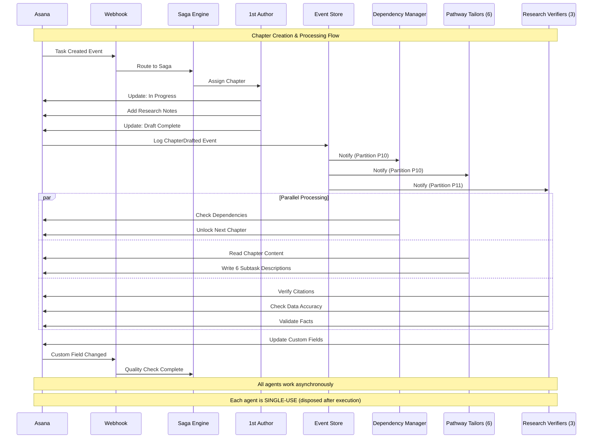
```mermaid
sequenceDiagram
 participant AS as Asana
 participant WH as Webhook
 participant SA as Saga Engine
 participant A1 as 1st Author
 participant ES as Event Store
 participant DM as Dependency Manager
 participant PT as Pathway Tailors (6)
 participant RV as Research Verifiers (3)

Note over AS,RV: Chapter Creation & Processing Flow

AS->>WH: Task Created Event
 WH->>SA: Route to Saga
 SA->>A1: Assign Chapter

A1->>AS: Update: In Progress
 A1->>AS: Add Research Notes
 A1->>AS: Update: Draft Complete

AS->>ES: Log ChapterDrafted Event
 ES->>DM: Notify (Partition P10)
 ES->>PT: Notify (Partition P10)
 ES->>RV: Notify (Partition P11)

par Parallel Processing
 DM->>AS: Check Dependencies
 DM->>AS: Unlock Next Chapter
 and
 PT->>AS: Read Chapter Content
 PT->>AS: Write 6 Subtask Descriptions
 and
 RV->>AS: Verify Citations
 RV->>AS: Check Data Accuracy
 RV->>AS: Validate Facts
 end

RV->>AS: Update Custom Fields
 AS->>WH: Custom Field Changed
 WH->>SA: Quality Check Complete

Note over AS,RV: All agents work asynchronously
Note over AS,RV: Each agent is SINGLE-USE (disposed after execution)
```

### 3.3 Agent Trust & Scoring (Ephemeral Model)

**Trust scoring is maintained in knowledge transfer packets, not in persistent agent state.**

**Key Changes**:

- Trust score is part of `KnowledgeTransferPacket.metadata['trust_score']`
- Each agent generation inherits trust score from predecessor
- Trust updates are computed during knowledge crystallization phase
- Trust score is bounded (0-100) and compressed (no full history)
- Trust degradation from failures is recorded as patterns, not raw events

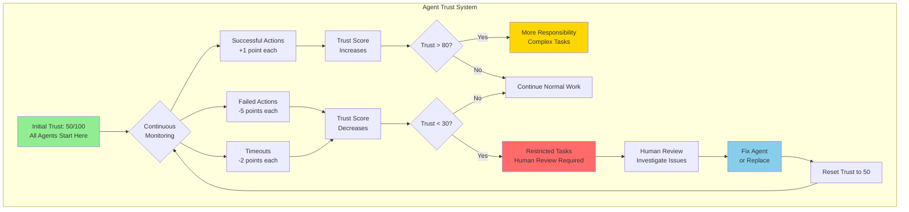
```mermaid
graph TB
 subgraph TrustSystem[" Agent Trust System"]
 Initial[Initial Trust: 50/100<br/>All Agents Start Here]

Initial --> Monitor{Continuous<br/>Monitoring}

Monitor --> Success[Successful Actions<br/>+1 point each]
 Monitor --> Failure[Failed Actions<br/>-5 points each]
 Monitor --> Timeout[Timeouts<br/>-2 points each]

Success --> ScoreUp[Trust Score<br/>Increases]
 Failure --> ScoreDown[Trust Score<br/>Decreases]
 Timeout --> ScoreDown

ScoreUp --> CheckHigh{Trust > 80?}
 CheckHigh -->|Yes| Promote[More Responsibility<br/>Complex Tasks]
 CheckHigh -->|No| Continue[Continue Normal Work]

ScoreDown --> CheckLow{Trust < 30?}
 CheckLow -->|Yes| Restrict[Restricted Tasks<br/>Human Review Required]
 CheckLow -->|No| Continue

Restrict --> Review[Human Review<br/>Investigate Issues]
 Review --> Fix[Fix Agent<br/>or Replace]

Fix --> Reset[Reset Trust to 50]
 Reset --> Monitor
 end

style Initial fill:#90EE90
 style Promote fill:#FFD700
 style Restrict fill:#FF6B6B
 style Fix fill:#87CEEB
```

---

## 4. EVENT FLOW PATTERNS

### Ephemeral Agent Events in Distributed Log

**New Event Types for Ephemeral Architecture**:

```tsx
interface AgentHandoffEvent {
  event_type: "AgentHandoff";
  event_id: string;
  timestamp: string;
  partition: string;  // P0-P11
  
  from_generation: number;
  to_generation: number;
  task_id: string;
  
  // METADATA ONLY (not full payload)
  result_summary: string;  // Compressed summary
  transfer_size_tokens: number;
  patterns_transferred: number;
  constraints_active: number;
  
  // Audit chain (for reconstruction)
  lineage_hash: string;  // Hash of transfer chain
  predecessor_hash: string;  // Link to previous generation
}

interface AgentDisposalEvent {
  event_type: "AgentDisposed";
  event_id: string;
  timestamp: string;
  partition: string;
  
  agent_generation: number;
  tasks_executed: number;
  total_lifetime_ms: number;
  
  // Performance metrics
  execution_time_ms: number;
  crystallization_time_ms: number;
  transfer_time_ms: number;
}
```

**Partial Auditability Strategy**:

- ✅ Log: Handoff metadata (generation, task, result summary, transfer size)
- ✅ Log: Disposal events (performance metrics, lifetime)
- ✅ Log: Transfer chain hashes (lineage tracking)
- ❌ DO NOT Log: Full knowledge transfer payloads (too expensive)
- ❌ DO NOT Log: Complete agent execution traces (bounded audit)

**Reconstruction for Debugging**:

- Use lineage hashes to trace agent succession: Gen 1 → Gen 2 → ... → Gen N
- Use transfer size metrics to identify compression issues
- Use performance metrics to identify bottlenecks
- Full content reconstruction NOT possible (trade-off for bounded audit)

### 4.1 Complete Event Lifecycle

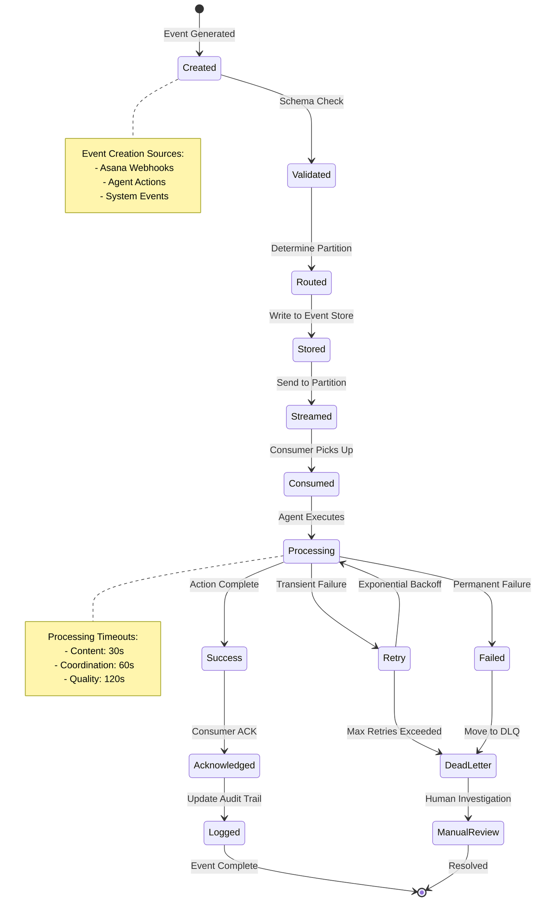
```mermaid
stateDiagram-v2
 [*] --> Created: Event Generated

Created --> Validated: Schema Check
 Validated --> Routed: Determine Partition
 Routed --> Stored: Write to Event Store
 Stored --> Streamed: Send to Partition

Streamed --> Consumed: Consumer Picks Up
 Consumed --> Processing: Agent Executes

Processing --> Success: Action Complete
 Processing --> Retry: Transient Failure
 Processing --> Failed: Permanent Failure

Retry --> Processing: Exponential Backoff
 Retry --> DeadLetter: Max Retries Exceeded

Success --> Acknowledged: Consumer ACK
 Failed --> DeadLetter: Move to DLQ

Acknowledged --> Logged: Update Audit Trail
 Logged --> [*]: Event Complete

DeadLetter --> ManualReview: Human Investigation
 ManualReview --> [*]: Resolved

note right of Created
 Event Creation Sources:
 - Asana Webhooks
 - Agent Actions
 - System Events
 end note

note right of Processing
 Processing Timeouts:
 - Content: 30s
 - Coordination: 60s
 - Quality: 120s
 end note
```

### 4.2 Event Types & Routing

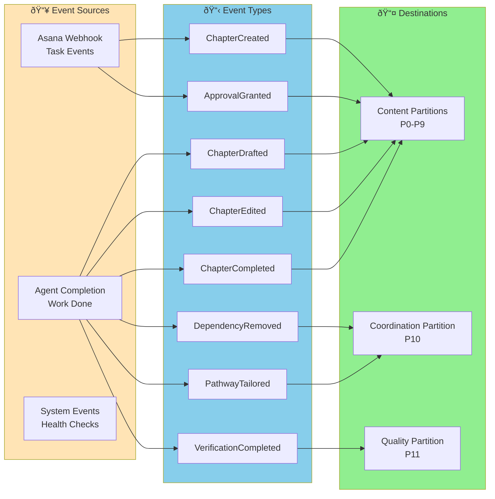
```mermaid
graph LR
 subgraph Sources["📥 Event Sources"]
 S1[Asana Webhook<br/>Task Events]
 S2[Agent Completion<br/>Work Done]
 S3[System Events<br/>Health Checks]
 end

subgraph EventTypes["📋 Event Types"]
 E1[ChapterCreated]
 E2[ChapterDrafted]
 E3[ChapterEdited]
 E4[ChapterCompleted]
 E5[DependencyRemoved]
 E6[PathwayTailored]
 E7[VerificationCompleted]
 E8[ApprovalGranted]
 end

subgraph Destinations["📤 Destinations"]
 D1[Content Partitions<br/>P0-P9]
 D2[Coordination Partition<br/>P10]
 D3[Quality Partition<br/>P11]
 end

S1 --> E1
 S1 --> E8
 S2 --> E2
 S2 --> E3
 S2 --> E4
 S2 --> E5
 S2 --> E6
 S2 --> E7

E1 --> D1
 E2 --> D1
 E3 --> D1
 E4 --> D1
 E5 --> D2
 E6 --> D2
 E7 --> D3
 E8 --> D1

style Sources fill:#FFE4B5
 style EventTypes fill:#87CEEB
 style Destinations fill:#90EE90
```

### 4.3 Cross-Partition Coordination

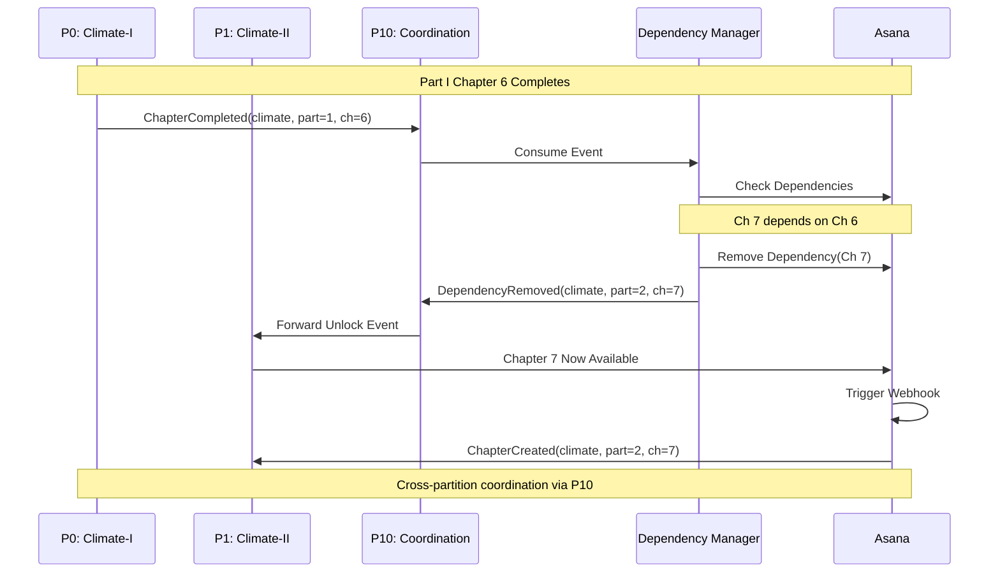
```mermaid
sequenceDiagram
 participant P0 as P0: Climate-I
 participant P1 as P1: Climate-II
 participant P10 as P10: Coordination
 participant DM as Dependency Manager
 participant AS as Asana

Note over P0,AS: Part I Chapter 6 Completes

P0->>P10: ChapterCompleted(climate, part=1, ch=6)
 P10->>DM: Consume Event
 DM->>AS: Check Dependencies

Note over DM,AS: Ch 7 depends on Ch 6

DM->>AS: Remove Dependency(Ch 7)
 DM->>P10: DependencyRemoved(climate, part=2, ch=7)

P10->>P1: Forward Unlock Event
 P1->>AS: Chapter 7 Now Available

AS->>AS: Trigger Webhook
 AS->>P1: ChapterCreated(climate, part=2, ch=7)

Note over P0,AS: Cross-partition coordination via P10
```

---

## 5. HYBRID CONSISTENCY MODEL

### 5.1 Consistency Architecture

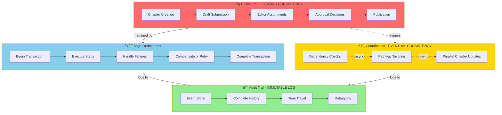
```mermaid
graph TB
 subgraph Critical["âš¡ Critical Path - STRONG CONSISTENCY"]
 C1[Chapter Creation]
 C2[Draft Submission]
 C3[Editor Assignments]
 C4[Approval Decisions]
 C5[Publication]

C1 --> C2 --> C3 --> C4 --> C5
 end

subgraph EventualC["🔄 Coordination - EVENTUAL CONSISTENCY"]
 EC1[Dependency Checks]
 EC2[Pathway Tailoring]
 EC3[Parallel Chapter Updates]

EC1 -.async.-> EC2
 EC2 -.async.-> EC3
 end

subgraph Audit["📝 Audit Trail - IMMUTABLE LOG"]
 A1[Event Store]
 A2[Complete History]
 A3[Time Travel]
 A4[Debugging]

A1 --> A2 --> A3 --> A4
 end

subgraph Saga["🎯 Saga Orchestrator"]
 S1[Begin Transaction]
 S2[Execute Steps]
 S3[Handle Failures]
 S4[Compensate or Retry]
 S5[Complete Transaction]

S1 --> S2
 S2 --> S3
 S3 --> S4
 S4 --> S5
 end

Critical -->|managed by| Saga
 Saga -->|logs to| Audit
 Critical -.triggers.-> EventualC
 EventualC -->|logs to| Audit

style Critical fill:#FF6B6B
 style EventualC fill:#FFD700
 style Audit fill:#90EE90
 style Saga fill:#87CEEB
```

### 5.2 Saga Pattern Implementation

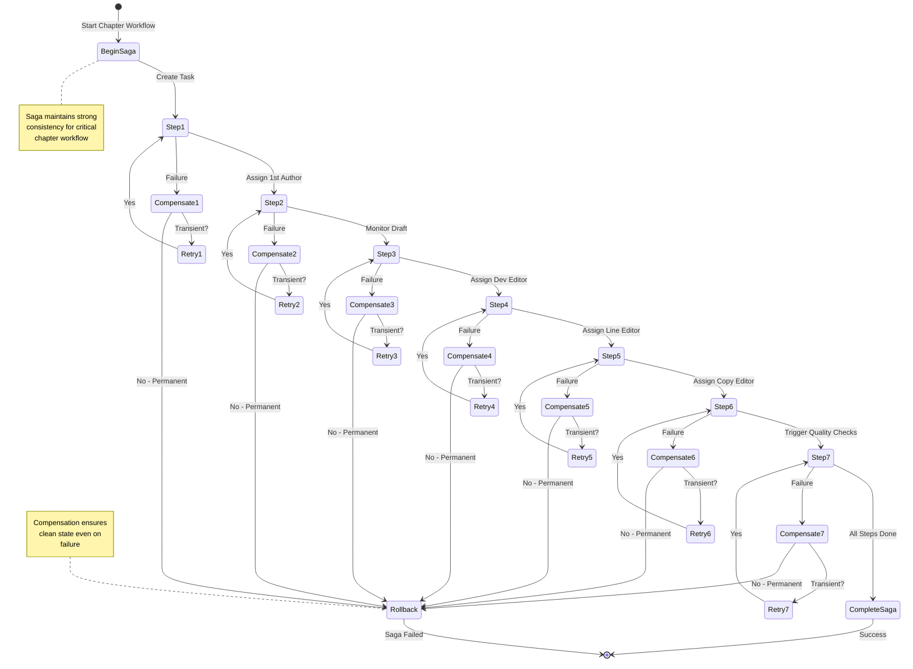
```mermaid
stateDiagram-v2
 [*] --> BeginSaga: Start Chapter Workflow

BeginSaga --> Step1: Create Task
 Step1 --> Step2: Assign 1st Author
 Step2 --> Step3: Monitor Draft
 Step3 --> Step4: Assign Dev Editor
 Step4 --> Step5: Assign Line Editor
 Step5 --> Step6: Assign Copy Editor
 Step6 --> Step7: Trigger Quality Checks
 Step7 --> CompleteSaga: All Steps Done

Step1 --> Compensate1: Failure
 Step2 --> Compensate2: Failure
 Step3 --> Compensate3: Failure
 Step4 --> Compensate4: Failure
 Step5 --> Compensate5: Failure
 Step6 --> Compensate6: Failure
 Step7 --> Compensate7: Failure

Compensate1 --> Retry1: Transient?
 Compensate2 --> Retry2: Transient?
 Compensate3 --> Retry3: Transient?
 Compensate4 --> Retry4: Transient?
 Compensate5 --> Retry5: Transient?
 Compensate6 --> Retry6: Transient?
 Compensate7 --> Retry7: Transient?

Retry1 --> Step1: Yes
 Retry2 --> Step2: Yes
 Retry3 --> Step3: Yes
 Retry4 --> Step4: Yes
 Retry5 --> Step5: Yes
 Retry6 --> Step6: Yes
 Retry7 --> Step7: Yes

Compensate1 --> Rollback: No - Permanent
 Compensate2 --> Rollback: No - Permanent
 Compensate3 --> Rollback: No - Permanent
 Compensate4 --> Rollback: No - Permanent
 Compensate5 --> Rollback: No - Permanent
 Compensate6 --> Rollback: No - Permanent
 Compensate7 --> Rollback: No - Permanent

Rollback --> [*]: Saga Failed
 CompleteSaga --> [*]: Success

note right of BeginSaga
 Saga maintains strong
 consistency for critical
 chapter workflow
 end note

note left of Rollback
 Compensation ensures
 clean state even on
 failure
 end note
```

### 5.3 Consistency Guarantees by Component

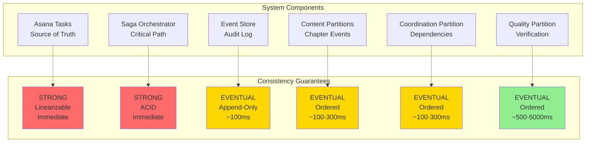
```mermaid
graph TB
 subgraph Components["System Components"]
 C1[Asana Tasks<br/>Source of Truth]
 C2[Saga Orchestrator<br/>Critical Path]
 C3[Event Store<br/>Audit Log]
 C4[Content Partitions<br/>Chapter Events]
 C5[Coordination Partition<br/>Dependencies]
 C6[Quality Partition<br/>Verification]
 end

subgraph Guarantees["Consistency Guarantees"]
 G1[STRONG<br/>Linearizable<br/>Immediate]
 G2[STRONG<br/>ACID<br/>Immediate]
 G3[EVENTUAL<br/>Append-Only<br/>~100ms]
 G4[EVENTUAL<br/>Ordered<br/>~100-300ms]
 G5[EVENTUAL<br/>Ordered<br/>~100-300ms]
 G6[EVENTUAL<br/>Ordered<br/>~500-5000ms]
 end

C1 -.-> G1
 C2 -.-> G2
 C3 -.-> G3
 C4 -.-> G4
 C5 -.-> G5
 C6 -.-> G6

style G1 fill:#FF6B6B
 style G2 fill:#FF6B6B
 style G3 fill:#FFD700
 style G4 fill:#FFD700
 style G5 fill:#FFD700
 style G6 fill:#90EE90
```

---

## 6. IMPLEMENTATION PHASES

### 6.1 Three-Phase Rollout


```mermaid
graph TB
 subgraph Phase1["📦 PHASE 1: START SIMPLE (Weeks 1-12)"]
 P1_Infra["Infrastructure:<br/>• Asana (source of truth)<br/>• PostgreSQL (event store)<br/>• Simple webhook server<br/>• Claude API"]

P1_Agents["Agents:<br/>• 5 Content agents<br/>• 1 Dependency Manager<br/>• 6 Pathway Tailors<br/>• 3 Research Verifiers<br/>• 2 Quality Agents"]

P1_Scale["Expected Scale:<br/>• <100 events/sec<br/>• <1000 tasks/day<br/>• 2-3 book projects<br/>• 17 total agents"]

P1_Complexity["Complexity: LOW<br/>✅ No Kafka<br/>✅ No distributed log<br/>✅ Single database<br/>✅ Simple webhooks"]
 end

subgraph Phase2["🚀 PHASE 2: SCALE UP (Weeks 13-24)"]
 P2_Infra["Add Infrastructure:<br/>• Redis caching<br/>• RabbitMQ queues<br/>• Multiple webhook servers<br/>• Prometheus monitoring<br/>• Grafana dashboards"]

P2_Agents["Expand Agents:<br/>• All Phase 1 agents<br/>• Additional orchestrators<br/>• Analytics consumers<br/>• Backup agents"]

P2_Scale["Expected Scale:<br/>• 100-500 events/sec<br/>• 5000 tasks/day<br/>• 10-20 book projects<br/>• 25+ agents"]

P2_Complexity["Complexity: MEDIUM<br/>⚠️ Message queues<br/>⚠️ Caching layer<br/>⚠️ Load balancing<br/>⚠️ Advanced monitoring"]
 end

subgraph Phase3["âš¡ PHASE 3: HIGH SCALE (Weeks 25+)"]
 P3_Infra["Full Infrastructure:<br/>• Apache Kafka (3+ brokers)<br/>• ZooKeeper cluster<br/>• Distributed tracing<br/>• Advanced analytics<br/>• Auto-scaling"]

P3_Agents["Scale Agents:<br/>• All Phase 2 agents<br/>• Multiple consumer groups<br/>• Rebalancing controllers<br/>• Redundant orchestrators"]

P3_Scale["Expected Scale:<br/>• >1000 events/sec<br/>• 50000+ tasks/day<br/>• 100+ book projects<br/>• 50+ agents"]

P3_Complexity["Complexity: HIGH<br/>🔴 Kafka management<br/>🔴 Partition rebalancing<br/>🔴 Consumer coordination<br/>🔴 Distributed systems expertise"]
 end

Start([Project Start]) --> Decision{Current<br/>Scale?}
 Decision -->|Small| Phase1
 Decision -->|Medium| Phase2
 Decision -->|Large| Phase3

Phase1 --> Eval1{Growing<br/>Beyond?}
 Eval1 -->|Yes| Phase2
 Eval1 -->|No| Stay1[Stay in Phase 1]

Phase2 --> Eval2{Growing<br/>Beyond?}
 Eval2 -->|Yes| Phase3
 Eval2 -->|No| Stay2[Stay in Phase 2]

Phase3 --> Monitor[Monitor &<br/>Optimize]

style Phase1 fill:#90EE90
 style Phase2 fill:#FFD700
 style Phase3 fill:#FF6B6B
```

### 6.2 Phase 1 Implementation Timeline

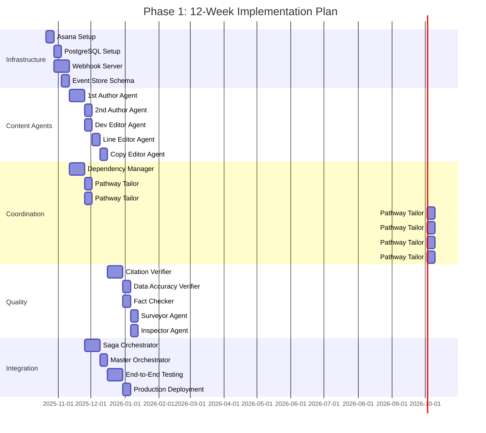
```mermaid
gantt
 title Phase 1: 12-Week Implementation Plan
 dateFormat YYYY-MM-DD
 section Infrastructure
 Asana Setup :a1, 2025-10-21, 1w
 PostgreSQL Setup :a2, after a1, 1w
 Webhook Server :a3, after a1, 2w
 Event Store Schema :a4, after a2, 1w

section Content Agents
 1st Author Agent :b1, after a3, 2w
 2nd Author Agent :b2, after b1, 1w
 Dev Editor Agent :b3, after b1, 1w
 Line Editor Agent :b4, after b3, 1w
 Copy Editor Agent :b5, after b4, 1w

section Coordination
 Dependency Manager :c1, after a4, 2w
 Pathway Tailor: Policy :c2, after c1, 1w
 Pathway Tailor: Technical :c3, after c1, 1w
 Pathway Tailor: Academic :c4, after c2, 1w
 Pathway Tailor: Student :c5, after c2, 1w
 Pathway Tailor: General :c6, after c3, 1w
 Pathway Tailor: Stakeholder:c7, after c3, 1w

section Quality
 Citation Verifier :d1, after b5, 2w
 Data Accuracy Verifier :d2, after d1, 1w
 Fact Checker :d3, after d1, 1w
 Surveyor Agent :d4, after d2, 1w
 Inspector Agent :d5, after d3, 1w

section Integration
 Saga Orchestrator :e1, after c1, 2w
 Master Orchestrator :e2, after e1, 1w
 End-to-End Testing :e3, after e2, 2w
 Production Deployment :e4, after e3, 1w
```

### 6.3 Migration Path Between Phases


```mermaid
graph LR
 subgraph CurrentPhase1["Phase 1 Active"]
 P1A[Asana + PostgreSQL<br/>Simple Webhooks<br/>17 Agents]
 end

subgraph Checkpoint1["Migration Checkpoint"]
 C1{Evaluate:<br/>Events/sec > 100?<br/>Lag > 5000?<br/>Latency p95 > 5s?}
 end

subgraph Migration1["Migration Actions"]
 M1[Add Redis Cache]
 M2[Deploy RabbitMQ]
 M3[Scale Webhook Servers]
 M4[Add Monitoring]
 end

subgraph TargetPhase2["Phase 2 Active"]
 P2A[All Phase 1<br/>+ Message Queues<br/>+ Caching<br/>25+ Agents]
 end

subgraph Checkpoint2["Migration Checkpoint"]
 C2{Evaluate:<br/>Events/sec > 1000?<br/>Projects > 50?<br/>Team Expertise?}
 end

subgraph Migration2["Migration Actions"]
 M5[Deploy Kafka Cluster]
 M6[Implement Partitions]
 M7[Migrate Consumers]
 M8[Add Distributed Tracing]
 end

subgraph TargetPhase3["Phase 3 Active"]
 P3A[All Phase 2<br/>+ Kafka<br/>+ Distributed Log<br/>50+ Agents]
 end

P1A --> C1
 C1 -->|Yes| M1
 C1 -->|No| P1A
 M1 --> M2 --> M3 --> M4 --> P2A

P2A --> C2
 C2 -->|Yes| M5
 C2 -->|No| P2A
 M5 --> M6 --> M7 --> M8 --> P3A

style CurrentPhase1 fill:#90EE90
 style Migration1 fill:#FFD700
 style TargetPhase2 fill:#FFA500
 style Migration2 fill:#FF6B6B
 style TargetPhase3 fill:#8B0000
```

---

## 7. MONITORING & OBSERVABILITY

### 7.1 Comprehensive Monitoring Architecture

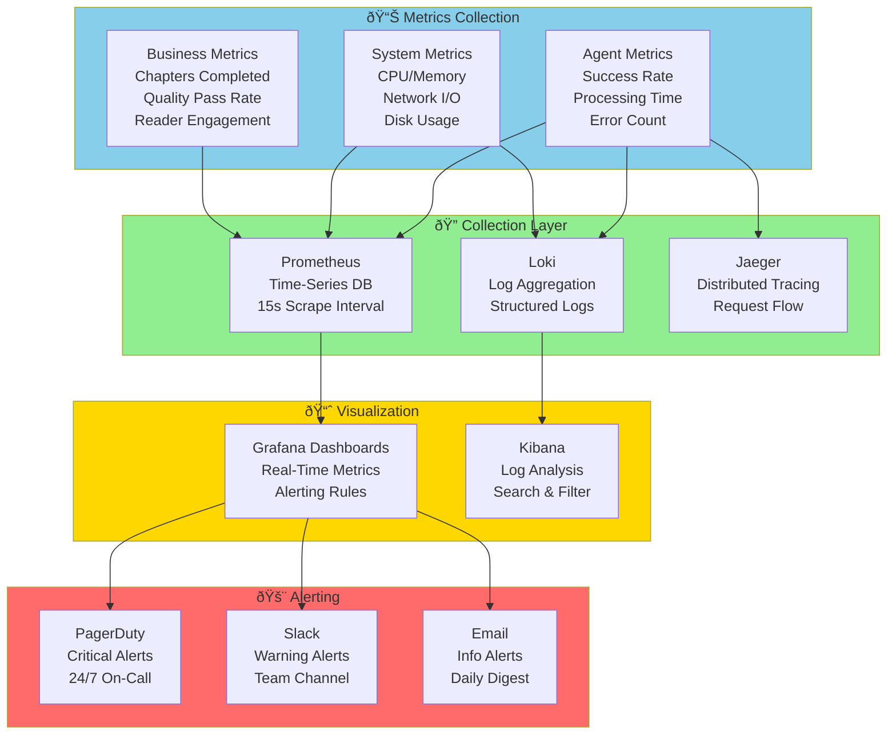
```mermaid
graph TB
 subgraph Metrics["📊 Metrics Collection"]
 M1[Agent Metrics<br/>Success Rate<br/>Processing Time<br/>Error Count]

M2[System Metrics<br/>CPU/Memory<br/>Network I/O<br/>Disk Usage]

M3[Business Metrics<br/>Chapters Completed<br/>Quality Pass Rate<br/>Reader Engagement]
 end

subgraph Collection["🔍 Collection Layer"]
 Prometheus[Prometheus<br/>Time-Series DB<br/>15s Scrape Interval]

Loki[Loki<br/>Log Aggregation<br/>Structured Logs]

Jaeger[Jaeger<br/>Distributed Tracing<br/>Request Flow]
 end

subgraph Visualization["📈 Visualization"]
 Grafana[Grafana Dashboards<br/>Real-Time Metrics<br/>Alerting Rules]

Kibana[Kibana<br/>Log Analysis<br/>Search & Filter]
 end

subgraph Alerting["🚨 Alerting"]
 PD[PagerDuty<br/>Critical Alerts<br/>24/7 On-Call]

Slack[Slack<br/>Warning Alerts<br/>Team Channel]

Email[Email<br/>Info Alerts<br/>Daily Digest]
 end

M1 --> Prometheus
 M2 --> Prometheus
 M3 --> Prometheus

M1 --> Loki
 M2 --> Loki

M1 --> Jaeger

Prometheus --> Grafana
 Loki --> Kibana

Grafana --> PD
 Grafana --> Slack
 Grafana --> Email

style Metrics fill:#87CEEB
 style Collection fill:#90EE90
 style Visualization fill:#FFD700
 style Alerting fill:#FF6B6B
```

### 7.2 Key Performance Indicators

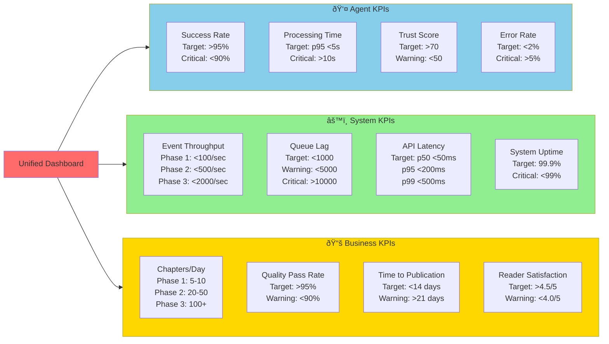
```mermaid
graph LR
 subgraph AgentKPIs["👤 Agent KPIs"]
 AK1[Success Rate<br/>Target: >95%<br/>Critical: <90%]
 AK2[Processing Time<br/>Target: p95 <5s<br/>Critical: >10s]
 AK3[Trust Score<br/>Target: >70<br/>Warning: <50]
 AK4[Error Rate<br/>Target: <2%<br/>Critical: >5%]
 end

subgraph SystemKPIs["⚙️ System KPIs"]
 SK1[Event Throughput<br/>Phase 1: <100/sec<br/>Phase 2: <500/sec<br/>Phase 3: <2000/sec]
 SK2[Queue Lag<br/>Target: <1000<br/>Warning: <5000<br/>Critical: >10000]
 SK3[API Latency<br/>Target: p50 <50ms<br/>p95 <200ms<br/>p99 <500ms]
 SK4[System Uptime<br/>Target: 99.9%<br/>Critical: <99%]
 end

subgraph BusinessKPIs["📚 Business KPIs"]
 BK1[Chapters/Day<br/>Phase 1: 5-10<br/>Phase 2: 20-50<br/>Phase 3: 100+]
 BK2[Quality Pass Rate<br/>Target: >95%<br/>Warning: <90%]
 BK3[Time to Publication<br/>Target: <14 days<br/>Warning: >21 days]
 BK4[Reader Satisfaction<br/>Target: >4.5/5<br/>Warning: <4.0/5]
 end

Dashboard[Unified Dashboard] --> AgentKPIs
 Dashboard --> SystemKPIs
 Dashboard --> BusinessKPIs

style AgentKPIs fill:#87CEEB
 style SystemKPIs fill:#90EE90
 style BusinessKPIs fill:#FFD700
 style Dashboard fill:#FF6B6B
```

### 7.3 Alert Severity Levels

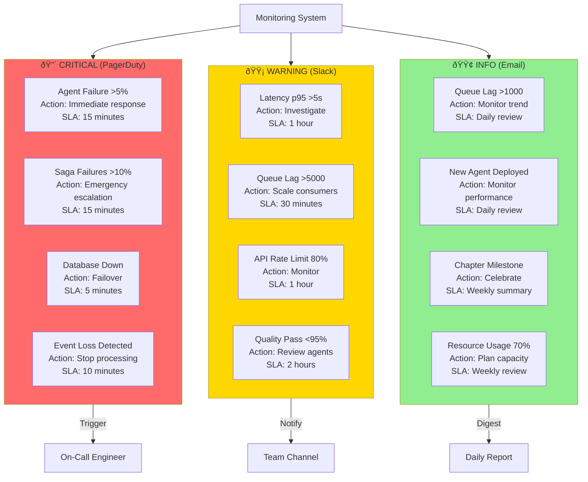
```mermaid
graph TB
 subgraph Critical["🔴 CRITICAL (PagerDuty)"]
 C1[Agent Failure >5%<br/>Action: Immediate response<br/>SLA: 15 minutes]
 C2[Saga Failures >10%<br/>Action: Emergency escalation<br/>SLA: 15 minutes]
 C3[Database Down<br/>Action: Failover<br/>SLA: 5 minutes]
 C4[Event Loss Detected<br/>Action: Stop processing<br/>SLA: 10 minutes]
 end

subgraph Warning["🟡 WARNING (Slack)"]
 W1[Latency p95 >5s<br/>Action: Investigate<br/>SLA: 1 hour]
 W2[Queue Lag >5000<br/>Action: Scale consumers<br/>SLA: 30 minutes]
 W3[API Rate Limit 80%<br/>Action: Monitor<br/>SLA: 1 hour]
 W4[Quality Pass <95%<br/>Action: Review agents<br/>SLA: 2 hours]
 end

subgraph Info["🟢 INFO (Email)"]
 I1[Queue Lag >1000<br/>Action: Monitor trend<br/>SLA: Daily review]
 I2[New Agent Deployed<br/>Action: Monitor performance<br/>SLA: Daily review]
 I3[Chapter Milestone<br/>Action: Celebrate<br/>SLA: Weekly summary]
 I4[Resource Usage 70%<br/>Action: Plan capacity<br/>SLA: Weekly review]
 end

Monitor[Monitoring System] --> Critical
 Monitor --> Warning
 Monitor --> Info

Critical -->|Trigger| OnCall[On-Call Engineer]
 Warning -->|Notify| Team[Team Channel]
 Info -->|Digest| Report[Daily Report]

style Critical fill:#FF6B6B
 style Warning fill:#FFD700
 style Info fill:#90EE90
```

---

## 8. SCALING & PERFORMANCE

### 8.1 Scaling Decision Tree

```mermaid
graph TB
 Start([Monitor System]) --> Check{Current<br/>Metrics?}

Check -->|Events <100/sec<br/>Lag <1000| Phase1OK[Phase 1 Sufficient<br/>No Action Needed]

Check -->|Events 100-500/sec<br/>Lag 1000-5000| Decision1{Is Lag<br/>Growing?}
 Decision1 -->|Yes| Scale1[Scale Actions:<br/>• Add consumer instances<br/>• Increase worker pool<br/>• Add Redis cache]
 Decision1 -->|No| Monitor1[Monitor Closely<br/>Check Daily]

Check -->|Events 500-1000/sec<br/>Lag >5000| Decision2{Team Has<br/>Kafka Expertise?}
 Decision2 -->|Yes| Phase2Plan[Plan Phase 2:<br/>• Add RabbitMQ<br/>• Scale webhooks<br/>• Add monitoring]
 Decision2 -->|No| Scale2[Alternative Scaling:<br/>• Horizontal scaling<br/>• Database optimization<br/>• Batch processing]

Check -->|Events >1000/sec<br/>System Struggling| Decision3{Budget<br/>Approved?}
 Decision3 -->|Yes| Phase3Plan[Plan Phase 3:<br/>• Deploy Kafka<br/>• Implement partitions<br/>• Hire specialists]
 Decision3 -->|No| Emergency[Emergency Measures:<br/>• Throttle input<br/>• Prioritize critical<br/>• Defer non-critical]

Phase1OK --> Start
 Monitor1 --> Start
 Scale1 --> Evaluate1{Solved?}
 Evaluate1 -->|Yes| Start
 Evaluate1 -->|No| Phase2Plan

Phase2Plan --> Implement2[Implement<br/>Phase 2]
 Scale2 --> Implement2
 Implement2 --> Start

Phase3Plan --> Implement3[Implement<br/>Phase 3]
 Emergency --> Implement3
 Implement3 --> Start

style Start fill:#87CEEB
 style Phase1OK fill:#90EE90
 style Phase2Plan fill:#FFD700
 style Phase3Plan fill:#FFA500
 style Emergency fill:#FF6B6B
```

### 8.2 Performance Optimization Strategies

```mermaid
graph TB
 subgraph Current["📊 Current Performance"]
 C1[Event Throughput<br/>Current: 75/sec<br/>Target: 100/sec]
 C2[Processing Latency<br/>Current: p95 = 3.5s<br/>Target: <5s]
 C3[Queue Lag<br/>Current: 800<br/>Target: <1000]
 end

subgraph Optimizations["âš¡ Optimization Strategies"]
 O1[Database Optimization<br/>• Add indexes<br/>• Connection pooling<br/>• Query optimization]

O2[Caching Layer<br/>• Redis for hot data<br/>• Cache agent results<br/>• Reduce DB calls]

O3[Batch Processing<br/>• Group similar tasks<br/>• Batch DB writes<br/>• Reduce API calls]

O4[Agent Optimization<br/>• Reduce prompt size<br/>• Parallel processing<br/>• Async operations]

O5[Infrastructure<br/>• Horizontal scaling<br/>• Load balancing<br/>• Resource allocation]
 end

subgraph Results["📈 Expected Results"]
 R1[Throughput<br/>Increase to 150/sec<br/>+100% headroom]
 R2[Latency<br/>Reduce to p95 = 2s<br/>+60% improvement]
 R3[Lag<br/>Maintain <500<br/>Better stability]
 end

C1 --> O1
 C1 --> O2
 C2 --> O3
 C2 --> O4
 C3 --> O5

O1 --> R1
 O2 --> R1
 O3 --> R2
 O4 --> R2
 O5 --> R3

style Current fill:#FFE4B5
 style Optimizations fill:#87CEEB
 style Results fill:#90EE90
```

### 8.3 Capacity Planning

```mermaid
graph LR
 subgraph Today["📅 Today"]
 T1[2 Books<br/>56 Chapters<br/>17 Agents]
 T2[Throughput<br/>75 events/sec<br/>Phase 1]
 T3[Resources<br/>2 CPU cores<br/>8GB RAM]
 end

subgraph Q1["📅 Q1 Next Year"]
 Q11[5 Books<br/>140 Chapters<br/>25 Agents]
 Q12[Throughput<br/>200 events/sec<br/>Phase 2]
 Q13[Resources<br/>8 CPU cores<br/>32GB RAM]
 end

subgraph Q4["📅 Q4 Next Year"]
 Q41[20 Books<br/>560 Chapters<br/>50 Agents]
 Q42[Throughput<br/>1000 events/sec<br/>Phase 3]
 Q43[Resources<br/>32 CPU cores<br/>128GB RAM<br/>Kafka Cluster]
 end

Today -->|Growth 150%| Q1
 Q1 -->|Growth 400%| Q4

T1 --> Q11
 T2 --> Q12
 T3 --> Q13

Q11 --> Q41
 Q12 --> Q42
 Q13 --> Q43

style Today fill:#90EE90
 style Q1 fill:#FFD700
 style Q4 fill:#FFA500
```

---

## 9. ERROR HANDLING & RECOVERY

### 9.1 Error Handling Strategy

```mermaid
graph TB
 Error[Error Occurs] --> Classify{Error<br/>Type?}

Classify -->|Transient| Retry[Retry Logic]
 Classify -->|Validation| Reject[Reject & Log]
 Classify -->|System| Escalate[Escalate to Ops]
 Classify -->|Business| Compensate[Run Compensation]

Retry --> Backoff{Retry<br/>Count?}
 Backoff -->|< 3| Wait1[Wait 1s<br/>Retry]
 Backoff -->|< 6| Wait2[Wait 5s<br/>Retry]
 Backoff -->|< 9| Wait3[Wait 30s<br/>Retry]
 Backoff -->|>= 9| DLQ1[Move to<br/>Dead Letter Queue]

Wait1 --> Success1{Success?}
 Wait2 --> Success1
 Wait3 --> Success1

Success1 -->|Yes| Complete[Mark Complete<br/>Continue]
 Success1 -->|No| Backoff

Reject --> Alert1[Alert Team<br/>Invalid Input]
 Alert1 --> Manual1[Manual Review]

Escalate --> Alert2[PagerDuty Alert<br/>System Issue]
 Alert2 --> Manual2[Ops Investigation]

Compensate --> Rollback[Execute Saga<br/>Compensation]
 Rollback --> Cleanup[Clean State]
 Cleanup --> Notify[Notify Stakeholders]

DLQ1 --> Manual3[Manual Review<br/>Persistent Failure]
 Manual1 --> DLQ1
 Manual2 --> DLQ1

style Error fill:#FF6B6B
 style Complete fill:#90EE90
 style Retry fill:#FFD700
 style DLQ1 fill:#8B0000
```

### 9.2 Failure Scenarios & Recovery

```mermaid
graph TB
 subgraph Scenarios["🚨 Failure Scenarios"]
 S1[Claude API Timeout<br/>Agent can't get response]
 S2[Asana API Rate Limit<br/>Can't update tasks]
 S3[Database Connection Lost<br/>Can't write events]
 S4[Agent Logic Error<br/>Bad output generated]
 S5[Network Partition<br/>Services can't communicate]
 end

subgraph Detection["🔍 Detection"]
 D1[Monitor API Timeouts<br/>Alert if >5% in 5min]
 D2[Monitor Rate Limits<br/>Track remaining quota]
 D3[Connection Pool Health<br/>Check available connections]
 D4[Output Validation<br/>Schema & business rules]
 D5[Service Health Checks<br/>Ping every 30s]
 end

subgraph Recovery["🔧 Recovery Actions"]
 R1[Retry Logic<br/>Exponential backoff<br/>Max 3 attempts]
 R2[Queue Requests<br/>Process when quota resets<br/>Priority ordering]
 R3[Failover to Replica<br/>Automatic reconnection<br/>Transaction replay]
 R4[Quarantine Agent<br/>Manual review<br/>Fix & redeploy]
 R5[Circuit Breaker<br/>Graceful degradation<br/>Alternative paths]
 end

S1 --> D1 --> R1
 S2 --> D2 --> R2
 S3 --> D3 --> R3
 S4 --> D4 --> R4
 S5 --> D5 --> R5

style Scenarios fill:#FF6B6B
 style Detection fill:#FFD700
 style Recovery fill:#90EE90
```

### 9.3 Dead Letter Queue Processing

```mermaid
sequenceDiagram
 participant E as Event
 participant P as Processor
 participant DLQ as Dead Letter Queue
 participant A as Alerting
 participant H as Human Operator
 participant R as Recovery Process

E->>P: Process Event
 P->>P: Attempt 1 (Fail)
 P->>P: Wait 1s
 P->>P: Attempt 2 (Fail)
 P->>P: Wait 5s
 P->>P: Attempt 3 (Fail)
 P->>P: Wait 30s
 P->>P: Attempt 4 (Fail)

Note over P,DLQ: Max retries exceeded

P->>DLQ: Move to DLQ
 DLQ->>A: Trigger Alert
 A->>H: Notify (Slack/Email)

H->>DLQ: Review Failed Event
 H->>H: Investigate Root Cause
 H->>R: Fix Issue

alt Fixable
 R->>DLQ: Replay Event
 DLQ->>P: Retry Processing
 P->>P: Success!
 P->>A: Clear Alert
 else Permanent Error
 R->>DLQ: Mark as Resolved
 R->>A: Document Issue
 A->>A: Update Runbook
 end
```

---

## 10. QUALITY ASSURANCE FLOW

### 10.1 Multi-Stage Quality Pipeline

```mermaid
graph TB
 Start([Chapter Content<br/>Ready]) --> Stage1[Stage 1:<br/>Content Verification]

Stage1 --> RV1[Citation Verifier<br/>Check all sources<br/>Validate URLs]
 Stage1 --> RV2[Data Accuracy Verifier<br/>Verify numbers<br/>Validate statistics]
 Stage1 --> RV3[Fact Checker<br/>Validate claims<br/>Check evidence]

RV1 --> Results1{Pass<br/>Rate?}
 RV2 --> Results2{Pass<br/>Rate?}
 RV3 --> Results3{Pass<br/>Rate?}

Results1 -->|<90%| Fail1[Critical Issues<br/>Return to Author]
 Results2 -->|<90%| Fail1
 Results3 -->|<90%| Fail1

Results1 -->|90-95%| Warning1[Minor Issues<br/>Flag for Review]
 Results2 -->|90-95%| Warning1
 Results3 -->|90-95%| Warning1

Results1 -->|>95%| Stage2[Stage 2:<br/>Reader Assessment]
 Results2 -->|>95%| Stage2
 Results3 -->|>95%| Stage2

Fail1 --> Start
 Warning1 --> Review1[Human Review<br/>Accept/Reject]
 Review1 --> Stage2

Stage2 --> Surveyor[Surveyor Agent<br/>Reader clarity<br/>Comprehension check]

Surveyor --> SurveyResults{Clarity<br/>Score?}
 SurveyResults -->|<4.0/5| Fail2[Clarity Issues<br/>Return to Editor]
 SurveyResults -->|4.0-4.5/5| Warning2[Good with notes<br/>Minor improvements]
 SurveyResults -->|>4.5/5| Stage3[Stage 3:<br/>Final Inspection]

Fail2 --> Start
 Warning2 --> Review2[Human Review<br/>Accept/Reject]
 Review2 --> Stage3

Stage3 --> Inspector[Inspector Agent<br/>Holistic review<br/>Publication readiness]

Inspector --> Final{Final<br/>Decision?}
 Final -->|Reject| Fail3[Quality Gate Failed<br/>Comprehensive Revision]
 Final -->|Conditional| Warning3[Approve with Changes<br/>Minor fixes needed]
 Final -->|Approve| Complete[Quality Approved<br/>Ready for Publication]

Fail3 --> Start
 Warning3 --> QuickFix[Quick Fixes<br/>Copy Editor]
 QuickFix --> Complete

Complete --> End([Publish<br/>Chapter])

style Start fill:#87CEEB
 style Stage1 fill:#FFE4B5
 style Stage2 fill:#F0E68C
 style Stage3 fill:#DDA0DD
 style Complete fill:#90EE90
 style Fail1 fill:#FF6B6B
 style Fail2 fill:#FF6B6B
 style Fail3 fill:#FF6B6B
 style End fill:#32CD32
```

### 10.2 Quality Metrics Dashboard

```mermaid
graph TB
 subgraph Citations["📚 Citation Quality"]
 C1[Total Citations<br/>Target: >50 per chapter]
 C2[Valid URLs<br/>Target: 100%]
 C3[Source Diversity<br/>Target: >10 unique sources]
 C4[Citation Freshness<br/>Target: >80% recent]
 end

subgraph DataAccuracy["📊 Data Accuracy"]
 D1[Numbers Verified<br/>Target: 100%]
 D2[Source Attribution<br/>Target: 100%]
 D3[Calculation Errors<br/>Target: 0]
 D4[Data Currency<br/>Target: <2 years old]
 end

subgraph FactChecking["✅ Fact Checking"]
 F1[Claims Verified<br/>Target: 100%]
 F2[Evidence Quality<br/>Target: High]
 F3[Contradictions Found<br/>Target: 0]
 F4[External Validation<br/>Target: >90%]
 end

subgraph ReaderClarity["👥 Reader Clarity"]
 R1[Clarity Score<br/>Target: >4.5/5]
 R2[Comprehension Rate<br/>Target: >90%]
 R3[Jargon Density<br/>Target: <15%]
 R4[Reading Level<br/>Target: Grade 12-14]
 end

Dashboard[Quality Dashboard] --> Citations
 Dashboard --> DataAccuracy
 Dashboard --> FactChecking
 Dashboard --> ReaderClarity

style Citations fill:#87CEEB
 style DataAccuracy fill:#90EE90
 style FactChecking fill:#FFD700
 style ReaderClarity fill:#DDA0DD
```

### 10.3 Verification Event Flow

```mermaid
sequenceDiagram
 participant CH as Chapter
 participant ES as Event Store
 participant RV1 as Citation Verifier
 participant RV2 as Data Verifier
 participant RV3 as Fact Checker
 participant AS as Asana
 participant IN as Inspector

Note over CH,IN: Quality Verification Process

CH->>ES: ChapterCompleted Event
 ES->>RV1: Route to Quality Partition P11
 ES->>RV2: Route to Quality Partition P11
 ES->>RV3: Route to Quality Partition P11

par Parallel Verification
 RV1->>AS: Read Chapter Content
 RV1->>RV1: Extract Citations
 RV1->>RV1: Verify URLs
 RV1->>RV1: Check Sources
 RV1->>AS: Update Citation Field
 RV1->>ES: Log VerificationCompleted(citations)
 and
 RV2->>AS: Read Chapter Content
 RV2->>RV2: Extract Data Points
 RV2->>RV2: Verify Numbers
 RV2->>RV2: Check Statistics
 RV2->>AS: Update Accuracy Field
 RV2->>ES: Log VerificationCompleted(data)
 and
 RV3->>AS: Read Chapter Content
 RV3->>RV3: Extract Claims
 RV3->>RV3: Validate Facts
 RV3->>RV3: Check Evidence
 RV3->>AS: Update Facts Field
 RV3->>ES: Log VerificationCompleted(facts)
 end

ES->>IN: All Verifications Complete
 IN->>AS: Read All Quality Fields
 IN->>IN: Holistic Assessment

alt Quality Gate Passed
 IN->>AS: Approve Chapter
 IN->>ES: Log QualityApproved
 else Quality Issues Found
 IN->>AS: Request Revisions
 IN->>ES: Log QualityRejected
 end
```

---

## 11. READER PATHWAY COORDINATION

### 11.1 Six Reader Types & Pathway Tailoring

```mermaid
graph TB
 Chapter[Chapter Content<br/>Complete] --> Tailoring[Pathway Tailoring<br/>Process]

Tailoring --> PT1[Policy Maker Tailor<br/>Focus: Governance & Regulation]
 Tailoring --> PT2[Technical Specialist Tailor<br/>Focus: Implementation Details]
 Tailoring --> PT3[Academic Researcher Tailor<br/>Focus: Research Methods]
 Tailoring --> PT4[Graduate Student Tailor<br/>Focus: Learning Objectives]
 Tailoring --> PT5[General Audience Tailor<br/>Focus: Accessible Language]
 Tailoring --> PT6[Stakeholder Tailor<br/>Focus: Actionable Items]

PT1 --> ST1[Policy Subtask<br/>150-200 pages<br/>Regulatory focus]
 PT2 --> ST2[Technical Subtask<br/>200-250 pages<br/>Implementation focus]
 PT3 --> ST3[Academic Subtask<br/>300-400 pages<br/>Research focus]
 PT4 --> ST4[Student Subtask<br/>200-300 pages<br/>Learning focus]
 PT5 --> ST5[General Subtask<br/>100-150 pages<br/>Clarity focus]
 PT6 --> ST6[Stakeholder Subtask<br/>120-180 pages<br/>Action focus]

ST1 --> Asana[Update Asana<br/>Subtask Descriptions]
 ST2 --> Asana
 ST3 --> Asana
 ST4 --> Asana
 ST5 --> Asana
 ST6 --> Asana

Asana --> Coordination[Log to P10<br/>Coordination Partition]

style Chapter fill:#87CEEB
 style Tailoring fill:#FFD700
 style PT1 fill:#FFB6C1
 style PT2 fill:#DDA0DD
 style PT3 fill:#F0E68C
 style PT4 fill:#90EE90
 style PT5 fill:#87CEEB
 style PT6 fill:#FFA500
 style Asana fill:#FFE4B5
```

### 11.2 Reader Priority Matrix

```mermaid
graph TB
 subgraph Climate["📗 Climate Book Reader Priorities"]
 C_Ch1[Ch 1: Dollar Decline<br/>🔴 Policy: CRITICAL<br/>🟡 Technical: MEDIUM<br/>🔴 Academic: CRITICAL<br/>🔴 Student: CRITICAL<br/>🔴 General: CRITICAL<br/>🟡 Stakeholder: MEDIUM]

C_Ch13[Ch 13: Biomass TEA<br/>🟡 Policy: MEDIUM<br/>🔴 Technical: CRITICAL<br/>🔴 Academic: CRITICAL<br/>🟡 Student: MEDIUM<br/>⚪ General: SKIP<br/>🔴 Stakeholder: CRITICAL]

C_Ch21[Ch 21: Missouri Case<br/>🔴 Policy: CRITICAL<br/>🟡 Technical: MEDIUM<br/>🔴 Academic: CRITICAL<br/>🟡 Student: MEDIUM<br/>🔴 General: CRITICAL<br/>🔴 Stakeholder: CRITICAL]
 end

subgraph AIEthics["📘 AI Ethics Book Reader Priorities"]
 AI_Ch1[Ch 1: AI Monopoly<br/>🔴 Policy: CRITICAL<br/>🟡 Technical: MEDIUM<br/>🔴 Academic: CRITICAL<br/>🔴 Student: CRITICAL<br/>🔴 General: CRITICAL<br/>🟡 Stakeholder: MEDIUM]

AI_Ch13[Ch 13: Alignment Tech<br/>🟡 Policy: MEDIUM<br/>🔴 Technical: CRITICAL<br/>🔴 Academic: CRITICAL<br/>🔴 Student: CRITICAL<br/>⚪ General: SKIP<br/>🟡 Stakeholder: MEDIUM]

AI_Ch21[Ch 21: Detroit Case<br/>🔴 Policy: CRITICAL<br/>🟡 Technical: MEDIUM<br/>🔴 Academic: CRITICAL<br/>🟡 Student: MEDIUM<br/>🔴 General: CRITICAL<br/>🔴 Stakeholder: CRITICAL]
 end

Legend[Legend:<br/>🔴 CRITICAL = Read<br/>🟡 MEDIUM = Optional<br/>⚪ SKIP = Omit]

style Climate fill:#90EE90
 style AIEthics fill:#87CEEB
 style Legend fill:#FFD700
```

### 11.3 Pathway Coordination Across Books

```mermaid
graph LR
 subgraph Climate_Part1["Climate Part I"]
 C1[Ch 1: Dollar]
 C2[Ch 2: Education]
 C3[Ch 3: Digital Divide]
 end

subgraph AI_Part1["AI Ethics Part I"]
 A1[Ch 1: Monopoly]
 A2[Ch 2: Literacy]
 A3[Ch 3: Algorithmic Divide]
 end

subgraph Coordination["Coordination Points"]
 Coord1[Fiscal Constraints<br/>Common Theme]
 Coord2[Educational Infrastructure<br/>Common Theme]
 Coord3[Access & Equity<br/>Common Theme]
 end

C1 -.parallel.-> A1
 C2 -.parallel.-> A2
 C3 -.parallel.-> A3

C1 --> Coord1
 A1 --> Coord1

C2 --> Coord2
 A2 --> Coord2

C3 --> Coord3
 A3 --> Coord3

Coord1 --> Pathway1[Policy Maker Path<br/>Reads both Ch 1s]
 Coord2 --> Pathway2[Academic Path<br/>Reads both Ch 2s]
 Coord3 --> Pathway3[General Path<br/>Reads both Ch 3s]

style Climate_Part1 fill:#90EE90
 style AI_Part1 fill:#87CEEB
 style Coordination fill:#FFD700
```

---

## 12. DEPLOYMENT ARCHITECTURE

### 12.1 Phase 1 Deployment

```mermaid
graph TB
 subgraph Internet["🌐 Internet"]
 AsanaCloud[Asana Cloud<br/>SaaS Platform]
 ClaudeAPI[Claude API<br/>Anthropic Cloud]
 end

subgraph VPC["☁️ AWS VPC or On-Prem"]
 subgraph AppLayer["Application Layer"]
 Webhook[Webhook Server<br/>Node.js/Python<br/>2 instances]
 Saga[Saga Orchestrator<br/>Python<br/>1 instance]
 Master[Master Orchestrator<br/>Python<br/>1 instance]
 end

subgraph AgentLayer["Agent Layer"]
 ContentPool[Content Agent Pool<br/>5 agents<br/>Docker containers]
 CoordPool[Coordination Pool<br/>7 agents<br/>Docker containers]
 QualityPool[Quality Pool<br/>5 agents<br/>Docker containers]
 end

subgraph DataLayer["Data Layer"]
 PG[(PostgreSQL<br/>Event Store<br/>RDS/Self-hosted)]
 end

subgraph MonitorLayer["Monitoring Layer"]
 Prometheus[Prometheus<br/>Metrics]
 Grafana[Grafana<br/>Dashboards]
 end
 end

AsanaCloud <-->|HTTPS| Webhook
 Webhook --> Saga
 Saga --> Master

Master --> ContentPool
 Master --> CoordPool
 Master --> QualityPool

ContentPool <-->|API| ClaudeAPI
 CoordPool <-->|API| ClaudeAPI
 QualityPool <-->|API| ClaudeAPI

Saga --> PG
 ContentPool --> PG
 CoordPool --> PG
 QualityPool --> PG

Webhook --> Prometheus
 Saga --> Prometheus
 Master --> Prometheus
 ContentPool --> Prometheus

Prometheus --> Grafana

style Internet fill:#FFE4B5
 style VPC fill:#E0FFFF
 style AppLayer fill:#F0E68C
 style AgentLayer fill:#87CEEB
 style DataLayer fill:#90EE90
 style MonitorLayer fill:#DDA0DD
```

### 12.2 Phase 2 Deployment (With Queues)

```mermaid
graph TB
 subgraph LoadBalancer["⚖️ Load Balancer"]
 LB[AWS ALB/NGINX<br/>SSL Termination]
 end

subgraph WebhookCluster["🌐 Webhook Cluster"]
 WH1[Webhook 1<br/>Primary]
 WH2[Webhook 2<br/>Secondary]
 WH3[Webhook 3<br/>Standby]
 end

subgraph MessageQueue["📮 Message Queue"]
 RMQ[RabbitMQ<br/>High Availability<br/>3-node cluster]
 end

subgraph OrchCluster["🎯 Orchestrator Cluster"]
 Saga1[Saga Primary]
 Saga2[Saga Backup]
 Master1[Master Primary]
 end

subgraph AgentPools["🤖 Agent Pools"]
 Content[Content Pool<br/>10 instances]
 Coord[Coordination Pool<br/>14 instances]
 Quality[Quality Pool<br/>10 instances]
 end

subgraph DataCluster["💾 Data Cluster"]
 PGPrimary[(PostgreSQL Primary)]
 PGReplica1[(Replica 1)]
 PGReplica2[(Replica 2)]
 Redis[(Redis Cache<br/>3-node cluster)]
 end

subgraph MonitorStack["📊 Monitoring Stack"]
 Prom[Prometheus<br/>HA Pair]
 Loki[Loki<br/>Log Aggregation]
 Grafana[Grafana<br/>Dashboards]
 Jaeger[Jaeger<br/>Tracing]
 end

LB --> WH1
 LB --> WH2
 LB --> WH3

WH1 --> RMQ
 WH2 --> RMQ
 WH3 --> RMQ

RMQ --> Saga1
 RMQ --> Master1
 Saga1 -.failover.-> Saga2

Saga1 --> Content
 Saga1 --> Coord
 Saga1 --> Quality

Content --> Redis
 Coord --> Redis
 Quality --> Redis

Redis --> PGPrimary
 PGPrimary -.replicate.-> PGReplica1
 PGPrimary -.replicate.-> PGReplica2

Content --> Prom
 Content --> Loki
 Content --> Jaeger

Prom --> Grafana
 Loki --> Grafana
 Jaeger --> Grafana

style LoadBalancer fill:#FFD700
 style MessageQueue fill:#FFA500
 style DataCluster fill:#90EE90
 style MonitorStack fill:#DDA0DD
```

### 12.3 Phase 3 Deployment (With Kafka)

```mermaid
graph TB
 subgraph External["🌐 External"]
 Asana[Asana]
 Claude[Claude API]
 end

subgraph Gateway["⚖️ API Gateway"]
 Kong[Kong/AWS API Gateway<br/>Rate Limiting<br/>Authentication]
 end

subgraph WebCluster["🌐 Webhook Cluster"]
 WH[Auto-Scaling Group<br/>5-20 instances]
 end

subgraph KafkaCluster["📊 Kafka Cluster"]
 K1[Kafka Broker 1<br/>Leader]
 K2[Kafka Broker 2<br/>Follower]
 K3[Kafka Broker 3<br/>Follower]
 ZK[ZooKeeper<br/>3-node ensemble]

K1 -.replication.-> K2
 K2 -.replication.-> K3
 ZK -.coordination.-> K1
 ZK -.coordination.-> K2
 ZK -.coordination.-> K3
 end

subgraph ConsumerGroups["🤖 Consumer Groups"]
 CG1[Content Consumers<br/>Auto-scaling<br/>10-50 instances]
 CG2[Coordination Consumers<br/>Auto-scaling<br/>5-20 instances]
 CG3[Quality Consumers<br/>Auto-scaling<br/>5-20 instances]
 end

subgraph DataPlatform["💾 Data Platform"]
 PGRDS[(RDS PostgreSQL<br/>Multi-AZ<br/>Read Replicas)]
 RedisCluster[(ElastiCache Redis<br/>Cluster Mode)]
 S3[(S3<br/>Event Archive)]
 end

subgraph ObservabilityStack["📊 Observability"]
 DataDog[DataDog<br/>Unified Monitoring]
 Splunk[Splunk<br/>Log Analytics]
 NewRelic[New Relic<br/>APM]
 end

Asana --> Kong
 Kong --> WH
 WH --> KafkaCluster

KafkaCluster --> CG1
 KafkaCluster --> CG2
 KafkaCluster --> CG3

CG1 <--> Claude
 CG2 <--> Claude
 CG3 <--> Claude

CG1 --> RedisCluster
 CG1 --> PGRDS

KafkaCluster -.archive.-> S3

WH --> DataDog
 CG1 --> DataDog
 KafkaCluster --> DataDog

WH --> Splunk
 WH --> NewRelic

style External fill:#FFE4B5
 style Gateway fill:#FFD700
 style KafkaCluster fill:#FF6B6B
 style DataPlatform fill:#90EE90
 style ObservabilityStack fill:#DDA0DD
```

---

## 13. AGENT LIFECYCLE MANAGEMENT

### Ephemeral Agent Lifecycle (Revised)

**FUNDAMENTAL CHANGE**: Agents are now single-use, disposable units. Traditional lifecycle (Idle → Assigned → Processing → Idle) is replaced with:

**Linear Lifecycle**: Creation → Execution → Disposal (No loops, no idle state)

### 13.1 Agent Creation & Initialization (Ephemeral)

```mermaid
stateDiagram-v2
 [*] --> Defined: Define Agent Specification

Defined --> Validated: Validate Requirements
 Validated --> Configured: Create Configuration
 Configured --> Deployed: Deploy Container

Deployed --> Initializing: Start Initialization
 Initializing --> RegisteringServices: Register with Orchestrator
 RegisteringServices --> LoadingContext: Load Agent Context
 LoadingContext --> TestingConnections: Test External Services

TestingConnections --> HealthCheck: Initial Health Check
 HealthCheck --> Ready: All Systems OK

HealthCheck --> InitFailed: Initialization Failed
 InitFailed --> Retry: Retry Logic
 Retry --> Initializing: Exponential Backoff
 Retry --> Quarantine: Max Retries Exceeded

Ready --> Active: Begin Processing

Quarantine --> ManualReview: Human Investigation
 ManualReview --> Configured: Fix & Redeploy

note right of Defined
 Agent Specification:
 - Role & Responsibilities
 - Required Permissions
 - Resource Limits
 - Success Criteria
 end note

note left of Active
 Active State:
 - Trust Score: 50
 - Processing Events
 - Health Monitoring
 - Performance Tracking
 end note
```

### 13.2 Agent State Machine (Ephemeral - Simplified)

**Traditional multi-state machine is ELIMINATED. Ephemeral agents have linear progression:**

```mermaid
stateDiagram-v2
 [*] --> Idle: Agent Ready

Idle --> Assigned: Task Assigned
 Assigned --> Processing: Begin Work
 Processing --> Thinking: Claude API Call
 Thinking --> Acting: Execute Action

Acting --> Success: Task Complete
 Acting --> TransientError: Retry-able Error
 Acting --> PermanentError: Non-retry-able Error

Success --> LoggingEvent: Log Success Event
 LoggingEvent --> Idle: Ready for Next

TransientError --> Retry: Exponential Backoff
 Retry --> Processing: Attempt Again

PermanentError --> ErrorHandling: Handle Error
 ErrorHandling --> Escalate: Notify Ops
 Escalate --> Quarantine: Suspend Agent

Quarantine --> Investigation: Root Cause Analysis
 Investigation --> Fix: Apply Fix
 Fix --> [*]: Restart Agent

Processing --> Timeout: Exceeds Time Limit
 Timeout --> Terminate: Kill Process
 Terminate --> Escalate

note right of Idle
 Idle State:
 - Listening for events
 - Health check passing
 - Trust score maintained
 end note

note left of Quarantine
 Quarantine State:
 - Stopped processing
 - Events redistributed
 - Manual intervention needed
 end note
```

### 13.3 Agent Trust Score Evolution (Knowledge Transfer Model)

**Trust score is now part of knowledge transfer, not persistent agent state:**

```mermaid
graph LR
 subgraph Initialization["🎯 Initialization"]
 Init[New Agent<br/>Trust Score: 50/100]
 end

subgraph Actions["âš¡ Actions & Outcomes"]
 Success[Successful Task<br/>+1 point]
 Failure[Failed Task<br/>-5 points]
 Timeout[Timeout<br/>-2 points]
 Quality[High Quality<br/>+2 points]
 end

subgraph Thresholds["📊 Trust Thresholds"]
 Low[Trust < 30<br/>RESTRICTED]
 Medium[Trust 30-70<br/>NORMAL]
 High[Trust 70-85<br/>PROMOTED]
 Elite[Trust > 85<br/>ELITE]
 end

subgraph Consequences["🎭 Consequences"]
 Restrict[• Simple tasks only<br/>• Human review required<br/>• No critical work]
 Normal[• Standard tasks<br/>• Normal workflow<br/>• Monitored]
 Promote[• Complex tasks<br/>• Increased autonomy<br/>• Priority assignment]
 EliteStatus[• Critical tasks<br/>• Max autonomy<br/>• Mentor new agents]
 end

Init --> Medium

Success -.increases.-> Medium
 Success -.increases.-> High
 Success -.increases.-> Elite

Failure -.decreases.-> Medium
 Failure -.decreases.-> Low

Timeout -.decreases.-> Medium
 Quality -.increases.-> High

Low --> Restrict
 Medium --> Normal
 High --> Promote
 Elite --> EliteStatus

style Init fill:#87CEEB
 style Low fill:#FF6B6B
 style Medium fill:#FFD700
 style High fill:#90EE90
 style Elite fill:#32CD32
```

---

## 14. OPERATIONAL WORKFLOWS

### 14.1 Daily Operations Workflow

```mermaid
graph TB
 Start([Start of Day]) --> Morning[Morning Health Check]

Morning --> CheckMetrics{System<br/>Healthy?}
 CheckMetrics -->|Yes| MonitorNormal[Normal Monitoring<br/>Check every hour]
 CheckMetrics -->|No| Investigate[Investigate Issues]

Investigate --> Critical{Critical<br/>Issue?}
 Critical -->|Yes| Incident[Incident Response<br/>Follow runbook]
 Critical -->|No| MinorFix[Apply Fix<br/>Monitor closely]

Incident --> Resolve[Resolve & Document]
 MinorFix --> Resolve
 Resolve --> MonitorNormal

MonitorNormal --> Midday[Midday Check]
 Midday --> ReviewQueue{Queue<br/>Healthy?}
 ReviewQueue -->|Yes| Continue[Continue Operations]
 ReviewQueue -->|No| ScaleDecision{Need to<br/>Scale?}

ScaleDecision -->|Yes| ScaleUp[Add Consumer<br/>Instances]
 ScaleDecision -->|No| Optimize[Optimize Processing]

ScaleUp --> Continue
 Optimize --> Continue

Continue --> Evening[Evening Review]
 Evening --> GenerateReport[Generate Daily<br/>Report]

GenerateReport --> ReviewMetrics[Review KPIs:<br/>• Events processed<br/>• Success rate<br/>• Quality scores<br/>• Trust scores]

ReviewMetrics --> Planning[Plan Tomorrow:<br/>• Maintenance windows<br/>• Deployments<br/>• Capacity changes]

Planning --> End([End of Day])

style Start fill:#90EE90
 style Incident fill:#FF6B6B
 style GenerateReport fill:#FFD700
 style End fill:#87CEEB
```

### 14.2 Incident Response Workflow

```mermaid
graph TB
 Alert[🚨 Alert Triggered] --> Severity{Severity<br/>Level?}

Severity -->|CRITICAL| PageOps[Page On-Call<br/>Engineer]
 Severity -->|WARNING| SlackTeam[Notify Team<br/>Channel]
 Severity -->|INFO| EmailDigest[Add to Daily<br/>Digest]

PageOps --> Acknowledge[Acknowledge<br/>within 15min]
 Acknowledge --> InitialAssess[Initial Assessment<br/>< 5 minutes]

InitialAssess --> Impact{Impact<br/>Scope?}
 Impact -->|System Down| P1[Priority 1<br/>All hands on deck]
 Impact -->|Degraded| P2[Priority 2<br/>Team response]
 Impact -->|Isolated| P3[Priority 3<br/>Single engineer]

P1 --> WarRoom[Start War Room<br/>Slack Channel]
 WarRoom --> Diagnose[Diagnose Root Cause]

P2 --> Diagnose
 P3 --> Diagnose

Diagnose --> RootCause{Root Cause<br/>Found?}
 RootCause -->|Yes| ApplyFix[Apply Fix]
 RootCause -->|No| Escalate[Escalate to<br/>Senior Engineers]

Escalate --> Diagnose

ApplyFix --> Verify[Verify Fix<br/>Monitor metrics]
 Verify --> Resolved{Issue<br/>Resolved?}

Resolved -->|Yes| PostMortem[Schedule<br/>Post-Mortem]
 Resolved -->|No| Diagnose

PostMortem --> Document[Document:<br/>• Timeline<br/>• Root cause<br/>• Fix applied<br/>• Prevention]

Document --> UpdateRunbook[Update Runbooks<br/>& Procedures]
 UpdateRunbook --> CloseIncident[Close Incident]

SlackTeam --> Monitor[Monitor Progress]
 EmailDigest --> ReviewDaily[Review in Daily<br/>Stand-up]

CloseIncident --> End([Incident Closed])

style Alert fill:#FF6B6B
 style P1 fill:#8B0000
 style PostMortem fill:#FFD700
 style End fill:#90EE90
```

### 14.3 Deployment Workflow

```mermaid
graph TB
 Start([Code Change<br/>Ready]) --> Review[Code Review<br/>PR Approved]

Review --> CI[CI Pipeline<br/>Run Tests]
 CI --> Tests{Tests<br/>Pass?}
 Tests -->|No| FixTests[Fix & Retry]
 FixTests --> Review
 Tests -->|Yes| Build[Build Artifacts<br/>Docker Images]

Build --> Staging[Deploy to<br/>Staging Environment]
 Staging --> StagingTests[Run Integration<br/>Tests]

StagingTests --> TestResults{Tests<br/>Pass?}
 TestResults -->|No| Rollback1[Rollback Staging]
 Rollback1 --> FixTests
 TestResults -->|Yes| ApprovalGate[Deployment<br/>Approval]

ApprovalGate --> Approved{Approved?}
 Approved -->|No| Cancel[Cancel Deployment]
 Approved -->|Yes| Production[Deploy to Production<br/>Blue-Green Strategy]

Production --> CanaryDeploy[Canary Deployment<br/>10% Traffic]
 CanaryDeploy --> MonitorCanary[Monitor Canary<br/>15 minutes]

MonitorCanary --> CanaryHealthy{Canary<br/>Healthy?}
 CanaryHealthy -->|No| Rollback2[Rollback Production<br/>Switch to Blue]
 CanaryHealthy -->|Yes| IncreaseTraffic[Increase Traffic<br/>50% → 100%]

IncreaseTraffic --> FullMonitor[Monitor Full<br/>Deployment<br/>30 minutes]

FullMonitor --> FullHealthy{Production<br/>Healthy?}
 FullHealthy -->|No| Rollback2
 FullHealthy -->|Yes| Complete[Deployment Complete<br/>Terminate Old Version]

Rollback2 --> Investigate[Investigate Failure<br/>Create Incident]
 Investigate --> FixTests

Complete --> Notify[Notify Team<br/>Update Docs]
 Notify --> End([Deployment<br/>Successful])

style Start fill:#87CEEB
 style Rollback1 fill:#FF6B6B
 style Rollback2 fill:#FF6B6B
 style Complete fill:#90EE90
 style End fill:#32CD32
```

---

## 15. DECISION TREES & TRADE-OFFS

### 15.1 Architecture Decision Tree

```mermaid
graph TB
 Start([Project Start]) --> Q1{What's your<br/>current scale?}

Q1 -->|<100 events/sec| Simple[Start with<br/>Phase 1]
 Q1 -->|100-1000/sec| Medium[Consider<br/>Phase 2]
 Q1 -->|>1000/sec| Large[Plan for<br/>Phase 3]

Simple --> Q2{Have PostgreSQL<br/>expertise?}
 Q2 -->|Yes| Phase1A[✅ PostgreSQL Event Store<br/>✅ Simple webhooks<br/>✅ Direct agent calls]
 Q2 -->|No| Phase1B[Consider:<br/>• Managed PostgreSQL<br/>• Or hire expert]

Medium --> Q3{Have message queue<br/>experience?}
 Q3 -->|Yes| Phase2A[✅ Add RabbitMQ<br/>✅ Add Redis cache<br/>✅ Scale webhooks]
 Q3 -->|No| Phase2B[Start Phase 1<br/>Learn & grow into Phase 2]

Large --> Q4{Have Kafka<br/>expertise?}
 Q4 -->|Yes| Phase3A[✅ Deploy Kafka<br/>✅ Implement partitions<br/>✅ Distributed tracing]
 Q4 -->|No| Phase3B[⚠️ High risk:<br/>• Hire specialists<br/>• Or use managed Kafka<br/>• Or rethink scale needs]

Phase1A --> Budget1{Budget<br/>constraints?}
 Budget1 -->|Low| EC2[Self-host on EC2]
 Budget1 -->|High| RDS[Use RDS PostgreSQL]

Phase2A --> Budget2{Budget<br/>constraints?}
 Budget2 -->|Low| SelfManaged[Self-managed<br/>message queues]
 Budget2 -->|High| Managed[AWS MQ/SQS<br/>ElastiCache]

Phase3A --> Budget3{Budget<br/>constraints?}
 Budget3 -->|Low| KafkaSelf[Self-managed Kafka<br/>Requires ops team]
 Budget3 -->|High| MSK[AWS MSK<br/>Fully managed]

EC2 --> Recommendation1[Recommendation:<br/>Start here for most projects]
 RDS --> Recommendation1
 SelfManaged --> Recommendation2[Recommendation:<br/>Move here when growing]
 Managed --> Recommendation2
 KafkaSelf --> Recommendation3[Recommendation:<br/>Only if absolutely needed]
 MSK --> Recommendation3

Phase1B --> Recommendation1
 Phase2B --> Recommendation1
 Phase3B --> Warning[⚠️ Warning:<br/>Kafka is complex<br/>Consider alternatives]

style Start fill:#87CEEB
 style Recommendation1 fill:#90EE90
 style Recommendation2 fill:#FFD700
 style Recommendation3 fill:#FFA500
 style Warning fill:#FF6B6B
```

### 15.2 Consistency vs. Performance Trade-offs

```mermaid
graph TB
 subgraph StrongConsistency["Strong Consistency (Saga)"]
 SC_Pro[Pros:<br/>✅ Immediate consistency<br/>✅ ACID guarantees<br/>✅ Simple to reason about<br/>✅ No conflicts]
 SC_Con[Cons:<br/>❌ Lower throughput<br/>❌ Higher latency<br/>❌ Single point coordination<br/>❌ Limited scalability]
 SC_Use[Use For:<br/>• Critical path<br/>• Approvals<br/>• State changes<br/>• Dependencies]
 end

subgraph EventualConsistency["Eventual Consistency (Event Sourcing)"]
 EC_Pro[Pros:<br/>✅ High throughput<br/>✅ Horizontal scaling<br/>✅ Loose coupling<br/>✅ Audit trail]
 EC_Con[Cons:<br/>❌ Temporary inconsistency<br/>❌ Conflict resolution needed<br/>❌ Complex to reason<br/>❌ Ordering challenges]
 EC_Use[Use For:<br/>• Coordination<br/>• Quality checks<br/>• Analytics<br/>• Non-critical updates]
 end

subgraph HybridApproach["🎯 Hybrid Approach (Recommended)"]
 Hybrid[Combine Both:<br/>• Saga for critical path<br/>• Events for everything else<br/>• Best of both worlds<br/>• Manageable complexity]
 end

SC_Pro -.strengths.-> Hybrid
 EC_Pro -.strengths.-> Hybrid

Hybrid --> Result[Result:<br/>Strong where needed<br/>Fast where possible<br/>Auditable everywhere]

style StrongConsistency fill:#FF6B6B
 style EventualConsistency fill:#FFD700
 style HybridApproach fill:#90EE90
 style Result fill:#87CEEB
```

### 15.3 Build vs. Buy Decisions

```mermaid
graph LR
 subgraph BuildOwn["🔨 Build Your Own"]
 Build_Pro[Pros:<br/>✅ Full control<br/>✅ Customizable<br/>✅ Lower $ cost<br/>✅ No vendor lock-in]
 Build_Con[Cons:<br/>❌ Time to build<br/>❌ Maintenance burden<br/>❌ Requires expertise<br/>❌ Hidden costs]
 Build_When[Build When:<br/>• Unique requirements<br/>• Team has expertise<br/>• Time is available<br/>• Scale is modest]
 end

subgraph BuyManaged["💰 Buy Managed Service"]
 Buy_Pro[Pros:<br/>✅ Fast to deploy<br/>✅ Expert support<br/>✅ Auto-scaling<br/>✅ Less ops burden]
 Buy_Con[Cons:<br/>❌ Higher $ cost<br/>❌ Less control<br/>❌ Vendor lock-in<br/>❌ Limited customization]
 Buy_When[Buy When:<br/>• Need quick start<br/>• Lack expertise<br/>• Want reliability<br/>• Have budget]
 end

subgraph Components["System Components"]
 C1[PostgreSQL<br/>Event Store]
 C2[Message Queue<br/>RabbitMQ/Kafka]
 C3[Monitoring<br/>Prometheus/Grafana]
 C4[Agent Runtime<br/>Docker/K8s]
 end

C1 -.Self-hosted OR.-> RDS[AWS RDS]
 C2 -.Self-managed OR.-> MSK[AWS MSK/SQS]
 C3 -.Self-hosted OR.-> DataDog[DataDog]
 C4 -.Self-hosted OR.-> ECS[AWS ECS/Fargate]

Build_When --> C1
 Build_When --> C2
 Buy_When --> RDS
 Buy_When --> MSK

style BuildOwn fill:#FFD700
 style BuyManaged fill:#87CEEB
 style Components fill:#90EE90
```

---

## 🎯 IMPLEMENTATION CHECKLIST

### Phase 1 (Weeks 1-12) Checklist

- [ ]  **Week 1-2: Foundation**
    - [ ]  Set up Asana workspace
    - [ ]  Create 2 projects (Climate, AI Ethics)
    - [ ]  Configure custom fields
    - [ ]  Set up PostgreSQL database
    - [ ]  Create event store schema
    - [ ]  Deploy webhook server
- [ ]  **Week 3-4: Content Agents**
    - [ ]  Deploy 1st Author Agent
    - [ ]  Deploy 2nd Author Agent
    - [ ]  Deploy Dev Editor Agent
    - [ ]  Test content pipeline
    - [ ]  Monitor trust scores
- [ ]  **Week 5-6: More Content Agents**
    - [ ]  Deploy Line Editor Agent
    - [ ]  Deploy Copy Editor Agent
    - [ ]  End-to-end content test
    - [ ]  Tune agent parameters
- [ ]  **Week 7-8: Coordination Agents**
    - [ ]  Deploy Dependency Manager
    - [ ]  Deploy 6 Pathway Tailors
    - [ ]  Test dependency unlocking
    - [ ]  Test subtask customization
- [ ]  **Week 9-10: Quality Agents**
    - [ ]  Deploy Citation Verifier
    - [ ]  Deploy Data Accuracy Verifier
    - [ ]  Deploy Fact Checker
    - [ ]  Deploy Surveyor Agent
    - [ ]  Deploy Inspector Agent
    - [ ]  Test quality pipeline
- [ ]  **Week 11-12: Integration & Launch**
    - [ ]  Implement Saga Orchestrator
    - [ ]  Implement Master Orchestrator
    - [ ]  Set up monitoring & alerting
    - [ ]  End-to-end system test
    - [ ]  Performance testing
    - [ ]  Production deployment
    - [ ]  Team training
    - [ ]  Documentation complete

---

## 📚 GLOSSARY

**Agent**: Autonomous software component powered by Claude that performs specific tasks (writing, editing, verification, etc.)
**Asana**: Project management platform serving as the source of truth for all book content and workflow state
**Event Sourcing**: Architectural pattern where state changes are stored as immutable events rather than updating current state
**Hybrid Consistency Model**: Architecture combining strong consistency (Saga) for critical paths with eventual consistency (Events) for non-critical operations
**Partition**: Isolated stream of events within a distributed log, ensuring ordering within but not across partitions
**Saga Orchestrator**: Component managing multi-step transactions with strong consistency guarantees and compensation logic
**Trust Score**: Metric (0-100) tracking agent reliability based on success/failure history, affecting task assignment
**Pathway Tailor**: Specialized agent that customizes chapter descriptions for specific reader types (policy maker, technical, academic, etc.)
**Research Verifier**: Specialized agent that validates content quality (citations, data accuracy, fact-checking)
**Dependency Manager**: Agent that automatically unlocks chapter tasks when prerequisite chapters are completed

---

## 🔗 RELATED DOCUMENTATION

- [Dual Book Project Instructions](/mnt/project/Dual_Book_Project_Instructions_Complete.md)
- [Parallel Structure Matrix](/mnt/project/Parallel_Structure_Matrix_Both_Books.md)
- [Mermaid Visualization Guide](/mnt/project/Mermaid.md)
- [Obsidian Templates & Dataview](/mnt/project/Obsidian_Templates_Dataview.md)
- [Visualization Setup Guide](/mnt/project/Visualization_Setup_Guide.md)

---

**END OF ENHANCED ARCHITECTURE VISUALIZATIONS***These visualizations are designed for Obsidian compatibility and provide comprehensive coverage of the Enhanced Distributed Log Architecture for the dual-book multi-agent writing system.*