# 🔷 FOUNDATION: Conflict Resolution Architecture - Complete Lecture

## Complete Comprehensive Lecture for Undergraduate Engineers

### A Journey from Kitchen Chaos to Control Theory

---

## Introduction and Course Context

Good morning, everyone. Today we’re going to explore something that initially might seem unusual for an engineering course: we’re going to spend considerable time thinking about restaurant kitchens. But I assure you, this isn’t a culinary detour – what we discover about how kitchens handle complexity, dependencies, and timing constraints will reveal fundamental principles about how **any complex system** manages conflicting demands when it doesn’t have complete information upfront.

This presentation addresses a question that appears in countless engineering contexts: **How do we execute tasks efficiently when we don’t know all the dependencies in advance?** Whether you’re designing operating systems that schedule processes, building distributed databases that must maintain consistency, creating manufacturing workflows with shared resources, or architecting cloud services that scale dynamically, this same fundamental challenge appears: tasks must execute in some order, but the “right” order isn’t fully known until you’re already executing.

### The Central Problem

Imagine you’re building a system where:
- Multiple tasks need to be done
- Some tasks depend on others (but you don’t know all dependencies upfront)
- Resources are shared and limited
- Tasks discover new constraints during execution
- There’s a “right answer” somewhere (an authoritative source), but asking for it has a cost

**This describes everything from:**
- Restaurant kitchens coordinating dishes for multiple tables
- Operating systems scheduling processes with unknown dependencies
- Manufacturing lines with shared equipment
- Distributed systems maintaining data consistency
- Project management with resource constraints
- Traffic control systems managing intersection conflicts

The fascinating insight is that **how you discover and resolve these conflicts fundamentally determines your system’s performance characteristics**. Different architectural assumptions lead to radically different behaviors, and understanding these patterns helps you design better systems.

---

## Part 1: Building Intuition with Restaurant Kitchens

### Why Start with Kitchens?

Before we dive into control theory mathematics and system architectures, let’s build intuition using something tangible: a professional restaurant kitchen. This isn’t just a teaching metaphor – restaurant operations genuinely embody all the complexity we want to study:

**Restaurant kitchens have:**
- **Multiple simultaneous tasks**: Many tables ordering different dishes
- **Shared resources**: Limited burners, ovens, fryers, refrigeration
- **Hidden dependencies**: Dishes that share ingredients, equipment, or cooking stages
- **Time constraints**: Customers expect food within reasonable timeframes
- **Sequential execution**: Line cooks work through tasks one at a time (mostly)
- **Partial information**: The expediter doesn’t know exactly how long each step will take
- **Authority source**: There’s a “target time” (management says 25 minutes per table)
- **Real-time discovery**: Dependencies and conflicts emerge during service

Most importantly, **real restaurants have evolved different organizational structures** that map precisely to different architectural assumptions about how to manage this complexity. By understanding why different restaurants organize differently, we’ll understand why different engineering systems need different architectures.

### Visual Introduction: The Kitchen Floor Plan

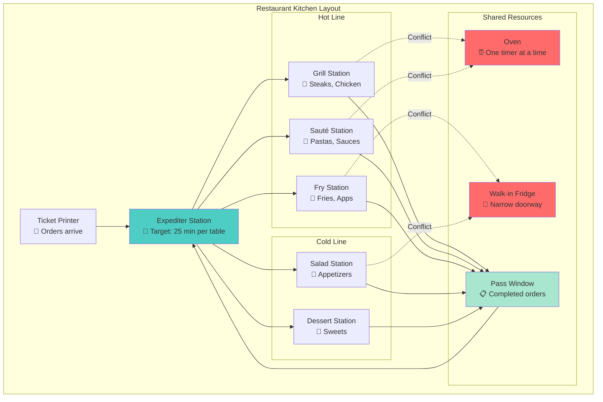

This diagram shows the **physical layout** that creates the conflicts we need to resolve. Notice:
- **Multiple stations** working in parallel
- **Shared resources** (oven, walk-in) that create bottlenecks
- **Expediter** as a central coordination point
- **Ticket flow** showing information propagation

Now let’s see what happens when a ticket arrives…

---

## Scenario 0: The Naive Approach (What NOT To Do)

### The Disastrous “Do Whatever Feels Right” Kitchen

Before we examine sophisticated approaches, let’s understand what happens with **no coordination strategy at all**:

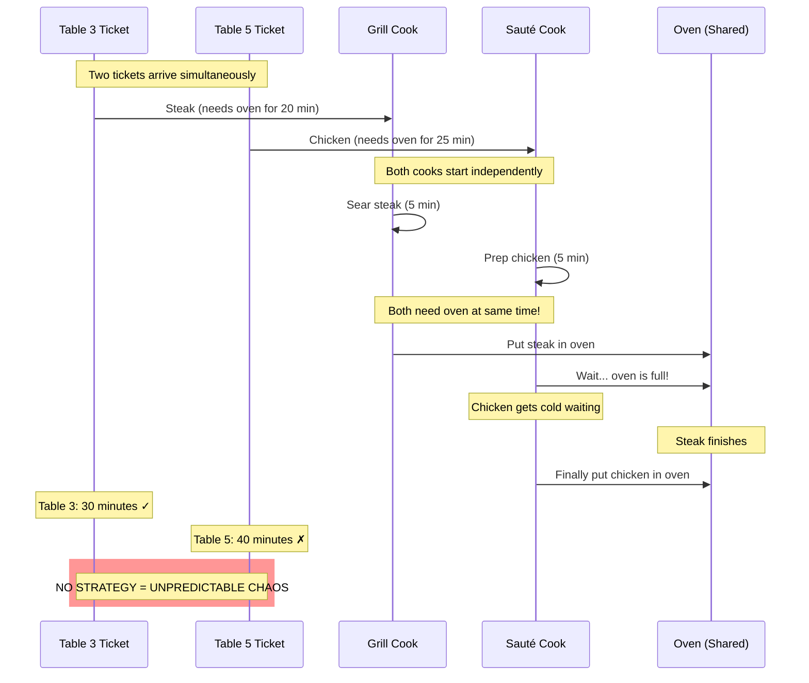

**What went wrong?**
- No coordination between stations
- Discovered conflict only during execution
- One table suffered significant delay
- No learning for next time

This **naive approach** teaches us that we need *some* coordination strategy. But what kind?

---

## Part 2: Five Different Kitchen Architectures

The same physical kitchen can operate under **fundamentally different organizational principles**. Each principle embodies different assumptions about knowledge, control, and adaptation. Let’s explore five distinct approaches, understanding how each handles the critical moments of conflict.

### Architecture 1: Command & Control (The Dictator Chef)

**Organizational Principle**: “I know everything, follow my orders exactly”

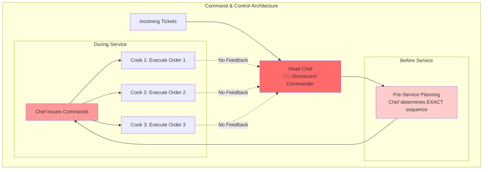

**Key Characteristic**: **Open-loop system with no feedback**

**The Chef’s Assumption**: “I know:
- Exactly how long each step takes
- All equipment availability
- All dependencies between dishes
- No surprises will occur”

**How It Works**:

1. **Pre-Service**: Chef plans complete sequence
    
    ```
    Sequence = [
      Cook Table 3 steak (grill, then oven),
      Cook Table 5 pasta (sauté station),
      Cook Table 3 sides (fry station),
      Cook Table 5 chicken (oven),
      ...
    ]
    ```
    
2. **During Service**: Cooks follow orders blindly
    - Cook: “But the pasta water isn’t boiling yet—”
    - Chef: “I SAID START TABLE 5 PASTA NOW!”
3. **Conflict Discovery**: **NEVER** (system assumes no conflicts)
4. **When Assumptions Fail**:
    
    ```mermaid
    graph LR
        ASSUMPTION[Chef's Plan] -->|Reality Differs| FAILURE[Catastrophic Failure]
        FAILURE -->|No Adaptation| CHAOS[Chaos & Delay]
    
        style FAILURE fill:#ff6b6b
        style CHAOS fill:#ff0000
    ```
    

**Example Dialogue**:

```
Chef: "Cook table 3's steak, then table 5's pasta, then table 3's sides."
Cook: "But the oven is—"
Chef: "DID I ASK FOR YOUR OPINION?"
[30 minutes later: Table 3 still waiting, table 5 got wrong dish]
```

**Architecture Summary**:

| Element | Command & Control |
| --- | --- |
| **Control Type** | Open-loop |
| **Feedback** | ❌ None |
| **Authority Role** | Dictator - issues commands |
| **Cook Role** | Executor - follows blindly |
| **Conflict Detection** | Never (assumes complete knowledge) |
| **Adaptation** | ❌ None |
| **Failure Mode** | Catastrophic when assumptions wrong |
| **Real World Example** | Military mess hall, assembly line |

---

### Architecture 2: Closed-Loop with Feedback (The Professional Restaurant)

**Organizational Principle**: “Set a target, measure performance, adapt dynamically”

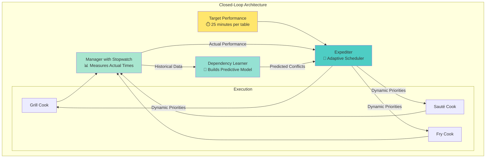

**Key Characteristic**: **Closed-loop system with continuous feedback and learning**

**The System’s Assumption**: “We DON’T know:
- Exact timing of each step
- All dependencies upfront
- Which conflicts will arise
- BUT we can measure, adapt, and learn!”

**How It Works**:

1. **Set Target**: Management decides “25 minutes per table”
2. **Measure Actual**: Manager times actual service
    
    ```mermaid
    gantt
        title Actual vs Target Performance
        dateFormat X
        axisFormat %L
    
        section Target
        Target Time (25 min) :milestone, target, 0, 0
    
        section Actual
        Table 1 :done, t1, 0, 28
        Table 2 :done, t2, 5, 33
        Table 3 :active, t3, 10, 40
        Table 4 :crit, t4, 15, 47
    
        Target (25 min) :milestone, 25, 25
    ```
    
3. **Compute Error**: Error = Actual - Target
    - Table 1: +3 minutes (slightly over)
    - Table 4: +7 minutes (significantly over)
4. **Adapt Strategy**:
    
    ```mermaid
    graph LR
        ERROR[Error: +7 min] --> ANALYZE[Analyze Cause]
        ANALYZE -->|Oven conflict| REORDER[Reorder Ticket Priorities]
        ANALYZE -->|Missing prep| PREDICT[Predict Next Conflict]
    
        REORDER --> ADJUST[Adjust Queue]
        PREDICT --> ADJUST
    
        style ERROR fill:#ff9999
        style ADJUST fill:#a8e6cf
    ```
    
5. **Learn Over Time**:
    
    ```mermaid
    graph TB
        subgraph "Week 1: No Knowledge"
            W1[Avg Time: 35 min<br/>High variance]
        end
    
        subgraph "Week 4: Learning"
            W4[Avg Time: 28 min<br/>Predicting conflicts]
        end
    
        subgraph "Week 12: Mastery"
            W12[Avg Time: 24 min<br/>Proactive scheduling]
        end
    
        W1 --> W4
        W4 --> W12
    
        style W12 fill:#a8e6cf
    ```
    

**Example Dialogue**:

```
Expediter: "We're targeting 25 minutes per table."
Cook: "Table 7 is at 30 minutes!"
Expediter: "Bump their salad to cold station, start table 8's apps now."
Manager: "Last week average was 30 min, this week 27 min. Learning the pattern!"
```

**The Feedback Loop in Detail**:

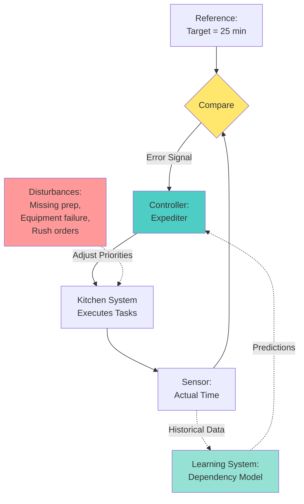

**Architecture Summary**:

| Element | Closed-Loop with Feedback |
| --- | --- |
| **Control Type** | Closed-loop with feedback |
| **Feedback** | ✅ Continuous |
| **Authority Role** | Target setter + Adaptive expediter |
| **Cook Role** | Responsive executor |
| **Conflict Detection** | During execution |
| **Adaptation** | ✅ Real-time adjustment |
| **Learning** | ✅ Builds predictive model |
| **Failure Mode** | Graceful degradation |
| **Real World Example** | **Professional restaurant** |

---

### Architecture 3: Multi-Agent Collision Detection (The Food Truck Collective)

**Organizational Principle**: “Everyone works independently, call referee only when we collide”

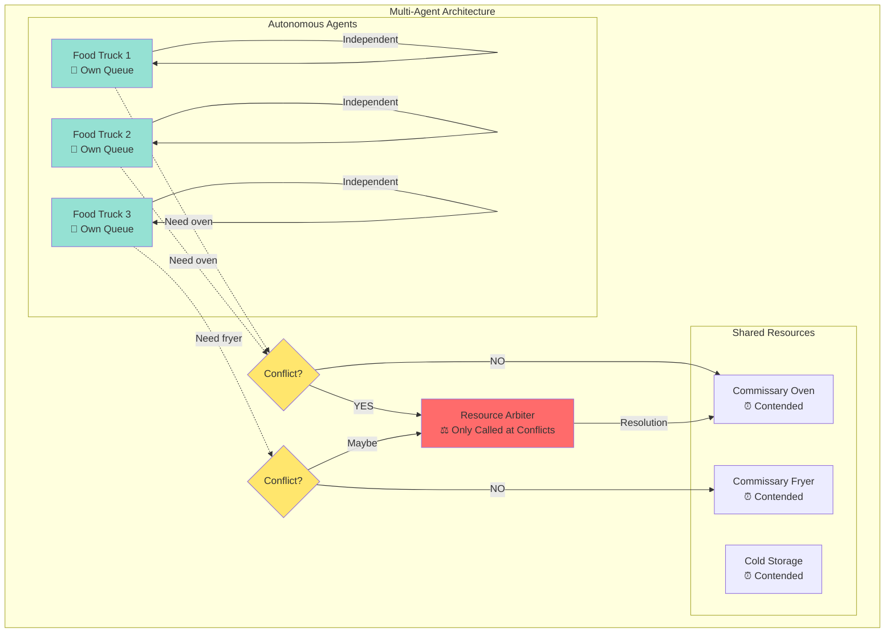

**Key Characteristic**: **Autonomous agents with conflict arbitration**

**The System’s Assumption**: “Each agent can work independently UNTIL they need the same resource”

**How It Works**:

1. **Normal Operation**: Each truck follows its own sequence
    
    ```mermaid
    gantt
        title Independent Agent Timelines
        dateFormat X
        axisFormat %L
    
        section Truck 1
        Prep burgers :t1, 0, 10
        Cook burgers :t1b, 10, 25
        Package :t1c, 25, 30
    
        section Truck 2
        Prep tacos :t2, 0, 15
        Cook tacos :t2b, 15, 30
    
        section Truck 3
        Prep fries :t3, 5, 12
        Cook fries :t3b, 12, 20
    ```
    
2. **Collision Detection**: Agents attempt to acquire shared resource
    
    ```mermaid
    sequenceDiagram
        participant T1 as Truck 1
        participant T2 as Truck 2
        participant O as Oven
        participant A as Arbiter
    
        T1->>O: Request oven access
        O->>T1: Granted (oven free)
    
        Note over T1,O: Truck 1 using oven
    
        T2->>O: Request oven access
        O->>T2: CONFLICT! Oven busy
    
        T2->>A: Arbitration request
        A->>A: Decide priority
        A->>T2: Wait 10 minutes
    
        Note over T2: Truck 2 waits
    
        T1->>O: Release oven
        A->>T2: Proceed now
    ```
    
3. **Arbitration Policies**:
    - **First-Come-First-Serve**: Earliest request wins
    - **Priority-Based**: VIP orders jump queue
    - **Fair Sharing**: Round-robin with time slices
    - **Auction**: Bid for resource access
4. **Low Baseline, Spiky Latency**:
    
    ```mermaid
    graph TB
        subgraph "Latency Profile"
            BASELINE[Baseline: Fast<br/>No conflicts]
            SPIKE1[Spike: Wait<br/>Oven conflict]
            BASELINE2[Baseline: Fast<br/>Conflict resolved]
            SPIKE2[Spike: Wait<br/>Fryer conflict]
    
            BASELINE --> SPIKE1
            SPIKE1 --> BASELINE2
            BASELINE2 --> SPIKE2
        end
    
        style SPIKE1 fill:#ff9999
        style SPIKE2 fill:#ff9999
        style BASELINE fill:#a8e6cf
        style BASELINE2 fill:#a8e6cf
    ```
    

**Example Dialogue**:

```
Truck 1: "I need the oven for my chicken."
Truck 2: "I'm using it for my fish."
Arbiter: "Truck 1 gets 10 minutes, then Truck 2."
```

**Architecture Summary**:

| Element | Multi-Agent Collision |
| --- | --- |
| **Control Type** | Distributed with arbitration |
| **Feedback** | ⚠️ Only at conflicts |
| **Authority Role** | Referee - resolves conflicts only |
| **Agent Role** | Autonomous - own decision making |
| **Conflict Detection** | At resource access attempts |
| **Adaptation** | ⚠️ Agent-level only |
| **Latency** | Low baseline, spikes at collisions |
| **Real World Example** | Food truck collective, thread scheduling |

---

### Architecture 4: Single Agent Pathway Switching (The Home Cook)

**Organizational Principle**: “I switch between tasks, checking the recipe only when I switch”

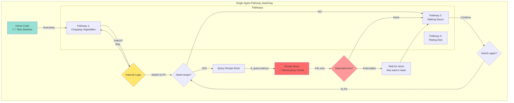

**Key Characteristic**: **Sequential pathway execution with memoryless oracle**

**The System’s Assumption**: “I work through tasks sequentially, consulting reference material only when switching tasks”

**Key Insight**: The recipe book doesn’t track what you’ve done – it’s **stateless**. Every query is independent.

**How It Works**:

1. **Execute Current Pathway**:
    
    ```mermaid
    graph LR
        START[Start P1:<br/>Chop vegetables] --> STEP1[Chop onions]
        STEP1 --> STEP2[Chop carrots]
        STEP2 --> STEP3[Chop celery]
    
        style START fill:#a8e6cf
    ```
    
2. **Internal Logic Triggers Switch**:
    
    ```
    Cook's thought process:
    "Vegetables are chopped. Next I need to make the sauce.
     Let me check the recipe for sauce instructions..."
    ```
    
3. **Query Recipe (if needed)**:
    
    ```mermaid
    sequenceDiagram
        participant C as Cook
        participant R as Recipe Book
    
        Note over C: Finished chopping pathway
    
        C->>C: Decision: Switch to sauce pathway
        C->>R: "How do I make the sauce?"
    
        Note over R: Recipe book has no memory<br/>of what cook just did
    
        R->>C: "Use the stock from step 3"
    
        C->>C: "Oh no! I didn't make stock!"
    
        Note over C: Externality discovered
    ```
    
4. **Discovery of Missing Dependencies**:
    
    ```mermaid
    graph TB
        SWITCH[Pathway Switch Point] --> QUERY[Query Recipe]
        QUERY --> DISCOVER{What's discovered?}
    
        DISCOVER -->|All Good| PROCEED[Proceed to new pathway]
        DISCOVER -->|Missing Prep!| EXTERNAL[Handle Externality]
    
        EXTERNAL --> BACKTRACK[Go back and make stock]
        BACKTRACK --> PROCEED
    
        style DISCOVER fill:#ffe66d
        style EXTERNAL fill:#ff9999
    ```
    

**Example Dialogue**:

```
Cook: "Time to make the sauce... let me check the recipe."
Recipe: "Use the stock from step 3."
Cook: "Oh no, I didn't make stock! I have to do that first!"
```

**Why This Happens**:
- Recipe book is **memoryless** – doesn’t know your execution history
- Cook discovers dependencies **at runtime** when switching tasks
- No feedback loop to warn about missing prerequisites

**The Oracle’s Perspective**:

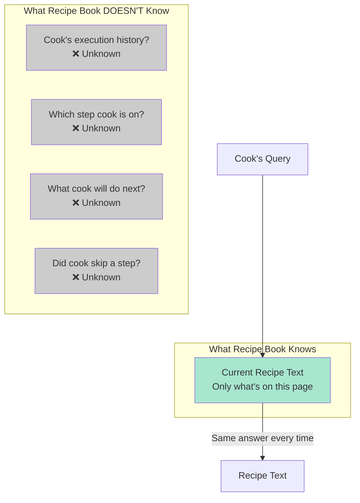

**Architecture Summary**:

| Element | Single Agent Pathway |
| --- | --- |
| **Control Type** | Sequential with oracle queries |
| **Feedback** | ⚠️ Only at pathway switches |
| **Authority Role** | Memoryless oracle - provides info only |
| **Agent Role** | Autonomous task switcher |
| **Conflict Detection** | When switching pathways |
| **Latency** | Query cost + externality handling |
| **Real World Example** | Home cooking, solo software development |

---

### Architecture 5: Kick the Can (Deferred Complexity)

**Organizational Principle**: “Do the easy stuff now, we’ll figure out the hard stuff later”

```mermaid
graph TB
    subgraph "Kick the Can Architecture"
        START[Start Prep] --> EASY1[Easy Task 1<br/>✅ Fast]

        EASY1 --> HARD1{Hard Task?}
        HARD1 -->|Skip it!| KICK1[👟 Kick Can →]

        KICK1 --> EASY2[Easy Task 2<br/>✅ Fast]

        EASY2 --> HARD2{Hard Task?}
        HARD2 -->|Defer it!| KICK2[👟 Kick Can →]

        KICK2 --> EASY3[Easy Task 3<br/>✅ Fast]

        EASY3 --> HARD3{Hard Task?}
        HARD3 -->|Later!| KICK3[👟 Kick Can →]

        KICK3 --> DEADLINE[🧱 SERVICE TIME!]

        DEADLINE --> PANIC[🔥 PANIC MODE<br/>All deferred work DUE NOW]

        PANIC --> CRISIS[Complexity Debt:<br/>δ₁ + δ₂ + δ₃ + compound interest]
    end

    style EASY1 fill:#a8e6cf
    style EASY2 fill:#a8e6cf
    style EASY3 fill:#a8e6cf
    style KICK1 fill:#ffe66d
    style KICK2 fill:#ff9999
    style KICK3 fill:#ff0000
    style PANIC fill:#8b0000
    style CRISIS fill:#ff0000
```

**Key Characteristic**: **Optimistic execution with deferred complexity**

**The System’s Assumption**: “If we defer the hard stuff, maybe:
- We won’t need it after all
- We’ll have more information later
- Someone else will handle it
- Magic will happen”

**Spoiler**: Magic doesn’t happen. The can hits a wall.

**How It Works**:

1. **Early Execution (Lightweight)**:
    
    ```mermaid
    graph LR
        TASK1[Simple Prep] -->|2 min| TASK2[Basic Chopping]
        TASK2 -->|3 min| TASK3[Easy Seasoning]
    
        COMPLEX1[🥫 Garnish prep] -.->|DEFERRED| CAN1[The Can]
    
        style TASK1 fill:#a8e6cf
        style TASK2 fill:#a8e6cf
        style TASK3 fill:#a8e6cf
        style CAN1 fill:#ffe66d
    ```
    
2. **Mid Execution (Can Getting Heavier)**:
    
    ```mermaid
    graph LR
        TASK4[More Simple Tasks] -->|4 min| TASK5[Still Easy]
    
        COMPLEX2[🥫 Sauce reduction] -.->|DEFERRED| CAN2[The Can<br/>🥫🥫]
    
        style TASK4 fill:#a8e6cf
        style TASK5 fill:#a8e6cf
        style CAN2 fill:#ff9999
    ```
    
3. **Late Execution (Can Very Heavy)**:
    
    ```mermaid
    graph LR
        TASK6[Last Easy Task] --> LOOK[Look at can]
    
        LOOK --> OH_NO[😱 Can is HUGE]
    
        COMPLEX3[🥫 Stock preparation] -.->|DEFERRED| CAN3[The Can<br/>🥫🥫🥫]
        COMPLEX4[🥫 Plating complexity] -.->|DEFERRED| CAN3
        COMPLEX5[🥫 Temperature timing] -.->|DEFERRED| CAN3
    
        style OH_NO fill:#ff6b6b
        style CAN3 fill:#8b0000
    ```
    
4. **The Wall (Reckoning Time)**:
    
    ```mermaid
    sequenceDiagram
        participant C as Cook
        participant CAN as The Can (Deferred Work)
        participant W as Wall (Deadline)
        participant D as Dinner Service
    
        Note over C,CAN: Hour 1: Kicking feels great!
        C->>CAN: Kick garnish prep
        C->>CAN: Kick sauce reduction
    
        Note over C,CAN: Hour 2: Can getting heavy...
        C->>CAN: Kick stock preparation
        C->>CAN: Kick plating design
    
        Note over C,W: Hour 3: SERVICE IN 5 MINUTES!
    
        CAN->>W: 🥫🥫🥫🥫 CRASH!
        W->>C: PAY ALL DEBT NOW
    
        C->>C: 🔥 PANIC
    
        rect rgb(255, 0, 0, 0.3)
            Note over C,D: Everything needed simultaneously<br/>Compound complexity<br/>Catastrophic latency spike
        end
    
        C->>D: Late, stressed, poor quality
    ```
    

**The Mathematics of Can-Kicking**:

```
Early Strategy:
  L_early = N × t_easy          (feels fast!)
  Deferred = {C₁, C₂, C₃, ..., Cₙ}

Reckoning Point:
  L_reckoning = Σ(Cᵢ) + compound_interactions

Where compound_interactions > Σ(Cᵢ)
  (The can gets heavier than sum of deferred tasks)
```

**Example Dialogue**:

```
Expediter: "This garnish is complex, we'll do it later."
[2 hours later]
Cook: "SERVICE IN 5 MINUTES AND WE HAVE 50 GARNISHES TO DO! 🔥"
Expediter: "WHY DIDN'T WE DO THESE EARLIER?!"
Cook: "YOU SAID LATER!"
```

**The Can’s Journey**:

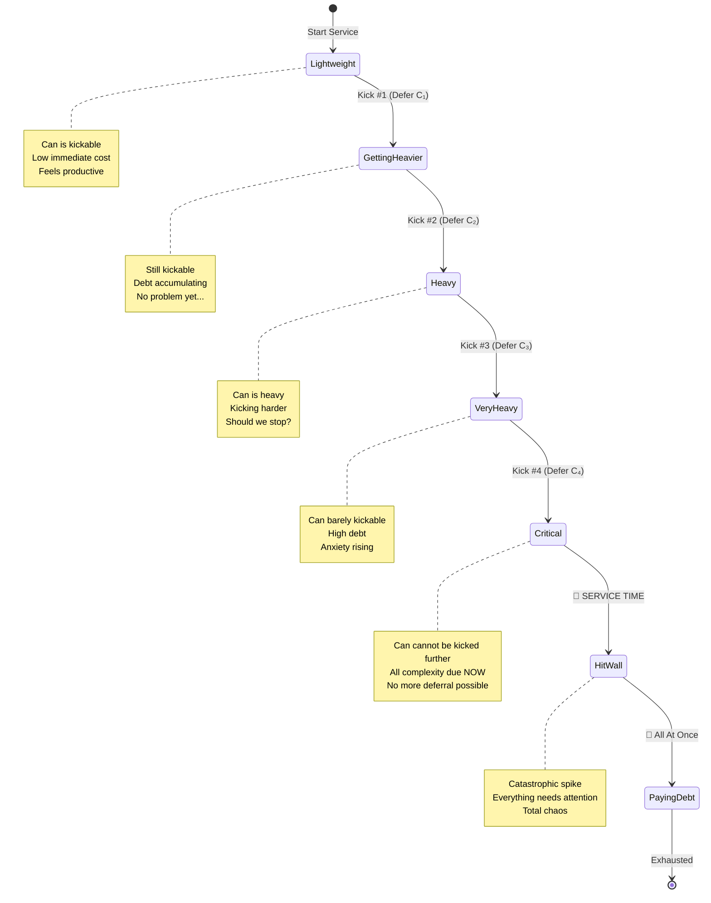

**Architecture Summary**:

| Element | Kick the Can |
| --- | --- |
| **Control Type** | Optimistic with deferred handling |
| **Feedback** | ❌ None until crisis |
| **Authority Role** | “We’ll figure it out later” |
| **Agent Role** | Optimistic executor |
| **Conflict Detection** | At deadline (too late!) |
| **Adaptation** | ❌ Panic mode only |
| **Latency** | Low early, **catastrophic** at deadline |
| **Real World Example** | Catering under pressure, Thanksgiving dinner chaos |

---

## Part 3: The Universal Execution Loop

### From Kitchens to General Theory

Now that we’ve built intuition with five different kitchen architectures, let’s extract the **universal pattern** that underlies all of them. Every architecture we examined follows the same basic execution loop, but they differ in **how they handle critical decision points**.

This is the key insight: **The loop is canonical, the policies are pluggable.**

### The Universal Agent Execution Loop

Every agent in every architecture executes this loop:

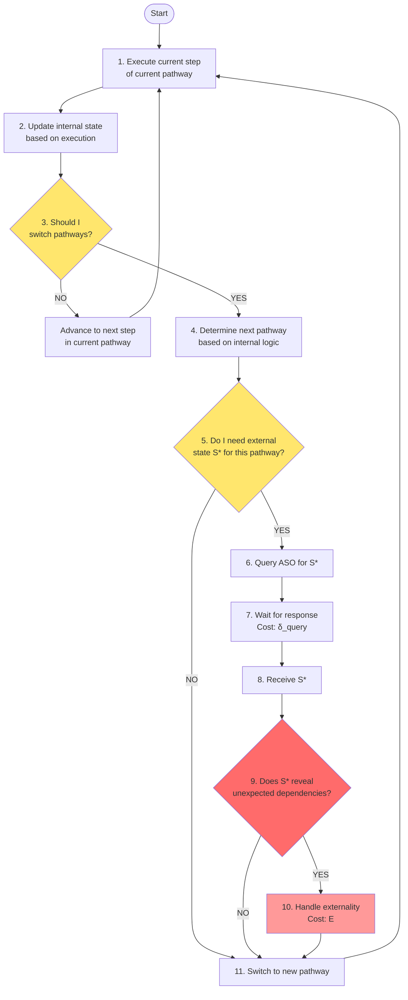

### The Critical Decision Points

The loop has **two critical decision points** where architectural assumptions create dramatic differences:

**Decision Point 1 (Step 9)**: “Does S* reveal unexpected dependencies?”

**Decision Point 2 (Step 10)**: “How do we handle the externality?”

These two steps are where we **plug in different policies** to create different architectures!

---

## Part 4: Modular Architectural Policies

### Step 9: Dependency Discovery Policy

At Step 9, we ask: “Does the external state reveal something we didn’t know?”

Different architectures have different **dependency discovery policies**:

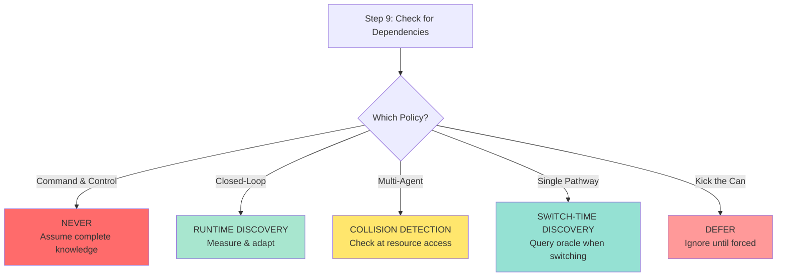

### Policy 1: Command & Control - “Never Discover”

```jsx
// Step 9: Dependency Discovery (Command & Control)function checkDependencies_CommandControl(externalState) {
    // Assumption: Chef knows everything upfront    // Dependencies were planned in advance    // If something is wrong, it's not our problem!    return {
        dependenciesFound: false,  // Always false        action: "continue"    };}
```

**Behavior**: System NEVER discovers dependencies because it assumes it already knows everything. When reality differs from assumptions, system fails silently.

### Policy 2: Closed-Loop - “Measure and Adapt”

```jsx
// Step 9: Dependency Discovery (Closed-Loop)function checkDependencies_ClosedLoop(externalState, targetState, history) {
    // Measure actual vs target    const error = externalState.actualTime - targetState.targetTime;    if (Math.abs(error) > THRESHOLD) {
        // Analyze why we're off target        const conflict = analyzeConflict(externalState, history);        // Update predictive model        dependencyLearner.update(conflict);        return {
            dependenciesFound: true,            conflict: conflict,            action: "adapt_priority_queue"        };    }
    return {
        dependenciesFound: false,        action: "continue"    };}
```

**Behavior**: Continuously compares actual performance against target. When deviation detected, analyzes root cause and adapts. **Learns from experience**.

### Policy 3: Multi-Agent - “Check Resource Availability”

```jsx
// Step 9: Dependency Discovery (Multi-Agent)function checkDependencies_MultiAgent(externalState, requiredResource) {
    // Try to acquire shared resource    const resourceStatus = externalState.resources[requiredResource];    if (resourceStatus.inUse) {
        return {
            dependenciesFound: true,            conflict: {
                type: "resource_contention",                resource: requiredResource,                holder: resourceStatus.currentUser            },            action: "request_arbitration"        };    }
    return {
        dependenciesFound: false,        action: "acquire_resource"    };}
```

**Behavior**: Checks resource availability only when attempting access. Collision detected at runtime, arbitration requested.

### Policy 4: Single Pathway - “Query Oracle”

```jsx
// Step 9: Dependency Discovery (Single Pathway)function checkDependencies_SinglePathway(externalState, newPathway) {
    // Query memoryless oracle for pathway requirements    const requirements = externalState.pathwayInfo[newPathway];    // Check if requirements are met    const missingPrereqs = requirements.prerequisites.filter(
        prereq => !ourState.completed.includes(prereq)
    );    if (missingPrereqs.length > 0) {
        return {
            dependenciesFound: true,            conflict: {
                type: "missing_prerequisites",                missing: missingPrereqs
            },            action: "backtrack_and_complete"        };    }
    return {
        dependenciesFound: false,        action: "continue"    };}
```

**Behavior**: Discovers dependencies when switching pathways. Oracle has no memory of what agent did before.

### Policy 5: Kick the Can - “Defer and Hope”

```jsx
// Step 9: Dependency Discovery (Kick the Can)function checkDependencies_KickTheCan(externalState, deferredComplexity) {
    // Are we at the wall yet?    if (externalState.deadline_imminent) {
        // Can't kick anymore!        return {
            dependenciesFound: true,            conflict: {
                type: "accumulated_debt",                deferred: deferredComplexity.allItems,                cost: calculateCompoundCost(deferredComplexity)
            },            action: "panic_mode"        };    }
    // Not at wall yet, keep kicking!    return {
        dependenciesFound: false,  // Ignore problems        action: "defer_to_future"    };}
```

**Behavior**: Ignores dependencies until forced to confront them at deadline. Accumulates complexity debt with compound interest.

---

### Step 10: Externality Handling Policy

At Step 10, we ask: “How do we handle the discovered dependency/conflict?”

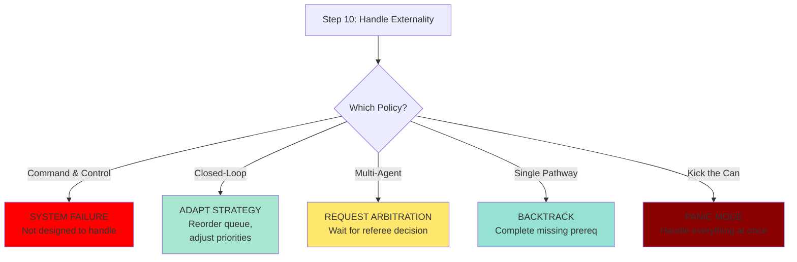

### Policy 1: Command & Control - “System Failure”

```jsx
// Step 10: Externality Handling (Command & Control)function handleExternality_CommandControl(conflict) {
    // This code path should never execute    // If we're here, assumptions were wrong    console.error("FATAL ERROR: Unexpected dependency!");    console.error("System was not designed for this scenario!");    // No recovery mechanism exists    throw new SystemFailureException(
        "Command plan failed - no adaptation possible"    );}
```

**Behavior**: System cannot handle unexpected dependencies. Catastrophic failure.

### Policy 2: Closed-Loop - “Adapt and Learn”

```jsx
// Step 10: Externality Handling (Closed-Loop)function handleExternality_ClosedLoop(conflict, queue, learner) {
    // Compute correction    const correction = computePIDCorrection(
        conflict.error,        P_GAIN, I_GAIN, D_GAIN
    );    // Reorder queue based on correction    queue.reorder(correction);    // Update learning model    learner.recordConflict(conflict);    learner.updatePredictions();    // Log for performance analysis    performance.log({
        timestamp: now(),        conflict: conflict,        correction: correction,        queueState: queue.snapshot()
    });    return {
        action: "continue_with_adjusted_strategy",        cost: conflict.delayIncurred    };}
```

**Behavior**: Dynamically adjusts strategy. Learns from conflicts to predict and prevent future occurrences.

### Policy 3: Multi-Agent - “Request Arbitration”

```jsx
// Step 10: Externality Handling (Multi-Agent)function handleExternality_MultiAgent(conflict, arbiter) {
    // Package conflict information    const arbitrationRequest = {
        requester: this.agentId,        resource: conflict.resource,        priority: this.calculatePriority(),        timestamp: now()
    };    // Submit to arbiter    const decision = arbiter.requestArbitration(arbitrationRequest);    // Wait for decision    const waitTime = decision.waitUntil - now();    sleep(waitTime);    // Acquire resource when permitted    conflict.resource.acquire(this.agentId);    return {
        action: "proceed_with_resource",        cost: waitTime
    };}
```

**Behavior**: Waits for external arbiter to resolve conflict. Accepts arbitration decision.

### Policy 4: Single Pathway - “Backtrack and Complete”

```jsx
// Step 10: Externality Handling (Single Pathway)function handleExternality_SinglePathway(conflict, oracleState) {
    // Discover what we missed    const missingSteps = conflict.missing;    console.log("Discovered missing prerequisites:", missingSteps);    // Save current pathway position    const savedPosition = this.currentPosition;    const savedPathway = this.currentPathway;    // Backtrack to complete missing work    for (const prereq of missingSteps) {
        console.log(`Backtracking to complete: ${prereq}`);        // Query oracle for how to do this prerequisite        const prereqInstructions = oracleState.pathwayInfo[prereq];        // Execute the missing pathway        this.executePathway(prereq, prereqInstructions);    }
    // Return to original pathway    this.currentPathway = savedPathway;    this.currentPosition = savedPosition;    return {
        action: "resume_original_pathway",        cost: calculateBacktrackCost(missingSteps)
    };}
```

**Behavior**: Discovers missing work at pathway switch. Backtracks to complete prerequisites before proceeding.

### Policy 5: Kick the Can - “Panic Mode”

```jsx
// Step 10: Externality Handling (Kick the Can)function handleExternality_KickTheCan(accumulatedDebt) {
    console.log("🔥 PANIC MODE ACTIVATED 🔥");    console.log(`Deferred complexity count: ${accumulatedDebt.length}`);    // Everything is due NOW    const startTime = now();    // Attempt to handle all deferred work simultaneously    const results = [];    for (const deferredTask of accumulatedDebt) {
        // No time for proper sequencing        // Do everything as fast as possible        const result = rushExecution(deferredTask);        results.push(result);    }
    const totalTime = now() - startTime;    const compoundCost = totalTime * PANIC_MULTIPLIER;    // Quality suffered, time exploded    return {
        action: "completed_under_duress",        cost: compoundCost,        quality: "degraded",        stress: "maximum"    };}
```

**Behavior**: Handles all deferred complexity simultaneously. High cost, degraded quality, maximum stress.

---

## Part 5: Comparative Architecture Analysis

### Side-by-Side Comparison: Decision Making

Let’s see how the SAME situation (oven conflict) is handled by different policies:

**Scenario**: Two dishes need the oven simultaneously

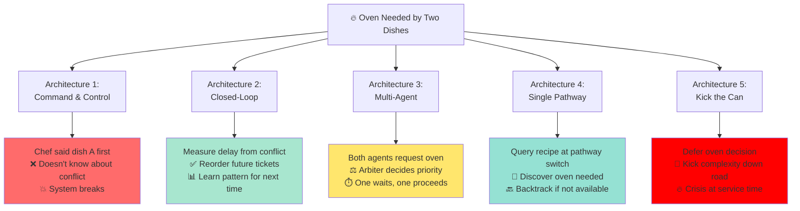

### Performance Characteristics Matrix

| Metric | Command & Control | Closed-Loop | Multi-Agent | Single Pathway | Kick the Can |
| --- | --- | --- | --- | --- | --- |
| **Best Case Latency** | ⭐⭐⭐⭐⭐ Optimal | ⭐⭐⭐⭐ Good | ⭐⭐⭐⭐ Good | ⭐⭐⭐ Moderate | ⭐⭐⭐⭐⭐ Feels fast |
| **Worst Case Latency** | 💥 Catastrophic | ⭐⭐⭐ Bounded | ⭐⭐ Spikes | ⭐⭐ Variable | 💥 Catastrophic |
| **Adaptability** | ❌ None | ✅✅✅ High | ⚠️ Limited | ⚠️ Local only | ❌ None |
| **Learning** | ❌ Never | ✅✅✅ Continuous | ⚠️ Conflict patterns | ⚠️ Dependency patterns | ❌ Never |
| **Coordination Cost** | Low (predetermined) | Moderate (feedback) | Low (sparse) | Very Low (solo) | Low (defer) |
| **Robustness** | ❌ Brittle | ✅✅✅ Robust | ✅✅ Good | ✅ Moderate | ❌ Brittle |
| **Predictability** | ⭐⭐ (until failure) | ⭐⭐⭐⭐ | ⭐⭐⭐ | ⭐⭐ | ❌ Unpredictable |
| **Scalability** | ⭐⭐ | ⭐⭐⭐⭐ | ⭐⭐⭐⭐⭐ | ⭐⭐⭐ | ⭐ |

### Latency Profile Visualization

```mermaid
graph TB
    subgraph "Command & Control Latency"
        CC_START[Start] --> CC_GOOD[Good if assumptions right]
        CC_GOOD -.->|Reality differs| CC_FAIL[Catastrophic failure]

        style CC_FAIL fill:#ff0000
    end

    subgraph "Closed-Loop Latency"
        CL_START[Start] --> CL_MEASURE[Measure performance]
        CL_MEASURE --> CL_ADAPT[Adapt strategy]
        CL_ADAPT --> CL_IMPROVE[Continuous improvement]

        style CL_IMPROVE fill:#a8e6cf
    end

    subgraph "Multi-Agent Latency"
        MA_START[Start] --> MA_BASELINE[Low baseline]
        MA_BASELINE --> MA_SPIKE1[Spike at conflict]
        MA_SPIKE1 --> MA_BASELINE2[Return to baseline]

        style MA_SPIKE1 fill:#ffe66d
    end

    subgraph "Single Pathway Latency"
        SP_START[Start] --> SP_EXEC[Execute pathway]
        SP_EXEC --> SP_QUERY[Query at switch]
        SP_QUERY --> SP_DISCOVER{Dependency?}
        SP_DISCOVER -->|Yes| SP_BACK[Backtrack cost]
        SP_DISCOVER -->|No| SP_CONTINUE[Continue]

        style SP_BACK fill:#ff9999
    end

    subgraph "Kick the Can Latency"
        KC_START[Start] --> KC_FAST[Fast early execution]
        KC_FAST --> KC_DEFER[Defer complexity]
        KC_DEFER --> KC_DEADLINE[Hit deadline]
        KC_DEADLINE --> KC_PANIC[PANIC SPIKE]

        style KC_PANIC fill:#8b0000
    end
```

---

## Part 6: Control Theory Perspective

### From Kitchens to Feedback Control Systems

Now let’s formalize what we’ve learned using control theory concepts. This helps us understand WHY certain architectures behave the way they do.

### Open-Loop vs Closed-Loop Systems

### Open-Loop System (Command & Control)

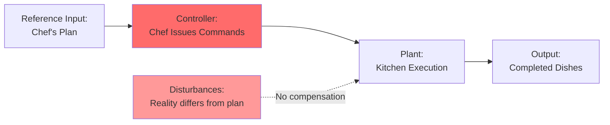

**Characteristics**:
- No feedback loop
- Disturbances cause uncompensated errors
- Performance depends entirely on model accuracy
- Cannot adapt to changing conditions

**Mathematical Model**:

```
Output = Plant × Controller × Input
         (no feedback term)
```

If plant behavior differs from model: **FAIL**

### Closed-Loop System (Closed-Loop Feedback)

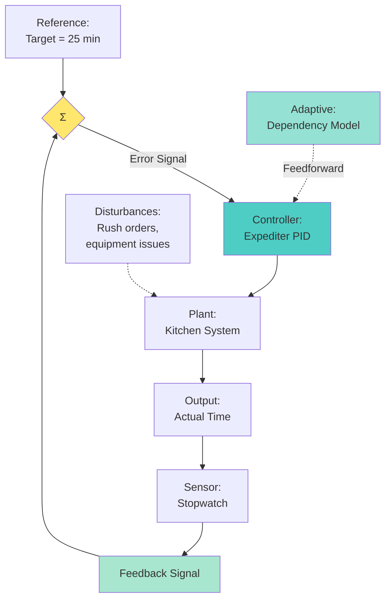

**Characteristics**:
- Continuous feedback loop
- Measures actual vs. desired
- Compensates for disturbances
- Adapts to changing conditions
- Can incorporate learning (adaptive control)

**Mathematical Model**:

```
Error(t) = Reference(t) - Output(t)

Control(t) = Kp × Error(t)          (Proportional)
           + Ki × ∫Error(τ)dτ       (Integral)
           + Kd × dError/dt         (Derivative)

Output(t+1) = f(Output(t), Control(t), Disturbance(t))
```

**PID Control in Restaurant Context**:

```jsx
// Expediter as PID Controllerclass ExpediterController {
    constructor() {
        this.Kp = 0.5;  // Proportional gain        this.Ki = 0.1;  // Integral gain        this.Kd = 0.2;  // Derivative gain        this.integral = 0;        this.lastError = 0;    }
    computeAction(targetTime, actualTime, dt) {
        // Compute error        const error = actualTime - targetTime;  // Positive if late        // Proportional term: React to current error        const P = this.Kp * error;        // Integral term: React to accumulated error        this.integral += error * dt;        const I = this.Ki * this.integral;        // Derivative term: React to rate of error change        const derivative = (error - this.lastError) / dt;        const D = this.Kd * derivative;        this.lastError = error;        // Control action        const control = P + I + D;        // Translate to kitchen actions        if (control > THRESHOLD_HIGH) {
            return "increase_priority";  // Rush this order        } else if (control < THRESHOLD_LOW) {
            return "decrease_priority";  // Can wait        } else {
            return "maintain_current";        }
    }
}
```

**Why This Works**:
- **P term**: If table is running late, bump its priority
- **I term**: If tables consistently run late, systematically increase urgency
- **D term**: If table’s time is accelerating (getting worse fast), intervene aggressively

### System Stability and Convergence

```mermaid
graph TB
    subgraph "Stable System (Closed-Loop)"
        START1[Initial Error:<br/>+10 min late] --> CORRECT1[Apply control:<br/>Bump priority]
        CORRECT1 --> MEASURE1[Measure:<br/>+5 min late]
        MEASURE1 --> CORRECT2[Apply control:<br/>Rush order]
        CORRECT2 --> MEASURE2[Measure:<br/>+1 min late]
        MEASURE2 --> CONVERGE[✅ Converge to target]

        style CONVERGE fill:#a8e6cf
    end

    subgraph "Unstable System (Command & Control)"
        START2[Initial Error:<br/>+5 min late] --> NO_CORRECT[No correction]
        NO_CORRECT --> WORSE[+8 min late]
        WORSE --> NO_CORRECT2[No correction]
        NO_CORRECT2 --> DIVERGE[+15 min late]
        DIVERGE --> FAIL[💥 System failure]

        style FAIL fill:#ff0000
    end
```

---

## Part 7: The Agent Execution Loop - Complete Implementation

### Putting It All Together

Let’s implement the complete execution loop with pluggable policies:

```jsx
class UniversalAgent {
    constructor(architecture) {
        this.architecture = architecture;        this.currentPathway = null;        this.currentPosition = 0;        this.internalState = {};        this.executionHistory = [];        // Load architecture-specific policies        this.dependencyPolicy = POLICIES[architecture].dependencyDiscovery;        this.externalityPolicy = POLICIES[architecture].externalityHandling;    }
    // THE UNIVERSAL LOOP    async executeLoop() {
        while (!this.isComplete()) {
            // STEP 1: Execute current step            await this.executeCurrentStep();            // STEP 2: Update internal state            this.updateInternalState();            // STEP 3: Should I switch pathways?            if (this.shouldSwitchPathway()) {
                // STEP 4: Determine next pathway                const nextPathway = this.determineNextPathway();                // STEP 5: Do I need external state?                if (this.needsExternalState(nextPathway)) {
                    // STEP 6: Query ASO                    const queryStart = performance.now();                    const externalState = await this.queryASO(nextPathway);                    const queryLatency = performance.now() - queryStart;                    // STEP 7: Wait for response (cost recorded above)                    this.logLatency('query', queryLatency);                    // STEP 8: Receive S*                    this.receiveExternalState(externalState);                    // STEP 9: Check for dependencies (PLUGGABLE POLICY!)                    const dependencyCheck = this.dependencyPolicy(
                        externalState,                        this.internalState,                        this.executionHistory                    );                    if (dependencyCheck.dependenciesFound) {
                        // STEP 10: Handle externality (PLUGGABLE POLICY!)                        const externalityStart = performance.now();                        const handling = await this.externalityPolicy(
                            dependencyCheck.conflict,                            externalState,                            this                        );                        const externalityLatency = performance.now() - externalityStart;                        this.logLatency('externality', externalityLatency);                        this.logExternality(dependencyCheck.conflict, handling);                    }
                    // STEP 11: Switch to new pathway                    this.switchToPathway(nextPathway);                } else {
                    // STEP 11: Switch to new pathway (no external state needed)                    this.switchToPathway(nextPathway);                }
            } else {
                // Advance to next step in current pathway                this.advancePosition();            }
        }
        return this.generateReport();    }
    // Architecture-specific implementations would override these    shouldSwitchPathway() {
        return this.internalState.pathwayComplete;    }
    determineNextPathway() {
        // Internal logic determines next pathway        return this.internalState.nextPathwayLogic();    }
    needsExternalState(pathway) {
        // Does this pathway require authoritative state?        return pathway.requiresASO;    }
    async queryASO(pathway) {
        // Query Authoritative State Oracle        return await ASO.query(pathway);    }
    // ... other helper methods ...}
```

### Architecture-Specific Policy Implementations

```jsx
const POLICIES = {
    "command_control": {
        dependencyDiscovery: (externalState, internalState, history) => {
            // Never discover dependencies            return {
                dependenciesFound: false,                action: "continue"            };        },        externalityHandling: (conflict, externalState, agent) => {
            // Should never be called            throw new Error("System failure: unexpected dependency");        }
    },    "closed_loop": {
        dependencyDiscovery: (externalState, internalState, history) => {
            // Measure error against target            const error = externalState.actualTime - externalState.targetTime;            if (Math.abs(error) > THRESHOLD) {
                const conflict = analyzeConflict(externalState, history);                return {
                    dependenciesFound: true,                    conflict: conflict,                    action: "adapt"                };            }
            return {
                dependenciesFound: false,                action: "continue"            };        },        externalityHandling: async (conflict, externalState, agent) => {
            // Compute PID correction            const correction = agent.pidController.compute(conflict.error);            // Reorder queue            agent.queue.reorder(correction);            // Update learning model            agent.learner.recordConflict(conflict);            return {
                action: "continue_with_adjusted_strategy",                cost: conflict.delayIncurred            };        }
    },    "multi_agent": {
        dependencyDiscovery: (externalState, internalState, history) => {
            // Check resource availability            const resource = internalState.requiredResource;            const status = externalState.resources[resource];            if (status.inUse) {
                return {
                    dependenciesFound: true,                    conflict: {
                        type: "resource_contention",                        resource: resource,                        holder: status.currentUser                    },                    action: "request_arbitration"                };            }
            return {
                dependenciesFound: false,                action: "acquire_resource"            };        },        externalityHandling: async (conflict, externalState, agent) => {
            // Request arbitration            const decision = await externalState.arbiter.requestArbitration({
                requester: agent.id,                resource: conflict.resource,                priority: agent.calculatePriority()
            });            // Wait for decision            const waitTime = decision.waitUntil - Date.now();            await sleep(waitTime);            // Acquire resource            conflict.resource.acquire(agent.id);            return {
                action: "proceed_with_resource",                cost: waitTime
            };        }
    },    "single_pathway": {
        dependencyDiscovery: (externalState, internalState, history) => {
            // Query oracle for pathway requirements            const requirements = externalState.pathwayInfo[internalState.nextPathway];            // Check for missing prerequisites            const missing = requirements.prerequisites.filter(
                prereq => !internalState.completed.includes(prereq)
            );            if (missing.length > 0) {
                return {
                    dependenciesFound: true,                    conflict: {
                        type: "missing_prerequisites",                        missing: missing
                    },                    action: "backtrack"                };            }
            return {
                dependenciesFound: false,                action: "continue"            };        },        externalityHandling: async (conflict, externalState, agent) => {
            // Save current position            const savedPosition = agent.currentPosition;            const savedPathway = agent.currentPathway;            // Complete missing prerequisites            const backtrackCost = 0;            for (const prereq of conflict.missing) {
                const prereqInstructions = externalState.pathwayInfo[prereq];                const cost = await agent.executePathway(prereq, prereqInstructions);                backtrackCost += cost;            }
            // Restore position            agent.currentPathway = savedPathway;            agent.currentPosition = savedPosition;            return {
                action: "resume_original_pathway",                cost: backtrackCost
            };        }
    },    "kick_the_can": {
        dependencyDiscovery: (externalState, internalState, history) => {
            // Check if we've hit the wall            if (externalState.deadline_imminent) {
                return {
                    dependenciesFound: true,                    conflict: {
                        type: "accumulated_debt",                        deferred: internalState.deferredComplexity,                        cost: calculateCompoundCost(internalState.deferredComplexity)
                    },                    action: "panic"                };            }
            // Keep deferring            return {
                dependenciesFound: false,                action: "defer"            };        },        externalityHandling: async (conflict, externalState, agent) => {
            console.log("🔥 PANIC MODE ACTIVATED 🔥");            // Handle all deferred work simultaneously            const startTime = Date.now();            const results = await Promise.all(
                conflict.deferred.map(task => agent.rushExecution(task))
            );            const totalTime = Date.now() - startTime;            const compoundCost = totalTime * PANIC_MULTIPLIER;            return {
                action: "completed_under_duress",                cost: compoundCost,                quality: "degraded",                stress: "maximum"            };        }
    }
};
```

---

## Part 8: Real-World Applications Beyond Kitchens

### Where This Architecture Appears

The patterns we’ve studied appear everywhere in engineering:

### 1. Operating System Process Scheduling

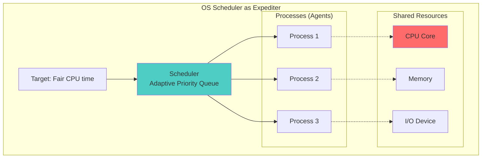

**Mapping**:
- **Tickets** = Processes
- **Expediter** = OS Scheduler
- **Cooks** = CPU cores
- **Oven** = Shared resources (memory, I/O)
- **Target time** = Fair CPU allocation
- **Feedback** = Process priority adjustment

**Architecture**: Typically **Closed-Loop** or **Multi-Agent**

### 2. Database Transaction Management

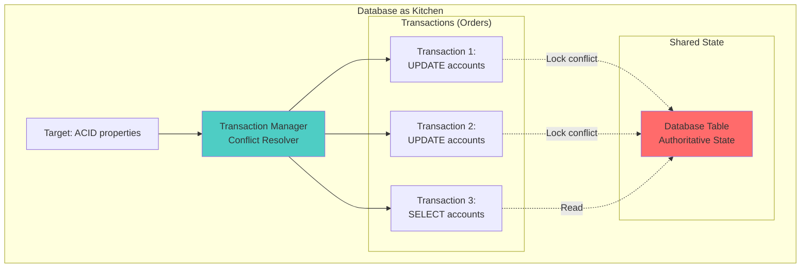

**Mapping**:
- **Tickets** = Transactions
- **ASO** = Database state (authoritative)
- **Conflict** = Lock contention
- **Arbiter** = Deadlock detector

**Architecture**: **Multi-Agent** with optimistic or pessimistic locking

### 3. Manufacturing Assembly Line

```mermaid
graph TB
    subgraph "Assembly Line as Kitchen"
        QUOTA[Target: Production quota]
        FOREMAN[Foreman<br/>Line Controller]

        subgraph "Stations"
            S1[Station 1:<br/>Welding]
            S2[Station 2:<br/>Assembly]
            S3[Station 3:<br/>Quality Check]
        end

        subgraph "Shared Equipment"
            ROBOT[Robot Arm]
            TOOLS[Tool Set]
        end

        QUOTA --> FOREMAN
        FOREMAN --> S1
        FOREMAN --> S2
        FOREMAN --> S3

        S1 -.-> ROBOT
        S2 -.-> ROBOT
        S2 -.-> TOOLS
    end

    style FOREMAN fill:#4ecdc4
    style ROBOT fill:#ff6b6b
```

**Architecture**: **Command & Control** (traditional) or **Closed-Loop** (modern lean manufacturing)

### 4. Cloud Service Request Handling

```mermaid
graph TB
    subgraph "Cloud System"
        SLA[Target: SLA response time]
        BALANCER[Load Balancer<br/>Adaptive Router]

        subgraph "Service Instances"
            I1[Instance 1]
            I2[Instance 2]
            I3[Instance 3]
        end

        subgraph "Shared Resources"
            DB[Database]
            CACHE[Cache]
        end

        SLA --> BALANCER
        BALANCER --> I1
        BALANCER --> I2
        BALANCER --> I3

        I1 -.-> DB
        I2 -.-> DB
        I3 -.-> CACHE
    end

    style BALANCER fill:#4ecdc4
    style DB fill:#ff6b6b
```

**Architecture**: **Closed-Loop** with auto-scaling

---

## Part 9: Design Guidelines and Best Practices

### When to Use Each Architecture

### Use Command & Control When:

✅ Environment is **completely known and stable**
✅ No runtime surprises expected
✅ Execution speed is critical
✅ Failure is acceptable if assumptions break

**Examples**:
- Assembly line with fixed tasks
- Batch processing with known inputs
- Embedded systems with deterministic behavior

### Use Closed-Loop When:

✅ Environment has **uncertainty**
✅ Performance targets must be met
✅ System must **adapt** to changing conditions
✅ **Learning** improves performance over time

**Examples**:
- **Professional restaurants** (our scenario!)
- Adaptive cruise control
- Climate control systems
- Resource allocation in data centers

### Use Multi-Agent When:

✅ **Parallel execution** is natural
✅ Agents can work **independently** most of the time
✅ Conflicts are **sparse**
✅ Centralized control is expensive or impractical

**Examples**:
- Thread scheduling
- Food truck collectives
- Distributed databases
- Multi-robot coordination

### Use Single Pathway When:

✅ **Single executor** model
✅ Tasks are **sequential by nature**
✅ Dependencies discovered at runtime
✅ Oracle/reference material available

**Examples**:
- Home cooking
- Solo software development
- Research with literature review
- Interactive tutorials

### AVOID Kick the Can When:

❌ Deadlines are hard
❌ Quality matters
❌ Complexity compounds
❌ Rework is expensive

**Reality Check**: We all kick the can sometimes. The key is recognizing when you’re doing it and understanding the **compound interest** on technical debt.

### Design Decision Tree

```mermaid
graph TB
    START{Do you know ALL<br/>dependencies upfront?}

    START -->|YES| STABLE{Is environment<br/>stable?}
    START -->|NO| PARALLEL{Multiple agents<br/>in parallel?}

    STABLE -->|YES| CC[Command & Control]
    STABLE -->|NO| CL[Closed-Loop Feedback]

    PARALLEL -->|YES| SPARSE{Conflicts<br/>sparse?}
    PARALLEL -->|NO| SINGLE[Single Pathway]

    SPARSE -->|YES| MA[Multi-Agent]
    SPARSE -->|NO| CL2[Closed-Loop Feedback]

    style CC fill:#ff6b6b
    style CL fill:#a8e6cf
    style CL2 fill:#a8e6cf
    style MA fill:#ffe66d
    style SINGLE fill:#95e1d3
```

---

## Part 10: Mathematical Framework (Optional Advanced Section)

### Formal Definitions

For students interested in the mathematical foundations:

### State Space Representation

**Agent State**:

```
x(t) = [pathway_id, position, internal_variables]
```

**State Evolution**:

```
dx/dt = f(x, u, w)

where:
  u = control input (policy decisions)
  w = disturbances (externalities)
```

**Pathway Switching**:

```
P(t+1) = g(x(t), P(t), S*(t))

where:
  P(t) = current pathway at time t
  S*(t) = external authoritative state at time t
```

### Latency Accumulation Model

**Total Latency**:

```
L_total = Σᵢ [t_exec(i) + I_switch(i)·δ_query + E(i)]

where:
  t_exec(i) = base execution time at position i
  I_switch(i) ∈ {0,1} = indicator: pathway switch requiring query?
  δ_query = ASO query latency (constant)
  E(i) = externality cost discovered at position i (random variable)
```

**Expected Latency**:

```
E[L_total] = N·E[t_exec] + P_switch·N·δ_query + E[Σ E(i)]

where:
  N = total number of positions
  P_switch = probability of pathway switch
  E[E(i)] = expected externality cost
```

### Feedback Control Transfer Function

**Closed-Loop System**:

```
          G(s)·K(s)
H(s) = ──────────────────
       1 + G(s)·K(s)·F(s)

where:
  G(s) = plant transfer function (kitchen dynamics)
  K(s) = controller transfer function (expediter PID)
  F(s) = feedback transfer function (measurement)
```

**Stability Condition**:

```
Real parts of poles of H(s) < 0

Or equivalently (Nyquist):
|G(jω)K(jω)F(jω)| < 1 for phase = -180°
```

### Learning System Dynamics

**Adaptive Control**:

```
θ(t+1) = θ(t) + η·∇J(θ)

where:
  θ = model parameters (dependency predictions)
  η = learning rate
  J(θ) = cost function (prediction error)
```

**Convergence**:

```
lim[t→∞] |E(t)| = 0

if learning rate satisfies:
  Σ η(t) = ∞
  Σ η²(t) < ∞
```

---

## Conclusion: From Kitchen to Control Theory

### What We’ve Learned

1. **Architectural Assumptions Matter**: How you assume conflicts are discovered fundamentally determines system behavior
2. **The Universal Loop**: All systems follow the same execution pattern, but **pluggable policies** at critical decision points create radically different architectures
3. **Feedback Enables Adaptation**: Closed-loop systems with feedback can handle incomplete knowledge and changing conditions
4. **There’s No Free Lunch**: Every architecture has trade-offs:
    - **Command & Control**: Fast when right, catastrophic when wrong
    - **Closed-Loop**: Robust and adaptive, but overhead of measurement
    - **Multi-Agent**: Scalable and parallel, but coordination complexity
    - **Single Pathway**: Simple and solo, but runtime surprises
    - **Kick the Can**: Fast early, catastrophic at deadline
5. **Real-World Systems Are Hybrids**: Most real systems combine elements from multiple architectures

### The Restaurant Kitchen Metaphor

We started with restaurant kitchens because they’re:
- **Tangible**: Everyone understands food and time pressure
- **Complete**: They exhibit all the complexity we want to study
- **Observable**: We can see conflicts happen in real-time
- **Diverse**: Different restaurants genuinely use different architectures

But the principles extend far beyond kitchens:
- **Operating systems** scheduling processes
- **Databases** managing transactions
- **Manufacturing** coordinating assembly lines
- **Cloud services** balancing load
- **Traffic systems** routing vehicles

### Key Takeaway for Engineers

When you design a system with:
- Multiple tasks
- Unknown dependencies
- Shared resources
- Time constraints

**Ask yourself**:
1. Which architectural assumptions fit my environment?
2. Can I measure performance and adapt?
3. Where are my decision points (Steps 9 and 10)?
4. What policies should I plug in?

The answers determine whether you build:
- A rigid system that breaks under stress
- A robust system that learns and adapts
- A scalable system that handles growth
- Or a chaotic system that kicks cans until crisis

### Final Thought

The professional restaurant kitchen, with its expediter measuring times, adapting priorities, and learning patterns, represents **closed-loop control with feedback and adaptation** – arguably the most robust architecture for handling incomplete information in dynamic environments.

Next time you’re in a restaurant and watch the expediter calling orders, adjusting priorities, and managing timing, you’re watching **control theory in action**.

And next time you’re designing a system with uncertain dependencies, remember: you’re not just writing code or configuring parameters – **you’re choosing an architectural philosophy that will determine how your system behaves under stress**.

Choose wisely. Learn continuously. Adapt intelligently.

---

**Thank you for your attention. Questions?**

---

## Appendix A: Additional Diagrams

### Complete System Architecture Comparison

```mermaid
graph TB
    subgraph "Architecture 1: Command & Control"
        CC_CHEF[Chef<br/>Omniscient Dictator]
        CC_PLAN[Fixed Plan]
        CC_COOKS[Cooks<br/>Blind Executors]

        CC_CHEF --> CC_PLAN
        CC_PLAN --> CC_COOKS

        style CC_CHEF fill:#ff6b6b
    end

    subgraph "Architecture 2: Closed-Loop Feedback"
        CL_TARGET[Target: 25 min]
        CL_EXPO[Expediter<br/>Adaptive Controller]
        CL_COOKS[Cooks<br/>Responsive Executors]
        CL_MEASURE[Manager<br/>Performance Sensor]
        CL_LEARN[Learning System]

        CL_TARGET --> CL_EXPO
        CL_EXPO --> CL_COOKS
        CL_COOKS --> CL_MEASURE
        CL_MEASURE --> CL_EXPO
        CL_MEASURE --> CL_LEARN
        CL_LEARN --> CL_EXPO

        style CL_EXPO fill:#4ecdc4
        style CL_LEARN fill:#95e1d3
    end

    subgraph "Architecture 3: Multi-Agent"
        MA_ARBITER[Arbiter<br/>Conflict Resolver]
        MA_AGENT1[Agent 1<br/>Autonomous]
        MA_AGENT2[Agent 2<br/>Autonomous]
        MA_AGENT3[Agent 3<br/>Autonomous]
        MA_RESOURCE[Shared Resources]

        MA_AGENT1 -.-> MA_RESOURCE
        MA_AGENT2 -.-> MA_RESOURCE
        MA_AGENT3 -.-> MA_RESOURCE
        MA_RESOURCE -.-> MA_ARBITER
        MA_ARBITER -.-> MA_AGENT1
        MA_ARBITER -.-> MA_AGENT2
        MA_ARBITER -.-> MA_AGENT3

        style MA_ARBITER fill:#ff6b6b
    end

    subgraph "Architecture 4: Single Pathway"
        SP_RECIPE[Recipe Book<br/>Memoryless Oracle]
        SP_COOK[Cook<br/>Task Switcher]
        SP_PATHWAYS[Multiple Pathways]

        SP_COOK --> SP_PATHWAYS
        SP_PATHWAYS -.-> SP_RECIPE
        SP_RECIPE -.-> SP_COOK

        style SP_RECIPE fill:#ff6b6b
    end

    subgraph "Architecture 5: Kick the Can"
        KC_EXPEDITER[Expediter<br/>Defer Boss]
        KC_COOK[Cook<br/>Optimistic Executor]
        KC_CAN[🥫 Deferred Work]
        KC_WALL[🧱 Deadline]

        KC_EXPEDITER --> KC_COOK
        KC_COOK --> KC_CAN
        KC_CAN --> KC_WALL

        style KC_CAN fill:#ffe66d
        style KC_WALL fill:#ff0000
    end
```

---

## Appendix B: Glossary of Terms

**Architectural Assumptions**: Fundamental beliefs about system knowledge and capabilities that determine architectural design choices

**Authoritative State Oracle (ASO)**: Single source of truth for system state; memoryless and stateless from agent perspective

**Closed-Loop System**: Control system with feedback that measures output and adjusts control to reduce error

**Compound Interest (on Complexity)**: Phenomenon where deferred work becomes increasingly costly due to interactions and dependencies

**Dependency Discovery**: Process of learning about task dependencies, timing varies by architecture

**Externality**: Unexpected dependency or constraint discovered during execution

**Feedback Loop**: Path from system output back to controller input, enabling adaptation

**Latency Accumulation**: Total time cost including execution time, query latency, and externality handling

**Memoryless Oracle**: Information source with no knowledge of query history or agent state

**Open-Loop System**: Control system without feedback; output does not affect subsequent control

**Pathway**: Sequence of execution steps; agent switches between pathways during execution

**PID Controller**: Proportional-Integral-Derivative controller that computes control action from error signal

**Pluggable Policy**: Modular decision-making strategy that can be swapped to change system architecture

**Query Latency (δ_query)**: Time cost to retrieve information from authoritative source

**Reckoning Point**: Moment when deferred complexity must be handled, cannot be delayed further

**Sequential Order**: Order in which agent executes positions across pathways; emergent from agent decisions

**State Synchronization**: Process of aligning local agent state with authoritative state

---

## Appendix C: Further Reading

### Control Theory

- Åström, K. J., & Murray, R. M. (2008). *Feedback Systems: An Introduction for Scientists and Engineers*
- Franklin, G. F., Powell, J. D., & Emami-Naeini, A. (2019). *Feedback Control of Dynamic Systems*

### Distributed Systems

- Lamport, L. (1978). “Time, clocks, and the ordering of events in a distributed system”
- Tanenbaum, A. S., & Van Steen, M. (2017). *Distributed Systems: Principles and Paradigms*

### Real-Time Systems

- Liu, J. W. S. (2000). *Real-Time Systems*
- Buttazzo, G. C. (2011). *Hard Real-Time Computing Systems*

### Restaurant Operations (Seriously!)

- Ackerman, D. (2019). *The Restaurant: A History of Eating Out*
- Various academic papers on restaurant operations management

---

**Document Version:** 1.0

**Created:** 2025-10-23

**Target Audience:** Undergraduate Engineering Students

**Prerequisites:** Basic understanding of systems, feedback, and logical reasoning

**Estimated Reading Time:** 2-3 hours with diagrams

**Recommended Follow-up**: Implement one architecture in code, analyze real-world system