# 🔷 FOUNDATION: EDLA Design Trade-offs Analysis

## Multi-Agent Book Writing with Dependency Management, Pathway Tailoring, and Research Verification

**Integrating Critical Design Considerations from Event Sourcing**

---

## EXECUTIVE SUMMARY

This architecture extends the base multi-agent collaboration system by adding three specialized agent groups:

1. **Dependency Manager Agents** - Manage Part-level dependencies between chapters
2. **Pathway Tailor Agents** - Customize subtask descriptions for 6 reader types
3. **Research Verifier Agents** - Validate citations, data accuracy, and fact-checking

The design carefully balances the power of Event Sourcing with operational pragmatism, following a **Hybrid Consistency Model**: Saga Orchestrator for critical coordination + Event Sourcing for audit trails. This addresses the key trade-offs identified in the discussion: strong consistency vs. eventual consistency, ordering guarantees, latency, and infrastructure complexity.

---

## TABLE OF CONTENTS

1. [Critical Design Considerations](about:blank#critical-design-considerations)
2. [Enhanced Architecture Overview](about:blank#enhanced-architecture-overview)
3. [Partitioning Strategy for New Agent Types](about:blank#partitioning-strategy-for-new-agent-types)
4. [Hybrid Consistency Model](about:blank#hybrid-consistency-model)
5. [Agent Group Specifications](about:blank#agent-group-specifications)
6. [Event Flow with Cross-Partition Coordination](about:blank#event-flow-with-cross-partition-coordination)
7. [Addressing Ordering Guarantees](about:blank#addressing-ordering-guarantees)
8. [Latency Considerations](about:blank#latency-considerations)
9. [Infrastructure & Operational Complexity](about:blank#infrastructure--operational-complexity)
10. [Implementation Roadmap](about:blank#implementation-roadmap)

---

## CRITICAL DESIGN CONSIDERATIONS

### The Core Trade-offs We're Addressing

Based on the Event Sourcing discussion, we must carefully navigate these fundamental tensions:

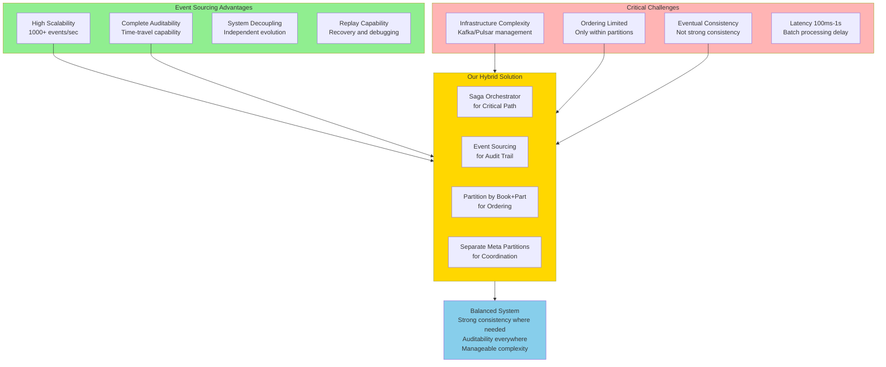

### Key Decision: Why Hybrid?

**Professor Elliot's Recommendation**: "For systems requiring strong consistency, a hybrid approach is recommended. Use a Saga Orchestrator for primary coordination, ensuring strong consistency for critical business processes, and supplement with Event Sourcing specifically for audit trails."

This is exactly what we implement:

- **Critical Path** (Chapter drafting → Editing → Approval): Saga Orchestrator ensures strong consistency
- **Audit Trail** (What happened? Why? When?): Event Sourcing captures immutable history
- **Coordination Events** (Dependencies, Pathways, Verification): Separate partitions with eventual consistency

---

## ENHANCED ARCHITECTURE OVERVIEW

### Complete System with New Agent Types

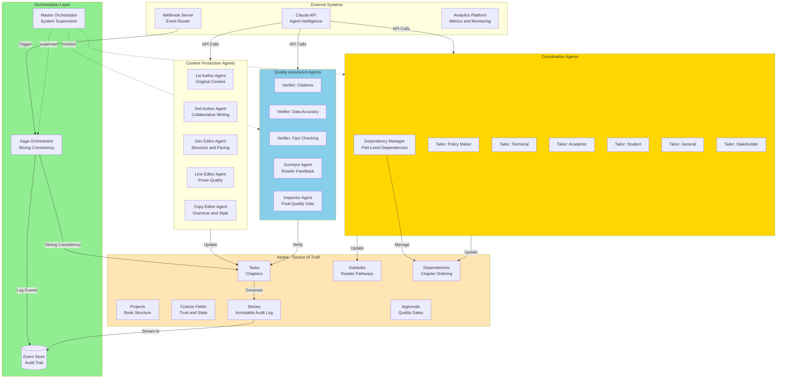

**Key Architectural Decision**: The Distributed Log is *optional* and only needed at high scale (>1000 events/sec). We start with the simpler Saga + Event Store approach.

---

## PARTITIONING STRATEGY FOR NEW AGENT TYPES

### Partition Design Philosophy

Following the discussion's guidance on ordering guarantees:

> "Ordering is guaranteed within a partition, but not across partitions."
> 

We design partitions to ensure events that must maintain strict ordering are in the same partition.

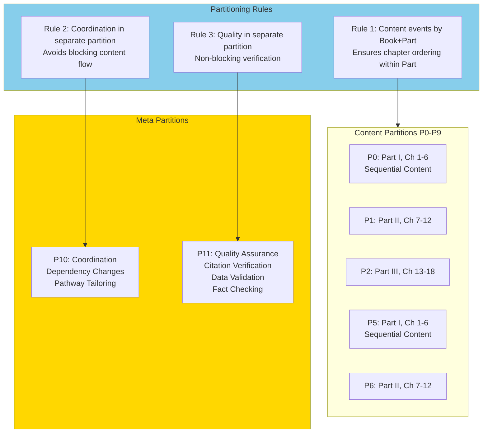

### Why This Partitioning Strategy?

**Content Partitions (P0-P9)**:

- Each Part of each Book gets its own partition
- This ensures **strict ordering** for chapter progression within a Part
- Example: In P0 (Climate Part I), events for Ch1→Ch2→Ch3 maintain their order
- Enables parallel work across Parts without ordering conflicts

**Coordination Partition (P10)**:

- Dependency changes and pathway tailoring events
- These don't need strict ordering with content events
- Example: Unlocking Ch4 dependency can happen asynchronously from Ch3 completion
- **Trade-off**: Eventual consistency acceptable here

**Quality Partition (P11)**:

- Research verification events
- Non-blocking - doesn't stop content flow
- Example: Citation verification can lag behind content drafting
- **Trade-off**: Verification results are eventually consistent

---

## HYBRID CONSISTENCY MODEL

### The Two-Path Architecture

Following Professor Elliot's recommendation for hybrid approach:

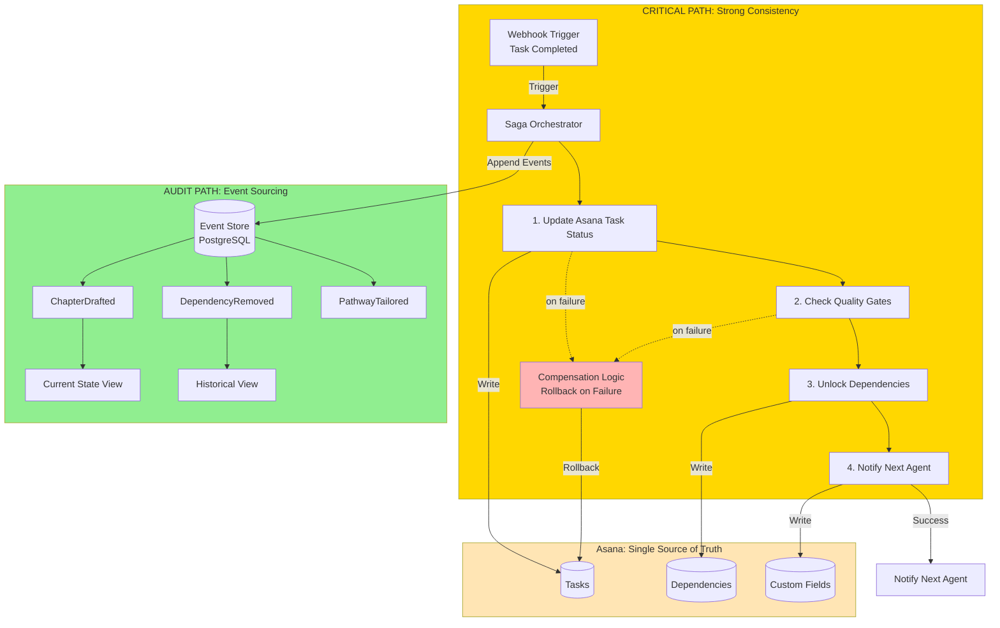

### What Runs on Each Path?

**Critical Path (Strong Consistency via Saga)**:

- Chapter drafting → Editing handoffs
- Approval workflows
- Quality gate transitions
- Any operation requiring immediate consistency

**Audit Path (Eventual Consistency via Event Sourcing)**:

- Complete history of all changes
- "Why did this happen?" questions
- Performance metrics and analytics
- Replay capability for debugging

**Key Insight**: The Critical Path uses the Saga to ensure immediate consistency, while the Audit Path captures everything for later analysis. This gives us both reliability and complete auditability.

---

## AGENT GROUP SPECIFICATIONS

### 1. Dependency Manager Agent

**Purpose**: Manages Part-level dependencies between chapters, automatically unlocking downstream work as upstream chapters complete.

**Responsibilities**:

- Monitor chapter completion events within each Part
- Analyze dependency chains (Ch3 blocks Ch4, Ch4 blocks Ch5)
- Automatically remove dependencies when prerequisites complete
- Update Asana's dependency graph via API
- Emit coordination events to Partition 10

**Event Consumption**:

- Subscribes to: Content Partitions (P0-P9)
- Publishes to: Coordination Partition (P10)

**Example Workflow**:

```
1. P0 emits: ChapterCompleted(book=Climate, part=I, chapter=3)
2. Dependency Manager consumes event
3. Analyzes: Ch4 dependency on Ch3
4. Calls Asana API: remove_dependency(Ch4, Ch3)
5. Emits to P10: DependencyRemoved(chapter=4, unblocked_by=3)
6. Author Agent for Ch4 receives notification
```

**Coordination Diagram**:

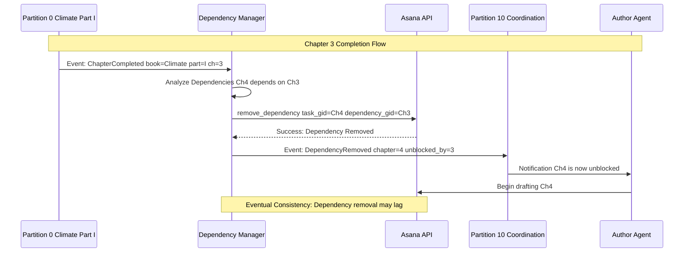

**Configuration**:

```yaml
dependency_manager:
  consumer_group: "coordination-consumers"
  partitions_subscribed: ["P0", "P1", "P2", "P3", "P4", "P5", "P6", "P7", "P8", "P9"]
  partition_published: "P10"
  rules:
    - name: "Sequential Chapter Dependencies"
      condition: "chapter_n completed AND chapter_n+1 depends_on chapter_n"
      action: "remove_dependency(chapter_n+1, chapter_n)"
```

---

### 2. Pathway Tailor Agents (6 Agents)

**Purpose**: Customize subtask descriptions for different reader types, ensuring each reader pathway provides appropriate context and framing.

**Agent Instances**:

1. **Policy Maker Tailor** - Focuses on governance, policy implications, actionable recommendations
2. **Technical Specialist Tailor** - Emphasizes technical details, implementation, system design
3. **Academic Tailor** - Highlights research methods, theoretical frameworks, citations
4. **Student Tailor** - Provides foundational concepts, learning objectives, examples
5. **General Audience Tailor** - Uses accessible language, human stories, practical impact
6. **Stakeholder Tailor** - Focuses on direct impact, resource access, action items

**Responsibilities**:

- Monitor chapter completion events
- Analyze chapter content and identify key themes
- Generate customized descriptions for subtasks targeting each reader type
- Update Asana subtask descriptions via API
- Emit pathway tailoring events to Partition 10

**Event Consumption**:

- Subscribes to: Content Partitions (P0-P9)
- Publishes to: Coordination Partition (P10)

**Example Workflow**:

```
1. P0 emits: ChapterCompleted(book=Climate, part=I, chapter=3, title="Decarbonization Pathways")
2. All 6 Pathway Tailors consume event
3. Each Tailor fetches chapter content from Asana
4. Policy Maker Tailor generates:
   "Focus: Policy frameworks for industrial decarbonization.
   Key sections: Carbon pricing mechanisms, regulatory approaches,
   international agreements. Critical for policy makers."
5. Technical Tailor generates:
   "Focus: Technical implementation of decarbonization.
   Key sections: Energy efficiency metrics, grid integration,
   CCS technology. Critical for engineers."
6. Each Tailor updates corresponding subtask in Asana
7. Each Tailor emits to P10: PathwayTailored(chapter=3, reader_type=...)
```

**Coordination Diagram**:

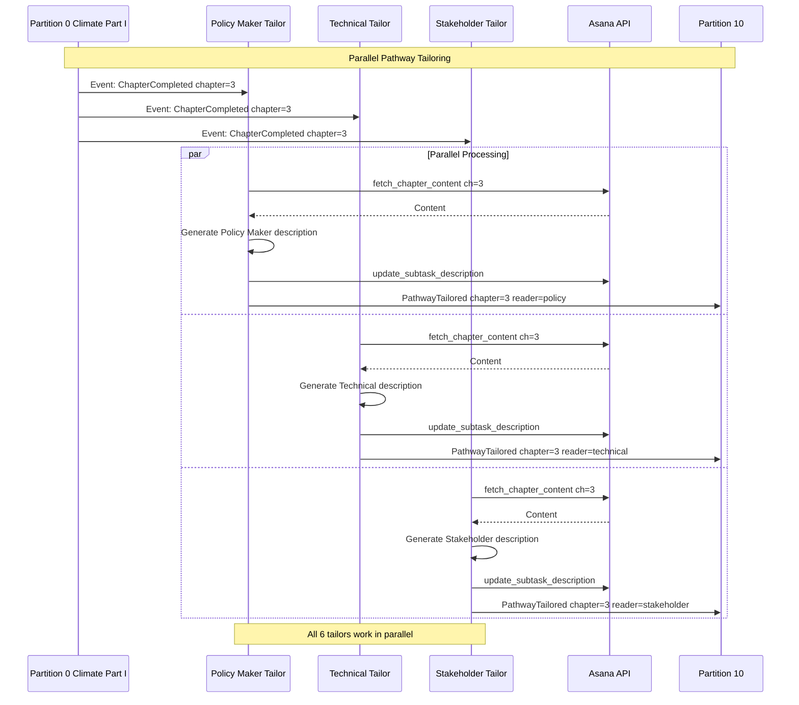

**Configuration**:

```yaml
pathway_tailors:
  consumer_group: "pathway-tailoring-consumers"
  partitions_subscribed: ["P0", "P1", "P2", "P3", "P4", "P5", "P6", "P7", "P8", "P9"]
  partition_published: "P10"
  instances:
    - reader_type: "policy_maker"
      prompt_template: "Generate a description for policy makers focusing on..."
      subtask_suffix: "-PolicyMaker"
    - reader_type: "technical"
      prompt_template: "Generate a description for technical specialists focusing on..."
      subtask_suffix: "-Technical"
```

---

### 3. Research Verifier Agents (3 Agents)

**Purpose**: Validate the accuracy and completeness of written content through specialized verification tasks.

**Agent Instances**:

1. **Citation Verifier** - Validates that all claims are properly cited and citations are accurate
2. **Data Accuracy Verifier** - Checks numerical data, statistics, and quantitative claims
3. **Fact Checker** - Verifies factual statements, dates, names, and events

**Responsibilities**:

- Monitor chapter completion events
- Extract claims, data, and facts from content
- Verify against authoritative sources
- Generate verification reports
- Update Asana tasks with verification status via custom fields
- Emit quality events to Partition 11

**Event Consumption**:

- Subscribes to: Content Partitions (P0-P9)
- Publishes to: Quality Partition (P11)

**Example Workflow**:

```
1. P0 emits: ChapterCompleted(book=Climate, part=I, chapter=7, title="Agriculture")
2. All 3 Research Verifiers consume event
3. Citation Verifier:
   - Extracts all citations from chapter
   - Verifies each citation exists and is accessible
   - Checks citation format compliance
   - Result: 18/20 citations valid
4. Data Accuracy Verifier:
   - Extracts numerical claims: "40% reduction in emissions"
   - Cross-references with source data
   - Result: All data points verified
5. Fact Checker:
   - Extracts factual claims: "Paris Agreement signed in 2015"
   - Verifies against reliable sources
   - Result: All facts accurate
6. Each Verifier updates Asana custom field: "Verification_Status"
7. Each Verifier emits to P11: VerificationCompleted(chapter=7, type=...)
```

**Coordination Diagram**:

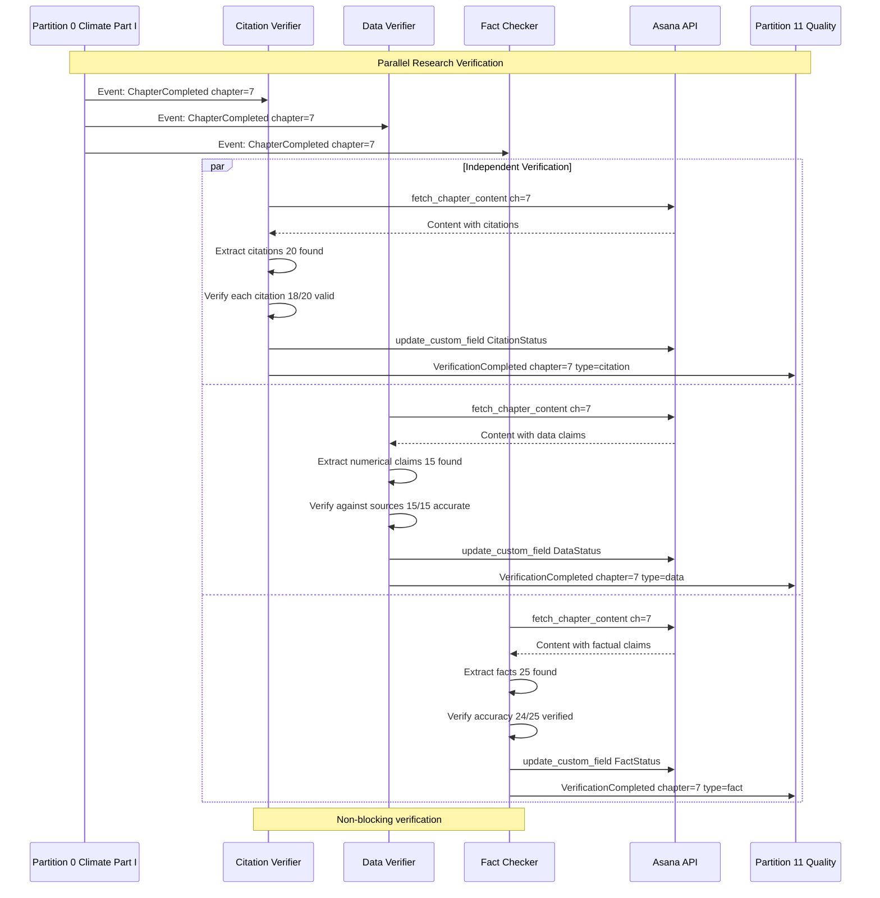

**Configuration**:

```yaml
research_verifiers:
  consumer_group: "quality-verification-consumers"
  partitions_subscribed: ["P0", "P1", "P2", "P3", "P4", "P5", "P6", "P7", "P8", "P9"]
  partition_published: "P11"
  instances:
    - type: "citation"
      custom_field: "CitationVerificationStatus"
      acceptance_threshold: 95.0
    - type: "data_accuracy"
      custom_field: "DataAccuracyStatus"
      acceptance_threshold: 100.0
    - type: "fact_checking"
      custom_field: "FactCheckStatus"
      acceptance_threshold: 98.0
```

---

## EVENT FLOW WITH CROSS-PARTITION COORDINATION

### Complete End-to-End Flow

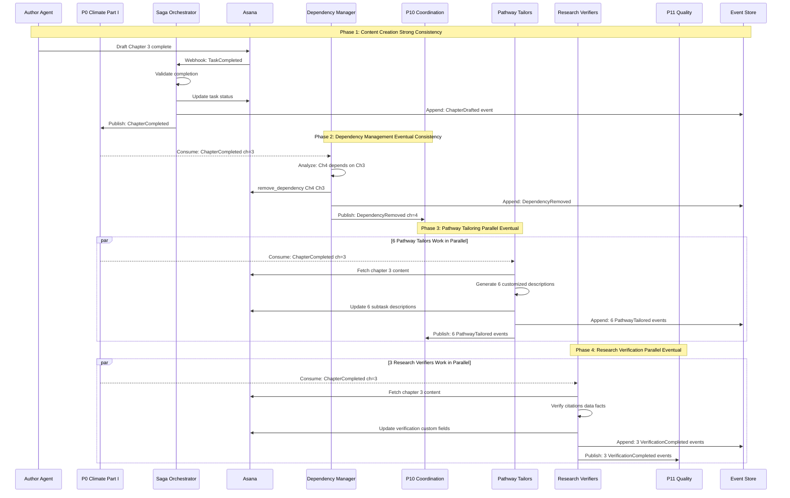

**Key Observations**:

1. **Strong Consistency in Phase 1**: The Saga Orchestrator ensures the chapter completion is properly recorded in Asana before any other processing begins.
2. **Eventual Consistency in Phases 2-4**: Dependency management, pathway tailoring, and research verification all happen asynchronously. There's no guarantee about which completes first.
3. **Non-Blocking Design**: Content creation (Phase 1) doesn't wait for verification (Phase 4) to complete. Authors can keep working while verification happens in the background.
4. **Trade-off Acceptance**: We accept 100ms-1s delay between content completion and dependency updates. This is the "latency" trade-off from the discussion.

---

## ADDRESSING ORDERING GUARANTEES

### What We Guarantee vs. What We Don't

Following Professor Elliot's key insight: "Ordering is guaranteed **within** a partition, but **not across** partitions."

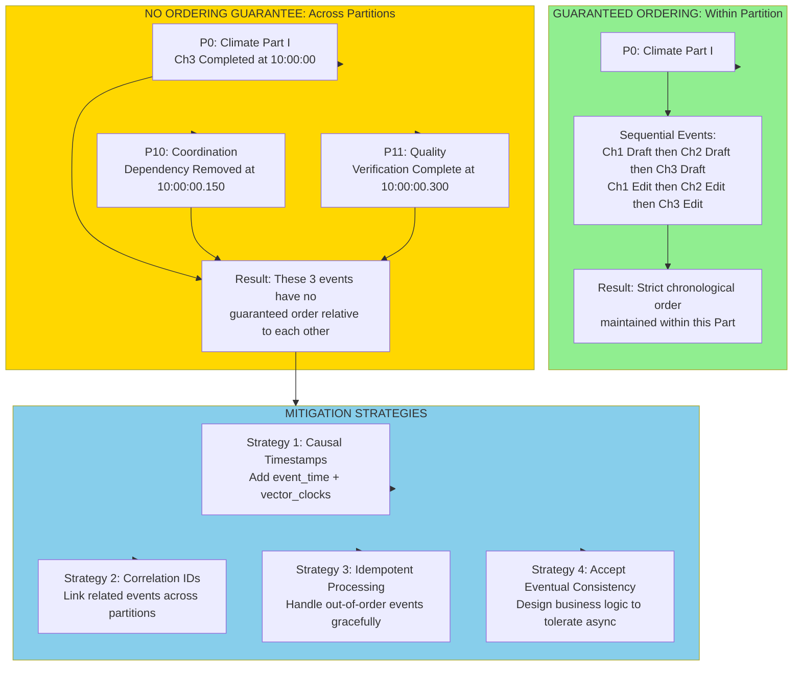

### Practical Example: Handling Out-of-Order Events

**Scenario**: What if the Research Verifier processes Chapter 3 before the Dependency Manager has unlocked Chapter 4?

**Answer**: This is acceptable because these are independent concerns:

- Research verification validates Chapter 3's content quality
- Dependency management controls workflow sequencing
- These can happen in any order without correctness issues

**Counter-Example**: What if we needed strict ordering?

- If verification results BLOCKED dependency removal (e.g., "don't unlock Ch4 until Ch3 passes verification")
- Then we'd need both events in the **same partition**
- Or use the Saga Orchestrator for this critical coordination

### Design Principle: Partition by Causality

**Question**: How do we decide what goes in the same partition?

**Answer**: Put events in the same partition if they have a **happens-before** relationship that matters for correctness.

- ✅ Ch1 Draft → Ch2 Draft → Ch3 Draft: Same partition (P0)
- ✅ Ch3 Draft → Ch3 Dev Edit → Ch3 Line Edit: Same partition (P0)
- ❌ Ch3 Complete → Dependency Update: Different partitions (P0, P10) - eventual consistency OK
- ❌ Ch3 Complete → Citation Verification: Different partitions (P0, P11) - eventual consistency OK

---

## LATENCY CONSIDERATIONS

### Understanding the 100ms-1s Delay

From the discussion: "Batch processing typically introduces latency ranging from 100 milliseconds to a full second."

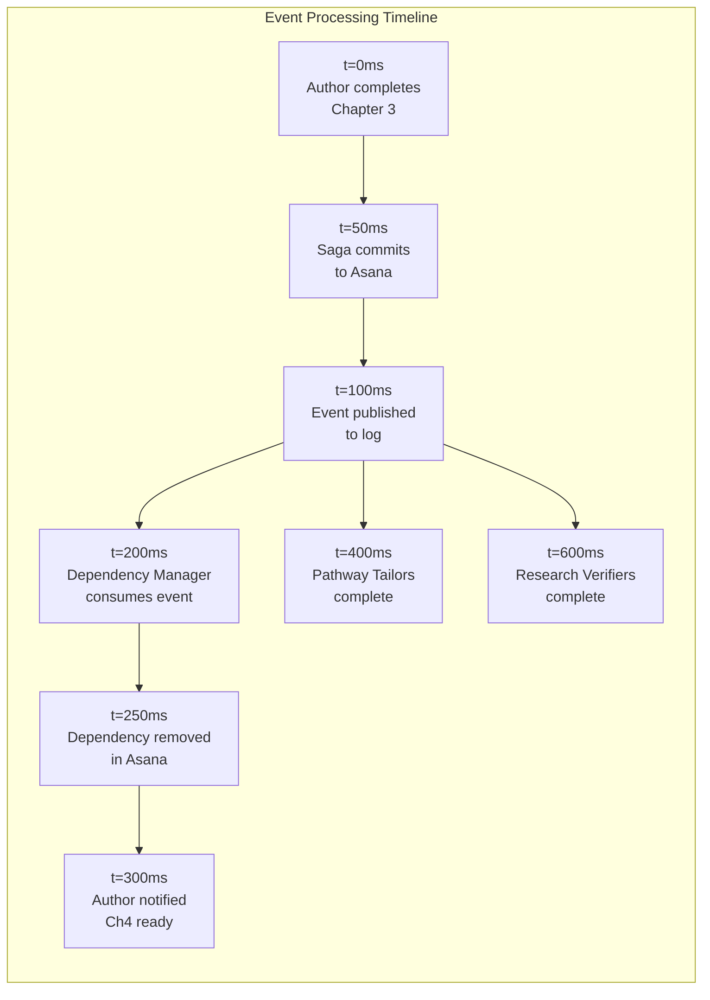

### Where Latency Matters (and Where It Doesn't)

**Latency DOES Matter**:

- Author waits for "save" confirmation → Must be <100ms
- Editor waits for content to load → Must be <500ms
- Approval decisions blocking publication → Must be <1s

**Latency DOESN'T Matter**:

- Dependency updates → 200ms delay is fine
- Pathway tailoring → 400ms delay is fine
- Research verification → 600ms delay is fine
- Analytics dashboard updates → Even minutes are OK

**Design Decision**: Use the Saga for low-latency critical path, use Event Sourcing for everything else.

### Latency Monitoring

```yaml
latency_slos:
  critical_path:
    author_to_asana:
      p50: 20ms
      p95: 50ms
      p99: 100ms
    saga_orchestration:
      p50: 30ms
      p95: 80ms
      p99: 150ms
  coordination_path:
    event_to_consumer:
      p50: 100ms
      p95: 300ms
      p99: 500ms
    agent_processing:
      p50: 150ms
      p95: 400ms
      p99: 800ms
  quality_path:
    verification_total:
      p50: 500ms
      p95: 2000ms
      p99: 5000ms
```

---

## INFRASTRUCTURE & OPERATIONAL COMPLEXITY

### The Complexity Spectrum

Based on the discussion's warning about infrastructure complexity:

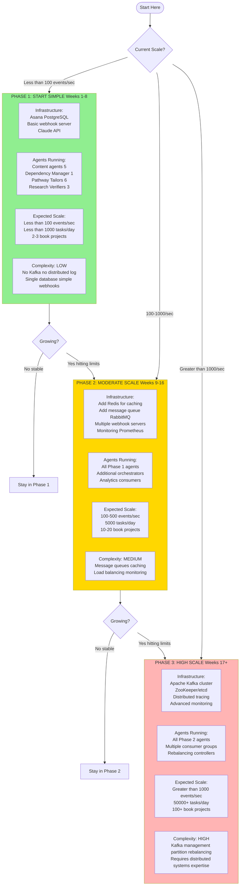

### Operational Complexity by Phase

**Phase 1: Simple (Recommended Start)**

Required Skills:

- ✅ Basic database administration (PostgreSQL)
- ✅ API integration (Asana, Claude)
- ✅ Simple webhook handling
- ❌ NO distributed systems expertise required

Operational Tasks:

- Database backups (automated)
- Webhook server monitoring (simple health checks)
- Agent log monitoring (basic alerts)

**Phase 2: Moderate**

Required Skills:

- ✅ Message queue management (RabbitMQ/Redis)
- ✅ Load balancing
- ✅ Performance monitoring
- ⚠️ Some distributed systems understanding helpful

Operational Tasks:

- Message queue monitoring
- Cache invalidation strategies
- Performance tuning
- Horizontal scaling

**Phase 3: Complex**

Required Skills:

- ✅ Kafka cluster administration
- ✅ Partition management and rebalancing
- ✅ Distributed systems debugging
- ✅ ZooKeeper/etcd management
- ⚠️ Requires dedicated distributed systems engineer

Operational Tasks:

- Partition rebalancing
- Consumer lag monitoring
- Broker failure recovery
- Schema evolution management
- Advanced performance tuning

### Cost Comparison

```yaml
monthly_costs:
  phase_1:
    infrastructure:
      asana_business: $600
      postgresql_managed: $50
      webhook_server: $20
      claude_api: $500
    total: $1,170
  
  phase_2:
    infrastructure:
      asana_business: $600
      postgresql_managed: $100
      redis_managed: $50
      rabbitmq_managed: $100
      load_balancer: $30
      multiple_servers: $100
      claude_api: $2000
      monitoring: $50
    total: $3,030
  
  phase_3:
    infrastructure:
      asana_enterprise: $1800
      postgresql_managed: $200
      kafka_managed: $1000
      distributed_tracing: $200
      advanced_monitoring: $200
      large_fleet: $500
      claude_api: $5000
    total: $8,900
```

**Key Insight**: Start with Phase 1 ($1,170/month) and only scale when necessary. Most book-writing workflows will never need Phase 3.

---

## IMPLEMENTATION ROADMAP

### Week-by-Week Plan

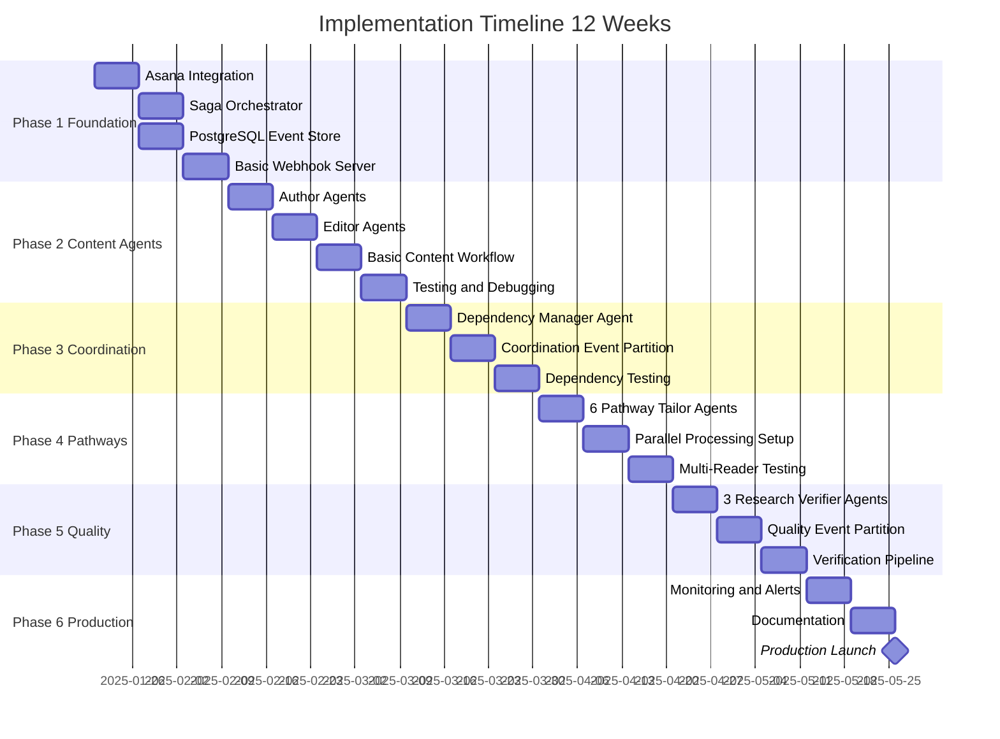

### Detailed Week-by-Week Tasks

**Weeks 1-2: Foundation**

```markdown
Week 1: Asana Integration
- [ ] Create Asana workspace and projects
- [ ] Set up custom fields (Trust Score, Agent Role, etc.)
- [ ] Create task templates for chapters
- [ ] Set up sections (Drafting, Editing, etc.)
- [ ] Configure approval workflows

Week 2: Saga Orchestrator
- [ ] Design saga transaction steps
- [ ] Implement compensation logic
- [ ] Set up PostgreSQL event store schema
- [ ] Create webhook receiver endpoint
- [ ] Test basic saga flow
```

**Weeks 3-4: Content Agents**

```markdown
Week 3: Author and Editor Agents
- [ ] Implement 1st Author agent with Claude
- [ ] Implement 2nd Author agent
- [ ] Implement Dev Editor agent
- [ ] Implement Line Editor agent
- [ ] Implement Copy Editor agent
- [ ] Test sequential workflow

Week 4: Integration Testing
- [ ] Test end-to-end chapter workflow
- [ ] Validate saga orchestration
- [ ] Check event logging
- [ ] Performance testing
- [ ] Bug fixes
```

**Weeks 5-6: Coordination**

```markdown
Week 5: Dependency Manager
- [ ] Implement Dependency Manager agent
- [ ] Create coordination event partition (P10)
- [ ] Set up consumer group for coordination
- [ ] Test dependency removal flow
- [ ] Validate cross-partition events

Week 6: Dependency Testing
- [ ] Test multi-chapter dependencies
- [ ] Test Part-level dependencies
- [ ] Test failure scenarios
- [ ] Performance testing
- [ ] Documentation
```

**Weeks 7-8: Pathway Tailoring**

```markdown
Week 7: Pathway Tailor Agents
- [ ] Implement Policy Maker Tailor
- [ ] Implement Technical Tailor
- [ ] Implement Academic Tailor
- [ ] Implement Student Tailor
- [ ] Implement General Audience Tailor
- [ ] Implement Stakeholder Tailor
- [ ] Set up parallel processing

Week 8: Pathway Testing
- [ ] Test all 6 tailors in parallel
- [ ] Validate subtask descriptions
- [ ] Test with real chapter content
- [ ] Performance and latency testing
- [ ] User acceptance testing
```

**Weeks 9-10: Research Verification**

```markdown
Week 9: Research Verifier Agents
- [ ] Implement Citation Verifier
- [ ] Implement Data Accuracy Verifier
- [ ] Implement Fact Checker
- [ ] Create quality event partition (P11)
- [ ] Set up verification consumer group

Week 10: Verification Testing
- [ ] Test citation verification
- [ ] Test data accuracy checking
- [ ] Test fact checking
- [ ] Test verification reporting
- [ ] Integration with approval workflow
```

**Weeks 11-12: Production Readiness**

```markdown
Week 11: Monitoring and Operations
- [ ] Set up Prometheus metrics
- [ ] Create Grafana dashboards
- [ ] Configure alerts (PagerDuty/Slack)
- [ ] Set up log aggregation
- [ ] Create operational runbooks

Week 12: Documentation and Launch
- [ ] Complete system documentation
- [ ] Create agent deployment guide
- [ ] Write troubleshooting guides
- [ ] Conduct team training
- [ ] Production launch
```

### Decision Point: When to Add Kafka?

**After 12 Weeks, Evaluate**:

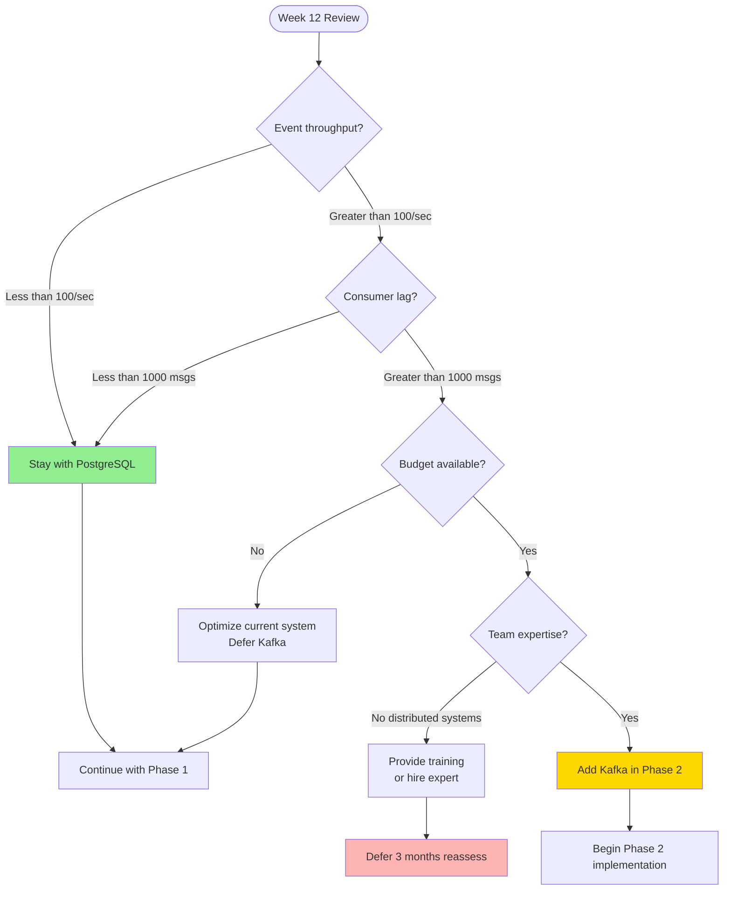

**Trigger Criteria for Kafka**:

1. Sustained >1000 events/second for 1+ week
2. Consumer lag consistently >5000 messages
3. Need for >20 parallel consumer instances
4. Multiple independent systems consuming events
5. Replay requirements for historical data processing

**Until then**: PostgreSQL + Saga is sufficient and much simpler to operate.

---

## MONITORING & ALERTING STRATEGY

### Key Metrics to Track

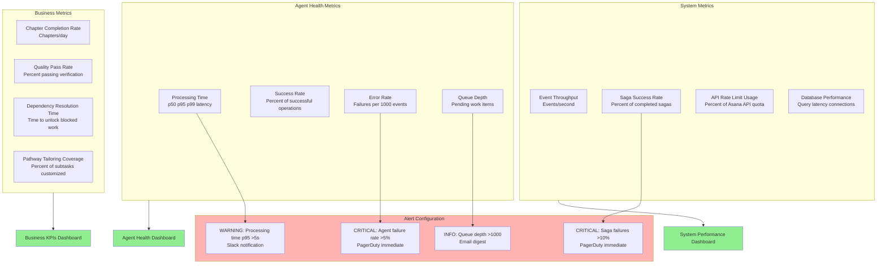

### Alert Thresholds

```yaml
alerts:
  critical:
    - name: "Agent Failure Rate High"
      condition: "error_rate > 5% over 5 minutes"
      action: "PagerDuty to on-call engineer"
    
    - name: "Saga Orchestrator Failures"
      condition: "saga_failures > 10% over 10 minutes"
      action: "PagerDuty to on-call engineer"
    
    - name: "Database Connection Pool Exhausted"
      condition: "available_connections < 5"
      action: "PagerDuty to on-call engineer"
  
  warning:
    - name: "Processing Latency High"
      condition: "p95_latency > 5s over 15 minutes"
      action: "Slack notification to team channel"
    
    - name: "Consumer Lag Building"
      condition: "queue_depth > 5000"
      action: "Slack notification to team channel"
    
    - name: "API Rate Limit Approaching"
      condition: "api_usage > 80% of quota"
      action: "Slack notification to team channel"
  
  info:
    - name: "Queue Depth Moderate"
      condition: "queue_depth > 1000"
      action: "Email digest daily"
    
    - name: "Quality Pass Rate Declining"
      condition: "verification_pass_rate < 95% over 1 day"
      action: "Email digest daily"
```

---

## CONCLUSION & RECOMMENDATIONS

### Summary of Design Decisions

Based on the critical considerations from the Event Sourcing discussion, here are our key architectural choices:

1. **Hybrid Consistency Model** ✅
    - Saga Orchestrator for critical path (strong consistency)
    - Event Sourcing for audit trail (eventual consistency)
    - Balances reliability with auditability
2. **Smart Partitioning Strategy** ✅
    - Content events partitioned by Book+Part (P0-P9)
    - Coordination events in separate partition (P10)
    - Quality events in separate partition (P11)
    - Ensures ordering where it matters
3. **Phased Infrastructure Approach** ✅
    - Start simple: PostgreSQL + Saga (Phase 1)
    - Scale gradually: Add message queues (Phase 2)
    - Only if needed: Add Kafka (Phase 3)
    - Defer complexity until scale demands it
4. **Three New Agent Groups** ✅
    - Dependency Manager: Automates Part-level dependencies
    - Pathway Tailors (6): Customizes for reader types
    - Research Verifiers (3): Validates content quality
5. **Latency-Aware Design** ✅
    - Critical path: <100ms (Saga)
    - Coordination: 100-500ms (acceptable)
    - Verification: 500-5000ms (acceptable)
    - Non-blocking design prevents slowdowns

### What We've Solved

**From the Discussion's Challenges**:

- ✅ **Infrastructure Complexity**: Start simple, scale gradually
- ✅ **Ordering Guarantees**: Partition by causality needs
- ✅ **Eventual Consistency**: Accept for non-critical paths
- ✅ **Latency**: Use Saga for critical, Event Sourcing for audit

**New Agent Capabilities**:

- ✅ **Dependency Management**: Automatic unlocking as work completes
- ✅ **Reader Pathways**: Customized descriptions for 6 reader types
- ✅ **Quality Assurance**: Citations, data, facts all verified

### Recommendations for Your Implementation

1. **Start with Phase 1 (Weeks 1-12)**
    - Implement Saga + PostgreSQL Event Store
    - Deploy all 3 new agent groups
    - Validate the hybrid consistency model
    - **Do NOT start with Kafka**
2. **Monitor These Key Metrics**
    - Event throughput (stay <100/sec initially)
    - Consumer lag (should stay <1000 messages)
    - Processing latency (p95 <5s)
    - Agent success rates (>95%)
3. **Scale Decision Points**
    - If throughput >100/sec sustained: Consider Phase 2
    - If throughput >1000/sec sustained: Consider Phase 3
    - If lag >5000 messages: Add more consumer instances
    - If budget allows and team has expertise: Add Kafka
4. **Operational Priorities**
    - Set up monitoring from Day 1
    - Create runbooks for common issues
    - Document all agent behaviors
    - Train team on saga orchestration

### Next Steps

**Immediate Actions**:

1. Review this architecture with your team
2. Decide on Phase 1 start date
3. Set up Asana workspace and projects
4. Allocate resources for 12-week implementation
5. Begin Week 1 tasks (Asana Integration)

**Questions to Answer Before Starting**:

- [ ]  Do we have PostgreSQL expertise on the team?
- [ ]  Can we dedicate 1-2 engineers for 12 weeks?
- [ ]  What's our Claude API budget?
- [ ]  Do we need additional Asana licenses?
- [ ]  Who will be on-call for production issues?

---

## APPENDIX: Event Schema Definitions

### Content Events (P0-P9)

```tsx
interface ChapterCompletedEvent {
  event_type: "ChapterCompleted";
  event_id: string;  // UUID
  timestamp: string;  // ISO 8601
  partition: string;  // "P0" through "P9"
  book_id: string;  // "climate" | "ai-ethics"
  part_number: number;  // 1-5
  chapter_number: number;  // 1-28
  task_gid: string;  // Asana task GID
  author_gid: string;  // Asana user GID
  metadata: {
    word_count: number;
    quality_score: number;
    revision_count: number;
  };
}
```

### Coordination Events (P10)

```tsx
interface DependencyRemovedEvent {
  event_type: "DependencyRemoved";
  event_id: string;
  timestamp: string;
  partition: "P10";
  book_id: string;
  part_number: number;
  chapter_number: number;
  unblocked_by_chapter: number;  // Which chapter completion triggered this
  task_gid: string;  // The task that was unblocked
  dependency_gid: string;  // The dependency that was removed
}

interface PathwayTailoredEvent {
  event_type: "PathwayTailored";
  event_id: string;
  timestamp: string;
  partition: "P10";
  book_id: string;
  part_number: number;
  chapter_number: number;
  reader_type: "policy_maker" | "technical" | "academic" | "student" | "general" | "stakeholder";
  subtask_gid: string;  // The subtask that was customized
  description_length: number;  // Character count of new description
}
```

### Quality Events (P11)

```tsx
interface VerificationCompletedEvent {
  event_type: "VerificationCompleted";
  event_id: string;
  timestamp: string;
  partition: "P11";
  book_id: string;
  part_number: number;
  chapter_number: number;
  verification_type: "citation" | "data_accuracy" | "fact_checking";
  results: {
    total_checked: number;
    passed: number;
    failed: number;
    pass_rate: number;  // Percentage
  };
  issues: Array<{
    location: string;  // "Chapter 7, paragraph 3"
    description: string;
    severity: "critical" | "moderate" | "minor";
  }>;
  custom_field_updated: string;  // Which Asana custom field was updated
}
```

---

**END OF ENHANCED DISTRIBUTED LOG ARCHITECTURE**

*This architecture balances the power of Event Sourcing with operational pragmatism, following Professor Elliot's hybrid approach recommendation.*